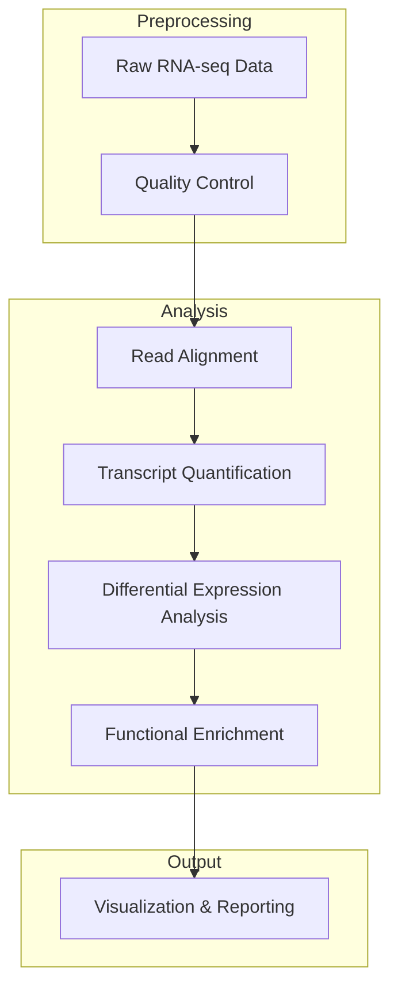

# coral-embryo-RNAseq

This repository contains code and output for a **gene expression** analysis of coral embryos exposed to 3 increasing levels of polyvinyl chloride (PVC) leachate. *Montipora capitata* rice coral embryos were subjected to a single-stressor ecotoxicology assay designed to test the impact of PVC leachate on their early development. You can check out the complimentary repositories for a development [coral-embryo-scope](https://github.com/sarahtanja/coral-embryo-scope) and microbiome (coral-embryo-microbiome) [coral-embryo-microbiome](https://github.com/sarahtanja/coral-embryo-microbiome) analysis from the same ecotoxicological assay.

## RNA-seq Analysis Pipeline

The bioinformatics pipeline includes:
- **Quality Control:** FastQC and Fastp for filtering and trimming reads
- **Read Alignment:** HISAT2 for mapping reads to reference genome
- **Transcript Quantification:** Counting gene/transcript abundances
- **Differential Expression Analysis:** DESeq2 for identifying significant expression changes
- **Functional Enrichment:** GO enrichment using goseq
- **Visualization & Reporting:** Generating plots and reports using rrvgo and ggplot2
