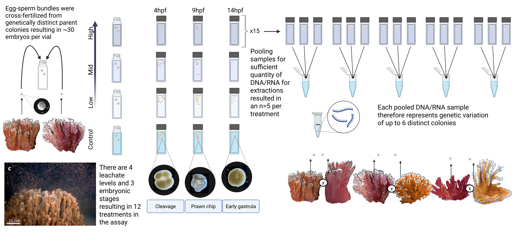
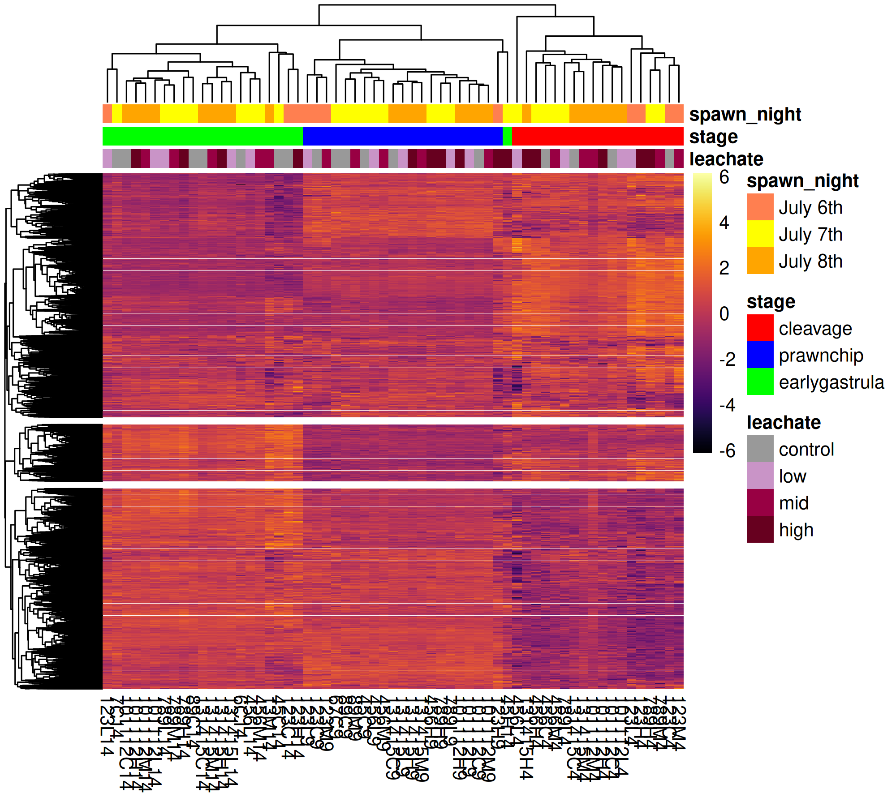

```{r setup, include=FALSE}
knitr::opts_chunk$set(
  echo = TRUE, # Display code chunks
  eval = TRUE, # Evaluate code chunks
  warning = FALSE, # Hide warnings
  message = FALSE, # Hide messages
  comment = "") # Prevents appending '##' to beginning of lines in code output))        
```

# Background



# Goals

-   Filter gene count matrix to remove low gene counts across samples

-   Create initial DESeq Dataset Object with `DESeq2` to use in
    exploratory data visualizations

-   Explore how samples cluster with PCA plots

-   Identify & remove any outliers

-   Explore batch effects

-   Examine dispersion with `betadispr`

-   Run a PERMANOVA with `vegan::adonis2`

-   Understand broad patterns across samples

## Inputs

-   `output/04_count/gene_count_matrix.csv` unfiltered gene count matrix
-   `metadata/metadata.csv` sample metadata

## Outputs

-   `output/05_explore/gcm_filtor.csv` filtered gene count matrix with
    outlier samples removed
-   `metadata/metadata_or.csv`filtered metadata with outlier samples
    removed
-   `output/05_explore/pca.png` exploratory principle component analysis
    (PCA) plot
-   `output/05_explore/zscore_heatmap.png` exploratory heatmap
-   `output/05_explore/permanova_result_fullgeneset.csv` result table of
    PERMANOVA test on

Resources:

[RNA-seq
workflow](https://master.bioconductor.org/packages/release/workflows/vignettes/rnaseqGene/inst/doc/rnaseqGene.html)

[DESeq2
Vignette](https://bioconductor.org/packages/devel/bioc/vignettes/DESeq2/inst/doc/DESeq2.html)

[@Love2014-dv]

# Setup

```{r}
# Specify colors
leachate_colors <- c("grey60", "#C994C7", "#980043", "#67001F")
stage_colors <- c("red", "blue", "green")

# Annotation colors for pheatmap
ann_colors = list(
  leachate = leachate_colors,
  stage = stage_colors
)
```

## Install packages

```{r, eval=FALSE}
# Install pak itself if not already installed
#if (!"pak" %in% rownames(installed.packages())) {
#  install.packages("pak")
#}

# Use pak to install CRAN packages
#pak::pak(c(
#  "tidyverse",
#  "viridis",
#  "pheatmap",
#  "vsn",
#  "plotly",
#  "ggrepel",
#  "vegan"
#))

# Install Bioconductor packages using pak (prefix with "bioc::")
#pak::pak(c(
#  "bioc::DESeq2"
#))

```

## Load packages

```{r}
library(tidyverse)
library(viridis)
library(DESeq2)
library(vsn)
library(pheatmap)
library(plotly)
library(ggrepel)
library(vegan)
```

## Load inputs

### Metadata

```{r}
metadata <- read_csv("../../metadata/metadata.csv")

# set factors
metadata <- metadata %>% 
  mutate(
    collection_date = as.Date(collection_date, format = "%d-%b-%Y"),
    stage    = factor(stage,    levels = c("cleavage", "prawnchip", "earlygastrula")),
    leachate = factor(leachate, levels = c("control", "low", "mid", "high")),
    spawn_night = factor(spawn_night, levels  = c("July 6th", "July 7th", "July 8th"))
    )

# View metadata structure
str(metadata)
```

### Gene count matrix

```{r}
gcm <- read.csv("../../output/04_count/gene_count_matrix.csv", row.names="gene_id", check.names = FALSE)
```

# Check order

From DESeq2 vignette under [Count matrix
input](https://bioconductor.org/packages/devel/bioc/vignettes/DESeq2/inst/doc/DESeq2.html#pre-filtering:~:text=for%20full%20details.-,Count%20matrix%20input,-Alternatively%2C%20the%20function):

> It is absolutely critical that the columns of the count matrix and the
> rows of the column data (information about samples) are in the same
> order. DESeq2 will not make guesses as to which column of the count
> matrix belongs to which row of the column data, these must be provided
> to DESeq2 already in consistent order.

Examine the count matrix and column data to see if they are consistent
in terms of sample order. For our data, `metadata` contains sample
information and `gcm` is our unfiltered gene count matrix.

```{r}
all(metadata$sample_id == colnames(gcm))
```

::: callout-note
Our samples are listed in the same order down our `metadata` rows and
across our `gcm` columns
:::

# Pre-filter reads

```{r distr_unfiltered_reads}

ggplot(data = data.frame(rowMeans(gcm)),
  aes(x = rowMeans.gcm.)) +
  geom_histogram(fill = "grey", binwidth = 5) +
  xlim(0, 500) +
  ylim(0, 5000) +
  theme_classic() +
  labs(title = "Distribution of unfiltered reads") +
  labs(y = "Density", x = "Raw read counts",
  title = "Read count distribution: untransformed, unnormalized, unfiltered")
  
```

::: callout-note
As you can see in the above plot, the raw distribution of all read
counts takes on a left-skewed negative binomial distribution.
:::

From the `DESeq2` vignette on
[Pre-filtering](https://bioconductor.org/packages/devel/bioc/vignettes/DESeq2/inst/doc/DESeq2.html#pre-filtering:~:text=cell%20…%20Sample%20BioSample-,Pre%2Dfiltering,-While%20it%20is):

> While it is not necessary to pre-filter low count genes before running
> the DESeq2 functions, there are two reasons which make pre-filtering
> useful: by removing rows in which there are very few reads, we reduce
> the memory size of the `dds` data object, and we increase the speed of
> count modeling within DESeq2. It can also improve visualizations, as
> features with no information for differential expression are not
> plotted in dispersion plots or MA-plots.
>
> A recommendation for the minimal number of samples is to specify the
> smallest group size... or the minimal number of samples where non-zero
> counts would be considered interesting.

In our experimental design, our smallest group is \~5 samples out of 60
(5/60 = 0.08). It would be interesting if 8% of the samples differed,
representing a treatment group.

`across(everything(), ~ . > 15)` → for each column, test if the cell is
greater than 15; returns a logical (TRUE/FALSE) matrix.

`rowSums(…)` → counts how many TRUEs per row (i.e., how many columns
exceed 15).

Note: if any comparisons are NA, rowSums() will return NA (since na.rm =
FALSE by default), and such rows will be dropped by filter().

`ncol(gcm)` → number of columns.

`>= 0.85 * ncol(gcm)` → require ≥ 85% of columns to pass the threshold.

`filter(…)` → keep only rows meeting that condition.

```{r}
# Filter rows where at least 85% of the columns have a raw count of ~15
gcm_filt <- gcm %>%
  filter(rowSums(across(everything(), ~ . > 15)) >= 0.85 * ncol(gcm))

nrow(gcm)
nrow(gcm_filt)
```

# Make DESeq Dataset Object

Create a `DESeqDataSet` design from the gene count matrix and treatment
conditions. Here we set the design to test gene expression responses to
pollution exposure (C, L, M, H) across developmental stage (4, 9, or 14
hours post fertilization).

From the `DESeq2` vignette on [The
DESeqDataSet](https://bioconductor.org/packages/devel/bioc/vignettes/DESeq2/inst/doc/DESeq2.html#pre-filtering:~:text=used%20as%20input.-,The%20DESeqDataSet,-The%20object%20class):

> The object class used by the DESeq2 package to store the read counts
> and the intermediate estimated quantities during statistical analysis
> is the *DESeqDataSet*, which will usually be represented in the code
> here as an object `dds`.
>
> A technical detail is that the *DESeqDataSet* class extends the
> *RangedSummarizedExperiment* class of the
> [SummarizedExperiment](http://bioconductor.org/packages/SummarizedExperiment)
> package. The "Ranged" part refers to the fact that the rows of the
> assay data (here, the counts) can be associated with genomic ranges
> (the exons of genes). This association facilitates downstream
> exploration of results, making use of other Bioconductor packages'
> range-based functionality (e.g. find the closest ChIP-seq peaks to the
> differentially expressed genes).
>
> A *DESeqDataSet* object must have an associated *design formula*. The
> design formula expresses the variables which will be used in modeling.
> The formula should be a tilde (\~) followed by the variables with plus
> signs between them (it will be coerced into an *formula* if it is not
> already). The design can be changed later, however then all
> differential analysis steps should be repeated, as the design formula
> is used to estimate the dispersions and to estimate the log2 fold
> changes of the model.
>
> ::: callout-important
> In order to benefit from the default settings of the package, you
> should put the variable of interest at the end of the formula and make
> sure the control level is the first level.
> :::

From the `RNA-seq-workflow`

> The simplest design formula for differential expression would be
> `~ condition`, where `condition` is a column in `colData(dds)` that
> specifies which of two (or more groups) the samples belong to. For the
> airway experiment, we will specify `~ cell + dex` meaning that we want
> to test for the effect of dexamethasone (`dex`) controlling for the
> effect of different cell line (`cell`). For running *DESeq2* models,
> you can use R's formula notation to express any **fixed-effects**
> experimental design. Note that *DESeq2* uses the same formula notation
> as, for instance, the *lm* function of base R. If the research aim is
> to determine for which genes the effect of treatment is different
> across groups, then interaction terms can be included and tested using
> a design such as `~ group + treatment + group:treatment`. See the
> manual page for `?results` for more examples.

```{r}
#Set DESeq2 design for 2 factors and their interaction
dds <- DESeqDataSetFromMatrix(countData = gcm_filt,
                              colData = metadata,
                              design = ~ stage + leachate + stage:leachate)
```

## Check factor levels

From the `DESeq2` vignette [Note on factor
levels](https://bioconductor.org/packages/devel/bioc/vignettes/DESeq2/inst/doc/DESeq2.html#note-on-factor-levels):

> By default, R will choose a *reference level* for factors based on
> alphabetical order. Then, if you never tell the DESeq2 functions which
> level you want to compare against (e.g. which level represents the
> control group), the comparisons will be based on the alphabetical
> order of the levels. There are two solutions: you can either
> explicitly tell *results* which comparison to make using the
> `contrast` argument (this will be shown later), or you can explicitly
> set the factors levels. In order to see the change of reference levels
> reflected in the results names, you need to either run `DESeq` or
> `nbinomWaldTest`/`nbinomLRT` after the re-leveling operation.

When we read in our metadata we set levels for both the `leachate` and
`stage` variables

-   `leachate` (4 levels)
    1.  `control`
    2.  `low`
    3.  `mid`
    4.  `high`
-   `stage` (3 levels)
    1.  `cleavage`
    2.  `prawnchip`
    3.  `earlygastrula`

The following code can confirm that DESeq2 sees the levels:

```{r}
levels(dds$leachate)
levels(dds$stage)
```

## Estimate size factors

In DESeq2, size factors account for differences in sequencing depth
(library size) between samples by scaling the per-sample counts to the
geometric mean ., making gene expression levels comparable across
samples before modeling biological effects.

Display histogram of size factors

```{r}
dds <- estimateSizeFactors(dds)
hist(sizeFactors(dds))
```

If size factors differ by a large amount (e.g. \>4-fold between smallest
and largest sample), the VST can over- or under-correct counts, leading
to distorted variance patterns or spurious clustering in PCA plots.

From [@Love2014-dv]:

> ...while the VST is also effective at stabilizing variance, it does
> not directly take into account differences in size factors; and in
> datasets with large variation in sequencing depth (dynamic range of
> size factors 4) we observed undesirable artifacts in the performance
> of the VST

From [A.Huffmyer Early Life History
Energetics](https://github.com/AHuffmyer/EarlyLifeHistory_Energetics/blob/07ef97f446e4383b95bbcc78e5d0e8df1736d51e/Mcap2020/Scripts/TagSeq/DESeq2_Mcap_V3.Rmd#L206){style="font-size: 11.4pt;"}
:

> ... calculate the size factors of our samples. This is a rough
> estimate of how many reads each sample contains compared to the
> others. In order to use VST (the faster log2 transforming process) to
> log-transform our data, the size factors need to be less than 4.

Check that size factors are all less than 4 (should return TRUE)

```{r}
all(sizeFactors(dds))<4
```

::: callout-note
Great! All size factors are less than 4, so we can proceed with using
the variance stabilizing transformation.
:::

## Apply a variance stabilizing transformation (VST)

> In order to test for differential expression, we operate on raw
> counts... However for visualization or clustering -- it might be
> useful to work with transformed versions of the count data. - [DESeq2
> Vignette](https://bioconductor.org/packages/devel/bioc/vignettes/DESeq2/inst/doc/DESeq2.html)

> First we are going to log-transform the data using a variance
> stabilizing transformation (VST). This is only for visualization
> purposes. Importantly, it does not use the design to remove variation
> in the data, and so can be used to examine if there may be any
> variability do to technical factors such as extraction batch
> effects. - [DESeq2
> Vignette](https://bioconductor.org/packages/devel/bioc/vignettes/DESeq2/inst/doc/DESeq2.html)

Here we apply a variance stabilizing transformation (vst) to minimize
effects of small counts and normalize for library size to improve
visualizations.

[Blind dispersion
estimation](https://bioconductor.org/packages/devel/bioc/vignettes/DESeq2/inst/doc/DESeq2.html#blind-dispersion-estimation)

> ... *vst* \[has\] an argument `blind`, for whether the transformation
> should be blind to the sample information specified by the design
> formula. When `blind` equals `TRUE` (the default), the functions will
> re-estimate the dispersions using only an intercept. This setting
> should be used in order to compare samples in a manner wholly unbiased
> by the information about experimental groups, for example to perform
> sample QA (quality assurance) as demonstrated below.
>
> However, blind dispersion estimation is not the appropriate choice if
> **one expects that many or the majority of genes (rows) will have
> large differences in counts which are explainable by the experimental
> design**, and one wishes to transform the data for downstream
> analysis. In this case, using blind dispersion estimation will lead to
> large estimates of dispersion, as it attributes differences due to
> experimental design as unwanted *noise*, and will result in overly
> shrinking the transformed values towards each other. **By setting
> `blind` to `FALSE`, the dispersions already estimated will be used to
> perform transformations, or if not present, they will be estimated
> using the current design formula. Note that only the fitted dispersion
> estimates from mean-dispersion trend line are used in the
> transformation (the global dependence of dispersion on mean for the
> entire experiment). So setting `blind` to `FALSE` is still for the
> most part not using the information about which samples were in which
> experimental group in applying the transformation.** - [DESeq2
> Vignette](https://bioconductor.org/packages/devel/bioc/vignettes/DESeq2/inst/doc/DESeq2.html){style="background-color: transparent; font-size: 11.4pt;"}

We choose to set `blind = FALSE` because we expect large differences in
expression between embryonic stages.

```{r}
# transform via variance stabilizing transformation
vsd <- vst(dds, blind=FALSE)
# extract variance stabilized count matrix
vst_gcm <- assay(vsd)
```

## Plot distribution of VST counts

```{r}
# Create a dataframe for ggplot
vst_long <- as_tibble(vst_gcm, rownames = "gene_id")  %>% 
  pivot_longer(-gene_id, names_to = "sample", values_to = "count") 
  
# Plot
ggplot(vst_long, aes(x = count)) +
  geom_histogram(fill = "grey") +
  theme_classic() +
  labs(
    title = "Histogram of Variance-Stabilized Counts",
    x = "VST-transformed read counts",
    y = "Frequency"
  )

```

This should look broadly like a normal distribution! If it doesn't, make
the filter stricter to remove more low reads by increasing the percent
of samples that have to have the minimum count, and/or increase the
minimum count back in the pre-filtering step. VST compresses the
high-end of the count distribution and expands the low-end, making the
variance roughly constant across the range. The resulting values are on
an approximate log2 scale but not exact log2(count + 1) --- VST is more
nuanced, especially for low counts. A range of 5 to 15 corresponds
roughly to raw counts ranging from 2³² to 2¹⁵ ≈ 32 to 32,000, so it's
realistic for RNA-seq gene expression data.

::: callout-important
The remaining spike of low counts in the context of embryonic
development is biologically relevant, because we expect many genes to be
used only in a specific stage but not in another... leading to chunks of
samples from one embryonic stage having zero counts in certain genes
that are abundant in other stages.
:::

[Effects of transformations on the
variance](https://bioconductor.org/packages/devel/bioc/vignettes/DESeq2/inst/doc/DESeq2.html#effects-of-transformations-on-the-variance)

> To show the effect of the transformation, in the figure below we plot
> the first sample against the second, first simply using the *log2*
> function (after adding 1, to avoid taking the log of zero), and then
> using the VST. For the *log2* approach, we need to first estimate
> *size factors* to account for sequencing depth, and then specify
> `normalized=TRUE`. Sequencing depth correction is done automatically
> for the *vst*. - [DESeq2
> Vignette](https://bioconductor.org/packages/devel/bioc/vignettes/DESeq2/inst/doc/DESeq2.html){style="background-color: transparent; font-size: 11.4pt;"}

```{r}
df <- bind_rows(
  as.data.frame(log2(counts(dds, normalized=TRUE)[, 1:2]+1)) %>%
         mutate(transformation = "log2(x + 1)"),
  as.data.frame(vst_gcm[, 1:2]) %>% mutate(transformation = "vst"))
  
colnames(df)[1:2] <- c("x", "y")  

lvls <- c("log2(x + 1)", "vst")
df$transformation <- factor(df$transformation, levels=lvls)

ggplot(df, aes(x = x, y = y)) +
  geom_hex(bins = 80) +
  coord_fixed() +
  facet_grid(. ~ transformation) +
  ggtitle("Count Transformation Comparisons")
```

About the `meanSdPlot` :

> The figure below plots the standard deviation of the transformed data,
> across samples, against the mean, using the ... variance stabilizing
> transformation. ... for the variance stabilized data the standard
> deviation is roughly constant along the whole dynamic range. - [DESeq2
> Vignette](https://bioconductor.org/packages/devel/bioc/vignettes/DESeq2/inst/doc/DESeq2.html){style="background-color: transparent; font-size: 11.4pt;"}

```{r}
meanSdPlot(vst_gcm)
```

> Note that the vertical axis in such plots is the square root of the
> variance over all samples, so including the variance due to the
> experimental conditions. While a flat curve of the square root of
> variance over the mean may seem like the goal of such transformations,
> this may be unreasonable in the case of datasets with many true
> differences due to the experimental conditions. - [DESeq2
> Vignette](https://bioconductor.org/packages/devel/bioc/vignettes/DESeq2/inst/doc/DESeq2.html){style="background-color: transparent; font-size: 11.4pt;"}

# Perform exploratory PCA

A principal components analysis (PCA) plot shows the samples in the 2D
plane spanned by their first two principal components. This type of plot
is useful for visualizing outliers, the overall effect of experimental
covariates, and batch effects.

```{r}
# Get PCA data (top 500 DEGs by default)
pca_500 <- plotPCA(vsd, intgroup = "group", returnData = TRUE)
percentVar_500 <- round(100*attr(pca_500, "percentVar"))

# Merge with metadata
pca_500 <- merge(pca_500, metadata, by.x = "name", by.y = "sample_id", all.x = TRUE)
```

```{r}
# Assign specific colors to each hpf
stage_colors <- c("red", "blue", "green")


pca_500$label <- paste0(pca_500$name)


# Plot PCA
PCA_500 <- ggplot(pca_500, aes(PC1, PC2, color = stage, shape = leachate, label = label)) +
  geom_point(size = 1) +
  ggtitle("M.cap embryos exposed to pvc leachate, top 500 most variable genes") +
  xlab(paste0("PC1: ", percentVar_500[1], "% variance")) +
  ylab(paste0("PC2: ", percentVar_500[2], "% variance")) + 
  coord_fixed() +
  scale_color_manual(values = stage_colors) +
  theme_minimal()+
  theme(panel.grid.major = element_blank(),
        panel.grid.minor = element_blank())

PCA_500
```

```{r, echo = knitr::is_html_output(), eval = knitr::is_html_output()}
# Convert to interactive plot
ggplotly(PCA_500, tooltip = "label")
```

From this we can visually detect that 131415L4 and 789C4 may be outliers

```{r}
#label the outliers

labels_to_show <- c("131415L4", "789C4")   # the two names to label

PCA_500 + geom_text_repel(
    data = pca_500 %>% filter(name %in% labels_to_show),
    aes(label = name),
    seed = 123,                # reproducible placement
    show.legend = FALSE
  )
```

## Identify outliers

> ... we usually identify any sample that falls outside the main group
> of samples by a magnitude (along PC1) of greater than 3 standard
> deviations. Mathematically, all that you need to do is convert your
> PC1 values to Z-scores and then check for those greater than 3. In R,
> get these by using prcomp() and then accessing the 'x' variable of the
> returned object, e.g., `pca <- prcomp(t(rna.data); pca$x`... --Kevin
> Blighe on [biostars forum](https://www.biostars.org/p/281767/)

```{r}
# Extract PC values
pca_scores <- pca_500[ , c("PC1", "PC2", "name")]

# Convert PC scores to Z-scores
pca_scores$zpc1 <- scale(pca_scores$PC1)
pca_scores$zpc2 <- scale(pca_scores$PC2)

# Show samples with Z-score > |3|
pca_scores %>%
  filter(abs(zpc1) > 2.5 | abs(zpc2) > 2.5)
```

::: callout-important
Their z-scores are greater than 3 standard deviations from the group,
and visually samples `131415L4` and `789C4`may be outliers in the
cleavage phase, as they have the greatest spread from the centroid of
hpf 4, and also from the rest of the samples. The hpf 4 data is expected
to be the least consistent because at 4 hpf, the eggs were just on the
cusp of beginning initial cleavage, meaning many of the embryos still
appeared as an undivided blastocyle, and we could therefore not
determine if the egg was fertilized and about to initiate cleavage, or
unfertilized and inviable.
:::

## Remove the outliers

### From metadata

```{r}
metadata_or <- metadata %>% 
  filter(!(sample_id == "131415L4")) %>% 
  filter(!(sample_id == "789C4"))
```

### From gene count matrix

```{r}
gcm_or <- gcm %>% 
  dplyr::select(-`131415L4`, -`789C4`)

dim(gcm_or)
```

### Refilter

```{r}
# Filter rows where at least 85% of the columns have a value greater than 15
gcm_filtor <- gcm_or %>%
  filter(rowSums(across(everything(), ~ . > 10)) >= 0.85 * ncol(gcm_or))

nrow(gcm_filtor)
```

::: callout-note
11250 genes made it past our filter when outliers were present, 11586
made it past the filter without outlier samples in our gene count
matrix.
:::

# Remake DESeq Object

```{r}
dds_or <- DESeqDataSetFromMatrix(countData = gcm_filtor,
                              colData = metadata_or,
                              design = ~ stage +  leachate + stage:leachate)
```

## Redo count transformations

```{r}
dds_or <- estimateSizeFactors(dds_or)
hist(sizeFactors(dds_or))
all(sizeFactors(dds_or))<4
```

```{r}
vsd_or <- vst(dds_or, blind=FALSE)
```

```{r}
df <- bind_rows(
  as_data_frame(log2(counts(dds_or, normalized=TRUE)[, 1:2]+1)) %>%
         mutate(transformation = "log2(x + 1)"),
  as_data_frame(assay(vsd_or)[, 1:2]) %>% mutate(transformation = "vst"))
  
colnames(df)[1:2] <- c("x", "y")  

lvls <- c("log2(x + 1)", "vst")
df$transformation <- factor(df$transformation, levels=lvls)

ggplot(df, aes(x = x, y = y)) +
  geom_hex(bins = 80) +
  coord_fixed() +
  facet_grid(. ~ transformation) +
  ggtitle("All Samples Count Transformation Comparisons with Outliers Removed")

```

```{r}
meanSdPlot(assay(vsd_or))
```

## Remake PCA

> A principal components analysis (PCA) plot shows the samples in the 2D
> plane spanned by their first two principal components. This type of
> plot is useful for visualizing the overall effect of experimental
> covariates and batch effects.

```{r}
# Get PCA data (top 500 DEGs by default)
pca_500_or <- plotPCA(vsd_or, intgroup = "group", returnData = TRUE)
percentVar_500_or <- round(100*attr(pca_500, "percentVar"))

# Merge with metadata
pca_500_or <- merge(pca_500_or, metadata_or, by.x = "name", by.y = "sample_id", all.x = TRUE)

# Assign specific colors to each stage
stage_colors <- c("red", "blue", "green")


pca_500_or$label <- paste0("sample: ", pca_500_or$sample_id,
                        "\nHpf: ", pca_500_or$hpf,
                        "\nLeachate: ", pca_500_or$leachate)

# PCA with outlier samples removed
PCA_500_or <- ggplot(pca_500_or, aes(PC1, PC2, color = stage, shape = leachate, label = name)) +
  geom_point(size = 1,  stroke = 1) +
  ggtitle("M.cap embryos exposed to pvc leachate, top 500 most variable genes") +
  xlab(paste0("PC1: ", percentVar_500[1], "% variance")) +
  ylab(paste0("PC2: ", percentVar_500[2], "% variance")) + 
  coord_fixed() +
  scale_color_manual(values = stage_colors) +
  stat_ellipse(aes(group = stage, color = stage), linewidth = 0.4, show.legend = FALSE) + 
  theme_minimal() +
  theme(panel.grid.major = element_blank(),
        panel.grid.minor = element_blank())
```

```{r, echo = knitr::is_html_output(), eval = knitr::is_html_output()}
# Convert to interactive plot
ggplotly(PCA_500_or, tooltip = "label")
```

```{r}
PCA_500_or
```

We can see there is strong clustering by developmental stage. It's
difficult to see if there is any other clustering pattern (by leachate,
or by nuisance batch effects). Let's explore those further...

# Examine for batch effects

```{r}
PCA_500_leachate <- ggplot(pca_500_or, aes(PC1, PC2, color = leachate, label = name)) +
  geom_point(size = 1,  stroke = 1) +
  ggtitle("M.cap embryos exposed to pvc leachate, top 500 most variable genes") +
  xlab(paste0("PC1: ", percentVar_500[1], "% variance")) +
  ylab(paste0("PC2: ", percentVar_500[2], "% variance")) + 
  coord_fixed() +
  scale_color_manual(values = leachate_colors) +
  stat_ellipse(aes(group = leachate, color = leachate), linewidth = 0.4, show.legend = FALSE) + 
  theme_minimal() +
  theme(panel.grid.major = element_blank(),
        panel.grid.minor = element_blank())

PCA_500_leachate
```

```{r, echo = knitr::is_html_output(), eval = knitr::is_html_output()}
# Convert to interactive plot
ggplotly(PCA_500_leachate, tooltip = "label")
```

```{r}
PCA_500_spawnnight <- ggplot(pca_500_or, aes(PC1, PC2, color = spawn_night, label = name)) +
  geom_point(size = 1,  stroke = 1) +
  ggtitle("M.cap embryos exposed to pvc leachate, top 500 most variable genes") +
  xlab(paste0("PC1: ", percentVar_500[1], "% variance")) +
  ylab(paste0("PC2: ", percentVar_500[2], "% variance")) + 
  coord_fixed() +
  #scale_color_manual(values = leachate_colors) +
  stat_ellipse(aes(group = spawn_night, color = spawn_night), linewidth = 0.4, show.legend = FALSE) + 
  theme_minimal() +
  theme(panel.grid.major = element_blank(),
        panel.grid.minor = element_blank())

PCA_500_spawnnight
```

```{r, echo = knitr::is_html_output(), eval = knitr::is_html_output()}
# Convert to interactive plot
ggplotly(PCA_500_spawnnight, tooltip = "label")
```

```{r}
pca_plot_spawn_night <- ggplot(
  pca_500_or,
  aes(
    x = PC1, y = PC2,
    fill = stage,                   # inside color
    colour = factor(spawn_night),       # outline color
    shape = leachate                # shape must be 21–25
  )
) +
  geom_point(size = 3.5, stroke = 1.5, alpha = 0.8) +   # stroke controls outline width
  scale_shape_manual(values = c(21, 22, 23, 24, 25)[seq_along(levels(pca_500_or$leachate))]) +
  scale_fill_grey(name = "Stage", start = 0.1, end = 1) +
  labs(
    title = "PCA of top 500 DEGs by Stage, Leachate, and Spawn night",
    x = paste0("PC1: ", percentVar_500[1], "% variance"),
    y = paste0("PC2: ", percentVar_500[2], "% variance"),
    shape = "Leachate",
    color = "Spawn night"
  ) +
  theme_minimal() +
  theme(
    legend.position = "right",
    plot.title = element_text(hjust = 0.5)
  )+
  # 3) make the fill legend draw a filled shape with an outline
  guides(
    shape  = guide_legend(order = 1),
    fill   = guide_legend(override.aes = list(shape = 21, stroke = 1.1, colour = "black"), 
                          order = 2),
    colour = guide_legend(order = 3)
    
  ) 

pca_plot_spawn_night
```

It seems like there may be clustering by spawn night within the cleavage
stage only?

## betadispr

Compute distance between samples We apply a variance stabilizing
transformation (vst) to minimize effects of small counts and normalize
for library size. Note: `t()` transposes. The code
`t(assay(vst(dds_cat, blind = TRUE)))` flips the matrix to samples as
rwos × genes as columns. Functions like `vegan::vegdist()` and
`adonis2()` expect rows = samples, columns = features. Use the
transposed matrix for PERMANOVA such that rows are samples with a 1 to 1
match of samples in our metadata dataframe.

```{r}
# extract variance stabilized count matrix
vst_gcm <- assay(vst(dds_or, blind = TRUE))

# transpose
vst_t_gcm <- t(vst_gcm) # rows are samples, columns are genes
```

```{r}
eu_dist <- vegdist((vst_t_gcm), method = "eu")
```

```{r}
grp_leachate <- metadata_or$leachate
grp_stage    <- metadata_or$stage     
grp_int    <- interaction(metadata_or$leachate, metadata_or$stage)
grp_night <- metadata_or$spawn_night
```

### night

```{r}
# Fit beta dispersion model 
bd_night <- betadisper(eu_dist, group = grp_night, type = "centroid")

# Permutation test with no blocking
perm_night <- permutest(bd_night, permutations = 999, pairwise = FALSE)

# Result
perm_night
```

```{r}
plot(bd_night, hull = TRUE, ellipse = TRUE, label = FALSE, cex = 0.8)
```

### leachate

```{r}
bd_leachate <- betadisper(eu_dist, group = grp_leachate, type = "centroid")

# Permutation test with optional blocking
perm_leachate <- permutest(bd_leachate, permutations = 999, pairwise = FALSE) 
perm_leachate
```

```{r}
plot(bd_leachate, hull = TRUE, ellipse = TRUE, label = FALSE, cex = 0.8)
```

### stage

```{r}
bd_stage <- betadisper(eu_dist, group = grp_stage, type = "centroid")
# Permutation test with optional blocking
perm_stage <- permutest(bd_stage, permutations = 999, pairwise = FALSE)
perm_stage
```

```{r}
plot(bd_stage, hull = TRUE, ellipse = TRUE, label = FALSE, cex = 0.8)
```

### leachate x stage

```{r}
bd_int <- betadisper(eu_dist, group = grp_int, type = "centroid")
# Permutation test 
perm_int <- permutest(bd_int, permutations = 999, pairwise = FALSE)
perm_int
```

```{r}
plot(bd_int, hull = TRUE, ellipse = TRUE, label = FALSE, cex = 0.8)
```

# PERMANOVA

Run `adonis2` to build PERMANOVA model

::: callout-note
Because `adonis2()` uses random permutations to get p-values. Without
fixing the seed, each run draws a different set/order of permutations,
which results in tiny differences in F-stats/p-values. By adding
`set.seed(1)` the permutation stream is reproducible so you (and future
you) get the same numbers.
:::

```{r}
set.seed(11042025)
permanova_result <- adonis2(eu_dist ~ leachate * stage, 
        data = metadata_or,
        permutations = 999,
        strata = metadata_or$spawn_night, # <-- control for spawn night
        by = "terms") 

permanova_result
```

```{r}
# Save results
write.csv(as.data.frame(permanova_result), 
          "../../output/05_explore/permanova_result_fullgeneset.csv",
          row.names = TRUE)
```

::: callout-note
A PERMANOVA with 999 permutations (permutations restricted within spawn
night) revealed that developmental stage explained the majority of
variation in multivariate gene-expression profiles.

A permutational multivariate analysis of variance (PERMANOVA) with 999
permutations was performed on the Euclidean distance matrix of
transformed gene expression values to assess the effects of leachate
concentration, developmental stage, and their interaction on global
expression profiles while controlling for variation among spawn nights
(permutations restricted within spawn night, strata = spawn night). The
model revealed that developmental stage explained a substantial
proportion of the overall variance in gene expression ( R² = 0.59, F =
41.22, *p* = 0.001 ), indicating strong stage-specific transcriptional
patterns. In contrast, neither leachate concentration ( R² = 0.02, F =
1.09, *p* = 0.338 ) nor the interaction between leachate and stage ( R²
= 0.04, F = 0.81, *p* = 0.679 ) significantly influenced the
multivariate expression structure. Residual variation accounted for 35%
of the total variance, suggesting that most of the compositional
differences in transcriptomic profiles were driven by developmental
stage rather than exposure treatment.
:::

PERMANOVA (Permutational Multivariate Analysis of Variance), implemented
in R as adonis2() (from vegan), is a non-parametric test used to
evaluate whether groups of samples differ significantly in their
multivariate composition --- that is, whether the centroids
(multivariate means) of groups are different in the space defined by a
distance or dissimilarity matrix.

It's the multivariate analog of ANOVA, but:

-   It uses a distance matrix (e.g., Euclidean, Bray--Curtis, Aitchison,
    etc.) instead of raw data.

-   It uses permutations (randomly shuffling group labels many times,
    typically 999+) instead of parametric assumptions about normality
    and homoscedasticity.

The PERMANOVA asks "Do samples differ in their overall gene expression
profiles among levels of leachate, stage, or their interaction, after
accounting for random variation among spawn nights?"

It asks whether group **centroids** differ. If `leachate` shifts are
modest, bidirectional, or limited to a subset of genes, the overall
centroid shift can be tiny → non-sig.

**Dominant developmental stage signal**

Your term table shows **`stage`** explains \~59% of variance; that can
swamp smaller `leachate` signals. After blocking by spawn_night, the
residual degrees of freedom and variability left to detect `leachate`
are limited.

# Heatmap

Set themes and metadata.

```{r}

# Extract the annotation dataframe
df <- as.data.frame(colData(vsd_or)[ , c("leachate", "stage", "spawn_night")])

legend_names_col = colnames(assay(vsd_or))
names(df)<- c("leachate", "stage", "spawn_night")
rownames(df) <- legend_names_col

# Specify colors
leachate_colors <- c(control = "grey60", 
                     low = "#C994C7", 
                     mid = "#980043", 
                     high = "#67001F")
stage_colors <- c(cleavage = "red", 
                  prawnchip = "blue", 
                  earlygastrula = "green")
spawn_colors <- c("July 6th" = "coral", 
                  "July 7th" = "yellow", 
                  "July 8th" = "orange")

ann_colors = list(
  leachate = leachate_colors,
  stage = stage_colors,
  spawn_night = spawn_colors
)
```

Plot heatmap of z-scores of differential expression.

```{r, fig.height = 6}
# Make the matrix 
mat <- assay(vsd_or)

# Display the heatmap
pheatmap(
  mat,
  scale = "row",                                # z-scores by row
  color = viridisLite::inferno(200),            # smoother gradient
  cluster_rows = TRUE,
  cluster_cols = TRUE,
  clustering_distance_rows = "euclidean",
  clustering_distance_cols = "euclidean",
  cutree_rows = 3,
  show_rownames = FALSE,
  show_colnames = TRUE,                         # set TRUE if using labels_col
  labels_col = legend_names_col,                # remove or keep as needed
  fontsize_row = 3,
  annotation_col = df,
  annotation_colors = ann_colors,
  border_color = NA                             # cleaner look (optional)
)

```

```{r}
# save the pheatmap
png("../../output/05_explore/zscore_heatmap.png", width = 2000, height = 1800, res = 300)
pheatmap(
  mat,
  scale = "row",                                # z-scores by row
  color = viridisLite::inferno(200),            # smoother gradient
  cluster_rows = TRUE,
  cluster_cols = TRUE,
  clustering_distance_rows = "euclidean",
  clustering_distance_cols = "euclidean",
  cutree_rows = 3,
  show_rownames = FALSE,
  show_colnames = TRUE,                         # set TRUE if using labels_col
  labels_col = legend_names_col,                # remove or keep as needed
  fontsize_row = 3,
  annotation_col = df,
  annotation_colors = ann_colors,
  border_color = NA                             # cleaner look (optional)
)
dev.off()
```



# Summary

-   We filtered our gene count matrix to where at least 85% of the
    samples have a raw count of \~15. Even doing this, we had a 'spike'
    of samples with `0` gene counts, an artifact of strong developmental
    stage differences.

We can see both via the PCA and the heatmap that our data groups largely
by `stage`, aka hours post fertilization (`hpf`). There is some nuisance
clustering by `spawn_night`. There is no obvious pattern by `leachate`.
Any `leachate` effects are going to be *very subtle* in comparison to
the differential expression due to stage. Do we have enough power to
'pick the needle out of the haystack?'

# Next steps

Next we are going to dive into the results of the DESeq2 likelihood
ratio test and Wald test to further interpret the main effect of
leachate and the interaction term in our design (\~ spawn_night +
stage + **leachate** + **hpf:leachate**)

We also aim to:

-   Identify transcripts significantly impacted across our samples by
    `leachate` and `leachate:stage`

-   Look for non-monotonic (aka non-linear) responses (are there
    non-linear effects of `leachate`, as we hypothesized we would see if
    PVC `leachate` is following a common endocrine disrupting pattern?)

```{r}
# save gene count matrix
gcm_filtor_rownames <- gcm_filtor %>% 
  rownames_to_column(var = "gene_id")
head(gcm_filtor_rownames)
write.csv(gcm_filtor_rownames, file = "../../output/05_explore/gcm_filtor.csv", row.names=FALSE)

# output metadata for other analyses 
write_csv(metadata_or, "../../metadata/metadata_or.csv")
```

Color schemes for data visualizations to carry through the remaining
analysis steps:

```{r}
# Specify colors
leachate_colors <- c(control = "grey60", 
                     low = "#C994C7", 
                     mid = "#980043", 
                     high = "#67001F")
stage_colors <- c(cleavage = "red", 
                  prawnchip = "blue", 
                  earlygastrula = "green")
spawn_colors <- c("July 6th" = "coral", 
                  "July 7th" = "yellow", 
                  "July 8th" = "orange")

ann_colors = list(
  leachate = leachate_colors,
  stage = stage_colors,
  spawn_night = spawn_colors
)

```
