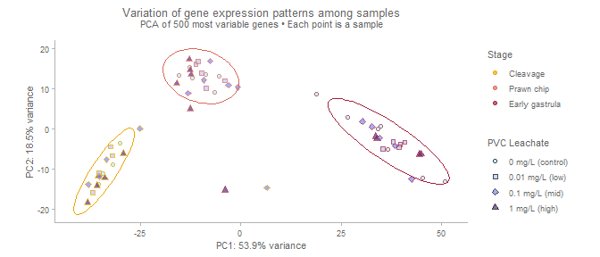
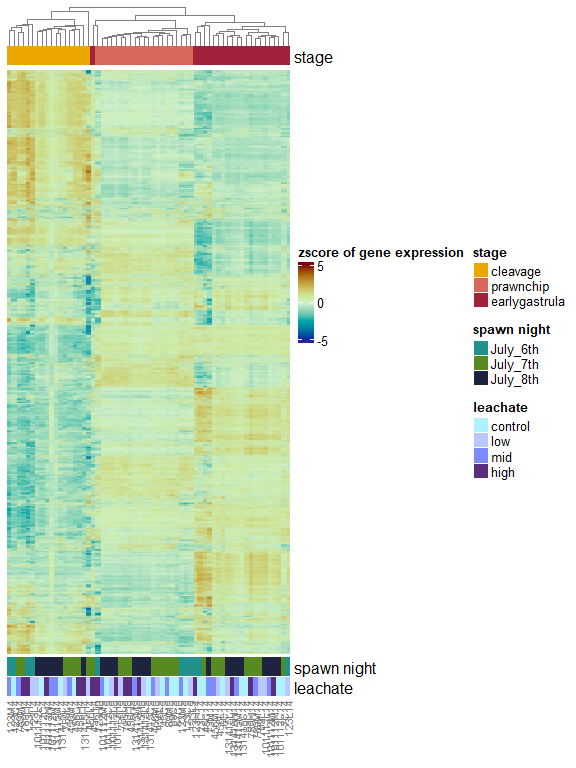
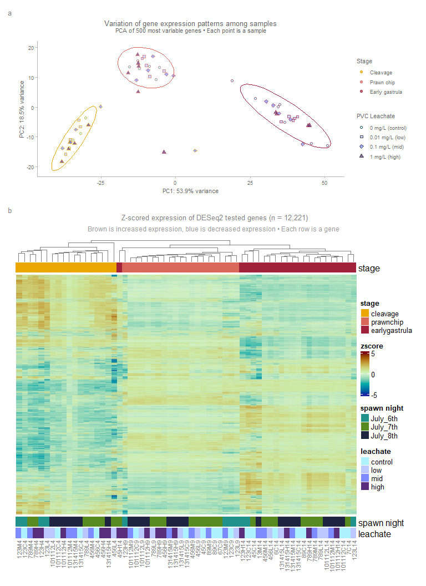

# Step 5: Final figure of PCA & Heatmap of full gene set
Sarah Tanja
2025-11-22

- [<span class="toc-section-number">1</span> Background](#background)
  - [<span class="toc-section-number">1.1</span> Load
    libraries](#load-libraries)
  - [<span class="toc-section-number">1.2</span> Load
    inputs](#load-inputs)
  - [<span class="toc-section-number">1.3</span> Custom ggplot
    theme](#custom-ggplot-theme)
  - [<span class="toc-section-number">1.4</span> Set
    colorschemes](#set-colorschemes)
- [<span class="toc-section-number">2</span> PCA plot of full gene
  set](#pca-plot-of-full-gene-set)
- [<span class="toc-section-number">3</span> Heatmap of full gene
  set](#heatmap-of-full-gene-set)
- [<span class="toc-section-number">4</span> Patchwork](#patchwork)

# Background

## Load libraries

``` r
library(colorspace)
library(shinyjs) # for colorspace hclwizard
library(ggsidekick) # for sean andersons theme_sleek()
library(ComplexHeatmap)
library(tidyverse)
library(patchwork)
```

## Load inputs

``` r
mat <- readRDS("../../output/05_explore/vst_matrix.rds")
pca <- read_csv("../../output/05_explore/pca_500_or.csv")
pheat_df <- readRDS("../../output/05_explore/pheat_annotation_df.rds")
```

## Custom ggplot theme

``` r
theme_sleek_axe <- function() {
  theme_sleek() +
    theme(
      panel.border = element_rect(
        color = "grey70",
        fill = NA,
        linewidth = 0.5
      ),
      axis.line.x  = element_line(color = "grey70"),
      axis.line.y  = element_line(color = "grey70"),
      
      plot.title = element_text(
        size  = 10,
        color = "grey40",
        hjust = 0.5,
        margin = margin(b = 0)
      ),
      
      strip.text = element_text(size = 8, color = "grey40"),
      
      plot.subtitle = element_text(
        size   = 8,
        color  = "grey40",
        hjust  = 0.5,
        margin = margin(t = 0, b = 10)
      ),
      
      axis.title = element_text(size = 8, color = "grey40"),
      axis.text = element_text(size = 7, color = "grey40"),
      legend.title = element_text(size = 8, color = "grey40"),
      legend.text = element_text(size = 7, color = "grey40")
    )
}
```

## Set colorschemes

``` r
leachate.colors <- c(control = "#AEF1FF", 
                     low     = "#BBC7FF",
                     mid     = "#7D8BFF", 
                     high    = "#592F7D")

stage.5.colors <- c(egg           = "#FFE362",
                    cleavage      = "#EBA600", 
                    morula        = "#E6AA83",
                    prawnchip     = "#D9685B", 
                    earlygastrula = "#A2223C")

stage.3.colors <- c(cleavage      = "#EBA600", 
                    prawnchip     = "#D9685B", 
                    earlygastrula = "#A2223C")

status.colors <- c(typical   = "#75C165", 
                   uncertain = "#E3FAA5", 
                   malformed = "#8B0069")

night.colors <- c(July_6th = "#E3FAA5", 
                  July_7th = "#578B21", 
                  July_8th = "#1E2440")

night.colors.alt <- c(July_6th = "#21918C", 
                      July_7th = "#578B21", 
                      July_8th = "#1E2440")
```

``` r
# Annotation colors for pheatmap
ann_colors = list(
  leachate = leachate.colors,
  stage = stage.3.colors,
  night = night.colors.alt
)
```

# PCA plot of full gene set

``` r
pca_flip <- pca %>% 
  mutate(stage = factor(stage, levels = c("cleavage", "prawnchip", "earlygastrula")),
         leachate = factor(leachate, levels = c("control", "low", "mid", "high")))%>%
  dplyr::mutate(PC1 = -PC1)
```

Extract the Percent Variance for the X and Y axis labels

``` r
pca_comp <- prcomp(t(mat))         # samples in rows

percentVar <- (pca_comp$sdev^2) / sum(pca_comp$sdev^2) * 100

pc1_var <- round(percentVar[1], 1)
pc2_var <- round(percentVar[2], 1)
```

``` r
labs_leachate <- c(control = "0 mg/L (control)",
                   low = "0.01 mg/L (low)",
                   mid = "0.1 mg/L (mid)",
                   high = "1 mg/L (high)")

labs_stage <- c(cleavage = "Cleavage", prawnchip = "Prawn chip", earlygastrula = "Early gastrula")

pca_plot <- ggplot(pca_flip, aes(PC1, PC2, color = stage, shape = leachate, fill = leachate, label = name)) +
  geom_point(size = 1.2, stroke = 1, alpha = 0.7) +
  xlab(paste0("PC1: ", pc1_var, "% variance")) +
  ylab(paste0("PC2: ", pc2_var, "% variance")) + 
  coord_fixed() +

  # Control legend labels + titles here
  scale_color_manual(
    name = "Stage",
    values = stage.3.colors,
    labels = labs_stage
  ) +
  scale_shape_manual(
    name = "PVC Leachate",
    values = c(21, 22, 23, 24), # open circle, square, diamond, triangle
    labels = labs_leachate, 
    #guide = "none"
  ) +
  scale_fill_manual(
    name = "PVC Leachate",
    values = leachate.colors,
    labels = labs_leachate, 
    #guide = "none" # prevents duplicate legend
  )+

  stat_ellipse(aes(group = stage, color = stage), linewidth = 0.4, show.legend = FALSE) + 
  labs(
    title = "Variation of gene expression patterns among samples",
    subtitle = "PCA of 500 most variable genes • Each point is a sample"
  ) +
  theme_sleek_axe() +
  theme(panel.border = element_blank())

pca_plot
```



# Heatmap of full gene set

Annotations for our heatmap

``` r
ha_top <- HeatmapAnnotation(
  stage = pheat_df$stage,
  col   = list(stage = ann_colors$stage),
  annotation_name_side = "right"  # label "stage" on the left side
)

ha_bottom <- HeatmapAnnotation(
  `spawn night` = pheat_df$spawn_night,
  leachate      = pheat_df$leachate,
  col = list(
    `spawn night` = ann_colors$night,
    leachate      = ann_colors$leachate
  ),
  annotation_name_side = "right"
)
```

Scale the matrix to be z scores! And then clamp extreme values for
better visualization.

``` r
mat_scaled <- t(scale(t(mat)))     # row-wise z-scaling
mat_scaled_clamped <- pmin(pmax(mat_scaled, -5), 5)  # clamp extreme values to -5 and 5
```

``` r
# 1. build column dendrogram once
col_hc <- hclust(
  dist(t(mat_scaled_clamped), method = "euclidean"),
  method = "complete"
)

# 2. flip it
col_dend_flipped <- rev(as.dendrogram(col_hc))

set.seed(11222025)
Heatmap(
  mat_scaled_clamped,
  clustering_distance_rows    = "euclidean",
  clustering_method_rows      = "complete",
  cluster_columns             = col_dend_flipped,
  name = "zscore of gene expression",
  border = NA,
  column_dend_gp  = gpar(col = "grey50", lwd = 0.7),
  row_names_gp    = gpar(col = "grey50", fontsize = 8),
  column_names_gp = gpar(col = "grey50", fontsize = 8),
  col = rev(colorspace::divergingx_hcl(n = 200, palette = "Roma")),
  cluster_column_slices = TRUE,
  show_row_dend    = FALSE,
  show_column_dend = TRUE,
  top_annotation    = ha_top,
  bottom_annotation = ha_bottom,
  show_row_names    = FALSE,
  show_column_names = TRUE
)
```



> Expression values were transformed using variance-stabilizing
> transformation (VST) and then standardized on a per-gene basis
> (z-score transformation). For each gene, the mean expression across
> samples was subtracted, and the standard deviation was used to scale
> its expression profile. Thus, a value of 0 indicates average
> expression for that gene across all samples, positive values indicate
> above-average expression, and negative values indicate below-average
> expression. This allows visual comparison of expression patterns, not
> absolute expression levels between genes.

# Patchwork

Join plots and add text annotations

``` r
fig_pca_heat <- (
  (wrap_elements(pca_plot) / heatmap_wrapped) +
    plot_layout(heights = c(0.8, 1.5))+
  plot_annotation(tag_levels = "a") &
  theme(plot.tag = element_text(size = 10, 
                                colour = "grey50")
        )
  )  


fig_pca_heat
```



> caption = paste( “A. Principal Component Analysis (PCA) of
> VST-normalized gene expression across all samples.”, “PC1 explains
> 53.9% of the total variance and primarily separates samples by
> embryonic stage,”, “while PC2 explains 18.5% of the variance,
> accounting for 72.4% of total sample variance.”, “Each point
> represents an individual sample, positioned according to its overall
> expression profile.”, “B. Heatmap of z-scored variance-stabilized gene
> count matrix. Values were transformed using variance-stabilizing”,
> “transformation (VST) and then standardized on a per-gene basis
> (z-score transformation). For each gene, the mean”, “expression across
> samples was subtracted, and the standard deviation was used to scale
> its expression profile.”, “A value of 0 indicates no change in
> expression for that gene across all samples, positive values
> indicate”, “above-average expression, and negative values indicate
> below-average expression. This allows visual comparison”, “of
> expression patterns across samples (columns), not absolute expression
> levels between genes (rows).”, sep = ” “)

``` r
# Save figure
ggsave(
  filename = "../../output/05_explore/fig_pca_heatmap_fullgene.png",
  plot     = fig_pca_heat,
  width    = 8,
  height   = 11,
  units    = "in",
  dpi      = 900
)
```
