# Step 5: Data Exploration Figures

This folder contains the initial exploratory data analysis of the gene count matrix for the *Montipora capitata* embryo RNA-seq experiment examining the effects of PVC leachate exposure.

## Overview

The exploratory analysis includes:
- Quality control checks on the count matrix
- Principal Component Analysis (PCA) to visualize sample clustering
- Heatmap analysis to examine gene expression patterns
- Statistical tests for batch effects (betadisper and PERMANOVA)

See [`05_data_exploration.qmd`](05_data_exploration.qmd) for the full analysis code and [`05_data_exploration.md`](05_data_exploration.md) or [`05_data_exploration.html`](05_data_exploration.html) for the rendered output.

---

## Main Output Figures

### Principal Component Analysis (PCA)

*Principal component analysis showing sample clustering by treatment and developmental stage.*

### Z-Score Heatmap

*Heatmap showing hierarchical clustering of samples based on gene expression patterns (z-score transformed).*

### PCA & Heatmap Combined

*Combined visualization of PCA and heatmap for the full gene set.*

### Z-Score Heatmap (Alternative)

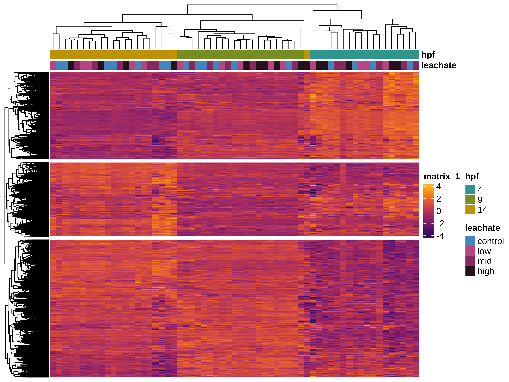

*Alternative z-score heatmap visualization.*

---

## Generated Figures from Analysis

The following figures are automatically generated from the Quarto analysis document and show various quality control, filtering, and exploratory analysis steps.

### Distribution of Unfiltered Reads

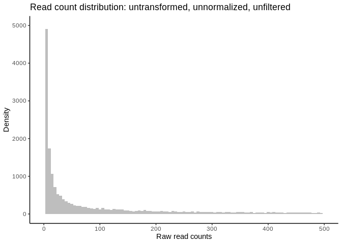

### Quality Control and Filtering Steps

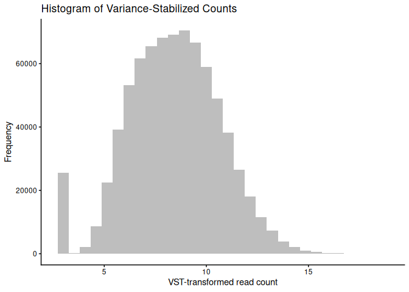

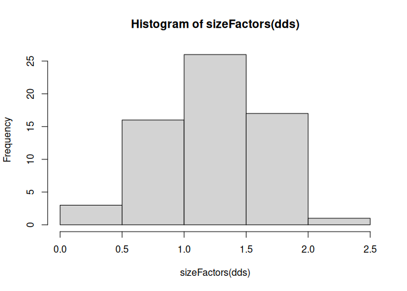

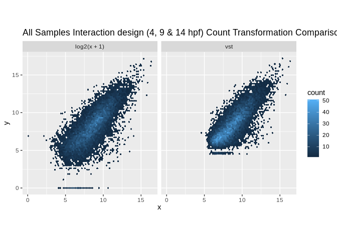

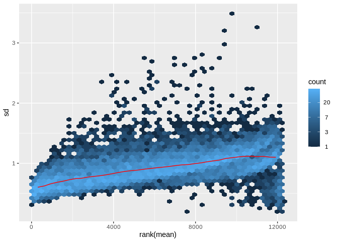

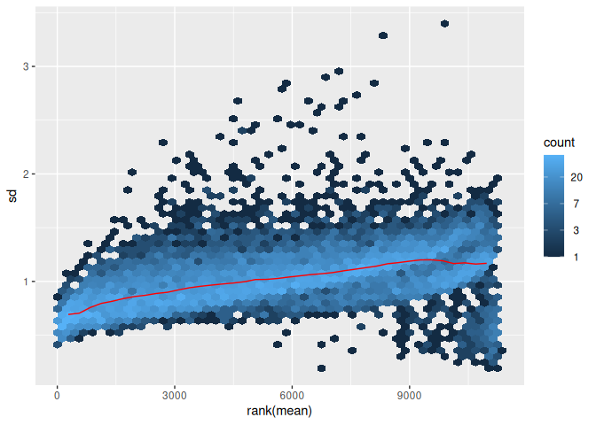

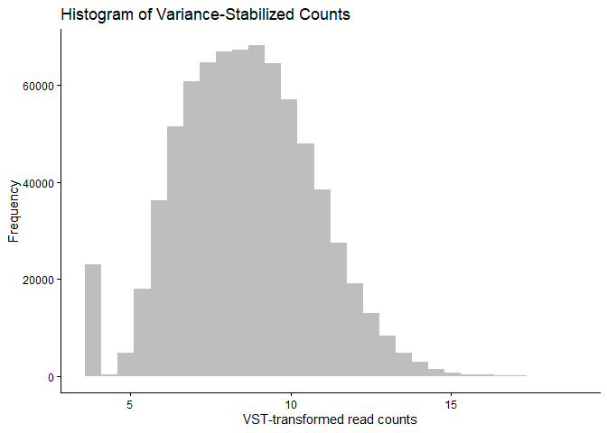

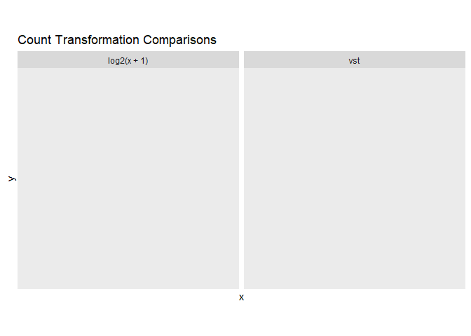

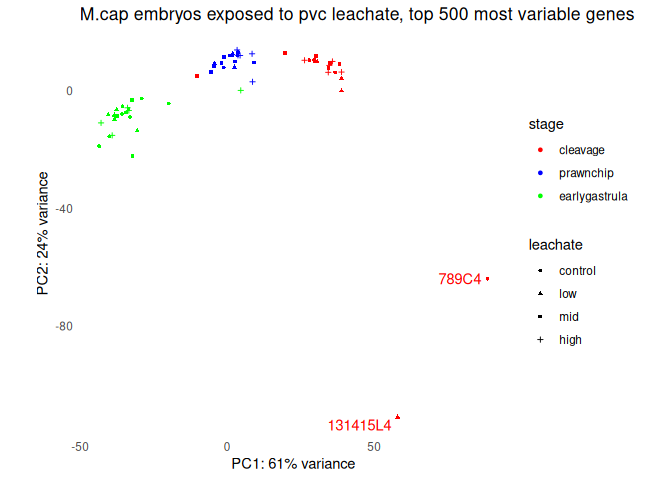

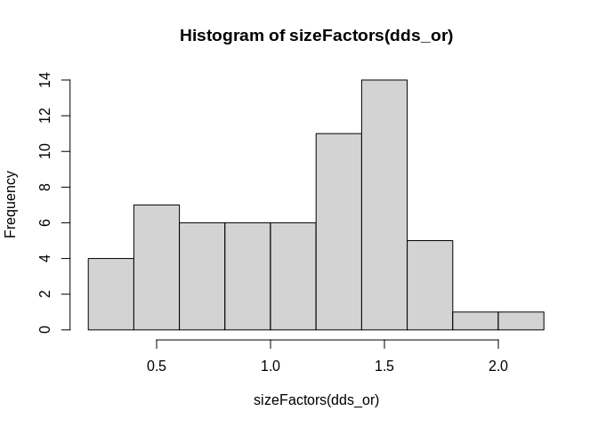

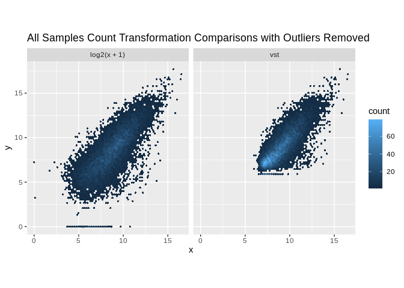

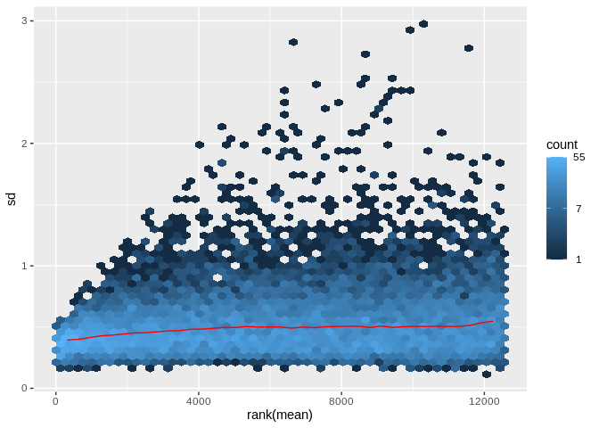

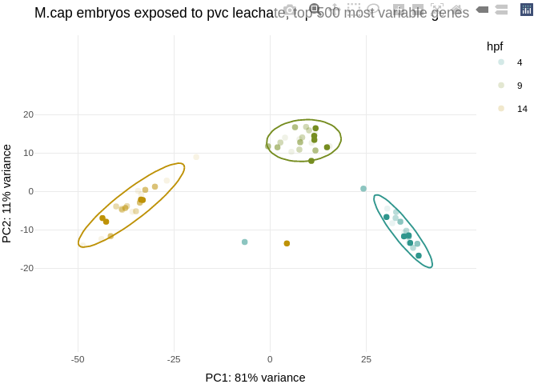

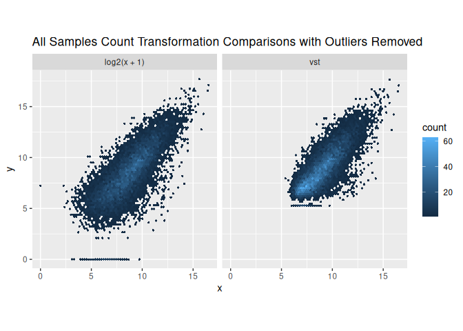

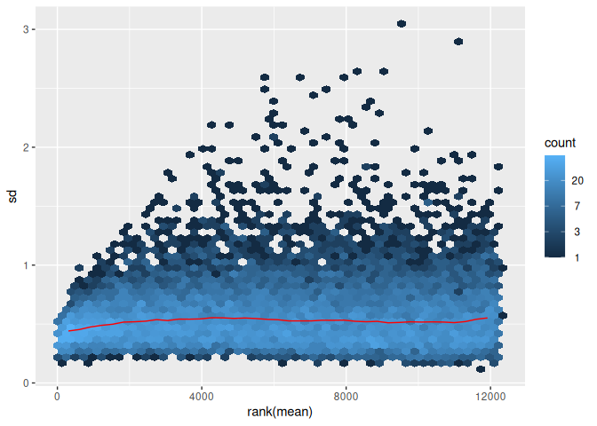

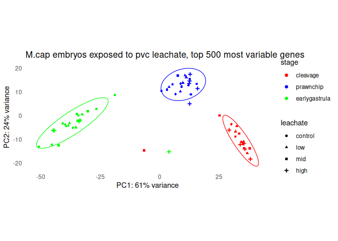

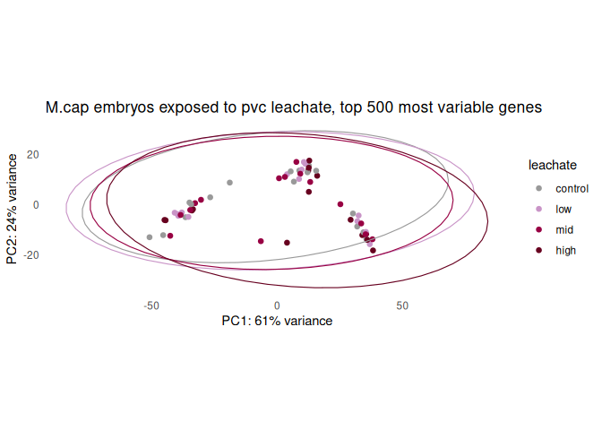

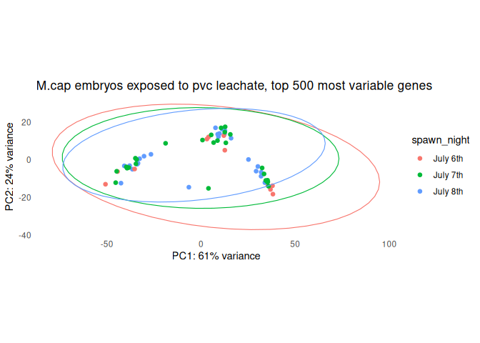

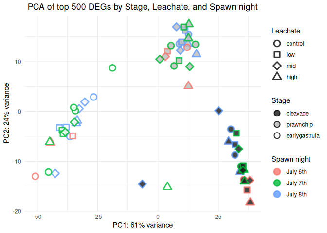

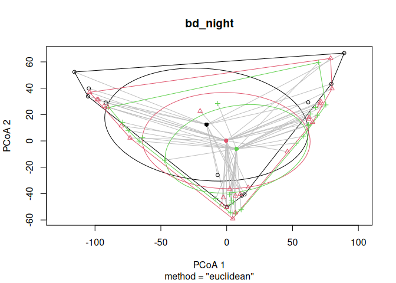

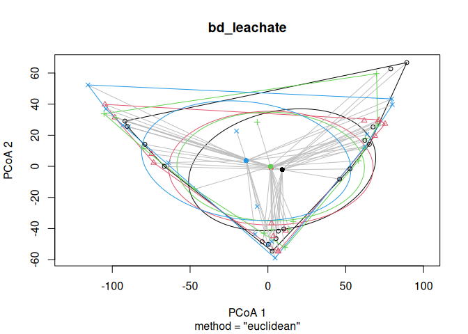

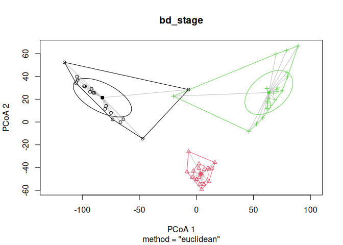

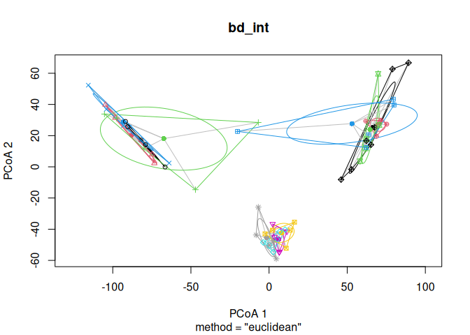

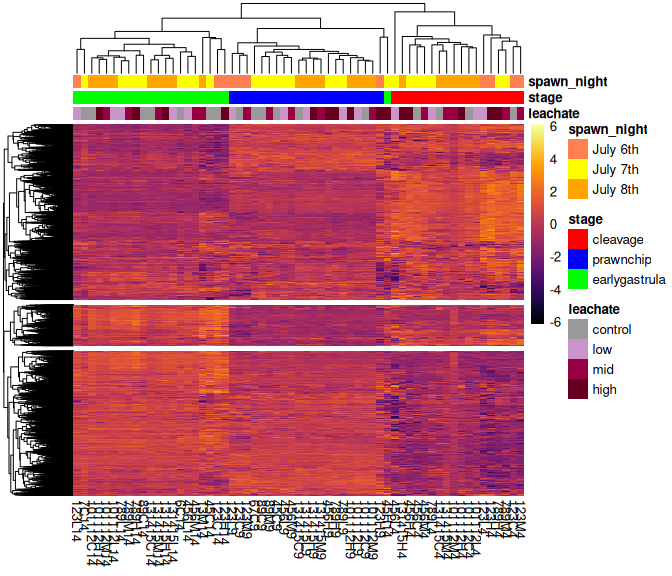

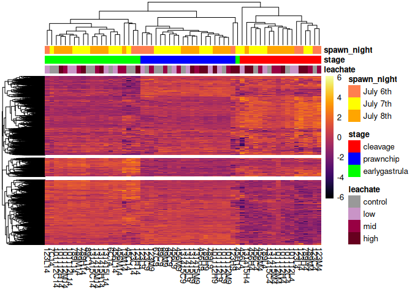

---

## Inputs

- `output/04_count/gene_count_matrix.csv` - Unfiltered gene count matrix
- `metadata/metadata.csv` - Sample metadata

## Outputs

- `output/05_explore/gcm_filtor.csv` - Filtered gene count matrix (gcm) with outlier samples removed
- `metadata/metadata_or.csv` - Filtered metadata with outlier samples removed
- `output/05_explore/pca.png` - Exploratory PCA plot
- `output/05_explore/zscore_heatmap.png` - Exploratory heatmap
- `output/05_explore/fig_pca_heatmap_fullgene.png` - Combined PCA and heatmap visualization
- `output/05_explore/permanova_result_fullgeneset.csv` - PERMANOVA test results
- `output/05_explore/vst_matrix.rds` - Variance stabilized transformation matrix
- `output/05_explore/pheat_annotation_df.rds` - Heatmap annotation data frame

---

## Analysis Summary

This exploratory analysis:
1. Filters the gene count matrix to remove low gene counts
2. Creates a DESeq2 Dataset Object for visualization
3. Identifies and removes outlier samples through PCA
4. Examines potential batch effects (night, leachate, stage)
5. Performs PERMANOVA to test for significant differences
6. Generates heatmaps to visualize broad expression patterns

For detailed methodology and results, see the [analysis document](05_data_exploration.md).
