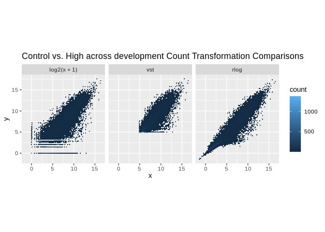
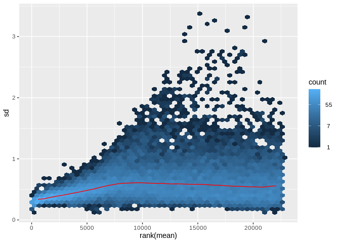
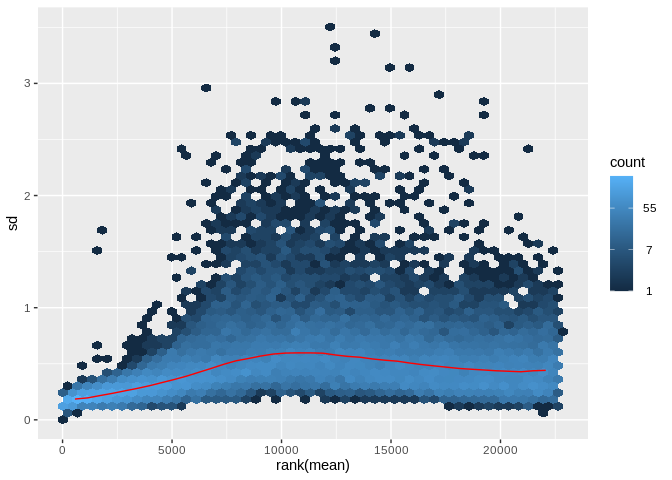
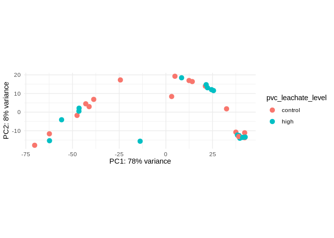
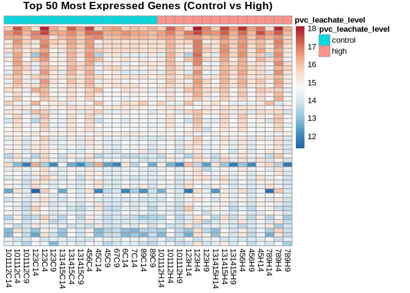

# Control vs High
Sarah Tanja
2025-05-08

- [Load libraries](#load-libraries)
- [Filter count matrix](#filter-count-matrix)
- [Setup metadata](#setup-metadata)
- [Make DESeq Object](#make-deseq-object)
- [Visualizations](#visualizations)
  - [Count transformations](#count-transformations)
  - [PCA](#pca)
  - [Heatmap](#heatmap)
- [Run DESeq2](#run-deseq2)

# Load libraries

``` r
library(tidyverse)
```

    ── Attaching core tidyverse packages ──────────────────────── tidyverse 2.0.0 ──
    ✔ dplyr     1.1.4     ✔ readr     2.1.5
    ✔ forcats   1.0.0     ✔ stringr   1.5.1
    ✔ ggplot2   3.5.1     ✔ tibble    3.2.1
    ✔ lubridate 1.9.4     ✔ tidyr     1.3.1
    ✔ purrr     1.0.2     
    ── Conflicts ────────────────────────────────────────── tidyverse_conflicts() ──
    ✖ dplyr::filter() masks stats::filter()
    ✖ dplyr::lag()    masks stats::lag()
    ℹ Use the conflicted package (<http://conflicted.r-lib.org/>) to force all conflicts to become errors

``` r
library(DESeq2)
```

    Loading required package: S4Vectors
    Loading required package: stats4
    Loading required package: BiocGenerics

    Attaching package: 'BiocGenerics'

    The following objects are masked from 'package:lubridate':

        intersect, setdiff, union

    The following objects are masked from 'package:dplyr':

        combine, intersect, setdiff, union

    The following objects are masked from 'package:stats':

        IQR, mad, sd, var, xtabs

    The following objects are masked from 'package:base':

        anyDuplicated, aperm, append, as.data.frame, basename, cbind,
        colnames, dirname, do.call, duplicated, eval, evalq, Filter, Find,
        get, grep, grepl, intersect, is.unsorted, lapply, Map, mapply,
        match, mget, order, paste, pmax, pmax.int, pmin, pmin.int,
        Position, rank, rbind, Reduce, rownames, sapply, setdiff, sort,
        table, tapply, union, unique, unsplit, which.max, which.min


    Attaching package: 'S4Vectors'

    The following objects are masked from 'package:lubridate':

        second, second<-

    The following objects are masked from 'package:dplyr':

        first, rename

    The following object is masked from 'package:tidyr':

        expand

    The following objects are masked from 'package:base':

        expand.grid, I, unname

    Loading required package: IRanges

    Attaching package: 'IRanges'

    The following object is masked from 'package:lubridate':

        %within%

    The following objects are masked from 'package:dplyr':

        collapse, desc, slice

    The following object is masked from 'package:purrr':

        reduce

    Loading required package: GenomicRanges
    Loading required package: GenomeInfoDb
    Loading required package: SummarizedExperiment
    Loading required package: MatrixGenerics
    Loading required package: matrixStats

    Attaching package: 'matrixStats'

    The following object is masked from 'package:dplyr':

        count


    Attaching package: 'MatrixGenerics'

    The following objects are masked from 'package:matrixStats':

        colAlls, colAnyNAs, colAnys, colAvgsPerRowSet, colCollapse,
        colCounts, colCummaxs, colCummins, colCumprods, colCumsums,
        colDiffs, colIQRDiffs, colIQRs, colLogSumExps, colMadDiffs,
        colMads, colMaxs, colMeans2, colMedians, colMins, colOrderStats,
        colProds, colQuantiles, colRanges, colRanks, colSdDiffs, colSds,
        colSums2, colTabulates, colVarDiffs, colVars, colWeightedMads,
        colWeightedMeans, colWeightedMedians, colWeightedSds,
        colWeightedVars, rowAlls, rowAnyNAs, rowAnys, rowAvgsPerColSet,
        rowCollapse, rowCounts, rowCummaxs, rowCummins, rowCumprods,
        rowCumsums, rowDiffs, rowIQRDiffs, rowIQRs, rowLogSumExps,
        rowMadDiffs, rowMads, rowMaxs, rowMeans2, rowMedians, rowMins,
        rowOrderStats, rowProds, rowQuantiles, rowRanges, rowRanks,
        rowSdDiffs, rowSds, rowSums2, rowTabulates, rowVarDiffs, rowVars,
        rowWeightedMads, rowWeightedMeans, rowWeightedMedians,
        rowWeightedSds, rowWeightedVars

    Loading required package: Biobase
    Welcome to Bioconductor

        Vignettes contain introductory material; view with
        'browseVignettes()'. To cite Bioconductor, see
        'citation("Biobase")', and for packages 'citation("pkgname")'.


    Attaching package: 'Biobase'

    The following object is masked from 'package:MatrixGenerics':

        rowMedians

    The following objects are masked from 'package:matrixStats':

        anyMissing, rowMedians

``` r
library(vsn)
library(pheatmap)
library(RColorBrewer)
```

# Filter count matrix

We want to look at the `control` group (embryos developed in 0.22 um
filtered seawater) vs. the `high` group across all embryonic stages. To
do this let’s start by filtering the count matrix to only the samples of
interest.

``` r
load("../output/06_exploration/gcm_tidyfilt.RData")
```

The genes are the rows. The samples are the columns.

remove outlier samples

``` r
gcm_filtout <- gcm_tidyfilt %>% 
  select(-"131415L4", -"789C4")
```

remove low & mid

``` r
gcm_controlvshigh <- gcm_filtout %>% 
  select(-matches("L|M"))
```

# Setup metadata

> It is absolutely critical that the columns of the count matrix and the
> rows of the column data (information about samples) are in the same
> order. DESeq2 will not make guesses as to which column of the count
> matrix belongs to which row of the column data, these must be provided
> to DESeq2 already in consistent order.

``` r
load("../output/06_exploration/metadata.RData")
```

The samples are rows

remove outlier samples

``` r
metadata_out <- metadata %>% 
  filter(!sample_name %in% c("131415L4", "789C4"))
```

remove low & mid

``` r
metadata_controlvshigh <- metadata_out %>% 
  filter(grepl("C|H", sample_name))
```

confirm metadata sample_name matches gene count matrix columns. The
following code checks that all the sample names in the metadata
dataframe match the column names in the gene count matrix. It should
return ‘TRUE’

``` r
meta <- (metadata_controlvshigh$sample_name)
gene_matrix <- (colnames(gcm_controlvshigh))
meta_check <- data.frame(meta, gene_matrix)

all(meta == gene_matrix)
```

    [1] TRUE

# Make DESeq Object

Make [DESeq Dataset Object from Count
Matrix](https://bioconductor.org/packages/devel/bioc/vignettes/DESeq2/inst/doc/DESeq2.html#count-matrix-input)
Create a DESeqDataSet design from gene count matrix and treatment
conditions.

``` r
#Set DESeq2 design for 1 factor with 2 levels
dds_cvh <- DESeqDataSetFromMatrix(countData = gcm_controlvshigh,
                              colData = metadata_controlvshigh, 
                              design = ~ pvc_leachate_level)
```

    factor levels were dropped which had no samples

# Visualizations

> In order to test for differential expression, we operate on raw counts
> and use discrete distributions… However for visualization or
> clustering – it might be useful to work with transformed versions of
> the count data.

## Count transformations

``` r
# This is now the 
vsd_cvh <- vst(dds_cvh, blind=FALSE)

# This is the r-log transformed DESeq Data
rld_cvh <- rlog(dds_cvh, blind=FALSE)
```

    rlog() may take a few minutes with 30 or more samples,
    vst() is a much faster transformation

``` r
dds_cvh <- estimateSizeFactors(dds_cvh)

df <- bind_rows(
  as_data_frame(log2(counts(dds_cvh, normalized=TRUE)[, 1:2]+1)) %>%
         mutate(transformation = "log2(x + 1)"),
  as_data_frame(assay(vsd_cvh)[, 1:2]) %>% mutate(transformation = "vst"),
  as_data_frame(assay(rld_cvh)[, 1:2]) %>% mutate(transformation = "rlog"))
```

    Warning: `as_data_frame()` was deprecated in tibble 2.0.0.
    ℹ Please use `as_tibble()` (with slightly different semantics) to convert to a
      tibble, or `as.data.frame()` to convert to a data frame.

``` r
colnames(df)[1:2] <- c("x", "y")  

lvls <- c("log2(x + 1)", "vst", "rlog")
df$transformation <- factor(df$transformation, levels=lvls)

ggplot(df, aes(x = x, y = y)) +
  geom_hex(bins = 80) +
  coord_fixed() +
  facet_grid(. ~ transformation) +
  ggtitle("Control vs. High across development Count Transformation Comparisons")
```



``` r
meanSdPlot(assay(vsd_cvh))
```



``` r
meanSdPlot(assay(rld_cvh))
```



## PCA

``` r
# Perform PCA on rlog transformed count data
pca_cvh <- prcomp(t(assay(rld_cvh)), scale = TRUE)

pca_cvh_plot <- plotPCA(rld_cvh, intgroup=c("pvc_leachate_level"), returnData=TRUE)

percentVar <- round(100 * attr(pca_cvh_plot, "percentVar"))

# Make the plot
PCA_CVH_plot <- ggplot(pca_cvh_plot, aes(PC1, PC2, 
                              color=pvc_leachate_level)) +
                              #geom_text(aes(label = name), size = 3) +  # Add labels from the 'name' column
                              geom_point(size=3) +
                              xlab(paste0("PC1: ",percentVar[1],"% variance")) +
                              ylab(paste0("PC2: ",percentVar[2],"% variance")) + 
                              coord_fixed() + 
                              theme_minimal()

# Display the plot
PCA_CVH_plot
```



``` r
# Save the plot as a png
#ggsave("../output/06_exploration/PCAout4.png", plot = PCAout4, width = 8, height = 6, dpi = 600)
```

## Heatmap

``` r
# 1. Select the top 50 genes by mean expression
top_genes <- order(rowMeans(counts(dds_cvh, normalized = TRUE)), decreasing = TRUE)[1:50]

# 2. Extract rlog-transformed matrix
rlog_matrix <- assay(rld_cvh)[top_genes, ]

# 3. Extract only pvc_leachate_level annotation
annotation_df <- as.data.frame(colData(dds_cvh)[, "pvc_leachate_level", drop = FALSE])

# Ensure it's a factor in correct order: control, high
annotation_df$pvc_leachate_level <- factor(annotation_df$pvc_leachate_level, levels = c("control", "high"))

# 4. Order samples by pvc_leachate_level
ordered_cols <- order(annotation_df$pvc_leachate_level)

# Reorder matrix and annotation
rlog_matrix_ordered <- rlog_matrix[, ordered_cols]
annotation_ordered <- annotation_df[ordered_cols, , drop = FALSE]

# 5. Plot heatmap
heatmap_colors <- colorRampPalette(rev(brewer.pal(n = 9, "RdBu")))(100)

pheatmap(
  rlog_matrix_ordered,
  cluster_rows = FALSE,
  cluster_cols = FALSE,
  show_rownames = FALSE,
  annotation_col = annotation_ordered,
  color = heatmap_colors,
  main = "Top 50 Most Expressed Genes (Control vs High)"
)
```



# Run DESeq2

``` r
dds_cvh_deseq <- DESeq(dds_cvh)
```

    using pre-existing size factors

    estimating dispersions

    gene-wise dispersion estimates

    mean-dispersion relationship

    final dispersion estimates

    fitting model and testing

    -- replacing outliers and refitting for 827 genes
    -- DESeq argument 'minReplicatesForReplace' = 7 
    -- original counts are preserved in counts(dds)

    estimating dispersions

    fitting model and testing

``` r
summary(results(dds_cvh_deseq))
```


    out of 22633 with nonzero total read count
    adjusted p-value < 0.1
    LFC > 0 (up)       : 0, 0%
    LFC < 0 (down)     : 0, 0%
    outliers [1]       : 0, 0%
    low counts [2]     : 1, 0.0044%
    (mean count < 0)
    [1] see 'cooksCutoff' argument of ?results
    [2] see 'independentFiltering' argument of ?results

> [!IMPORTANT]
>
> There are zero differentially expressed genes between the control and
> high treatment groups across all developmental stages.
