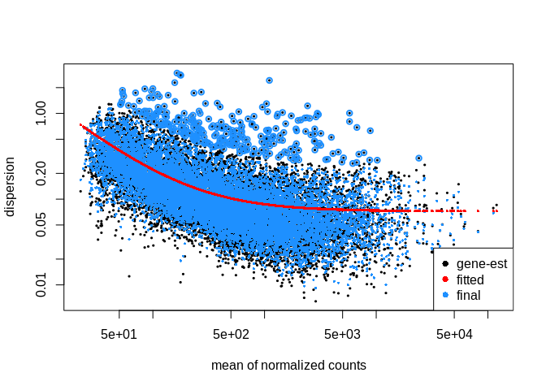
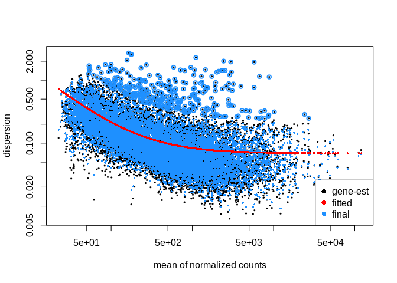
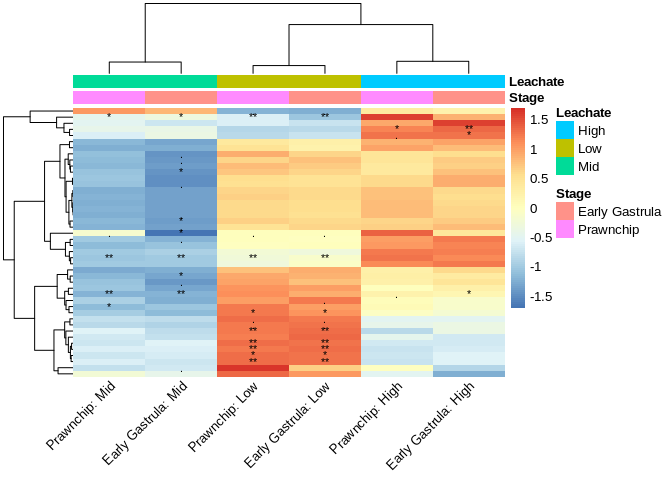

# Multifactorial Differential Gene Expression
Sarah Tanja
2024-12-02

- [<span class="toc-section-number">1</span> Background](#background)
  - [<span class="toc-section-number">1.1</span> Inputs](#inputs)
  - [<span class="toc-section-number">1.2</span> Outputs](#outputs)
- [<span class="toc-section-number">2</span> Setup](#setup)
  - [<span class="toc-section-number">2.1</span> Install
    packages](#install-packages)
  - [<span class="toc-section-number">2.2</span> Load
    packages](#load-packages)
  - [<span class="toc-section-number">2.3</span> Import filtered gene
    count matrix](#import-filtered-gene-count-matrix)
  - [<span class="toc-section-number">2.4</span> Import
    metadata](#import-metadata)
- [<span class="toc-section-number">3</span> LRT](#lrt)
  - [<span class="toc-section-number">3.1</span> Continuous vs
    categorical](#continuous-vs-categorical)
  - [<span class="toc-section-number">3.2</span> Run DESeq LRT
    Tests](#run-deseq-lrt-tests)
  - [<span class="toc-section-number">3.3</span> Results](#results)
  - [<span class="toc-section-number">3.4</span> Save significant
    genes](#save-significant-genes)
    - [<span class="toc-section-number">3.4.1</span> Plots](#plots)
    - [<span class="toc-section-number">3.4.2</span> Loop plots of all
      significant interaction
      genes](#loop-plots-of-all-significant-interaction-genes)
  - [<span class="toc-section-number">3.5</span> Gene Expression
    Plots](#gene-expression-plots)
- [<span class="toc-section-number">4</span> Wald](#wald)
  - [<span class="toc-section-number">4.1</span> Interaction
    terms](#interaction-terms)
    - [<span class="toc-section-number">4.1.1</span> Extract Wald
      results for all interaction
      terms](#extract-wald-results-for-all-interaction-terms)
    - [<span class="toc-section-number">4.1.2</span> Plot
      heatmap](#plot-heatmap)
- [<span class="toc-section-number">5</span> Summary & Next
  Steps](#summary--next-steps)

# Background

Here we are looking at a multifactorial differential gene expression
analysis for *Montipora capitata* coral embryos at 3 developmental
stages (4 hours post fertilization = cleavage , 9 hours post
fertilization = prawnchip, and 14 hours post fertilization = early
gastrula). Embryos at each stage were exposed to either a control, low,
mid, or high concentration of PVC leachate. This work aims to understand
sublethal effects of ubiquitous non-point source PVC leachate pollution
on coral reefs.

## Inputs

- `gcm_filtor.csv` is the filtered gene count matrix for 61 samples (two
  outliers removed).
- `metadata_or.csv` is the metadata for 61 samples (two outliers
  removed)

## Outputs

- `output/06_deg/interactions/int_wald_heatmap.png`
- `volcano_facet_interaction.png`

# Setup

## Install packages

Copy and run this once in the console

    # CRAN packages
    install.packages(c(
      "tidyverse",
      "viridis",
      "plotly",
      "cowplot",
      "pheatmap",
      "vsn",
      "ashr",
      "remotes"  # required for GitHub installs
    ))

    # GitHub package
    remotes::install_github("mdscheuerell/flexoki")

    # Bioconductor
    if (!"BiocManager" %in% rownames(installed.packages())) {
      install.packages("BiocManager")
    }
    BiocManager::install(c("DESeq2", "EnhancedVolcano"))

## Load packages

``` r
# Load packages
library(DESeq2)
library(viridis)
library(tidyverse)
library(EnhancedVolcano)
library(ashr)
library(flexoki)
library(plotly)
library(cowplot)
library(vsn)
library(pheatmap)
```

## Import filtered gene count matrix

In this count matrix, each row represents a gene, each column a
sequenced RNA library, and the values give the estimated counts of
fragments that were assigned to the respective gene in each library by
`HISAT2`

- `check.names = FALSE` removed the ‘X’ from in front of sample id’s in
  the column headers

``` r
gcm_filtor <- read.csv("../../output/05_explore/gcm_filtor.csv", row.names="gene_id", check.names=FALSE)
head(gcm_filtor)
```

                                              101112C14 101112C4 101112C9 101112H14
    Montipora_capitata_HIv3___RNAseq.g4581.t1       176      458      395       195
    Montipora_capitata_HIv3___RNAseq.g4582.t1      1137      380      934       882
    Montipora_capitata_HIv3___RNAseq.g4583.t1      2043      905     1848      1847
    Montipora_capitata_HIv3___RNAseq.g4584.t1      2641      452      706      1917
    Montipora_capitata_HIv3___RNAseq.g4585.t1       521       17      161       304
    Montipora_capitata_HIv3___RNAseq.g4586.t1       121       33       81       116
                                              101112H4 101112H9 101112L14 101112L4
    Montipora_capitata_HIv3___RNAseq.g4581.t1      144      351       156      187
    Montipora_capitata_HIv3___RNAseq.g4582.t1      326     1337      1101      392
    Montipora_capitata_HIv3___RNAseq.g4583.t1      945     2087      1625     1039
    Montipora_capitata_HIv3___RNAseq.g4584.t1      266      625      2301      367
    Montipora_capitata_HIv3___RNAseq.g4585.t1       33      243       449       20
    Montipora_capitata_HIv3___RNAseq.g4586.t1       17       98       114       45
                                              101112L9 101112M14 101112M4 101112M9
    Montipora_capitata_HIv3___RNAseq.g4581.t1      360       215      199      386
    Montipora_capitata_HIv3___RNAseq.g4582.t1     1195      1311      431     1076
    Montipora_capitata_HIv3___RNAseq.g4583.t1     2367      1875     1176     2230
    Montipora_capitata_HIv3___RNAseq.g4584.t1      668      1963      800      706
    Montipora_capitata_HIv3___RNAseq.g4585.t1      190       350      103      198
    Montipora_capitata_HIv3___RNAseq.g4586.t1       89       109       18      155
                                              123C14 123C4 123C9 123H14 123H4 123H9
    Montipora_capitata_HIv3___RNAseq.g4581.t1     63   714   351    138   384   146
    Montipora_capitata_HIv3___RNAseq.g4582.t1    643   496  1064    927   378   864
    Montipora_capitata_HIv3___RNAseq.g4583.t1   1349  1591  1529   1377   648  1902
    Montipora_capitata_HIv3___RNAseq.g4584.t1   2724   703   648   3178   497   438
    Montipora_capitata_HIv3___RNAseq.g4585.t1    641    25   146    426     9   208
    Montipora_capitata_HIv3___RNAseq.g4586.t1     78    51   114    121    21    32
                                              123L14 123L4 123L9 123M4 123M9
    Montipora_capitata_HIv3___RNAseq.g4581.t1    190   271   304   771   154
    Montipora_capitata_HIv3___RNAseq.g4582.t1    884   270   838   650   516
    Montipora_capitata_HIv3___RNAseq.g4583.t1   2007   630  1572  1258   892
    Montipora_capitata_HIv3___RNAseq.g4584.t1   1867   330   366   677   397
    Montipora_capitata_HIv3___RNAseq.g4585.t1    368    31    87    15    90
    Montipora_capitata_HIv3___RNAseq.g4586.t1    116     8    62    64    40
                                              131415C14 131415C4 131415C9 131415H14
    Montipora_capitata_HIv3___RNAseq.g4581.t1       198      321      371       196
    Montipora_capitata_HIv3___RNAseq.g4582.t1      1184      712     1338      1314
    Montipora_capitata_HIv3___RNAseq.g4583.t1      2175     1667     2190      1932
    Montipora_capitata_HIv3___RNAseq.g4584.t1      1556      510      473      2267
    Montipora_capitata_HIv3___RNAseq.g4585.t1       310       18      208       453
    Montipora_capitata_HIv3___RNAseq.g4586.t1       143       39      154        82
                                              131415H4 131415H9 131415L14 131415L9
    Montipora_capitata_HIv3___RNAseq.g4581.t1      221      410       170      362
    Montipora_capitata_HIv3___RNAseq.g4582.t1      382     1117      1167     1500
    Montipora_capitata_HIv3___RNAseq.g4583.t1      716     2219      1817     2102
    Montipora_capitata_HIv3___RNAseq.g4584.t1      334      326      2772      534
    Montipora_capitata_HIv3___RNAseq.g4585.t1        0      106       434      129
    Montipora_capitata_HIv3___RNAseq.g4586.t1       15       65       154      144
                                              131415M14 131415M4 131415M9 13M14
    Montipora_capitata_HIv3___RNAseq.g4581.t1       291      271      396    71
    Montipora_capitata_HIv3___RNAseq.g4582.t1      1376      667     1383   912
    Montipora_capitata_HIv3___RNAseq.g4583.t1      2108     1395     2314  1639
    Montipora_capitata_HIv3___RNAseq.g4584.t1      2296      404      492  2194
    Montipora_capitata_HIv3___RNAseq.g4585.t1       375       48      117   527
    Montipora_capitata_HIv3___RNAseq.g4586.t1       156       87       90    92
                                              456C4 456H4 456H9 456L14 456L4 456L9
    Montipora_capitata_HIv3___RNAseq.g4581.t1   196   351   236    125    73   274
    Montipora_capitata_HIv3___RNAseq.g4582.t1   306   458  1301   1306   249  1105
    Montipora_capitata_HIv3___RNAseq.g4583.t1   651   987  1882   1882  1050  2506
    Montipora_capitata_HIv3___RNAseq.g4584.t1   291   547   488   1736   169   495
    Montipora_capitata_HIv3___RNAseq.g4585.t1    29    11    87    384    35   198
    Montipora_capitata_HIv3___RNAseq.g4586.t1    55    29   117    113     0    77
                                              456M14 456M4 456M9 45C14 45C9 45H14
    Montipora_capitata_HIv3___RNAseq.g4581.t1    151   454   250    50  348   411
    Montipora_capitata_HIv3___RNAseq.g4582.t1   1270   525   967   420  981   590
    Montipora_capitata_HIv3___RNAseq.g4583.t1   1649   940  2005   703 2230  1807
    Montipora_capitata_HIv3___RNAseq.g4584.t1   1698   522   595  1402  913  1021
    Montipora_capitata_HIv3___RNAseq.g4585.t1    257    28   154   289  137   238
    Montipora_capitata_HIv3___RNAseq.g4586.t1     72    30    65    17   50    13
                                              67C9 6C14 789H14 789H4 789H9 789L14
    Montipora_capitata_HIv3___RNAseq.g4581.t1  290  114    150   516   332    168
    Montipora_capitata_HIv3___RNAseq.g4582.t1  973 1022    862   628  1338   1027
    Montipora_capitata_HIv3___RNAseq.g4583.t1 1995 1769   1633  1128  2429   1616
    Montipora_capitata_HIv3___RNAseq.g4584.t1  310 1435   2783   963   783   2549
    Montipora_capitata_HIv3___RNAseq.g4585.t1  167  169    489    21   158    457
    Montipora_capitata_HIv3___RNAseq.g4586.t1   77   81     75    68   172     83
                                              789L4 789L9 789M14 789M4 7C14 89C14
    Montipora_capitata_HIv3___RNAseq.g4581.t1   148   409    150   461  208   235
    Montipora_capitata_HIv3___RNAseq.g4582.t1   445  1326    959   551  711  1563
    Montipora_capitata_HIv3___RNAseq.g4583.t1   819  2344   1757  1111 1874  2623
    Montipora_capitata_HIv3___RNAseq.g4584.t1   313   686   2913   906 1307  2195
    Montipora_capitata_HIv3___RNAseq.g4585.t1    34   130    501    30  267   355
    Montipora_capitata_HIv3___RNAseq.g4586.t1    16    82     93    51   55    98
                                              89C9 89M9
    Montipora_capitata_HIv3___RNAseq.g4581.t1  273  230
    Montipora_capitata_HIv3___RNAseq.g4582.t1 1349  823
    Montipora_capitata_HIv3___RNAseq.g4583.t1 2594 1646
    Montipora_capitata_HIv3___RNAseq.g4584.t1  778  624
    Montipora_capitata_HIv3___RNAseq.g4585.t1  271  166
    Montipora_capitata_HIv3___RNAseq.g4586.t1  105   42

- The raw unfiltered, untransformed, count matrix shows counts of whole
  numbers (integers)
- Each column is a sample
- Each row is a gene
- A sample id describes parental crosses (the first string of numbers),
  the pollution exposure (C, L, M, H), and the embryonic stage (4, 9,
  14)

> [!NOTE]
>
> `gcm_filtor` is the gene count matrix that has been filtered down to
> only contain rows where counts are at least 15 in 75% of the samples
> and 2 outlier samples ( `131415L4` and `789C4` ) that had poor HISAT
> alignment and did not group in the exploratory PCA are already removed

## Import metadata

``` r
metadata_or <- read_csv("../../metadata/metadata_or.csv")
str(metadata_or)
```

    spc_tbl_ [61 × 7] (S3: spec_tbl_df/tbl_df/tbl/data.frame)
     $ sample_id   : chr [1:61] "101112C14" "101112C4" "101112C9" "101112H14" ...
     $ parents     : num [1:61] 101112 101112 101112 101112 101112 ...
     $ group       : chr [1:61] "C14" "C4" "C9" "H14" ...
     $ hpf         : num [1:61] 14 4 9 14 4 9 14 4 9 14 ...
     $ stage       : chr [1:61] "earlygastrula" "cleavage" "prawnchip" "earlygastrula" ...
     $ leachate    : chr [1:61] "control" "control" "control" "high" ...
     $ leachate_mgL: num [1:61] 0 0 0 1 1 1 0.01 0.01 0.01 0.1 ...
     - attr(*, "spec")=
      .. cols(
      ..   sample_id = col_character(),
      ..   parents = col_double(),
      ..   group = col_character(),
      ..   hpf = col_double(),
      ..   stage = col_character(),
      ..   leachate = col_character(),
      ..   leachate_mgL = col_double()
      .. )
     - attr(*, "problems")=<externalptr> 

``` r
# Reorder factors
metadata_or$stage <- as.factor(metadata_or$stage)
metadata_or$stage <- fct_relevel(metadata_or$stage, "cleavage", "prawnchip", "earlygastrula")
 
metadata_or$leachate <- as.factor(metadata_or$leachate)
metadata_or$leachate <- fct_relevel(metadata_or$leachate, "control", "low", "mid", "high")

str(metadata_or)
```

    spc_tbl_ [61 × 7] (S3: spec_tbl_df/tbl_df/tbl/data.frame)
     $ sample_id   : chr [1:61] "101112C14" "101112C4" "101112C9" "101112H14" ...
     $ parents     : num [1:61] 101112 101112 101112 101112 101112 ...
     $ group       : chr [1:61] "C14" "C4" "C9" "H14" ...
     $ hpf         : num [1:61] 14 4 9 14 4 9 14 4 9 14 ...
     $ stage       : Factor w/ 3 levels "cleavage","prawnchip",..: 3 1 2 3 1 2 3 1 2 3 ...
     $ leachate    : Factor w/ 4 levels "control","low",..: 1 1 1 4 4 4 2 2 2 3 ...
     $ leachate_mgL: num [1:61] 0 0 0 1 1 1 0.01 0.01 0.01 0.1 ...
     - attr(*, "spec")=
      .. cols(
      ..   sample_id = col_character(),
      ..   parents = col_double(),
      ..   group = col_character(),
      ..   hpf = col_double(),
      ..   stage = col_character(),
      ..   leachate = col_character(),
      ..   leachate_mgL = col_double()
      .. )
     - attr(*, "problems")=<externalptr> 

> [!NOTE]
>
> `metadata_filt` contains metadata for 61 samples with explanatory
> variables: - `stage` is a factor with 3 levels (cleavage, prawnchip,
> earlygastrula) - `hpf` is a discrete numerical variable representing
> the hours post fertilization 4, 9, and 14 (corresponding to `stage`)
>
> - `leachate` is a factor with 4 levels (control, low, mid, high)
> - `leachate_mgL` is a continuous numerical variable representing
>   leachate concentrations in mg/L with values 0 , 0.01 , 0.1 , and 1
>   (corresponding to `leachate`)

# LRT

This compares:

Full model: ~ stage + leachate + stage:leachate

Reduced model: ~ stage + leachate

This tells you: Is there any interaction effect between stage and
leachate?

But it won’t tell you which interaction is significant, or in which
direction — you need Wald contrasts for that.

## Continuous vs categorical

Embryonic stage should be treated as a categorical variable because
DESeq2 will estimate expression differences between stages, rather than
assuming a linear progression from 4 → 14 hpf. It will fit different
intercepts for each stage (i.e., different baseline expression levels).
If you encode stage as numeric, the model would assume a linear change
in expression per hour of development, which is biologically risky
unless you expect linearity (note: we do not).

Whether leachate is treated as a factor or a numeric (continuous)
variable radically changes the interpretation of both the main effect
and the interaction. If a variable is numeric, DESeq2 treats it as a
continuous covariate. This fits a regression slope, estimating the
change in gene expression per unit increase in the variable.

Coding `leachate` as a categorical factor allows each stage to have its
own independent leachate effect. ✅ Use this if you expect nonlinear,
stage-specific effects of exposure.

``` r
dds_cat <- DESeqDataSetFromMatrix(countData = gcm_filtor,
                              colData = metadata_or,
                              design = formula( ~ stage + leachate + stage:leachate))
```

Coding `leachate_mgL` as a continuous numeric tests for a change in
expression per unit increase in leachate, and the interaction term tests
whether the slope of the dose-response differs depending on stage. ✅
Use this if you expect a linear or dose-dependent trend, and want to ask
if the strength or direction of the trend varies by stage.

``` r
dds_con <- DESeqDataSetFromMatrix(countData = gcm_filtor,
                              colData = metadata_or,
                              design = formula( ~ stage + leachate_mgL + stage:leachate_mgL))
```

## Run DESeq LRT Tests

> Does modeling leachate as a factor vs. a continuous dose better
> explain gene expression changes across stages?

``` r
dds_cat <- DESeq(dds_cat, test = "LRT", reduced = ~ stage + leachate)
dds_con <- DESeq(dds_con, test = "LRT", reduced = ~ stage + leachate_mgL)
```

| Model         | Full model                                  | Reduced model          | LRT tests…                                                 |
|---------------|---------------------------------------------|------------------------|------------------------------------------------------------|
| `dds_cat_LRT` | `stage + leachate + stage:leachate`         | `stage + leachate`     | Are there **stage-specific effects of leachate (factor)**? |
| `dds_con_LRT` | `stage + leachate_mgL + stage:leachate_mgL` | `stage + leachate_mgL` | Are there **stage-specific trends** in dose response?      |

## Results

Plot dispersion

``` r
plotDispEsts(dds_cat)
```



``` r
plotDispEsts(dds_con)
```



> [!NOTE]
>
> Categorical model has less dispersion than the continuous model! Pay
> attention to the scale of the Y axis when comparing them.

View summary

``` r
res_cat <- results(dds_cat, alpha = 0.05)
summary(res_cat)
```


    out of 12565 with nonzero total read count
    adjusted p-value < 0.05
    LFC > 0 (up)       : 28, 0.22%
    LFC < 0 (down)     : 16, 0.13%
    outliers [1]       : 0, 0%
    low counts [2]     : 0, 0%
    (mean count < 23)
    [1] see 'cooksCutoff' argument of ?results
    [2] see 'independentFiltering' argument of ?results

``` r
res_con <- results(dds_con, alpha = 0.05)
summary(res_con)
```


    out of 12565 with nonzero total read count
    adjusted p-value < 0.05
    LFC > 0 (up)       : 2, 0.016%
    LFC < 0 (down)     : 0, 0%
    outliers [1]       : 1, 0.008%
    low counts [2]     : 0, 0%
    (mean count < 23)
    [1] see 'cooksCutoff' argument of ?results
    [2] see 'independentFiltering' argument of ?results

``` r
sig_cat <- rownames(results(dds_cat, alpha = 0.05)[which(results(dds_cat)$padj < 0.05), ])
sig_con <- rownames(results(dds_con, alpha = 0.05)[which(results(dds_con)$padj < 0.05), ])
length(intersect(sig_cat, sig_con))
```

    [1] 2

> [!NOTE]
>
> 2 out of 44 genes have a linear relationship (compared to a non-linear
> one!) as we look at the interactions between leachate and stage. All
> 44 of these genes respond to leachate differently depending on stage.
>
> 44 genes show significant stage-by-leachate interaction when leachate
> is treated categorically → meaning the response to leachate varies by
> stage, but not necessarily in a linear/dose-dependent way.
>
> 2 genes show significant stage-specific dose-response effects when
> leachate is treated as continuous → they show a linear or monotonic
> trend across leachate concentrations that varies by stage.
>
> The 2 overlapping genes are well-modeled by a linear trend in leachate
> (i.e., a slope, not just group differences). The 42 other genes show
> non-linear or non-monotonic behavior — meaning their response does not
> follow a consistent increase/decrease with dose. Instead, they respond
> differently to each specific leachate level depending on the stage
> (e.g., they might increase at 0.1 mg/L but decrease at 1 mg/L, or vice
> versa).

## Save significant genes

``` r
sig_genes <- res_cat %>%
  as.data.frame() %>%
  filter(padj < 0.05) %>% 
  rownames_to_column(var = "gene_id")

write.csv(sig_genes, "../../output/06_deg/interactions/sig_genes.csv")
```

> Of the 44 genes showing significant stage-specific responses to
> leachate (based on the categorical model), only 2 also show a
> significant linear dose-response interaction with stage (based on the
> continuous model). This suggests that while stage modulates leachate
> response broadly, most genes (42/44) exhibit nonlinear or
> non-monotonic patterns, rather than a simple linear trend across
> leachate levels. keep.order = TRUE)

``` r
vsd <- assay(vst(dds_cat))

# make long expression dataframe of significant interaction genes
sig_long <- vsd[sig_cat, ] %>% 
  as.data.frame() %>% 
  rownames_to_column("gene_id") %>%
  pivot_longer(-gene_id, names_to = "sample_id", values_to = "expression")

# add metadata
sig_long <- sig_long %>% left_join(metadata_or, by = "sample_id")
# add padj
sig_long <- sig_long %>% left_join(sig_genes, by = "gene_id")

# Assign numbers to genes by min padj
gene_order <- sig_long %>%
  group_by(gene_id) %>%
  summarise(min_padj = min(padj, na.rm = TRUE), .groups = "drop") %>%
  arrange(min_padj) %>%
  mutate(padj_rank = row_number())

# Join back to sig_long
sig_long <- sig_long %>%
  left_join(gene_order %>% select(gene_id, padj_rank), by = "gene_id")

sig_long %>% select(gene_id, padj, padj_rank) %>% distinct() %>% arrange(padj)
```

    # A tibble: 44 × 3
       gene_id                                             padj padj_rank
       <chr>                                              <dbl>     <int>
     1 Montipora_capitata_HIv3___TS.g26493.t2a    0.00000000749         1
     2 Montipora_capitata_HIv3___RNAseq.g15087.t1 0.00000108            2
     3 Montipora_capitata_HIv3___TS.g45793.t1b    0.00000108            3
     4 Montipora_capitata_HIv3___RNAseq.g40764.t1 0.00000265            4
     5 Montipora_capitata_HIv3___RNAseq.g7017.t1  0.0000247             5
     6 Montipora_capitata_HIv3___RNAseq.g20279.t1 0.0000410             6
     7 Montipora_capitata_HIv3___RNAseq.g21373.t1 0.000112              7
     8 Montipora_capitata_HIv3___RNAseq.g33315.t1 0.000112              8
     9 Montipora_capitata_HIv3___TS.g8038.t2      0.000211              9
    10 Montipora_capitata_HIv3___TS.g48661.t1     0.000423             10
    # ℹ 34 more rows

How many samples are in each treatment for each significant gene?

``` r
sample_counts <- sig_long %>% 
  count(gene_id, group) %>%   # count rows per gene_id + group
  pivot_wider(names_from = group,              # make each group a column
              values_from = n, 
              values_fill = 0)                 # fill missing group-gene combos with 0

any(as.matrix(sample_counts[, 2:13]) < 4)
```

    [1] FALSE

> [!NOTE]
>
> At least 4 samples representing in each group per significant gene.

``` r
sig_long %>%
  group_by(gene_id, leachate, stage) %>%
  summarise(n = n_distinct(sample_id), .groups = "drop") %>%
  filter(n < 4)
```

    # A tibble: 0 × 4
    # ℹ 4 variables: gene_id <chr>, leachate <fct>, stage <fct>, n <int>

Top 3 genes with significant interaction between `stage` x `leachate`

``` r
top_genes <- sig_long %>%
  select(gene_id, padj, padj_rank) %>% 
  distinct() %>%
  arrange(padj) %>%
  slice_head(n = 3) 
  
top_genes
```

    # A tibble: 3 × 3
      gene_id                                             padj padj_rank
      <chr>                                              <dbl>     <int>
    1 Montipora_capitata_HIv3___TS.g26493.t2a    0.00000000749         1
    2 Montipora_capitata_HIv3___RNAseq.g15087.t1 0.00000108            2
    3 Montipora_capitata_HIv3___TS.g45793.t1b    0.00000108            3

### Plots

#### Top 3 Significant Genes

``` r
top_info <- sig_long %>%
  group_by(gene_id) %>%
  summarise(min_padj = min(padj, na.rm = TRUE)) %>%
  arrange(min_padj) %>%
  slice_head(n = 3)
```

``` r
for (i in 1:nrow(top_info)) {
  gene <- top_info$gene_id[i]
  padj_val <- signif(top_info$min_padj[i], 3)

  gene_df <- sig_long %>% filter(gene_id == gene)
  padj_rank <- unique(gene_df$padj_rank)

  p <- ggplot(gene_df, aes(x = leachate, y = expression, color = stage, label = sample_id)) +
    geom_point(
      size = 2, 
      alpha = 0.9,
      position = position_jitter(width = 0.05, height = 0),
      show.legend = FALSE
      ) +
    geom_smooth(
      aes(group = stage, color = stage, fill = stage),
      method = "loess",
      se = TRUE,
      alpha = 0.5
    ) +
    labs(title = paste0("Gene ", padj_rank, ":", gene, " (padj = ", padj_val, ")")) +
    theme_minimal()

  print(ggplotly(p))
}
```

### Loop plots of all significant interaction genes

``` r
all_info <- sig_long %>%
  group_by(gene_id) %>%
  summarise(min_padj = min(padj, na.rm = TRUE)) %>%
  arrange(min_padj)

plots <- list()

for (i in 1:nrow(all_info)) {
  gene <- all_info$gene_id[i]
  padj_val <- signif(all_info$min_padj[i], 3)

  gene_df <- sig_long %>% filter(gene_id == gene)
  padj_rank <- unique(gene_df$padj_rank)

  p <- ggplot(gene_df, aes(x = leachate, y = expression, color = stage, label = sample_id)) +
    geom_point(
      size = 2, 
      alpha = 0.9,
      position = position_jitter(width = 0.05, height = 0),
      show.legend = FALSE
      ) +
    geom_smooth(
      aes(group = stage, color = stage, fill = stage),
      method = "loess",
      se = TRUE,
      alpha = 0.5
    ) +
    labs(title = paste0("Gene ", padj_rank, ":", gene, " (padj = ", padj_val, ")")) +
    theme_minimal()

  # Save plotly plots to plot list
  plots[[i]] <- ggplotly(p)
  
    # Save to PNG
  ggsave(
    filename = paste0("../../output/06_deg/interactions/gene_plots/", padj_rank, ".png"),
    plot = p, width = 8, height = 4, dpi = 600
  )
}
```

Display all plots

``` r
# Now render them all
for (p in plots) {
  print(p)
}
```

## Gene Expression Plots

<div>

</div>

> [!NOTE]
>
> We have 44 genes with significant interaction effects overall.
>
> Next step: 👉 Use Wald tests to dig into which interactions (e.g.,
> stage × leachate level) are responsible — gene by gene.

# Wald

> Wald tests on interaction terms assess whether the interaction
> coefficient **differs significantly from 0** — i.e., whether the
> combined effect of that `hpf` and `leachate` level deviates from what
> would be expected by the additive effects alone.

| What You Want to Know                                 | Use                           | Explanation                                     |
|-------------------------------------------------------|-------------------------------|-------------------------------------------------|
| Any interaction overall?                              | LRT                           | `reduced = ~ stage + leachate`                  |
| Specific interaction term significant?                | Wald                          | `results(dds, name = "stageX.leachateY")`       |
| Total effect of leachate at specific stage vs control | Wald with combined contrast   | `c("leachateY_vs_control", "stageX.leachateY")` |
| Difference in leachate effect between two stages      | Wald contrast of interactions | `list("stageX.leachateY", "stageZ.leachateY")`  |

``` r
dds <- DESeqDataSetFromMatrix(countData = gcm_filtor,
                              colData = metadata_or,
                              design = formula( ~ stage + leachate + stage:leachate))
```

``` r
dds_wald <- DESeq(dds, test = "Wald")
```

## Interaction terms

``` r
resultsNames(dds_wald)
```

     [1] "Intercept"                       "stage_prawnchip_vs_cleavage"    
     [3] "stage_earlygastrula_vs_cleavage" "leachate_low_vs_control"        
     [5] "leachate_mid_vs_control"         "leachate_high_vs_control"       
     [7] "stageprawnchip.leachatelow"      "stageearlygastrula.leachatelow" 
     [9] "stageprawnchip.leachatemid"      "stageearlygastrula.leachatemid" 
    [11] "stageprawnchip.leachatehigh"     "stageearlygastrula.leachatehigh"

- “stageprawnchip.leachatelow”

- “stageearlygastrula.leachatelow”

- “stageprawnchip.leachatemid”

- “stageearlygastrula.leachatemid”

- “stageprawnchip.leachatehigh”

- “stageearlygastrula.leachatehigh”

> Each of the above interaction terms tells us the extra effect of
> leachate at this stage (vs the additive sum of the stage and leachate
> effects).

### Extract Wald results for all interaction terms

``` r
# Get the interaction Wald results
res_high_pc <- results(dds_wald, name = "stageprawnchip.leachatehigh")
res_mid_pc  <- results(dds_wald, name = "stageprawnchip.leachatemid")
res_low_pc  <- results(dds_wald, name = "stageprawnchip.leachatelow")
res_high_eg <- results(dds_wald, name = "stageearlygastrula.leachatehigh")
res_mid_eg  <- results(dds_wald, name = "stageearlygastrula.leachatemid")
res_low_eg  <- results(dds_wald, name = "stageearlygastrula.leachatelow")

# Combine into a summary
int_wald_df <- data.frame(
  gene_id = rownames(res_high_pc),
  prawnchip_high_log2FC = res_high_pc$log2FoldChange,
  prawnchip_high_padj = res_high_pc$padj,
  prawnchip_mid_log2FC = res_mid_pc$log2FoldChange,
  prawnchip_mid_padj = res_mid_pc$padj,
  prawnchip_low_log2FC = res_low_pc$log2FoldChange,
  prawnchip_low_padj = res_low_pc$padj,
  earlygastrula_high_log2FC = res_high_eg$log2FoldChange,
  earlygastrula_high_padj = res_high_eg$padj,
  earlygastrula_mid_log2FC = res_mid_eg$log2FoldChange,
  earlygastrula_mid_padj = res_mid_eg$padj,
  earlygastrula_low_log2FC = res_low_eg$log2FoldChange,
  earlygastrula_low_padj = res_low_eg$padj
)

# Focus on the 44 genes
int_wald_df_sig <- int_wald_df[int_wald_df$gene_id %in% sig_genes$gene_id, ]
```

### Plot heatmap

``` r
library(pheatmap)

# Step 1: Order and extract log2FC values
log2fc_cols <- c(
  "prawnchip_low_log2FC", "prawnchip_mid_log2FC", "prawnchip_high_log2FC",
  "earlygastrula_low_log2FC", "earlygastrula_mid_log2FC", "earlygastrula_high_log2FC"
)

mat <- as.matrix(int_wald_df_sig[, log2fc_cols])
rownames(mat) <- int_wald_df_sig$gene_id

# Step 2: Rename columns for clarity
colnames(mat) <- c(
  "Prawnchip: Low", "Prawnchip: Mid", "Prawnchip: High",
  "Early Gastrula: Low", "Early Gastrula: Mid", "Early Gastrula: High"
)

# Step 3: Create annotation for stage/leachate
annotation_col <- data.frame(
  Stage = rep(c("Prawnchip", "Early Gastrula"), each = 3),
  Leachate = rep(c("Low", "Mid", "High"), times = 2)
)
rownames(annotation_col) <- colnames(mat)

# Step 4: Prepare significance (padj < 0.05) annotation matrix
padj_cols <- c(
  "prawnchip_low_padj", "prawnchip_mid_padj", "prawnchip_high_padj",
  "earlygastrula_low_padj", "earlygastrula_mid_padj", "earlygastrula_high_padj"
)
padj_mat <- as.matrix(int_wald_df_sig[, padj_cols])
rownames(padj_mat) <- int_wald_df_sig$gene_id
colnames(padj_mat) <- colnames(mat)

# Significance stars with NA handling
sig_labels <- ifelse(is.na(padj_mat), "",
                      ifelse(padj_mat < 0.01, "**",
                        ifelse(padj_mat < 0.05, "*",
                          ifelse(padj_mat < 0.1, ".", ""))))

# Step 5: Save heatmap with significance stars
png("../../output/06_deg/interactions/int_wald_heatmap.png", width = 10, height = 12, units = "in", res = 600)

pheatmap(mat,
         cluster_rows = TRUE,
         cluster_cols = TRUE,
         scale = "row",
         show_rownames = FALSE,
         annotation_col = annotation_col,
         display_numbers = sig_labels,
         number_color = "black",
         fontsize = 10,
         fontsize_number = 8,
         angle_col = 45,
         border_color = NA)
```



``` r
dev.off()
```

    png 
      3 

Interpretation notes: \> 🧬 What does the heatmap show? Each cell in the
heatmap shows the scaled log2 fold change for a gene in a specific
interaction condition. \> \> ✅ Scaling Because you set scale = “row”,
each gene’s values are z-scored across the six interaction conditions \>
\> Blue = low relative expression change in that condition \> \> Red =
high relative expression change in that condition \> \> The actual color
scale is relative within each row, not across the whole matrix. \> \>
This helps visualize patterns of expression changes across conditions
for each gene, regardless of absolute size. \> \> 📊 What can you learn
from this? Are there groups of genes responding similarly? Row
clustering may reveal gene modules with similar interaction response
profiles. \> \> Which stage + leachate condition drives the interaction?
Column patterns (e.g., lots of red in prawnchip_high_log2FC) suggest
strong interaction effects in that condition. \> \> Which genes have the
strongest differential interactions? Genes with high contrast (strong
red/blue) have more dynamic interaction effects. \> \> 🧠 Interpretation
Reminder These log2 fold changes are interaction effects — they reflect
how gene expression at a specific `stage` & `leachate` level deviates
from the expected additive effect of `stage` and `leachate` alone. \> \>
So, a large positive log2FC means: \> \> “At this `stage` and `leachate`
level, this gene is more highly expressed than we would expect based on
`stage` and `leachate` effects individually.” \> \> Likewise, a large
negative value = stronger-than-expected suppression.

``` r
int_wald_df_sig$any_sig <- apply(int_wald_df_sig[, grepl("padj", names(int_wald_df_sig))], 1, function(p) any(p < 0.05, na.rm = TRUE))
```

# Summary & Next Steps
