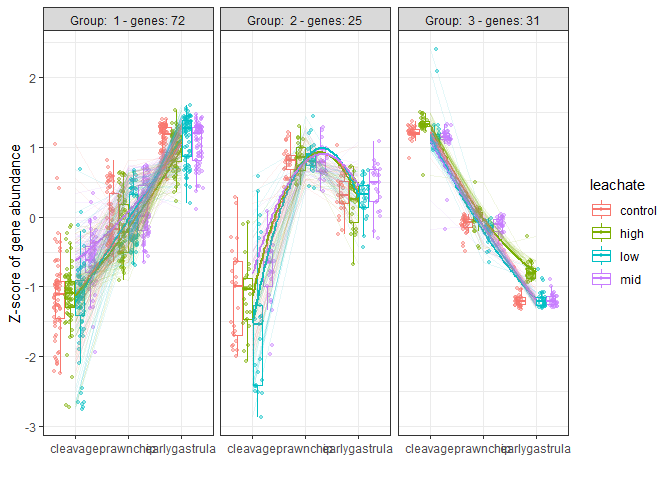
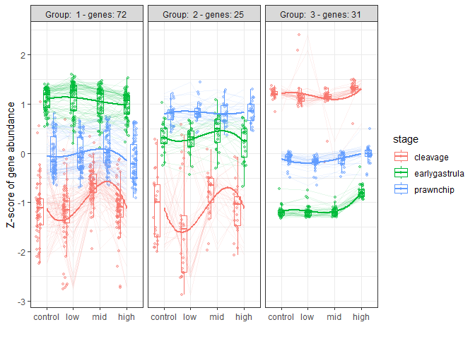
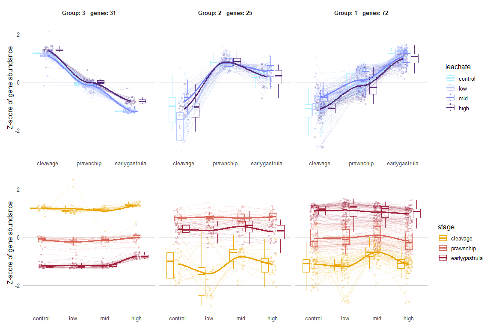
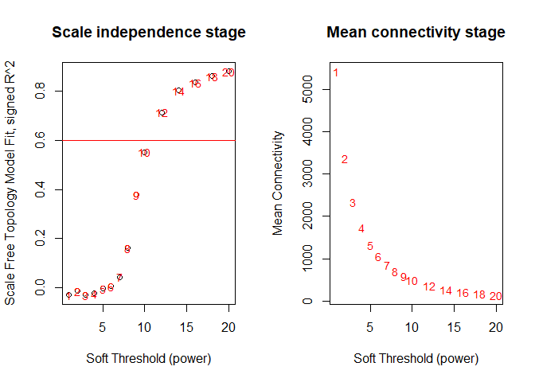
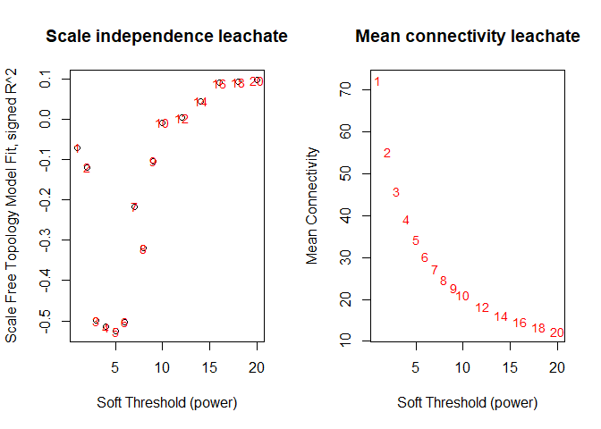
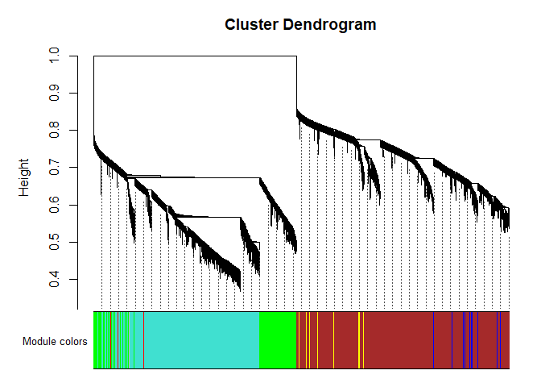
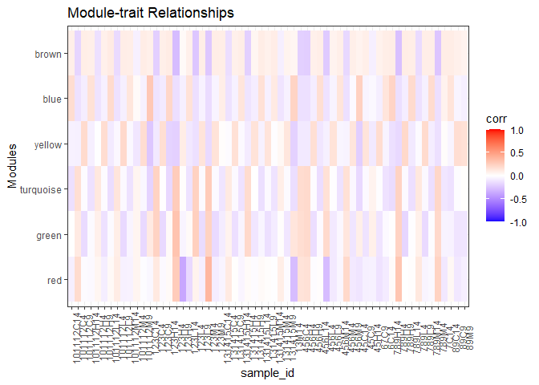
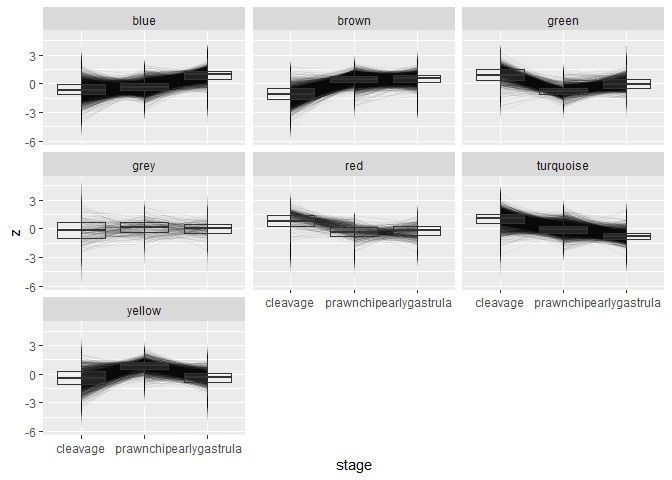
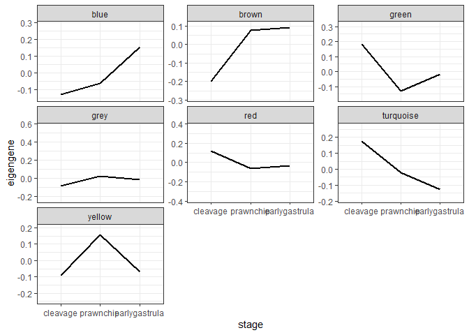

# Group DEGs by Expression Pattern
Sarah Tanja
2026-01-05

- [<span class="toc-section-number">1</span> Load
  Libraries](#load-libraries)
- [<span class="toc-section-number">2</span> Inputs](#inputs)
- [<span class="toc-section-number">3</span> DEGreport
  Clustering](#degreport-clustering)
  - [<span class="toc-section-number">3.1</span> Leachate
    DEGs](#leachate-degs)
    - [<span class="toc-section-number">3.1.1</span> Save leachate DEG
      clusters](#save-leachate-deg-clusters)
    - [<span class="toc-section-number">3.1.2</span> Extract z
      scores](#extract-z-scores)
    - [<span class="toc-section-number">3.1.3</span> Plot leachate DEG
      clusters](#plot-leachate-deg-clusters)
  - [<span class="toc-section-number">3.2</span> Stage DEGs
    clustering](#stage-degs-clustering)
- [<span class="toc-section-number">4</span> WGCNA](#wgcna)
  - [<span class="toc-section-number">4.1</span> Pick soft
    threshhold](#pick-soft-threshhold)
  - [<span class="toc-section-number">4.3</span> Create the network
    using
    `blockwiseModules`](#create-the-network-using-blockwisemodules)
    - [<span class="toc-section-number">4.3.1</span>
      `minModuleSize`](#minmodulesize)
    - [<span class="toc-section-number">4.3.2</span>
      `deepSplit`](#deepsplit)
    - [<span class="toc-section-number">4.3.3</span>
      `mergeCutHeight`](#mergecutheight)
  - [<span class="toc-section-number">4.4</span> Relate module (color
    cluster) assignments to treatment
    groups](#relate-module-color-cluster-assignments-to-treatment-groups)
  - [<span class="toc-section-number">4.5</span> Model
    Eigengenes](#model-eigengenes)
  - [<span class="toc-section-number">4.6</span> Examine Expression
    Profiles](#examine-expression-profiles)
    - [<span class="toc-section-number">4.6.1</span> Pick peaks & dips
      via Model Eigengene](#pick-peaks--dips-via-model-eigengene)
  - [<span class="toc-section-number">4.7</span> Extract &
    save](#extract--save)
    - [<span class="toc-section-number">4.7.1</span> Leachate clusters
      from degReport](#leachate-clusters-from-degreport)
    - [<span class="toc-section-number">4.7.2</span> Stage modules from
      WGCNA](#stage-modules-from-wgcna)
- [<span class="toc-section-number">5</span> Summary & Next
  Steps](#summary--next-steps)

# Load Libraries

``` r
library(tidyverse)
library(DEGreport)
library(patchwork)
```

Install WGCNA & package dependencies

> [!NOTE]
>
> If you have not installed WGCNA before, you may need to install some
> dependencies first. Uncomment and run the code chunk below to install
> them, and then install WGCNA.

``` r
#install.packages(c("fields", "dynamicTreeCut", "qvalue", "flashClust", "Hmisc") )
#BiocManager::install("impute", ask = FALSE, update = FALSE)
#install.packages("WGCNA")
```

``` r
library(WGCNA)
enableWGCNAThreads(nThreads = 8)
```

    Allowing parallel execution with up to 8 working processes.

# Inputs

``` r
output_path <- "../../output/06_deg/cluster/"
metadata_path <- "../../metadata/metadata_or.csv"
```

``` r
# Load metadata (outlier samples removed, 61 samples remain)
metadata_or <- read_csv(metadata_path)

# set factors
metadata_or <- metadata_or %>% 
  mutate(
    collection_date = as.Date(collection_date, format = "%d-%b-%Y"),
    stage    = factor(stage,    levels = c("cleavage", "prawnchip", "earlygastrula")),
    leachate = factor(leachate, levels = c("control", "low", "mid", "high")),
    spawn_night = factor(spawn_night, levels  = c("July_6th", "July_7th", "July_8th"))
    )

# View metadata structure
str(metadata_or)
```

    tibble [61 × 9] (S3: tbl_df/tbl/data.frame)
     $ sample_id      : chr [1:61] "101112C14" "101112C4" "101112C9" "101112H14" ...
     $ collection_date: Date[1:61], format: "2024-07-08" "2024-07-08" ...
     $ parents        : num [1:61] 101112 101112 101112 101112 101112 ...
     $ group          : chr [1:61] "C14" "C4" "C9" "H14" ...
     $ hpf            : num [1:61] 14 4 9 14 4 9 14 4 9 14 ...
     $ stage          : Factor w/ 3 levels "cleavage","prawnchip",..: 3 1 2 3 1 2 3 1 2 3 ...
     $ leachate       : Factor w/ 4 levels "control","low",..: 1 1 1 4 4 4 2 2 2 3 ...
     $ leachate_mgL   : num [1:61] 0 0 0 1 1 1 0.01 0.01 0.01 0.1 ...
     $ spawn_night    : Factor w/ 3 levels "July_6th","July_7th",..: 3 3 3 3 3 3 3 3 3 3 ...

``` r
# Load VST normalized gene count matrices for leachate and stage DEGs
vst_mat_130_df <- read_csv("../../output/06_deg/spawnnight/vst_mat_130_df.csv")
vst_mat_stage_df <- read_csv("../../output/06_deg/spawnnight/vst_mat_stage_df.csv")
```

# DEGreport Clustering

Detect Patterns of Expression see Roberts Lab Issue
[\#1916](https://github.com/RobertsLab/resources/issues/1916)

Perform clustering. You’ll need:

- a metadata matrix with sample_id as rows

``` r
meta_mat <- metadata_or %>%
  column_to_rownames(var = "sample_id")

head(meta_mat)
```

              collection_date parents group hpf         stage leachate leachate_mgL
    101112C14      2024-07-08  101112   C14  14 earlygastrula  control            0
    101112C4       2024-07-08  101112    C4   4      cleavage  control            0
    101112C9       2024-07-08  101112    C9   9     prawnchip  control            0
    101112H14      2024-07-08  101112   H14  14 earlygastrula     high            1
    101112H4       2024-07-08  101112    H4   4      cleavage     high            1
    101112H9       2024-07-08  101112    H9   9     prawnchip     high            1
              spawn_night
    101112C14    July_8th
    101112C4     July_8th
    101112C9     July_8th
    101112H14    July_8th
    101112H4     July_8th
    101112H9     July_8th

- a gene count matrix that has been variance stabilized and filtered to
  your significant genes of interest with genes in rows and sample ID in
  columns

``` r
vst_mat_130 <- vst_mat_130_df %>%
  column_to_rownames(var = "gene_id") %>%
  as.matrix()
dim(vst_mat_130)
```

    [1] 130  61

``` r
vst_mat_130[1:6,1:6]
```

                                               101112C14 101112C4 101112C9
    Montipora_capitata_HIv3___TS.g28558.t3a     9.372147 8.840657 9.285092
    Montipora_capitata_HIv3___TS.g9507.t1       7.238926 6.451824 7.263696
    Montipora_capitata_HIv3___TS.g9699.t2       8.223187 6.743106 6.686902
    Montipora_capitata_HIv3___RNAseq.g40764.t1  8.257760 7.033599 6.625200
    Montipora_capitata_HIv3___TS.g48661.t1      7.881448 6.371478 8.249059
    Montipora_capitata_HIv3___TS.g45793.t1b     7.563914 7.599192 7.905338
                                               101112H14 101112H4 101112H9
    Montipora_capitata_HIv3___TS.g28558.t3a     9.543859 8.982906 9.237886
    Montipora_capitata_HIv3___TS.g9507.t1       6.852210 7.273093 7.430226
    Montipora_capitata_HIv3___TS.g9699.t2       8.109286 6.966543 6.843566
    Montipora_capitata_HIv3___RNAseq.g40764.t1  8.569245 6.495544 6.667523
    Montipora_capitata_HIv3___TS.g48661.t1      7.913970 7.118086 8.194370
    Montipora_capitata_HIv3___TS.g45793.t1b     7.287801 6.911107 7.870739

``` r
vst_mat_stage <- vst_mat_stage_df %>%
  column_to_rownames(var = "gene_id") %>%
  as.matrix()
dim(vst_mat_stage)
```

    [1] 10793    61

``` r
vst_mat_stage[1:6,1:6]
```

                                               101112C14  101112C4  101112C9
    Montipora_capitata_HIv3___RNAseq.g4581.t1   7.594797  9.759822  8.479357
    Montipora_capitata_HIv3___RNAseq.g4583.t1  10.456419 10.669007 10.411524
    Montipora_capitata_HIv3___RNAseq.g4584.t1  10.806204  9.742696  9.163124
    Montipora_capitata_HIv3___RNAseq.g4585.t1   8.718631  6.624745  7.575180
    Montipora_capitata_HIv3___RNAseq.g4589.t1   7.810013  7.246678  8.355120
    Montipora_capitata_HIv3___RNAseq.g4591.t1b 11.584167  7.380851  8.669597
                                               101112H14  101112H4  101112H9
    Montipora_capitata_HIv3___RNAseq.g4581.t1   7.814438  8.563593  8.334495
    Montipora_capitata_HIv3___RNAseq.g4583.t1  10.501690 10.975711 10.558306
    Montipora_capitata_HIv3___RNAseq.g4584.t1  10.552161  9.296774  8.998308
    Montipora_capitata_HIv3___RNAseq.g4585.t1   8.266095  7.164475  7.950995
    Montipora_capitata_HIv3___RNAseq.g4589.t1   8.002365  7.333873  8.447536
    Montipora_capitata_HIv3___RNAseq.g4591.t1b 11.031153  7.534321  9.053283

## Leachate DEGs

Run with minimum 10 genes per cluster to detect because we have few
DEGs.

- DEGreport vignette,
  [degPatterns](https://www.bioconductor.org/packages/release/bioc/vignettes/DEGreport/inst/doc/DEGreport.html#:~:text=%22expression%22)

``` r
# Use the `degPatterns` function from the 'DEGreport' package to show gene clusters across developmental stage
leachate130_GEPs <- degPatterns(vst_mat_130, metadata = meta_mat, time = "stage", col= "leachate", plot=TRUE, minc = 10)
```



``` r
ggsave(filename="../../output/06_deg/cluster/DEG_LeachateClusterPatterns_bystage_plot.png", width=12, height=10)
```

``` r
# Use the `degPatterns` function from the 'DEGreport' package to show gene clusters across leachate dose
degPatterns(vst_mat_130, metadata = meta_mat, time = "leachate", col="stage", plot=TRUE, minc = 10)
```



``` r
ggsave(filename="../../output/06_deg/cluster/DEG_LeachateClusterPatterns_bydose_plot.png", width=12, height=10)
```

### Save leachate DEG clusters

``` r
# Rename and extract information 
leachate130_GEP_df <- leachate130_GEPs$df %>%
          rename(gene_id=genes)
```

``` r
write_csv(leachate130_GEP_df, file.path("../../output/06_deg/cluster/leachate_DEG_GEP.csv"))
```

\*GEP: gene expression pattern

### Extract z scores

Dataframe values are Z score of VST normalized gene counts

``` r
leachate_cluster_z <- leachate130_GEPs[["normalized"]]
leachate_cluster_z <- as.data.frame(leachate_cluster_z) %>% 
  select(1:12) %>% 
  rename(zscore = value)
```

Save dataframe of zscores and cluster for each DEG across each
stageXdose

``` r
write_csv(leachate_cluster_z, "../../output/06_deg/cluster/leachate_cluster_zscores.csv")
```

Extract the list of genes in each cluster.

The genes that have high relative transcript abundance in the
earlygastrula stage group in group 1, high relative transcript abundance
in prawnchip are group 2, and high relative abundance in cleavage are
group 3. There is a general trend of more transcripts present as
development progresses… which makes sense because the embryo as it grows
is doing more. The subtle leachate effects we do see (non monotonic
patterns in cleavage in group 1 and 2, slight increase under high pvc
leachate exposure in early gastrula in group 3) appear to impact the
transcript abundances of the stage with the lowest abundances of those
genes… so the lower the gene abundance the more effect leachate has on
those genes? Is that just an artifact of increased variability at lower
transcript abundance?

### Plot leachate DEG clusters

Set color scheme

``` r
leachate.colors <- c(control = "#AEF1FF", 
                low = "#BBC7FF",
                mid = "#7D8BFF", 
                high = "#592F7D")

stage.colors <- c(cleavage = "#EBA600", 
                  prawnchip = "#D9685B", 
                  earlygastrula = "#A2223C")
```

Wrangle and label

``` r
# reverse gene cluster order to plot from cleavage to eg
leachate_cluster_zordered <- leachate_cluster_z %>%
  mutate(cluster = factor(cluster, levels = rev(sort(unique(cluster)))))

facet_labs <- leachate_cluster_zordered %>%
  summarise(n_genes = n_distinct(genes), .by = cluster) %>%        # counts unique genes per cluster
  mutate(lab = sprintf("Group: %s - genes: %d", cluster, n_genes)) %>%
  dplyr::select(cluster, lab) %>%
  deframe()                                                        # named vector: names = cluster, values = lab
```

Plot and patch

``` r
# leachate as x plot
pl <- ggplot(leachate_cluster_zordered %>%
         mutate(leachate = factor(leachate, levels = c("control","low","mid","high"))),
       aes(x = leachate, y = zscore, color = stage)) +
  geom_line(aes(group = interaction(genes, stage)), alpha = 0.1, linewidth = 0.4) + # per-gene(thin & transparent)
  geom_point(position = position_jitter(width = 0.12, height = 0), alpha = 0.2, size = 1.2) +
  geom_boxplot(alpha = 0.10, outlier.shape = NA) +
  geom_smooth(aes(group = stage), se = FALSE) + # trend
  facet_wrap(~ cluster, nrow = 1) +
  labs(x = NULL, y = "Z-score of gene abundance", color = "stage") +
  theme_minimal(base_size = 12) +
  scale_color_manual(values = stage.colors)+
  scale_y_continuous(breaks = function(x) pretty(x, n = 3)) +
  theme(panel.grid = element_blank(),
  panel.grid.major.y = element_line(color = "grey80", linewidth = 0.3),   # keep major horizontal
  panel.grid.minor.y = element_blank(),  # drop minor horizontal
  panel.grid.major.x = element_blank(),  # drop vertical
  panel.grid.minor.x = element_blank(),
  strip.text = element_blank(),
  strip.background = element_blank())

# stage as x plot
ps <- ggplot(leachate_cluster_zordered %>%
         mutate(leachate = factor(leachate, levels = c("control","low","mid","high")),
                stage = factor(stage, levels = c("cleavage", "prawnchip", "earlygastrula"))),
       aes(x = stage, y = zscore, color = leachate)) +
  geom_line(aes(group = interaction(genes, leachate)), alpha = 0.1, linewidth = 0.4) + # per-gene(thin & transparent)
  geom_point(position = position_jitter(width = 0.12, height = 0), alpha = 0.2, size = 1.2) +
  geom_boxplot(alpha = 0.10, outlier.shape = NA) +
  geom_smooth(aes(group = leachate), se = FALSE) + #trend pattern 
  facet_wrap(~ cluster, nrow = 1, labeller = labeller(cluster = facet_labs)) +
  labs(x = NULL, y = "Z-score of gene abundance", color = "leachate") +
  theme_minimal(base_size = 12) +
  scale_color_manual(values = leachate.colors)+
  scale_y_continuous(breaks = function(x) pretty(x, n = 3)) +
  theme(panel.grid = element_blank(),
  panel.grid.major.y = element_line(color = "grey80", linewidth = 0.3),   # keep major horizontal
  panel.grid.minor.y = element_blank(),  # drop minor horizontal
  panel.grid.major.x = element_blank(),  # drop vertical
  panel.grid.minor.x = element_blank(),
  strip.text = element_text(face = "bold"))


# combine with patchwork
pc <- ps / pl

pc
```



Save plots as pngs

``` r
ggsave("../../output/06_deg/cluster/leachate_bystage_clusters.png", plot = pl, width=18, height=6 , dpi=600)
ggsave("../../output/06_deg/cluster/leachate_bydose_clusters.png", plot = ps, width=18, height=6 , dpi=600)
ggsave("../../output/06_deg/cluster/leachate_combo_clusters.png", plot = pc, width=18, height=12 , dpi=600)
```

## Stage DEGs clustering

``` r
# Use the `degPatterns` function from the 'DEGreport' package
#stage_GEPbystage <- degPatterns(
#  vst_mat_stage, 
#  metadata = meta_mat, 
#  time = "stage", 
#  plot = FALSE, 
#  minc = 10)
```

> [!NOTE]
>
> STUCK! WGCNA blockwiseModules (network clustering, handles 10k+ well)
>
> If you want modules that behave like coexpression “communities” (often
> great for GO enrichment), WGCNA’s blockwise workflow is designed to
> scale and can use multiple threads.

# WGCNA

- [tutorial by Jennifer
  Chang](https://bioinformaticsworkbook.org/tutorials/wgcna.html#gsc.tab=0)

> [!NOTE]
>
> Note that here we are starting with a subset of genes that have
> already been normalized using a variance stabilizing transformation
> and are differentially expressed.

Transpose VST count matrix such that rows are samples and columns are
genes

``` r
vst_t_stage <- t(vst_mat_stage)  # WGCNA expects samples x genes

vst_t_leachate <- t(vst_mat_130)
```

Examine the dataframe structure to confirm that rows are samples and
columns are genes and values are VST normalized counts

``` r
vst_t_stage %>%
  as.data.frame() %>%
  dplyr::select(1:3) %>%
  head() %>%
  knitr::kable()
```

|  | Montipora_capitata_HIv3\_\_\_RNAseq.g4581.t1 | Montipora_capitata_HIv3\_\_\_RNAseq.g4583.t1 | Montipora_capitata_HIv3\_\_\_RNAseq.g4584.t1 |
|:---|---:|---:|---:|
| 101112C14 | 7.594797 | 10.45642 | 10.806204 |
| 101112C4 | 9.759822 | 10.66901 | 9.742696 |
| 101112C9 | 8.479357 | 10.41152 | 9.163124 |
| 101112H14 | 7.814438 | 10.50169 | 10.552161 |
| 101112H4 | 8.563593 | 10.97571 | 9.296774 |
| 101112H9 | 8.334495 | 10.55831 | 8.998308 |

``` r
vst_t_leachate %>% 
  as.data.frame() %>% 
  dplyr::select(1:3) %>% 
  head() %>% 
  knitr::kable()
```

|  | Montipora_capitata_HIv3\_\_\_TS.g28558.t3a | Montipora_capitata_HIv3\_\_\_TS.g9507.t1 | Montipora_capitata_HIv3\_\_\_TS.g9699.t2 |
|:---|---:|---:|---:|
| 101112C14 | 9.372147 | 7.238926 | 8.223187 |
| 101112C4 | 8.840657 | 6.451824 | 6.743106 |
| 101112C9 | 9.285092 | 7.263697 | 6.686902 |
| 101112H14 | 9.543859 | 6.852210 | 8.109286 |
| 101112H4 | 8.982906 | 7.273093 | 6.966543 |
| 101112H9 | 9.237886 | 7.430225 | 6.843566 |

## Pick soft threshhold

> We can see now that the rows = treatments and columns = gene probes.
> We’re ready to start WGCNA. A correlation network will be a complete
> network (all genes are connected to all other genes). Ergo we will
> need to pick a threshhold value (if correlation is below threshold,
> remove the edge). We assume the true biological network follows a
> scale-free structure (see papers by Albert Barabasi). To do that,
> WGCNA will try a range of soft thresholds and create a diagnostic
> plot. - [Jennifer
> Chang](https://bioinformaticsworkbook.org/tutorials/wgcna.html#gsc.tab=0:~:text=We%20can%20see,a%20diagnostic%20plot.)

> [!NOTE]
>
> This step will take several minutes to run

``` r
# Choose a set of soft-thresholding powers
powers = c(c(1:10), seq(from = 12, to = 20, by = 2))

# Call the network topology analysis function
sft_stage = pickSoftThreshold(
  vst_t_stage,             # <= Input data
  powerVector = powers,
  networkType = "signed",
  #corFnc = cor,
  verbose = 5)
```

    pickSoftThreshold: will use block size 4145.
     pickSoftThreshold: calculating connectivity for given powers...
       ..working on genes 1 through 4145 of 10793
       ..working on genes 4146 through 8290 of 10793
       ..working on genes 8291 through 10793 of 10793
       Power SFT.R.sq  slope truncated.R.sq mean.k. median.k. max.k.
    1      1  0.02970  1.980          0.430    5420    5480.0   5740
    2      2  0.01370  0.809          0.773    3370    3340.0   4150
    3      3  0.02970  0.589          0.878    2340    2340.0   3310
    4      4  0.02250  0.339          0.804    1730    1720.0   2740
    5      5  0.00407  0.107          0.698    1330    1310.0   2330
    6      6  0.00674 -0.108          0.600    1050    1020.0   2010
    7      7  0.04270 -0.192          0.635     853     809.0   1750
    8      8  0.16200 -0.273          0.770     702     649.0   1540
    9      9  0.37900 -0.417          0.825     587     525.0   1380
    10    10  0.55200 -0.568          0.872     496     429.0   1270
    11    12  0.71300 -0.777          0.915     365     295.0   1090
    12    14  0.80200 -0.915          0.950     277     208.0    948
    13    16  0.83500 -1.010          0.958     216     149.0    836
    14    18  0.86000 -1.090          0.965     172     109.0    746
    15    20  0.88000 -1.150          0.970     140      81.1    671

``` r
# Call the network topology analysis function
sft_leachate = pickSoftThreshold(
  vst_t_leachate,             # <= Input data
  powerVector = powers,
  networkType = "signed",
  #corFnc = cor,
  verbose = 5)
```

    pickSoftThreshold: will use block size 130.
     pickSoftThreshold: calculating connectivity for given powers...
       ..working on genes 1 through 130 of 130
       Power SFT.R.sq   slope truncated.R.sq mean.k. median.k. max.k.
    1      1  0.07010  9.1500        0.24700    72.2      81.2   85.8
    2      2  0.12000  1.2600        0.47900    55.2      60.7   73.7
    3      3  0.50000  1.6200        0.36100    45.7      48.0   65.4
    4      4  0.51500  1.2400        0.38600    39.1      38.7   58.7
    5      5  0.52600  0.9170        0.41300    34.2      31.2   53.4
    6      6  0.50300  0.7200        0.41200    30.3      27.1   49.2
    7      7  0.21600  0.3910       -0.00661    27.3      26.2   45.7
    8      8  0.31900  0.3500        0.12800    24.8      25.5   42.8
    9      9  0.10300  0.1920       -0.08940    22.7      25.0   40.3
    10    10  0.00831  0.0531       -0.09870    21.0      24.1   38.1
    11    12  0.00383 -0.0429        0.20000    18.3      22.5   34.7
    12    14  0.04490 -0.1390        0.34100    16.3      19.9   32.2
    13    16  0.09070 -0.2180        0.42500    14.7      18.2   30.1
    14    18  0.09320 -0.2090        0.62900    13.4      16.5   28.3
    15    20  0.09660 -0.2420        0.58100    12.4      14.5   26.7

``` r
par(mfrow = c(1,2));
cex1 = 0.9;

plot(sft_stage$fitIndices[, 1],
     -sign(sft_stage$fitIndices[, 3]) * sft_stage$fitIndices[, 2],
     xlab = "Soft Threshold (power)",
     ylab = "Scale Free Topology Model Fit, signed R^2",
     main = paste("Scale independence stage")
)
text(sft_stage$fitIndices[, 1],
     -sign(sft_stage$fitIndices[, 3]) * sft_stage$fitIndices[, 2],
     labels = powers, cex = cex1, col = "red"
)
abline(h = 0.6, col = "red")
plot(sft_stage$fitIndices[, 1],
     sft_stage$fitIndices[, 5],
     xlab = "Soft Threshold (power)",
     ylab = "Mean Connectivity",
     type = "n",
     main = paste("Mean connectivity stage")
)
text(sft_stage$fitIndices[, 1],
     sft_stage$fitIndices[, 5],
     labels = powers,
     cex = cex1, col = "red")
```



``` r
par(mfrow = c(1,2));
cex1 = 0.9;

plot(sft_leachate$fitIndices[, 1],
     -sign(sft_leachate$fitIndices[, 3]) * sft_leachate$fitIndices[, 2],
     xlab = "Soft Threshold (power)",
     ylab = "Scale Free Topology Model Fit, signed R^2",
     main = paste("Scale independence leachate")
)
text(sft_leachate$fitIndices[, 1],
     -sign(sft_leachate$fitIndices[, 3]) * sft_leachate$fitIndices[, 2],
     labels = powers, cex = cex1, col = "red"
)
abline(h = 0.6, col = "red")
plot(sft_leachate$fitIndices[, 1],
     sft_leachate$fitIndices[, 5],
     xlab = "Soft Threshold (power)",
     ylab = "Mean Connectivity",
     type = "n",
     main = paste("Mean connectivity leachate")
)
text(sft_leachate$fitIndices[, 1],
     sft_leachate$fitIndices[, 5],
     labels = powers,
     cex = cex1, col = "red")
```



> [!NOTE]
>
> For stage DEGs (~10k genes)
>
> WGCNA is appropriate
>
> You should run enrichment on those modules
>
> You should treat those as “real” developmental programs
>
> ✅ For leachate DEGs (~130 genes)
>
> degPatterns() / clustering on expression profiles is the right tool
>
> These clusters are pattern-based, not network-based
>
> You should not claim scale-free structure or co-expression modules
>
> Your instinct to keep these conceptually separate was correct.
>
> How I would describe this in methods (important)
>
> You don’t need to show this plot in the paper, but if asked:
>
> “Because the leachate-responsive gene set was small and pre-filtered
> for differential expression, scale-free topology criteria were not met
> across soft-threshold powers. Therefore, leachate-associated
> expression patterns were summarized using trajectory-based clustering
> (degReport) rather than co-expression network inference.”

For **signed networks**, the authors explicitly recommend:

- Accepting **lower** R^2 (often 0.6–0.7)

- Prioritizing **reasonable connectivity**

- Choosing a power near the **knee**, not the ceiling

<!-- -->

- Each red number is a candidate power (1–20)
- The red horizontal line is the cut-off of 0.6 for the scale-free
  topology fit index
- As power increases, the network becomes more scale-free[^1]
- We want to find the lowest power where the curve crosses the red line
  or plateaus near it

> [!NOTE]
>
> “A soft-thresholding power of 8 was selected, as it was the lowest
> value achieving a high scale-free topology fit (R2≈0.9) while
> maintaining sufficient mean connectivity.”

## Create the network using `blockwiseModules`

Network type + TOM type (most important conceptual choice)

**`signed`**`network & corType`

Signed networks are recommended for gene expression because they
preserve direction: positively co-expressed genes cluster together;
negative correlations don’t create “same module” structure. If you care
about “genes moving together” (typical): **signed.** If you want modules
that allow anti-correlated genes together: **unsigned**

Use:

- `networkType = "signed"`

- `TOMType = "signed"`

Correlation choice for VST

For VST expression, the standard is:

- `corType = "pearson"` **if you trust the data are clean**

### `minModuleSize`

Because you’re using **DEGs only**, you often have fewer genes and
stronger signal. Common choices:

- 20–30 for DEG lists (~100–3000 genes)

- 50 if you want only big, robust modules

### `deepSplit`

Controls how aggressively the dendrogram is cut:

- 1 = conservative (fewer, larger modules)

- 2 = default sweet spot

- 3–4 = more modules (often too fragmented for DEG-only sets)

- **Start with 2.** If you get one giant module, go to 3. If you get
  tons of tiny modules, go to 1.

### `mergeCutHeight`

- Controls module merging by eigengene similarity. Smaller = stricter
  (less merging).

- 0.25 = common default (more merging)

- **0.15** = stricter (keeps modules separate)

- 0.10 = very strict

- For DEG-only, **0.15** is often good (keeps distinct patterns).

``` r
net <- blockwiseModules(
  vst_t_stage,
  power = 10, # choose via pickSoftThreshold
  networkType = "signed", # cluster positively co-expressed genes together
  TOMType = "signed",
  corType = "pearson",
  deepSplit = 1,
  minModuleSize = 50,
  mergeCutHeight = 0.3,
  numericLabels = TRUE,
  saveTOMs = FALSE,
  verbose = 3
)
```

     Calculating module eigengenes block-wise from all genes
       Flagging genes and samples with too many missing values...
        ..step 1
     ....pre-clustering genes to determine blocks..
       Projective K-means:
       ..k-means clustering..
       ..merging smaller clusters...
    Block sizes:
    gBlocks
       1    2    3 
    5000 4255 1538 
     ..Working on block 1 .
        TOM calculation: adjacency..
        ..will not use multithreading.
         Fraction of slow calculations: 0.000000
        ..connectivity..
        ..matrix multiplication (system BLAS)..
        ..normalization..
        ..done.
     ....clustering..
     ....detecting modules..
     ....calculating module eigengenes..
     ....checking kME in modules..
         ..removing 5 genes from module 1 because their KME is too low.
         ..removing 1 genes from module 2 because their KME is too low.
     ..Working on block 2 .
        TOM calculation: adjacency..
        ..will not use multithreading.
         Fraction of slow calculations: 0.000000
        ..connectivity..
        ..matrix multiplication (system BLAS)..
        ..normalization..
        ..done.
     ....clustering..
     ....detecting modules..
     ....calculating module eigengenes..
     ....checking kME in modules..
         ..removing 48 genes from module 1 because their KME is too low.
         ..removing 35 genes from module 2 because their KME is too low.
         ..removing 8 genes from module 3 because their KME is too low.
         ..removing 1 genes from module 4 because their KME is too low.
     ..Working on block 3 .
        TOM calculation: adjacency..
        ..will not use multithreading.
         Fraction of slow calculations: 0.000000
        ..connectivity..
        ..matrix multiplication (system BLAS)..
        ..normalization..
        ..done.
     ....clustering..
     ....detecting modules..
     ....calculating module eigengenes..
     ....checking kME in modules..
         ..removing 40 genes from module 1 because their KME is too low.
         ..removing 10 genes from module 2 because their KME is too low.
         ..removing 1 genes from module 3 because their KME is too low.
      ..reassigning 164 genes from module 1 to modules with higher KME.
      ..reassigning 141 genes from module 2 to modules with higher KME.
      ..reassigning 19 genes from module 3 to modules with higher KME.
      ..reassigning 31 genes from module 4 to modules with higher KME.
      ..reassigning 20 genes from module 5 to modules with higher KME.
      ..reassigning 13 genes from module 6 to modules with higher KME.
      ..reassigning 4 genes from module 7 to modules with higher KME.
      ..reassigning 2 genes from module 8 to modules with higher KME.
      ..reassigning 25 genes from module 9 to modules with higher KME.
      ..reassigning 13 genes from module 10 to modules with higher KME.
     ..merging modules that are too close..
         mergeCloseModules: Merging modules whose distance is less than 0.3
           Calculating new MEs...

``` r
stage_deg_modules <- data.frame(
  gene_id = colnames(vst_t_stage),            # your DEG gene IDs
  WGCNAmodule  = labels2colors(net$colors)     # convert numeric → color
) %>%
  mutate(
    WGCNAmodule = factor(WGCNAmodule)
  )
```

``` r
# Convert labels to colors for plotting
mergedColors = labels2colors(net$colors)

# Plot the dendrogram and the module colors underneath
plotDendroAndColors(
  net$dendrograms[[1]],
  mergedColors[net$blockGenes[[1]]],
  "Module colors",
  dendroLabels = FALSE,
  hang = 0.03,
  addGuide = TRUE,
  guideHang = 0.05 )
```



## Relate module (color cluster) assignments to treatment groups

``` r
stage_deg_modules %>%
  dplyr::group_by(WGCNAmodule) %>% 
  dplyr::summarise(n_genes = dplyr::n(), .groups = "drop") %>% 
  arrange(desc(n_genes)) %>% 
  knitr::kable()
```

| WGCNAmodule | n_genes |
|:------------|--------:|
| turquoise   |    2805 |
| blue        |    2588 |
| brown       |    2436 |
| yellow      |    1381 |
| green       |    1108 |
| red         |     326 |
| grey        |     149 |

## Model Eigengenes

> WGCNA will calculate an Eigengene (hypothetical central gene) for each
> module

``` r
# Get Module Eigengenes per cluster
eig <- moduleEigengenes(vst_t_stage, mergedColors)$eigengenes
```

``` r
# Reorder modules so similar modules are next to each other
eig <- orderMEs(eig)
module_order = names(eig) %>% gsub("ME","", .)

# Add treatment annotations
metaeig <- cbind(eig, meta_mat[rownames(eig), , drop = FALSE]) # reorders meta_mat rownames to match eig rownames

# make dataframe
ME_df <- metaeig %>% 
  rownames_to_column(var = "sample_id")
```

``` r
# tidy & plot data
ME_df_long <-  ME_df %>%
  pivot_longer(c(2:7)) %>% 
  mutate(
    name = gsub("ME", "", name),
    name = factor(name, levels = module_order)
  )

ME_df_long %>% ggplot(., aes(x=sample_id, y=name, fill=value)) +
  geom_tile() +
  theme_bw() +
  scale_fill_gradient2(
    low = "blue",
    high = "red",
    mid = "white",
    midpoint = 0,
    limit = c(-1,1)) +
  theme(axis.text.x = element_text(angle=90)) +
  labs(title = "Module-trait Relationships", y = "Modules", fill="corr")
```



## Examine Expression Profiles

``` r
expr_pat <- stage_deg_modules %>% 
left_join(vst_mat_stage_df)

expr_pat_long <- expr_pat %>% 
  pivot_longer(
    cols = -c(gene_id, WGCNAmodule),
    names_to = "sample_id",
    values_to = "vst"
  ) %>% 
  left_join(metadata_or, by = "sample_id") %>% 
  group_by(gene_id) %>% 
  mutate(
    z = as.numeric(scale(vst))
  ) %>% 
  ungroup()
```

``` r
ggplot(expr_pat_long, aes(x=stage, y=z))+
  geom_line(aes(group = gene_id), alpha = 0.05, linewidth = 0.01)+
  geom_boxplot(alpha = 0.10, outlier.shape = NA) +
  facet_wrap(~WGCNAmodule)
```



Cleavage-high → decreases over time

turquoise: strongest “cleavage program” (high at cleavage, steadily
down)

Prawnchip-peak (hump-shaped)

yellow: classic “mid-stage / prawnchip program” (up at prawnchip, down
again by early gastrula)

Prawnchip-dip (valley-shaped) green and red: cleavage-high → dip at
prawnchip → rebound a bit at early gastrula These often represent
“processes suppressed mid-stage then reactivated” or a mixed module that
could merge/split depending on parameters.

Early gastrula-high (increasing)

blue and brown: “late program” (low at cleavage, increasing toward early
gastrula) grey

grey is the WGCNA “unassigned” bucket (genes that didn’t fit cleanly).
Don’t enrich/interpret grey as a biological module.

So: you do have the four big biological programs you expected (early /
mid / late), but WGCNA is splitting them into submodules (early =
turquoise; mid = yellow/green+red; late = blue+brown)… with mid stage

keep modules but label them as belonging to one of 4 programs

Assign each module a “stage label” based on where its ME peaks (cleavage
/ prawn peak / prawn dip / early gastrula)

Then do enrichment by the grouped “meta-programs”

### Pick peaks & dips via Model Eigengene

Summarize ME by stage and assign objective module labels - Compute stage
means for each ME

``` r
ME_stage_means <- ME_df %>%
  pivot_longer(cols = starts_with("ME"),
               names_to = "ME",
               values_to = "eigengene") %>%
  group_by(ME, stage) %>%
  summarize(mean_ME = mean(eigengene, na.rm = TRUE), .groups = "drop") %>%
  tidyr::pivot_wider(names_from = stage, values_from = mean_ME)

ME_stage_means %>% knitr::kable()
```

| ME          |   cleavage |  prawnchip | earlygastrula |
|:------------|-----------:|-----------:|--------------:|
| MEblue      | -0.1195954 | -0.0622404 |     0.1572620 |
| MEbrown     | -0.1877733 |  0.0768243 |     0.0803004 |
| MEgreen     |  0.1560965 | -0.1300022 |    -0.0036223 |
| MEgrey      | -0.0420443 |  0.0273570 |     0.0082864 |
| MEred       |  0.1277290 | -0.0629109 |    -0.0444542 |
| MEturquoise |  0.1728368 | -0.0165460 |    -0.1256180 |
| MEyellow    | -0.0820645 |  0.1598676 |    -0.0854572 |

Convert ME name → module_color and classify pattern

This uses a simple, transparent rule set:

peak stage = stage with highest mean ME

also classify shape: monotonic up/down vs mid peak vs mid dip

``` r
stage_levels <- c("cleavage", "prawnchip", "earlygastrula")  # adjust to your exact names

ME_classified <- ME_stage_means %>%
  mutate(
    module_color = sub("^ME", "", ME),

    # pull into numeric vectors for easy comparisons
    cleav = .data[[stage_levels[1]]],
    prawn = .data[[stage_levels[2]]],
    gastr = .data[[stage_levels[3]]],

    peak_stage = stage_levels[max.col(cbind(cleav, prawn, gastr), ties.method = "first")],

    pattern_type = case_when(
      cleav > prawn & prawn > gastr ~ "monotonic_down",
      cleav < prawn & prawn < gastr ~ "monotonic_up",
      prawn > cleav & prawn > gastr ~ "hump",
      prawn < cleav & prawn < gastr ~ "valley",
      TRUE                          ~ "other"
    ),

    # This is your final grouping variable (edit labels as you like)
    module_stage = case_when(
      pattern_type == "monotonic_down" ~ "cleavage_up",
      pattern_type == "monotonic_up"   ~ "earlygastrula_up",
      pattern_type == "hump"           ~ "prawnchip_up",
      pattern_type == "valley"         ~ "prawnchip_dip",
      TRUE                             ~ "unassigned"
    )
  ) %>%
  select(module_color, peak_stage, pattern_type, module_stage)

ME_classified %>% knitr::kable()
```

| module_color | peak_stage    | pattern_type   | module_stage     |
|:-------------|:--------------|:---------------|:-----------------|
| blue         | earlygastrula | monotonic_up   | earlygastrula_up |
| brown        | earlygastrula | monotonic_up   | earlygastrula_up |
| green        | cleavage      | valley         | prawnchip_dip    |
| grey         | prawnchip     | hump           | prawnchip_up     |
| red          | cleavage      | valley         | prawnchip_dip    |
| turquoise    | cleavage      | monotonic_down | cleavage_up      |
| yellow       | prawnchip     | hump           | prawnchip_up     |

``` r
stage_deg_modules_ME <- stage_deg_modules %>%
  left_join(ME_classified, by = c("WGCNAmodule" = "module_color"))

ME_df %>%
  pivot_longer(cols = starts_with("ME"), names_to = "ME", values_to = "eigengene") %>%
  mutate(module_color = sub("^ME", "", ME)) %>%
  left_join(ME_classified, by = "module_color") %>%
  ggplot(aes(x = stage, y = eigengene, group = sample_id)) +
  geom_line(alpha = 0.1) +
  stat_summary(aes(group = 1), fun = median, geom = "line", linewidth = 1) +
  facet_wrap(~ module_color, scales = "free_y") +
  theme_bw()
```



## Extract & save

### Leachate clusters from degReport

Per-gene meta-dataframe with cluster assignments Make a dataframe with
one row per gene and its cluster assignment

``` r
leachate_deg_clusters <- leachate130_GEPs$df

head(leachate_deg_clusters)
```

                                                                                    genes
    Montipora_capitata_HIv3___TS.g28558.t3a       Montipora_capitata_HIv3___TS.g28558.t3a
    Montipora_capitata_HIv3___TS.g9507.t1           Montipora_capitata_HIv3___TS.g9507.t1
    Montipora_capitata_HIv3___TS.g9699.t2           Montipora_capitata_HIv3___TS.g9699.t2
    Montipora_capitata_HIv3___RNAseq.g40764.t1 Montipora_capitata_HIv3___RNAseq.g40764.t1
    Montipora_capitata_HIv3___TS.g48661.t1         Montipora_capitata_HIv3___TS.g48661.t1
    Montipora_capitata_HIv3___TS.g45793.t1b       Montipora_capitata_HIv3___TS.g45793.t1b
                                               cluster
    Montipora_capitata_HIv3___TS.g28558.t3a          1
    Montipora_capitata_HIv3___TS.g9507.t1            2
    Montipora_capitata_HIv3___TS.g9699.t2            1
    Montipora_capitata_HIv3___RNAseq.g40764.t1       1
    Montipora_capitata_HIv3___TS.g48661.t1           2
    Montipora_capitata_HIv3___TS.g45793.t1b          2

tidy save to csv without rownames

``` r
write_csv(leachate_deg_clusters, file.path(output_path,
                                            "leachate_DEG_clusters.csv"))
```

Save zscores
`{r. eval=FALSE} write_csv(leachate_cluster_z, file.path(output_path,                                     "leachate_DEG_cluster_zscores.csv"))`

### Stage modules from WGCNA

Per-gene meta-dataframe with module assignments Make a dataframe with
one row per gene and its module assignment and “stage label”

``` r
head(stage_deg_modules_ME) %>% knitr::kable()
```

| gene_id | WGCNAmodule | peak_stage | pattern_type | module_stage |
|:---|:---|:---|:---|:---|
| Montipora_capitata_HIv3\_\_\_RNAseq.g4581.t1 | turquoise | cleavage | monotonic_down | cleavage_up |
| Montipora_capitata_HIv3\_\_\_RNAseq.g4583.t1 | turquoise | cleavage | monotonic_down | cleavage_up |
| Montipora_capitata_HIv3\_\_\_RNAseq.g4584.t1 | blue | earlygastrula | monotonic_up | earlygastrula_up |
| Montipora_capitata_HIv3\_\_\_RNAseq.g4585.t1 | blue | earlygastrula | monotonic_up | earlygastrula_up |
| Montipora_capitata_HIv3\_\_\_RNAseq.g4589.t1 | brown | earlygastrula | monotonic_up | earlygastrula_up |
| Montipora_capitata_HIv3\_\_\_RNAseq.g4591.t1b | blue | earlygastrula | monotonic_up | earlygastrula_up |

``` r
write_csv(stage_deg_modules_ME,
          file.path(output_path,"stage_DEG_WGCNA_modules.csv"))
```

# Summary & Next Steps

``` r
module_summary <- stage_deg_modules_ME %>%
  count(module_stage, WGCNAmodule, name = "n_genes") %>%
  arrange(module_stage, desc(n_genes))

module_summary %>% knitr::kable()
```

| module_stage     | WGCNAmodule | n_genes |
|:-----------------|:------------|--------:|
| cleavage_up      | turquoise   |    2805 |
| earlygastrula_up | blue        |    2588 |
| earlygastrula_up | brown       |    2436 |
| prawnchip_dip    | green       |    1108 |
| prawnchip_dip    | red         |     326 |
| prawnchip_up     | yellow      |    1381 |
| prawnchip_up     | grey        |     149 |

We generated and saved:

- stage_DEG_WGCNA_modules.csv
- leachate_DEG_clusters.csv

These define membership into groups of genes with similar expression
patterns. We can perform functional enrichment on these modules and
clusters now!

[^1]:
    ## what “scale-free” means

    In a **scale-free network**:

    - **Most genes have very few connections**

    - **A small number of genes (hubs) have many connections**

    - There is **no “typical” number of connections** (no characteristic
      scale)

    - This contrasts with a random or regular network, where most nodes
      have roughly the same number of connections.
