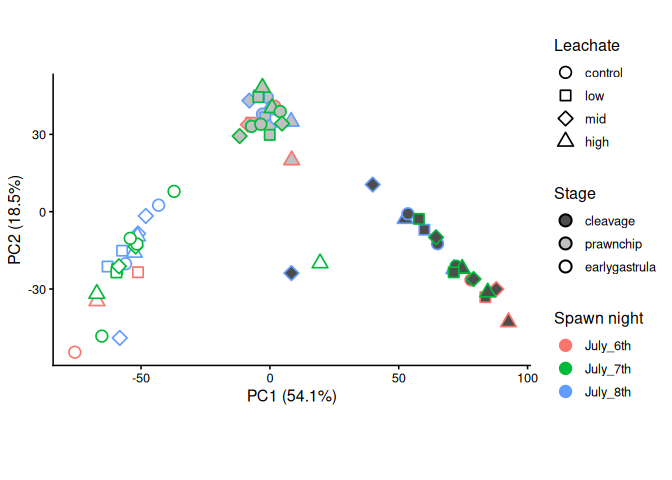
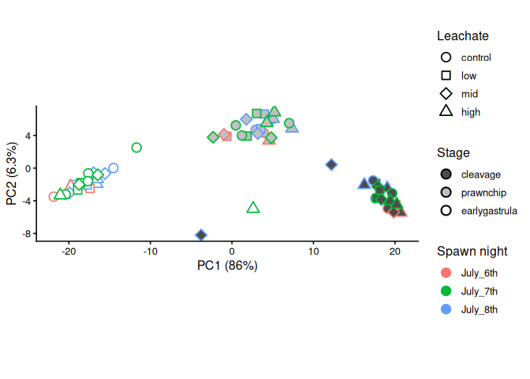
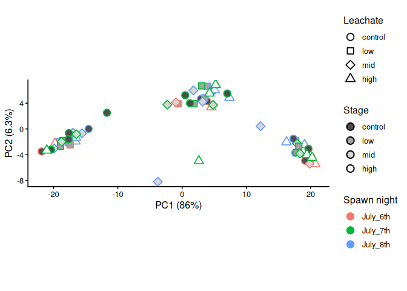

# PERMANOVA of RNA-seq gene counts
Sarah Tanja
2024-12-02

- [<span class="toc-section-number">1</span> Background](#background)
- [<span class="toc-section-number">2</span> Setup](#setup)
  - [<span class="toc-section-number">2.1</span> Inputs](#inputs)
  - [<span class="toc-section-number">2.2</span> Outputs](#outputs)
  - [<span class="toc-section-number">2.3</span> Set paths](#set-paths)
  - [<span class="toc-section-number">2.4</span> Load
    packages](#load-packages)
  - [<span class="toc-section-number">2.5</span> Load
    inputs](#load-inputs)
    - [<span class="toc-section-number">2.5.1</span>
      Metadata](#metadata)
- [<span class="toc-section-number">3</span> Data prep](#data-prep)
  - [<span class="toc-section-number">3.0.1</span> Turn the data.frames
    back to matrices](#turn-the-dataframes-back-to-matrices)
  - [<span class="toc-section-number">3.0.2</span> Transpose count
    matrices](#transpose-count-matrices)
  - [<span class="toc-section-number">3.0.3</span> Compute Euclidean
    distance between
    samples](#compute-euclidean-distance-between-samples)
- [<span class="toc-section-number">4</span> Run
  PERMANOVA](#run-permanova)
  - [<span class="toc-section-number">4.1</span> Full gene
    set](#full-gene-set)
  - [<span class="toc-section-number">4.2</span> DEGs](#degs)
- [<span class="toc-section-number">5</span> PCAs](#pcas)
  - [<span class="toc-section-number">5.1</span> Full gene
    set](#full-gene-set-1)
  - [<span class="toc-section-number">5.2</span> DEGs](#degs-1)

# Background

# Setup

## Inputs

- metadata `metadata_or`
- filtered gene count matrix `gcm_filtor`
- list of all significantly expressed genes `sig_all`

## Outputs

## Set paths

``` r
metadata_path <- "../../metadata/metadata_or.csv"
output_path <- "../../output/06_deg/permanova/"
input_path <- "../../output/06_deg/spawnnight/"
```

## Load packages

``` r
library(DESeq2)
library(vegan)
library(tidyverse)
```

## Load inputs

``` r
files <- file.path(input_path, c("vst_mat_df.csv", "vst_mat_130_df.csv"))

nm <- make.names(tools::file_path_sans_ext(basename(files)), unique = TRUE)

for (i in seq_along(files)) {
  assign(nm[i], readr::read_csv(files[i]), envir = .GlobalEnv)
}
```

### Metadata

``` r
# Load metadata (outlier samples removed, 61 samples remain)
metadata_or <- read_csv(metadata_path)

# set factors
metadata_or <- metadata_or %>% 
  mutate(
    collection_date = as.Date(collection_date, format = "%d-%b-%Y"),
    stage    = factor(stage,    levels = c("cleavage", "prawnchip", "earlygastrula")),
    leachate = factor(leachate, levels = c("control", "low", "mid", "high")),
    spawn_night = factor(spawn_night, levels  = c("July_6th", "July_7th", "July_8th"))
    )

# View metadata structure
str(metadata_or)
```

    tibble [61 × 9] (S3: tbl_df/tbl/data.frame)
     $ sample_id      : chr [1:61] "101112C14" "101112C4" "101112C9" "101112H14" ...
     $ collection_date: Date[1:61], format: "2024-07-08" "2024-07-08" ...
     $ parents        : num [1:61] 101112 101112 101112 101112 101112 ...
     $ group          : chr [1:61] "C14" "C4" "C9" "H14" ...
     $ hpf            : num [1:61] 14 4 9 14 4 9 14 4 9 14 ...
     $ stage          : Factor w/ 3 levels "cleavage","prawnchip",..: 3 1 2 3 1 2 3 1 2 3 ...
     $ leachate       : Factor w/ 4 levels "control","low",..: 1 1 1 4 4 4 2 2 2 3 ...
     $ leachate_mgL   : num [1:61] 0 0 0 1 1 1 0.01 0.01 0.01 0.1 ...
     $ spawn_night    : Factor w/ 3 levels "July_6th","July_7th",..: 3 3 3 3 3 3 3 3 3 3 ...

# Data prep

### Turn the data.frames back to matrices

``` r
vst_mat <- vst_mat_df %>% 
  column_to_rownames(var = "gene_id")

vst_mat_130 <- vst_mat_130_df %>% 
  column_to_rownames(var = "gene_id")
```

### Transpose count matrices

The variance stabilizing transformation (vst) minimized effects of small
counts and normalized for library size. Note: `t()` transposes. The code
`t()` flips the matrix to samples as rows × genes as columns. Functions
like `vegan::vegdist()` and `adonis2()` expect rows = samples, columns =
features. Use the transposed matrix for PERMANOVA such that rows are
samples ordered to match the sample names in our metadata.

``` r
# transpose
## Full set of genes
t_vst_mat <- t(vst_mat) # rows are samples, columns are genes
dim(t_vst_mat)
```

    [1]    61 12221

``` r
## DEGs only
t_vst_mat_130 <- t(vst_mat_130) # rows are samples, columns are genes
dim(t_vst_mat_130)
```

    [1]  61 130

### Compute Euclidean distance between samples

``` r
eu_dist_full <- vegdist((t_vst_mat), method = "eu")

eu_dist_deg <- vegdist((t_vst_mat_130), method = "eu")
```

# Run PERMANOVA

Run `adonis2` to build PERMANOVA model

> [!NOTE]
>
> Because adonis2() uses random permutations to get p-values. Without
> fixing the seed, each run draws a different set/order of permutations,
> which results in tiny differences in F-stats/p-values. By adding
> `set.seed(###)` the permutation stream is reproducible so you (and
> future you) get the same numbers.

## Full gene set

``` r
set.seed(11052025)
adonis2(eu_dist_full ~ leachate * stage, 
        data = metadata_or,
        permutations = 999,
        strata = metadata_or$spawn_night, # <-- control for spawn night
        by = "terms") 
```

    Permutation test for adonis under reduced model
    Terms added sequentially (first to last)
    Blocks:  strata 
    Permutation: free
    Number of permutations: 999

    adonis2(formula = eu_dist_full ~ leachate * stage, data = metadata_or, permutations = 999, by = "terms", strata = metadata_or$spawn_night)
                   Df SumOfSqs      R2       F Pr(>F)    
    leachate        3     6003 0.02094  1.1028  0.329    
    stage           2   183822 0.64125 50.6501  0.001 ***
    leachate:stage  6     7920 0.02763  0.7274  0.776    
    Residual       49    88917 0.31018                   
    Total          60   286662 1.00000                   
    ---
    Signif. codes:  0 '***' 0.001 '**' 0.01 '*' 0.05 '.' 0.1 ' ' 1

> [!NOTE]
>
> A PERMANOVA with 999 permutations (permutations restricted within
> spawn night) revealed that developmental stage explained the majority
> of variation in multivariate gene-expression profiles
> ($F_{2,49} = 45.0$, $R^2 = 0.613$, $p = 0.001$). Neither leachate
> concentration ($F_{3,49} = 1.09$, $R^2 = 0.022$, $p = 0.375$) nor the
> leachate,×,stage interaction ($F_{6,49} = 0.78$, $R^2 = 0.032$,
> $p = 0.697$) had a significant effect. Overall, the model explained
> 66.7% of the variance in gene-expression dissimilarity, with stage
> accounting for nearly all of the explained variation.
>
> These results indicate that transcriptomic profiles differed strongly
> among developmental stages but not across leachate concentrations or
> their interaction, suggesting that developmental processes dominate
> gene-expression variation in this dataset.

Why does the permanova say `leachate` and `leachate:stage` is
insignificant but `DESeq2` results return significantly differentially
expressed genes for those terms?

**PERMANOVA** is a **single** multivariate test on a distance among
**samples**

It asks whether group **centroids** differ (and a bit of spread,
depending on dispersion). If `leachate` shifts are modest,
bidirectional, or limited to a subset of genes, the overall centroid
shift can be tiny → non-sig.

**Dominant developmental stage signal**

Your term table shows **`stage`** explains ~61% of variance; that can
swamp smaller `leachate` signals. After blocking by parents, the
residual degrees of freedom and variability left to detect `leachate`
are limited.

Your DESeq2 results might be **stage-specific** contrasts (e.g.,
leachate within stage), while your PERMANOVA tested a **single global**
leachate and interaction term. The global test can be ns even if **some
stages** have effects.

## DEGs

``` r
adonis2(eu_dist_deg ~ leachate * stage, 
        data = metadata_or,
        permutations = 999,
        strata = metadata_or$spawn_night, # <-- control for spawn_night
        by = "terms") 
```

    Permutation test for adonis under reduced model
    Terms added sequentially (first to last)
    Blocks:  strata 
    Permutation: free
    Number of permutations: 999

    adonis2(formula = eu_dist_deg ~ leachate * stage, data = metadata_or, permutations = 999, by = "terms", strata = metadata_or$spawn_night)
                   Df SumOfSqs      R2        F Pr(>F)    
    leachate        3    338.3 0.02252   2.8743  0.044 *  
    stage           2  12506.6 0.83263 159.3957  0.001 ***
    leachate:stage  6    253.5 0.01687   1.0768  0.396    
    Residual       49   1922.3 0.12798                    
    Total          60  15020.7 1.00000                    
    ---
    Signif. codes:  0 '***' 0.001 '**' 0.01 '*' 0.05 '.' 0.1 ' ' 1

> [!NOTE]
>
> Using PERMANOVA on Euclidean distances calculated from the 130
> differentially expressed genes (DEGs) (n = 61 samples; 999
> permutations; stratified by parental cross), we detected a strong
> effect of developmental stage and smaller but significant effects of
> leachate and their interaction. Stage explained R² = 0.680 of the
> variance and was highly significant (Df = 2, F = 76.83, p = 0.001).
> Leachate explained R² = 0.039 (Df = 3, F = 2.96, p = 0.034), and the
> leachate × stage interaction explained R² = 0.063 (Df = 6, F = 2.38, p
> = 0.023). Residual variation accounted for R² = 0.217.

# PCAs

## Full gene set

``` r
# Check if metadata and matrix have same samples in the same order... should return TRUE
identical(metadata_or$sample_id, rownames(t_vst_mat))
```

    [1] TRUE

``` r
# Make pca
pca_full <- prcomp(t_vst_mat)

pvar_full <- (pca_full$sdev^2) / sum(pca_full$sdev^2) * 100


pca_full_df <- as.data.frame(pca_full$x) %>% 
  rownames_to_column("sample_id") %>% 
  left_join(metadata_or, by = "sample_id")
```

``` r
# Choose which % variance vector you computed
pvf1 <- if (exists("percentVar")) percentVar[1] else round(pvar_full[1], 1)
pvf2 <- if (exists("percentVar")) percentVar[2] else round(pvar_full[2], 1)

pf <- ggplot(pca_full_df, aes(x = PC1, y = PC2,
                        fill = stage,              # interior color
                        shape = leachate,          # shapes 21–25 allow fill+outline
                        colour = factor(spawn_night)) # outline color
  ) +
  geom_point(size = 3.5, stroke = 0.9) +
  scale_fill_grey(name = "Stage", start = 0.3, end = 1)+
  # Make sure your shape scale uses filled shapes:
  scale_shape_manual(values = c(21, 22, 23, 24, 25)) +
  # Legend tweak so color legend shows outlines (no fill)
  guides(colour = guide_legend(override.aes = list(fill = NA))) +
  coord_equal() +
  labs(x = paste0("PC1 (", pvf1, "%)"),
       y = paste0("PC2 (", pvf2, "%)"),
       colour = "Spawn night",
       fill   = "Stage",
       shape  = "Leachate") +
  theme_classic(base_size = 12)+
  guides(
    shape  = guide_legend(order = 1),
    fill   = guide_legend(override.aes = list(shape = 21, stroke = 1.1, colour = "black"), 
                          order = 2),
    colour = guide_legend(order = 3)
    
  ) 

pf
```



## DEGs

``` r
# Check if metadata and matrix have same samples in the same order... should return TRUE
identical(metadata_or$sample_id, rownames(t_vst_mat_130))
```

    [1] TRUE

``` r
# Make pca
pca_deg <- prcomp(t_vst_mat_130)

pvar_deg <- (pca_deg$sdev^2) / sum(pca_deg$sdev^2) * 100


pca_deg_df <- as.data.frame(pca_deg$x) %>% 
  rownames_to_column("sample_id") %>% 
  left_join(metadata_or, by = "sample_id")
```

``` r
# Choose which % variance vector you computed
pvd1 <- if (exists("percentVar")) percentVar[1] else round(pvar_deg[1], 1)
pvd2 <- if (exists("percentVar")) percentVar[2] else round(pvar_deg[2], 1)

pd <- ggplot(pca_deg_df, aes(x = PC1, y = PC2,
                        fill = stage,              # interior color
                        shape = leachate,          # shapes 21–25 allow fill+outline
                        colour = factor(spawn_night)) # outline color
  ) +
  geom_point(size = 3.5, stroke = 0.9) +
  scale_fill_grey(name = "Stage", start = 0.3, end = 1)+
  # Make sure your shape scale uses filled shapes:
  scale_shape_manual(values = c(21, 22, 23, 24, 25)) +
  # Legend tweak so color legend shows outlines (no fill)
  guides(colour = guide_legend(override.aes = list(fill = NA))) +
  coord_equal() +
  labs(x = paste0("PC1 (", pvd1, "%)"),
       y = paste0("PC2 (", pvd2, "%)"),
       colour = "Spawn night",
       fill   = "Stage",
       shape  = "Leachate") +
  theme_classic(base_size = 12)+
  guides(
    shape  = guide_legend(order = 1),
    fill   = guide_legend(override.aes = list(shape = 21, stroke = 1.1, colour = "black"), 
                          order = 2),
    colour = guide_legend(order = 3)
    
  ) 

pd
```



``` r
ggplot(pca_deg_df, aes(x = PC1, y = PC2,
                        fill = leachate,              # interior color
                        shape = leachate,          # shapes 21–25 allow fill+outline
                        colour = factor(spawn_night)) # outline color
  ) +
  geom_point(size = 3.5, stroke = 0.9) +
  scale_fill_grey(name = "Stage", start = 0.3, end = 1)+
  # Make sure your shape scale uses filled shapes:
  scale_shape_manual(values = c(21, 22, 23, 24, 25)) +
  # Legend tweak so color legend shows outlines (no fill)
  guides(colour = guide_legend(override.aes = list(fill = NA))) +
  coord_equal() +
  labs(x = paste0("PC1 (", pvd1, "%)"),
       y = paste0("PC2 (", pvd2, "%)"),
       colour = "Spawn night",
       fill   = "Leachate",
       shape  = "Leachate") +
  theme_classic(base_size = 12)+
  guides(
    shape  = guide_legend(order = 1),
    fill   = guide_legend(override.aes = list(shape = 21, stroke = 1.1, colour = "black"), 
                          order = 2),
    colour = guide_legend(order = 3)
    
  ) 
```


