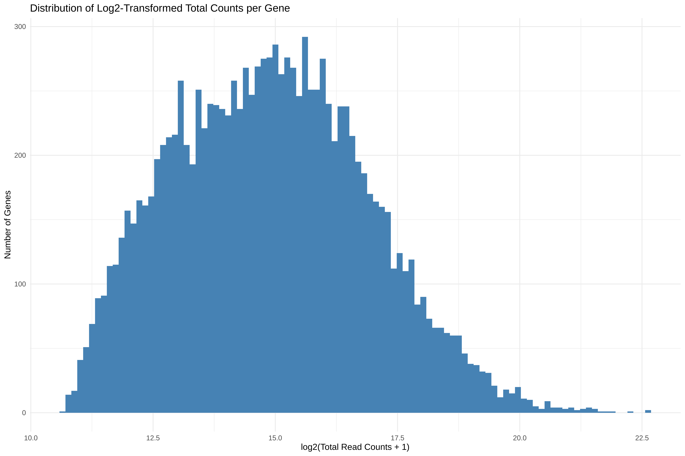
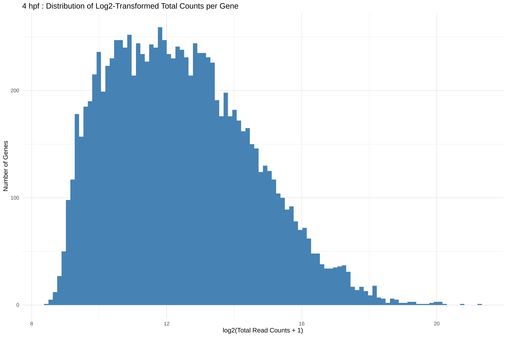
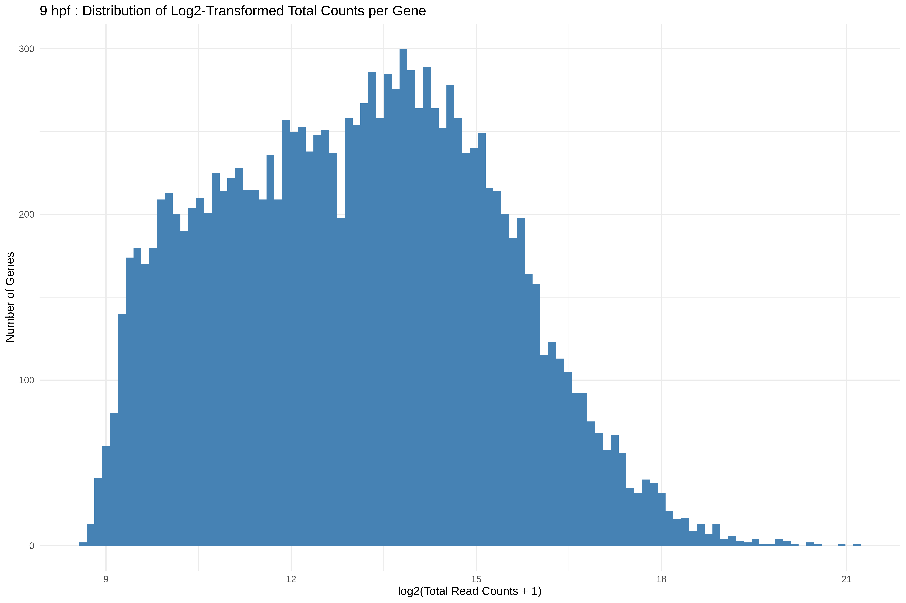
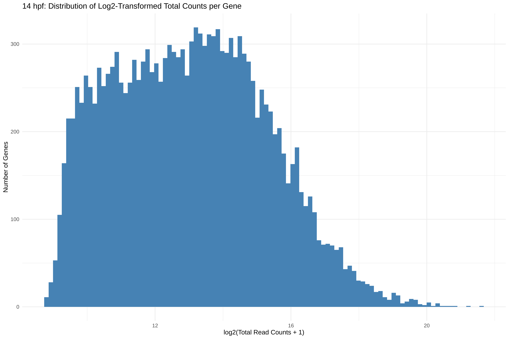
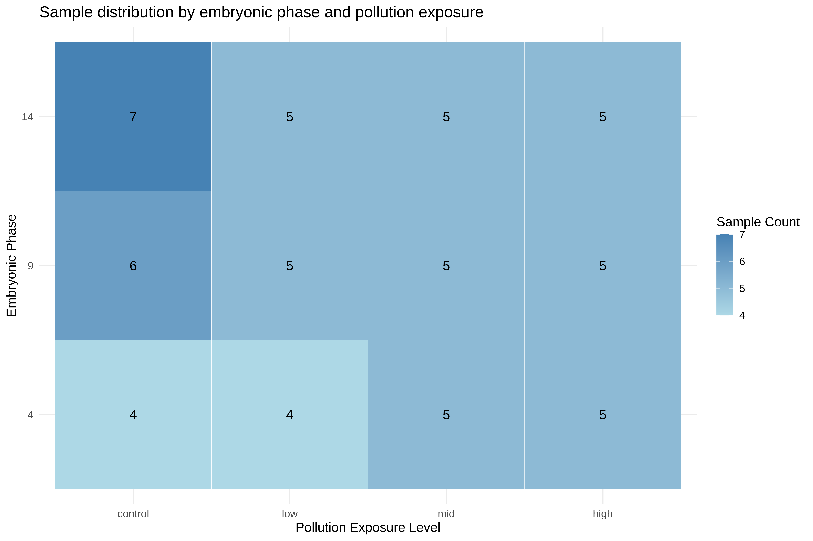

# Step 6: Filter
Sarah Tanja
2024-11-18

# Background

## Inputs

## Outputs

## Install packages

## Load packages

``` r
library(tidyverse)
```

# Import metadata

``` r
metadata <- read.csv("../metadata/mcap_RNAseq_simplified_metadata.csv")
str(metadata)
```

    'data.frame':   63 obs. of  18 variables:
     $ sample_no                      : int  1 2 3 4 5 6 7 8 9 10 ...
     $ sample_name                    : chr  "101112C14" "101112C4" "101112C9" "101112H14" ...
     $ organism                       : chr  "Montipora capitata" "Montipora capitata" "Montipora capitata" "Montipora capitata" ...
     $ collection_date                : chr  "08-Jul-2024" "08-Jul-2024" "08-Jul-2024" "08-Jul-2024" ...
     $ development_stage              : chr  "early gastrula" "cleavage" "prawn chip" "early gastrula" ...
     $ pvc_leachate_level             : chr  "control" "control" "control" "high" ...
     $ hours_post_fertilization       : int  14 4 9 14 4 9 14 4 9 14 ...
     $ pvc_leachate_concentration_mg.L: num  0 0 0 1 1 1 0.01 0.01 0.01 0.1 ...
     $ plate                          : int  1 1 1 1 1 1 1 1 1 1 ...
     $ well                           : chr  "E10" "C08" "B04" "E12" ...
     $ sample_type                    : chr  "Total RNA" "Total RNA" "Total RNA" "Total RNA" ...
     $ sample_buffer                  : chr  "DNAse/RNAse-free water" "DNAse/RNAse-free water" "DNAse/RNAse-free water" "DNAse/RNAse-free water" ...
     $ total_amount_ng                : num  210 770 276 356 402 ...
     $ volume_uL                      : int  50 50 50 50 50 50 50 50 50 50 ...
     $ conc.ng.uL                     : num  4.2 15.4 5.51 7.11 8.05 ...
     $ purification_method            : chr  "Zymo Quick DNA/RNA Miniprep Plus with DNase Treatment" "Zymo Quick DNA/RNA Miniprep Plus with DNase Treatment" "Zymo Quick DNA/RNA Miniprep Plus with DNase Treatment" "Zymo Quick DNA/RNA Miniprep Plus with DNase Treatment" ...
     $ biosafety_level                : chr  "None" "None" "None" "None" ...
     $ MethodUsedForFluorescence      : chr  "Qubit High Sensitivity Assay" "Qubit High Sensitivity Assay" "Qubit High Sensitivity Assay" "Qubit High Sensitivity Assay" ...

## Format metadata

``` r
metadata$embryonic_stage <- gsub(" ", "", metadata$development_stage) # Remove space in development_stage condition column and rename to embryonic_stage
metadata$leachate_mgL <- metadata$pvc_leachate_concentration_mg.L # Rename to leachate_mgL to simplify
metadata$leachate <- metadata$pvc_leachate_level # Rename to leachate_lvl to simplify

# Make a new column that represents the parent crosses
metadata <- metadata %>% 
  mutate(parents = sub("^(.*?)[CLMH].*", "\\1", sample_name)) %>% 
  relocate(parents, .after = sample_name)

# Make a new column that simplifies the treatment group
metadata <- metadata %>% 
  mutate(group = sub(".*?([CLMH].*)", "\\1", sample_name)) %>% 
  relocate(group, .after = parents)

# Reorder factors
metadata$embryonic_stage <- as.factor(metadata$embryonic_stage)
metadata$embryonic_stage <- fct_relevel(metadata$embryonic_stage, "cleavage", "prawnchip", "earlygastrula")
 
metadata$leachate <- as.factor(metadata$leachate)
metadata$leachate <- fct_relevel(metadata$leachate, "control", "low", "mid", "high")

metadata$hpf <- as.factor(metadata$hours_post_fertilization)
metadata$hpf <- fct_relevel(metadata$hpf, "4", "9", "14")
```

## Filter metadata

``` r
metadata_filt <- metadata %>% dplyr::select(sample_name, parents, group, hpf, embryonic_stage, leachate, leachate_mgL)

metadata_filt <- metadata_filt %>% 
  filter(!sample_name %in% c("131415L4", "789C4"))
```

# Import gene count matrix (gcm)

> In this count matrix, each row represents a gene, each column a
> sequenced RNA library, and the values give the estimated counts of
> fragments that were probabilistically assigned to the respective gene
> in each library by `HISAT2`

- `check.names = FALSE` removed the ‘X’ from in front of sample id’s in
  the column headers

``` r
gcm <- read.csv("../output/05_count/gene_count_matrix.csv", row.names="gene_id", check.names = FALSE)
head(gcm)
```

                                              101112C14 101112C4 101112C9 101112H14
    Montipora_capitata_HIv3___RNAseq.g4581.t1       176      458      395       195
    Montipora_capitata_HIv3___RNAseq.g4582.t1      1137      380      934       882
    Montipora_capitata_HIv3___RNAseq.g4588.t1        11        0        0         4
    Montipora_capitata_HIv3___RNAseq.g4583.t1      2043      905     1848      1847
    Montipora_capitata_HIv3___RNAseq.g4584.t1      2641      452      706      1917
    Montipora_capitata_HIv3___TS.g26265.t1            0        0        0         0
                                              101112H4 101112H9 101112L14 101112L4
    Montipora_capitata_HIv3___RNAseq.g4581.t1      144      351       156      187
    Montipora_capitata_HIv3___RNAseq.g4582.t1      326     1337      1101      392
    Montipora_capitata_HIv3___RNAseq.g4588.t1        0        0         0        0
    Montipora_capitata_HIv3___RNAseq.g4583.t1      945     2087      1625     1039
    Montipora_capitata_HIv3___RNAseq.g4584.t1      266      625      2301      367
    Montipora_capitata_HIv3___TS.g26265.t1           0        0         0        0
                                              101112L9 101112M14 101112M4 101112M9
    Montipora_capitata_HIv3___RNAseq.g4581.t1      360       215      199      386
    Montipora_capitata_HIv3___RNAseq.g4582.t1     1195      1311      431     1076
    Montipora_capitata_HIv3___RNAseq.g4588.t1        0         0        0        0
    Montipora_capitata_HIv3___RNAseq.g4583.t1     2367      1875     1176     2230
    Montipora_capitata_HIv3___RNAseq.g4584.t1      668      1963      800      706
    Montipora_capitata_HIv3___TS.g26265.t1           0         2        0        0
                                              123C14 123C4 123C9 123H14 123H4 123H9
    Montipora_capitata_HIv3___RNAseq.g4581.t1     63   714   351    138   384   146
    Montipora_capitata_HIv3___RNAseq.g4582.t1    643   496  1064    927   378   864
    Montipora_capitata_HIv3___RNAseq.g4588.t1      0     0     0      0     0     0
    Montipora_capitata_HIv3___RNAseq.g4583.t1   1349  1591  1529   1377   648  1902
    Montipora_capitata_HIv3___RNAseq.g4584.t1   2724   703   648   3178   497   438
    Montipora_capitata_HIv3___TS.g26265.t1         0     0     6      1     0     0
                                              123L14 123L4 123L9 123M4 123M9
    Montipora_capitata_HIv3___RNAseq.g4581.t1    190   271   304   771   154
    Montipora_capitata_HIv3___RNAseq.g4582.t1    884   270   838   650   516
    Montipora_capitata_HIv3___RNAseq.g4588.t1      0     0     0     0     0
    Montipora_capitata_HIv3___RNAseq.g4583.t1   2007   630  1572  1258   892
    Montipora_capitata_HIv3___RNAseq.g4584.t1   1867   330   366   677   397
    Montipora_capitata_HIv3___TS.g26265.t1         0     0     0     0     0
                                              131415C14 131415C4 131415C9 131415H14
    Montipora_capitata_HIv3___RNAseq.g4581.t1       198      321      371       196
    Montipora_capitata_HIv3___RNAseq.g4582.t1      1184      712     1338      1314
    Montipora_capitata_HIv3___RNAseq.g4588.t1         0        2        0         0
    Montipora_capitata_HIv3___RNAseq.g4583.t1      2175     1667     2190      1932
    Montipora_capitata_HIv3___RNAseq.g4584.t1      1556      510      473      2267
    Montipora_capitata_HIv3___TS.g26265.t1            0        0        0         0
                                              131415H4 131415H9 131415L14 131415L4
    Montipora_capitata_HIv3___RNAseq.g4581.t1      221      410       170       24
    Montipora_capitata_HIv3___RNAseq.g4582.t1      382     1117      1167        0
    Montipora_capitata_HIv3___RNAseq.g4588.t1        0        0         0        0
    Montipora_capitata_HIv3___RNAseq.g4583.t1      716     2219      1817        0
    Montipora_capitata_HIv3___RNAseq.g4584.t1      334      326      2772        0
    Montipora_capitata_HIv3___TS.g26265.t1           0        0         0        0
                                              131415L9 131415M14 131415M4 131415M9
    Montipora_capitata_HIv3___RNAseq.g4581.t1      362       291      271      396
    Montipora_capitata_HIv3___RNAseq.g4582.t1     1500      1376      667     1383
    Montipora_capitata_HIv3___RNAseq.g4588.t1        0         0        0        0
    Montipora_capitata_HIv3___RNAseq.g4583.t1     2102      2108     1395     2314
    Montipora_capitata_HIv3___RNAseq.g4584.t1      534      2296      404      492
    Montipora_capitata_HIv3___TS.g26265.t1           0         0        1        0
                                              13M14 456C4 456H4 456H9 456L14 456L4
    Montipora_capitata_HIv3___RNAseq.g4581.t1    71   196   351   236    125    73
    Montipora_capitata_HIv3___RNAseq.g4582.t1   912   306   458  1301   1306   249
    Montipora_capitata_HIv3___RNAseq.g4588.t1     0     0     0     0      0     0
    Montipora_capitata_HIv3___RNAseq.g4583.t1  1639   651   987  1882   1882  1050
    Montipora_capitata_HIv3___RNAseq.g4584.t1  2194   291   547   488   1736   169
    Montipora_capitata_HIv3___TS.g26265.t1        0     0     0     0      1     0
                                              456L9 456M14 456M4 456M9 45C14 45C9
    Montipora_capitata_HIv3___RNAseq.g4581.t1   274    151   454   250    50  348
    Montipora_capitata_HIv3___RNAseq.g4582.t1  1105   1270   525   967   420  981
    Montipora_capitata_HIv3___RNAseq.g4588.t1     0      0     0     3     0    0
    Montipora_capitata_HIv3___RNAseq.g4583.t1  2506   1649   940  2005   703 2230
    Montipora_capitata_HIv3___RNAseq.g4584.t1   495   1698   522   595  1402  913
    Montipora_capitata_HIv3___TS.g26265.t1        0      0     0     0     0    0
                                              45H14 67C9 6C14 789C4 789H14 789H4
    Montipora_capitata_HIv3___RNAseq.g4581.t1   411  290  114     0    150   516
    Montipora_capitata_HIv3___RNAseq.g4582.t1   590  973 1022     0    862   628
    Montipora_capitata_HIv3___RNAseq.g4588.t1     0    0    0     1      0     0
    Montipora_capitata_HIv3___RNAseq.g4583.t1  1807 1995 1769   106   1633  1128
    Montipora_capitata_HIv3___RNAseq.g4584.t1  1021  310 1435     0   2783   963
    Montipora_capitata_HIv3___TS.g26265.t1        0    0    0     0      0     0
                                              789H9 789L14 789L4 789L9 789M14 789M4
    Montipora_capitata_HIv3___RNAseq.g4581.t1   332    168   148   409    150   461
    Montipora_capitata_HIv3___RNAseq.g4582.t1  1338   1027   445  1326    959   551
    Montipora_capitata_HIv3___RNAseq.g4588.t1     0      0     0     0      0     0
    Montipora_capitata_HIv3___RNAseq.g4583.t1  2429   1616   819  2344   1757  1111
    Montipora_capitata_HIv3___RNAseq.g4584.t1   783   2549   313   686   2913   906
    Montipora_capitata_HIv3___TS.g26265.t1        0      0     0     0      0     0
                                              7C14 89C14 89C9 89M9
    Montipora_capitata_HIv3___RNAseq.g4581.t1  208   235  273  230
    Montipora_capitata_HIv3___RNAseq.g4582.t1  711  1563 1349  823
    Montipora_capitata_HIv3___RNAseq.g4588.t1    0     0    0    0
    Montipora_capitata_HIv3___RNAseq.g4583.t1 1874  2623 2594 1646
    Montipora_capitata_HIv3___RNAseq.g4584.t1 1307  2195  778  624
    Montipora_capitata_HIv3___TS.g26265.t1       0     2    0    0

The count matrix should show counts of whole numbers (integers) … since
each column shows <int> as the data type we know that the counts are
already integers

# Exclude outliers

Two samples had poor hisat alignment and should be removed from the
dataset: 131415L4 and 789C4

``` r
gcm_filt <- gcm %>% 
  dplyr::select(-`131415L4`, -`789C4`)
```

> It is absolutely critical that the columns of the count matrix and the
> rows of the column data (information about samples) are in the same
> order. DESeq2 will not make guesses as to which column of the count
> matrix belongs to which row of the column data, these must be provided
> to DESeq2 already in consistent order.

The following code checks that all the sample names in the metadata
dataframe match the column names in the gene count matrix. It should
return ‘TRUE’

``` r
print(paste("There are", nrow(metadata_filt), "samples in total"))
```

    [1] "There are 61 samples in total"

``` r
# Check if all matched names are equal (should return TRUE)
all(metadata_filt$sample_name == colnames(gcm_filt))
```

    [1] TRUE

Save gcm & metadata

``` r
write_csv(metadata_filt, "../metadata/metadata_filt.csv")
write_csv(rownames_to_column(gcm_filt, var = "gene_id"), "../output/06_tidyup/gcm_filt.csv")
```

# Subset gene count matrix by hpf

## 4hpf

``` r
# Subset metadata
# Filter rows where 'sample_name' matches the pattern [CLMH]4
metadata_4 <- metadata_filt %>% 
  filter(str_detect(sample_name, "[CLMH]4"))

# Subset gene count matrix
# Select only samples that are 4hpf out of gene count matrix
gcm_4 <- gcm_filt %>% 
  dplyr::select(matches("[CLMH]4"))

print(paste("There are", nrow(metadata_4), "samples at 4hpf"))
```

    [1] "There are 18 samples at 4hpf"

``` r
# Check if all matched names are equal (should return TRUE)
all(metadata_4$sample_name == colnames(gcm_4))
```

    [1] TRUE

- There should be 18 cleavage (4hpf) samples

Save gcm & metadata

``` r
write_csv(metadata_4, "../metadata/metadata_4.csv")
write_csv(rownames_to_column(gcm_4, var = "gene_id"), "../output/06_tidyup/gcm_4.csv")
```

## 9hpf

``` r
# Subset metadata
# Filter rows where 'sample_name' matches the pattern [CLMH]9
metadata_9 <- metadata_filt %>% 
  filter(str_detect(sample_name, "[CLMH]9"))

# Subset gene count matrix
# Select only samples that are 9hpf out of gene count matrix
gcm_9 <- gcm_filt %>% 
  dplyr::select(matches("[CLMH]9"))

print(paste("There are", nrow(metadata_9), "samples at 9hpf"))
```

    [1] "There are 21 samples at 9hpf"

``` r
# Check if all matched names are equal (should return TRUE)
all(metadata_9$sample_name == colnames(gcm_9))
```

    [1] TRUE

- There should be 21 prawn chip (9hpf) samples

Save gcm & metadata

``` r
write_csv(metadata_9, "../metadata/metadata_9.csv")
write_csv(rownames_to_column(gcm_9, var = "gene_id"), "../output/06_tidyup/gcm_9.csv")
```

## 14hpf

``` r
# Subset metadata
# Filter rows where 'sample_name' matches the pattern [CLMH]14
metadata_14 <- metadata_filt %>% 
  filter(str_detect(sample_name, "[CLMH]14"))

# Subset gene count matrix
# Select only samples that are 9hpf out of gene count matrix
gcm_14 <- gcm_filt %>% 
  dplyr::select(matches("[CLMH]14"))

print(paste("There are", nrow(metadata_14), "samples at 14hpf"))
```

    [1] "There are 22 samples at 14hpf"

``` r
# Check if all matched names are equal
all(metadata_14$sample_name == colnames(gcm_14))
```

    [1] TRUE

- There should be 22 early gastrula (14hpf) samples

save metadata_14

``` r
#output metadata for other analyses 
write_csv(metadata_14, "../metadata/metadata_14.csv")
write_csv(rownames_to_column(gcm_14, var = "gene_id"), "../output/06_tidyup/gcm_14.csv")
```

# Prefiltering

[Prefiltering](https://bioconductor.org/packages/devel/bioc/vignettes/DESeq2/inst/doc/DESeq2.html#pre-filtering)

Pre-filtering our dataset reduces the memory size of the dataframe,
increases the speed of the transformation and testing functions, and
improves quality of statistical analysis by removing low-coverage
counts. Removed counts could represent outliers in the data and removing
these improves sensitivity of statistical tests.

- **`across(everything(), ~ . > n)`**: This applies the condition `> n`
  to all columns of the data frame. For each cell, it returns `TRUE` if
  the value is greater than n and `FALSE` otherwise.

- **`rowSums()`**: This counts the number of `TRUE` values for each row.
  It adds up how many columns in each row have values greater than 10.

- **`>= n * ncol(df)`**: This checks if the count of `TRUE` values in
  each row is greater than or equal to n% of the total number of columns
  (`ncol(df)`).

### All

``` r
# Filter rows where at least 8% of the columns have a value greater than 10
gcm_filt <- gcm_filt %>%
  filter(rowSums(across(everything(), ~ . > 15)) >= 0.75 * ncol(gcm))

nrow(gcm)
```

    [1] 54384

``` r
nrow(gcm_filt)
```

    [1] 12225

> [!NOTE]
>
> We reduced our gene count matrix from 54,384 to 12,225 genes by
> selecting genes present (in counts of at least 15!) in at least 75% of
> the samples

``` r
ggplot(data.frame(log_counts = log2(rowSums(gcm_filt) + 1)), aes(x = log_counts)) +
  geom_histogram(bins = 100, fill = "steelblue") +
  labs(
    title = "Distribution of Log2-Transformed Total Counts per Gene",
    x = "log2(Total Read Counts + 1)",
    y = "Number of Genes"
  ) +
  theme_minimal()
```



We are going to run DGE analysis on each hpf separately (as well as
together) so let’s setup gene count matrices for each of 4, 9, and 14
hours post fertilization

### 4hpf

``` r
# Filter rows where at least 75% of the columns have a value greater than 15
gcm_filt_4 <- gcm_4 %>%
  filter(rowSums(across(everything(), ~ . > 15)) >= 0.75 * ncol(gcm_4))

nrow(gcm_4)
```

    [1] 54384

``` r
nrow(gcm_filt_4)
```

    [1] 10936

``` r
write_csv(rownames_to_column(gcm_filt_4, var = "gene_id"), file = "../output/06_tidyup/gcm_filt_4.csv")
```

> [!NOTE]
>
> 54384 genes were filtered down to 10,936 genes that have at least 15
> copies in at least 75% of the 4hpf samples

``` r
ggplot(data.frame(log_counts = log2(rowSums(gcm_filt_4) + 1)), aes(x = log_counts)) +
  geom_histogram(bins = 100, fill = "steelblue") +
  labs(
    title = "4 hpf : Distribution of Log2-Transformed Total Counts per Gene",
    x = "log2(Total Read Counts + 1)",
    y = "Number of Genes"
  ) +
  theme_minimal()
```



### 9hpf

``` r
# Filter rows where at least 75% of the columns have a value greater than 15
gcm_filt_9 <- gcm_9 %>%
  filter(rowSums(across(everything(), ~ . > 15)) >= 0.75 * ncol(gcm_9))

nrow(gcm_9)
```

    [1] 54384

``` r
nrow(gcm_filt_9)
```

    [1] 13781

``` r
write_csv(rownames_to_column(gcm_filt_9, var = "gene_id"), file = "../output/06_tidyup/gcm_filt_9.csv")
```

> [!NOTE]
>
> 54384 genes were filtered down to 13,781 genes that have at least 15
> copies in at least 75% of the 9hpf samples

``` r
ggplot(data.frame(log_counts = log2(rowSums(gcm_filt_9) + 1)), aes(x = log_counts)) +
  geom_histogram(bins = 100, fill = "steelblue") +
  labs(
    title = "9 hpf : Distribution of Log2-Transformed Total Counts per Gene",
    x = "log2(Total Read Counts + 1)",
    y = "Number of Genes"
  ) +
  theme_minimal()
```



### 14hpf

``` r
# Filter rows where at least 75% of the columns have a value greater than 15
gcm_filt_14 <- gcm_14 %>%
  filter(rowSums(across(everything(), ~ . > 15)) >= 0.75 * ncol(gcm_14))

nrow(gcm_14)
```

    [1] 54384

``` r
nrow(gcm_filt_14)
```

    [1] 15501

``` r
write_csv(rownames_to_column(gcm_filt_14, var = "gene_id"), file = "../output/06_tidyup/gcm_filt_14.csv")
```

> [!NOTE]
>
> 54384 genes were filtered down to 15,501 genes that have at least 15
> copies in at least 75% of the 14hpf samples

``` r
ggplot(data.frame(log_counts = log2(rowSums(gcm_filt_14) + 1)), aes(x = log_counts)) +
  geom_histogram(bins = 100, fill = "steelblue") +
  labs(
    title = "14 hpf: Distribution of Log2-Transformed Total Counts per Gene",
    x = "log2(Total Read Counts + 1)",
    y = "Number of Genes"
  ) +
  theme_minimal()
```



> [!IMPORTANT]
>
> More gene transcripts are active as embryonic development progresses!
>
> 4hpf : 14,191
>
> 9hpf : 17,368
>
> 14hpf : 21,447

# Sample summary

``` r
# Create a summary table
metadata_filt %>%
  count(hpf, leachate) %>%
  ggplot(aes(x = leachate, y = hpf, fill = n)) +
  geom_tile(color = "white") +
  geom_text(aes(label = n), color = "black", size = 5) +
  scale_fill_gradient(low = "lightblue", high = "steelblue") +
  labs(
    title = "Sample distribution by embryonic phase and pollution exposure",
    x = "Pollution Exposure Level",
    y = "Embryonic Phase",
    fill = "Sample Count"
  ) +
  theme_minimal(base_size = 14)
```



> [!NOTE]
>
> We have 61 samples spanning three embryonic phases and four pollution
> exposure levels, yielding 12 distinct treatment combinations. The
> heatmap above shows how samples are distributed across treatments. Our
> minimum group size is 4, which guides our gene filtering threshold. We
> hypothesize that both developmental stage and pollution exposure
> independently and interactively influence gene expression.

## Common genes

``` r
# Convert rownames to a column
gcm_4_df <- rownames_to_column(gcm_filt_4, var = "gene_id")
gcm_9_df <- rownames_to_column(gcm_filt_9, var = "gene_id")
gcm_14_df <- rownames_to_column(gcm_filt_14, var = "gene_id")

# Join by gene_id
gcm_common <- gcm_4_df %>%
  inner_join(gcm_9_df, by = "gene_id") %>%
  inner_join(gcm_14_df, by = "gene_id")

nrow(gcm_common)
```

    [1] 10828
