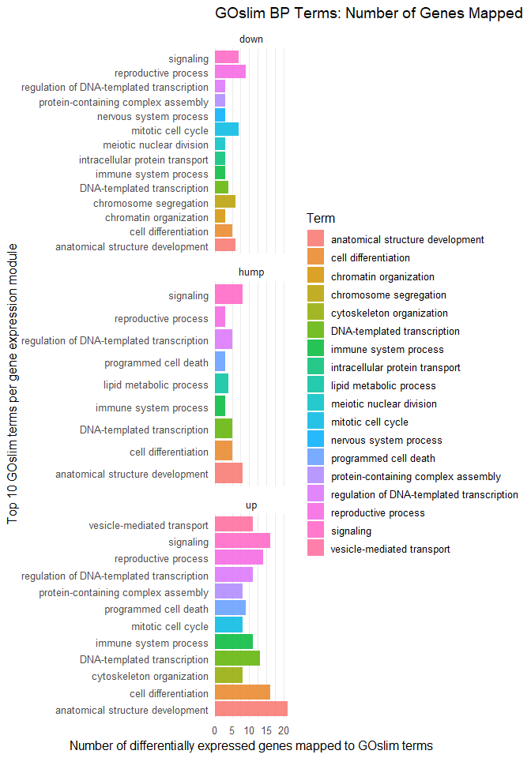
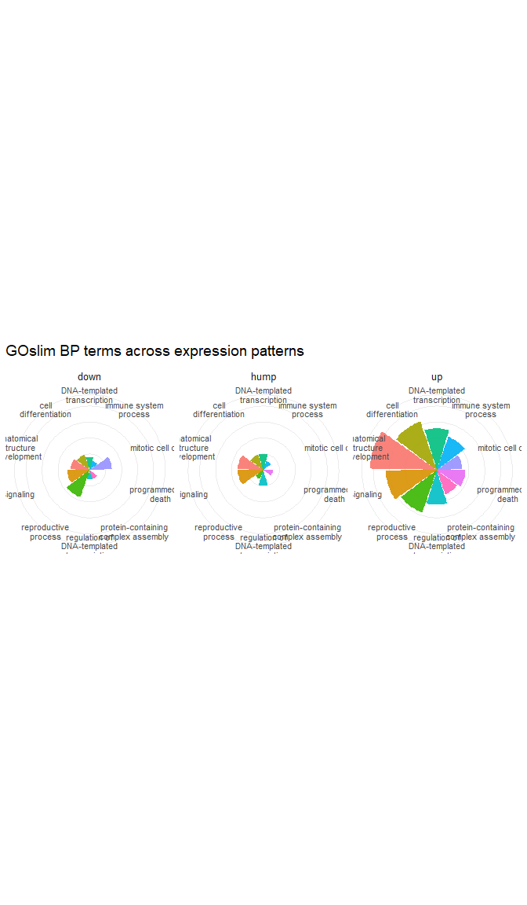
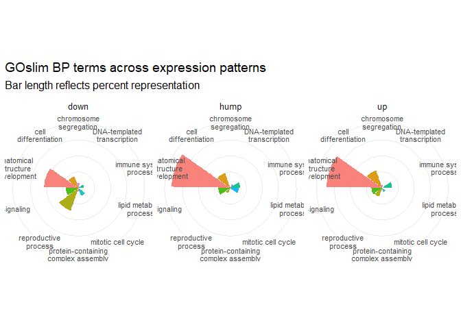

# Visualize GOslims by numbers of DEGs

2026-02-06

- [<span class="toc-section-number">1</span> Background](#background)
- [<span class="toc-section-number">2</span> Load
  libraries](#load-libraries)
- [<span class="toc-section-number">3</span> Load inputs](#load-inputs)
- [<span class="toc-section-number">4</span> Wrangle](#wrangle)
- [<span class="toc-section-number">5</span> How do I show this in
  context of background universe and stage
  signals?](#how-do-i-show-this-in-context-of-background-universe-and-stage-signals)
- [<span class="toc-section-number">6</span> How many GOSlims are
  there?](#how-many-goslims-are-there)
- [<span class="toc-section-number">7</span> How many terms are
  represented?](#how-many-terms-are-represented)
- [<span class="toc-section-number">8</span> Top 15
  terms](#top-15-terms)
- [<span class="toc-section-number">9</span> Which are
  unique?](#which-are-unique)
- [<span class="toc-section-number">10</span> Which are
  shared?](#which-are-shared)

# Background

We identified GOslim terms associated with DEGs in each cluster/module.
This is a descriptive summary plot, and does not reflect statistical
enrichment!

With this plot we simply want to know what the DE genes do, and how many
of them are associated with each GOslim term.

# Load libraries

``` r
library(tidyverse)
```

# Load inputs

``` r
input_path <- "../../output/07_enrichment/goslim/"
```

``` r
goslim_summary <- read_csv(file.path(input_path, "goslim_summary.csv"))
```

``` r
glimpse(goslim_summary)
```

    Rows: 576
    Columns: 10
    $ module  <chr> "leachate_up", "leachate_up", "leachate_up", "leachate_up", "l…
    $ Count   <dbl> 38, 5, 0, 90, 0, 4, 0, 0, 0, 0, 6, 6, 13, 3, 14, 6, 8, 2, 4, 4…
    $ Percent <dbl> 2.6045236, 0.3427005, 0.0000000, 6.1686086, 0.0000000, 0.27416…
    $ Term    <chr> "mitotic cell cycle", "cytokinesis", "cytoplasmic translation"…
    $ GO.IDs  <chr> "GO:0000070;GO:0000082;GO:0000086;GO:0000281;GO:0007052;GO:000…
    $ n_goids <dbl> 38, 5, 0, 90, 0, 4, 0, 0, 0, 0, 6, 6, 13, 3, 14, 6, 8, 2, 4, 4…
    $ n_genes <dbl> 8, 2, 0, 11, 0, 1, 0, 0, 0, 0, 1, 2, 2, 2, 13, 11, 1, 1, 3, 1,…
    $ genes   <chr> "Montipora_capitata_HIv3___RNAseq.27502_t;Montipora_capitata_H…
    $ DEdueto <chr> "leachate", "leachate", "leachate", "leachate", "leachate", "l…
    $ pattern <chr> "up", "up", "up", "up", "up", "up", "up", "up", "up", "up", "u…

``` r
summary(goslim_summary)
```

        module              Count            Percent            Term          
     Length:576         Min.   :   0.00   Min.   : 0.0000   Length:576        
     Class :character   1st Qu.:   4.00   1st Qu.: 0.1371   Class :character  
     Mode  :character   Median :  22.00   Median : 0.4432   Mode  :character  
                        Mean   :  80.29   Mean   : 1.3889                     
                        3rd Qu.:  63.50   3rd Qu.: 1.0973                     
                        Max.   :2906.00   Max.   :36.5889                     
        GO.IDs             n_goids           n_genes          genes          
     Length:576         Min.   :   0.00   Min.   :   0.0   Length:576        
     Class :character   1st Qu.:   4.00   1st Qu.:   1.0   Class :character  
     Mode  :character   Median :  22.00   Median :  18.0   Mode  :character  
                        Mean   :  80.29   Mean   : 110.7                     
                        3rd Qu.:  63.50   3rd Qu.: 101.5                     
                        Max.   :2906.00   Max.   :3120.0                     
       DEdueto            pattern         
     Length:576         Length:576        
     Class :character   Class :character  
     Mode  :character   Mode  :character  
                                          
                                          
                                          

``` r
colSums(is.na(goslim_summary))
```

     module   Count Percent    Term  GO.IDs n_goids n_genes   genes DEdueto pattern 
          0       0       0       0     107       0       0     107      72       0 

# Wrangle

remove rows that are 0 or NA

``` r
goslim_summary %>%
  drop_na(genes) %>% 
  filter(DEdueto == "leachate") %>% 
  filter(n_genes > 2) %>%
  group_by(module) %>%
  slice_max(order_by = n_genes, n = 10) %>%
  ungroup() %>% 
ggplot(., aes(x = n_genes, y = Term, fill = Term)) +
  geom_col(position = position_dodge(width = 0.9), alpha = 0.85) +
  facet_wrap(~ pattern, scales = "free_y", ncol = 1) +
  scale_x_continuous(expand = c(0, 0)) +
  labs(
    title = "GOslim BP Terms: Number of Genes Mapped",
    x = "Number of differentially expressed genes mapped to GOslim terms",
    y = "Top 10 GOslim terms per gene expression module"
  ) +
  theme_minimal(base_size = 12) +
  theme(panel.grid.major.y = element_blank())
```



``` r
ggsave(
  filename = "goslim_summary_barplot.png",
  plot = last_plot(),
  path = "../../output/07_enrichment/goslim/",
  width = 10,
  height = 8,
  units = "in",
  dpi = 900
)
```

    systemfonts and textshaping have been compiled with different versions of Freetype. Because of this, textshaping will not use the font cache provided by systemfonts

# How do I show this in context of background universe and stage signals?

# How many GOSlims are there?

``` r
length(unique(goslim_summary$Term))
```

    [1] 72

There are 72 unique Go Slim Terms.

# How many terms are represented?

``` r
goslim_summary %>%
  filter(DEdueto == "leachate", n_genes > 0) %>%
  group_by(module) %>%
  arrange(n_genes) %>%
  ungroup() %>%
  count(module, Term) %>%
  count(module, name = "n_unique_terms")
```

    # A tibble: 3 × 2
      module        n_unique_terms
      <chr>                  <int>
    1 leachate_down             32
    2 leachate_hump             37
    3 leachate_up               53

There are 32 terms in the down pattern, 37 in the hump patterns, and 53
in the up pattern.

# Top 15 terms

Which are the top ~15 terms of *leachate-responsive DEGs* represented in
each pattern by percent?

``` r
goslim_summary %>%
  filter(DEdueto == "leachate", n_genes > 2) %>%
  group_by(module) %>%
  slice_max(order_by = Percent, n = 15) %>%
  ungroup() %>%
  count(module, Term) %>%
  count(module, name = "n_unique_terms")
```

    # A tibble: 3 × 2
      module        n_unique_terms
      <chr>                  <int>
    1 leachate_down             14
    2 leachate_hump              9
    3 leachate_up               16

There are 14 unique terms represented in the down pattern, 9 in the hump
pattern, and 16 in the up pattern.

# Which are unique?

Across down, hump, and up.. which terms are only found in one pattern
(e.g. only in down, or only in up)?

``` r
unique_terms <- goslim_summary %>%
  filter(DEdueto == "leachate") %>%
  group_by(module) %>%
  slice_max(order_by = Percent, n = 15, with_ties = FALSE) %>%
  ungroup() %>%
  group_by(Term) %>%
  summarise(
    n_modules = n_distinct(module),
    modules = paste(sort(unique(module)), collapse = ", "),
    patterns = paste(sort(unique(pattern)), collapse = ", "),
    mean_percent = mean(Percent, na.rm = TRUE),
    mean_n_genes = mean(n_genes, na.rm = TRUE),
    .groups = "drop"
  ) %>%
  filter(n_modules == 1) %>%
  arrange(desc(mean_percent), Term)

unique_terms
```

    # A tibble: 13 × 6
       Term                     n_modules modules patterns mean_percent mean_n_genes
       <chr>                        <int> <chr>   <chr>           <dbl>        <dbl>
     1 lipid metabolic process          1 leacha… hump             5.39            4
     2 meiotic nuclear division         1 leacha… down             3.74            3
     3 vesicle-mediated transp…         1 leacha… up               3.50           11
     4 carbohydrate derivative…         1 leacha… hump             3.06            2
     5 DNA-templated transcrip…         1 leacha… hump             2.77            5
     6 amino acid metabolic pr…         1 leacha… down             2.49            1
     7 chromatin organization           1 leacha… down             1.75            3
     8 regulation of DNA-templ…         1 leacha… hump             1.60            5
     9 cell junction organizat…         1 leacha… up               1.51            6
    10 nervous system process           1 leacha… hump             1.46            1
    11 DNA repair                       1 leacha… hump             1.31            2
    12 nucleobase-containing s…         1 leacha… up               1.10            1
    13 cell motility                    1 leacha… up               1.03            4

Unique to down: - meitoc nuclear division, n_DEG = 3 - chromatin
organization, n_DEG = 3 - nervous system process, n_DEG = 3 -
intracellular protein transport, n_DEG = 3

Unique to hump: - lipid metablolic process, n_DEG = 4

Unique to up: - vesicle-mediated transport, n_DEG = -

# Which are shared?

``` r
top_terms <- goslim_summary %>%
  filter(DEdueto == "leachate", n_genes > 2) %>%
  group_by(module) %>%
  slice_max(order_by = Percent, n = 15, with_ties = FALSE) %>%
  ungroup()

overlap_terms <- top_terms %>%
  group_by(Term) %>%
  summarise(
    n_modules = n_distinct(module),
    modules = paste(sort(unique(module)), collapse = ", "),
    patterns = paste(sort(unique(pattern)), collapse = ", "),
    mean_percent = mean(Percent, na.rm = TRUE),
    mean_n_genes = mean(n_genes, na.rm = TRUE),
    .groups = "drop"
  ) %>%
  filter(n_modules > 1) %>%
  arrange(desc(n_modules), desc(mean_percent))

overlap_terms
```

    # A tibble: 11 × 6
       Term                     n_modules modules patterns mean_percent mean_n_genes
       <chr>                        <int> <chr>   <chr>           <dbl>        <dbl>
     1 anatomical structure de…         3 leacha… down, h…        30.9         11.7 
     2 cell differentiation             3 leacha… down, h…         9.81         8.67
     3 reproductive process             3 leacha… down, h…         8.07         8.67
     4 signaling                        3 leacha… down, h…         7.35        10.3 
     5 immune system process            3 leacha… down, h…         5.31         5.67
     6 DNA-templated transcrip…         3 leacha… down, h…         1.66         7.33
     7 mitotic cell cycle               2 leacha… down, up         3.92         7.5 
     8 chromosome segregation           2 leacha… down, up         2.39         4.5 
     9 protein-containing comp…         2 leacha… down, up         1.88         5.5 
    10 regulation of DNA-templ…         2 leacha… down, h…         1.30         4   
    11 programmed cell death            2 leacha… hump, up         1.22         6   

``` r
overlap_detail <- top_terms %>%
  semi_join(overlap_terms, by = "Term") %>%
  arrange(Term, module, desc(Percent)) %>%
  select(Term, module, pattern, Percent, n_genes, Count, GO.IDs)

overlap_detail
```

    # A tibble: 28 × 7
       Term                             module  pattern Percent n_genes Count GO.IDs
       <chr>                            <chr>   <chr>     <dbl>   <dbl> <dbl> <chr> 
     1 DNA-templated transcription      leacha… down      1.25        4     5 GO:00…
     2 DNA-templated transcription      leacha… hump      2.77        5    19 GO:00…
     3 DNA-templated transcription      leacha… up        0.960      13    14 GO:00…
     4 anatomical structure development leacha… down     21.4         6    86 GO:00…
     5 anatomical structure development leacha… hump     36.6         8   251 GO:00…
     6 anatomical structure development leacha… up       34.6        21   505 GO:00…
     7 cell differentiation             leacha… down      7.73        5    31 GO:00…
     8 cell differentiation             leacha… hump      9.91        5    68 GO:00…
     9 cell differentiation             leacha… up       11.8        16   172 GO:00…
    10 chromosome segregation           leacha… down      2.99        6    12 GO:00…
    # ℹ 18 more rows

``` r
goslim_summary %>%
  drop_na(genes) %>% 
  filter(DEdueto == "leachate") %>% 
  filter(n_genes > 2) %>%
  group_by(module) %>%
  slice_max(order_by = Percent, n = 10) %>%
  summarise(
    unique_terms = list(unique(Term)),
    n_unique_terms = n_distinct(Term),
    .groups = "drop"
  )
```

    # A tibble: 3 × 3
      module        unique_terms n_unique_terms
      <chr>         <list>                <int>
    1 leachate_down <chr [11]>               11
    2 leachate_hump <chr [9]>                 9
    3 leachate_up   <chr [10]>               10

``` r
library(tidyverse)

gos_plot <- goslim_summary %>%
  drop_na(genes) %>%
  filter(DEdueto == "leachate", n_genes > 2)

term_levels <- gos_plot %>%
  group_by(Term) %>%
  summarise(total_n_genes = sum(n_genes, na.rm = TRUE), .groups = "drop") %>%
  arrange(desc(total_n_genes), Term) %>%
  slice_head(n = 10) %>%
  pull(Term)

circ_df <- gos_plot %>%
  filter(Term %in% term_levels) %>%
  group_by(pattern, Term) %>%
  summarise(n_genes = sum(n_genes), .groups = "drop") %>%
  complete(pattern, Term = term_levels, fill = list(n_genes = 0)) %>%
  mutate(
    pattern = factor(pattern, levels = c("down", "hump", "up")),
    Term = factor(Term, levels = term_levels),
    Term_wrap = str_wrap(as.character(Term), width = 18)
  )

ggplot(circ_df, aes(x = factor(Term_wrap, levels = unique(Term_wrap)), y = n_genes, fill = Term)) +
  geom_col(width = 0.95, alpha = 0.9) +
  coord_polar(start = -pi / 2) +
  facet_wrap(~pattern, nrow = 1) +
  labs(
    title = "GOslim BP terms across expression patterns",
    x = NULL,
    y = "Number of DE genes mapped to term"
  ) +
  theme_minimal(base_size = 12) +
  theme(
    panel.grid.major.x = element_blank(),
    panel.grid.minor = element_blank(),
    axis.text.y = element_blank(),
    axis.title.y = element_blank(),
    axis.text.x = element_text(size = 8),
    legend.position = "none"
  )
```



``` r
library(tidyverse)

gos_plot <- goslim_summary %>%
  drop_na(genes) %>%
  filter(DEdueto == "leachate", n_genes > 2)

# choose one shared set of terms across all patterns
term_levels <- gos_plot %>%
  group_by(Term) %>%
  summarise(total_percent = sum(Percent, na.rm = TRUE), .groups = "drop") %>%
  arrange(desc(total_percent), Term) %>%
  slice_head(n = 10) %>%
  pull(Term)

circ_df <- gos_plot %>%
  filter(Term %in% term_levels) %>%
  group_by(pattern, Term) %>%
  summarise(
    Percent = max(Percent, na.rm = TRUE),
    .groups = "drop"
  ) %>%
  complete(pattern, Term = term_levels, fill = list(Percent = 0)) %>%
  mutate(
    pattern = factor(pattern, levels = c("down", "hump", "up")),
    Term = factor(Term, levels = term_levels),
    Term_wrap = str_wrap(as.character(Term), width = 18)
  )

ggplot(
  circ_df,
  aes(
    x = factor(Term_wrap, levels = unique(Term_wrap)),
    y = Percent,
    fill = Term
  )
) +
  geom_col(width = 0.95, alpha = 0.9) +
  coord_polar(start = -pi / 2) +
  facet_wrap(~pattern, nrow = 1) +
  labs(
    title = "GOslim BP terms across expression patterns",
    subtitle = "Bar length reflects percent representation",
    x = NULL,
    y = "Percent"
  ) +
  theme_minimal(base_size = 12) +
  theme(
    panel.grid.major.x = element_blank(),
    panel.grid.minor = element_blank(),
    axis.text.y = element_blank(),
    axis.title.y = element_blank(),
    axis.text.x = element_text(size = 8),
    legend.position = "none"
  )
```



``` r
ggplot(
  circ_df,
  aes(
    x = factor(Term_wrap, levels = unique(Term_wrap)),
    y = Percent,
    fill = Term
  )
) +
  geom_col(width = 0.95, alpha = 0.9) +
  coord_polar(start = -pi / 2) +
  facet_wrap(~pattern, nrow = 1) +
  scale_y_continuous(labels = scales::label_percent(scale = 1)) +
  labs(
    title = "GOslim BP terms across expression patterns",
    subtitle = "Bar length reflects percent representation",
    x = NULL,
    y = "Percent of genes mapped to GOslim term"
  ) +
  theme_minimal(base_size = 12) +
  theme(
    panel.grid.major.x = element_blank(),
    panel.grid.minor = element_blank(),
    axis.text.y = element_blank(),
    axis.title.y = element_blank(),
    axis.text.x = element_text(size = 8),
    legend.position = "none"
  )
```


