# Gene ontology (GO) enrichment plots
Sarah Tanja
2025-09-30

- [<span class="toc-section-number">1</span> Background](#background)
  - [<span class="toc-section-number">1.1</span> Inputs](#inputs)
  - [<span class="toc-section-number">1.2</span> Outputs](#outputs)
- [<span class="toc-section-number">2</span> Setup](#setup)
  - [<span class="toc-section-number">2.1</span> Set paths](#set-paths)
  - [<span class="toc-section-number">2.2</span> Install
    packages](#install-packages)
  - [<span class="toc-section-number">2.3</span> Load
    packages](#load-packages)
  - [<span class="toc-section-number">2.4</span> Load
    inputs](#load-inputs)
- [<span class="toc-section-number">3</span> All PVC-leachate DEG go
  terms](#all-pvc-leachate-deg-go-terms)
  - [<span class="toc-section-number">3.0.1</span> Similarity matrix
    heatmap](#similarity-matrix-heatmap)
  - [<span class="toc-section-number">3.0.2</span> Scatter
    plot](#scatter-plot)
  - [<span class="toc-section-number">3.0.3</span> Treemap
    plot](#treemap-plot)
- [<span class="toc-section-number">4</span> PVC GEP 1](#pvc-gep-1)
  - [<span class="toc-section-number">4.1</span> scatter
    plot](#scatter-plot-1)
  - [<span class="toc-section-number">4.2</span> treemap
    plot](#treemap-plot-1)
- [<span class="toc-section-number">5</span> GEP 2](#gep-2)
  - [<span class="toc-section-number">5.1</span> scatter
    plot](#scatter-plot-2)
  - [<span class="toc-section-number">5.2</span> treemap
    plot](#treemap-plot-2)
- [<span class="toc-section-number">6</span> GEP 3](#gep-3)
  - [<span class="toc-section-number">6.1</span> scatter
    plot](#scatter-plot-3)
  - [<span class="toc-section-number">6.2</span> treemap
    plot](#treemap-plot-3)
- [<span class="toc-section-number">7</span> Manuscript
  PCA](#manuscript-pca)
  - [<span class="toc-section-number">7.0.1</span> Interactive
    plot](#interactive-plot)
- [<span class="toc-section-number">8</span> Lollipop
  plot?](#lollipop-plot)
- [<span class="toc-section-number">9</span> Summary & next
  steps](#summary--next-steps)

# Background

- [Using the rrvgo
  package](https://bioconductor.org/packages/devel/bioc/vignettes/rrvgo/inst/doc/rrvgo.html)

The size column in the reduced results represents the number of genes
annotated to each GO term.

size \> 0 → that term is associated with at least one gene in our gene
universe (and was used in the GOseq enrichment test).

size = 0 → no genes in our input set are annotated to that term, even
though the term appears in the GO semantic similarity matrix.

Why size = 0 can appear: You built the similarity matrix
(calculateSimMatrix) from all GO terms, but then reduced it using a
filtered subset (e.g., only enriched terms). Some leftover terms in the
similarity matrix may not actually appear in your results’ gene
annotations. The term was pruned or filtered by GOseq or rrvgo during
processing — for example, if a cluster “parent” term wasn’t part of the
original enrichment table, but was added as a representative. Annotation
differences — GOseq uses your gene-to-GO mapping (often via gene2cat),
while rrvgo’s internal lookup (from GO.db) may include additional terms
that don’t exist in your mapping.

Relationship between score and size

There’s no inherent correlation between score and size because they
describe different things. A small, specific GO term with few genes
(size = 3) might have a very low p-value, if all 3 of those genes are
strongly enriched — → high score (e.g. 307 ≈ –log₁₀(10⁻³⁰⁷)). A large,
general term with many genes (size = 321) might not be strongly
overrepresented — → modest p-value → low score (≈ 1.895 → p ≈ 0.0126).
That’s why score and size often move in opposite directions: small,
specific terms can show stronger enrichment signals. GOseq adjusts for
gene length bias, so the resulting *p*-values already account for uneven
annotation probabilities. Still, a term with few genes can have a small
*p*-value if those genes are all DE, whereas a large term with hundreds
of genes often dilutes that signal.

Score ≈ significance, not size.

A small size + high score = “narrow but very strong enrichment.”

A large size + low score = “broad but weak enrichment.”

When reducing with rrvgo, the highest-scoring term in each cluster
becomes the representative — typically the most statistically
significant, not necessarily the largest. I**n GOseq (and therefore in
rrvgo)**, the `size` column does **not** represent the number of DEGs in
that GO term. It represents the **number of genes in your background
(gene universe)** that are annotated to that GO term.

🧬 1. What GOseq tests

GOseq’s enrichment test works like this:

You provide a set of DEGs and a background (usually all genes tested by
DESeq2 or edgeR).

For each GO term, GOseq asks:

- Are DEGs overrepresented among genes annotated to this term compared
  to what I’d expect by chance (accounting for gene length bias)?

- *Given the set of genes that **could have been called DE**, are DEGs
  over-represented in this GO term compared to what I’d expect by
  chance?*

So each GO term has:

numDEInCat = number of DEGs annotated to that term.

numInCat = number of total genes (background) annotated to that term.

Then it computes a p-value for enrichment.

## Inputs

- reduced terms
- semantic similarity matrix

## Outputs

# Setup

## Set paths

``` r
input_path <- "../../output/07_enrichment/goseq/"
```

## Install packages

``` r
## CRAN packages-----------
#install.packages("GOplot")
#install.packages("plotly")
#install.packages("tidyverse")

## Bioconductor packages---------
#if (!require("BiocManager", quietly = TRUE))
#    install.packages("BiocManager")
#BiocManager::install("rrvgo")
```

## Load packages

``` r
library(GOplot)
library(plotly)
library(tidyverse)
library(rrvgo)
library(kableExtra)
library(ggrepel)
```

## Load inputs

the similarity matrix is the same given each module/cluster had the same
“universe” of genes for enrichment testing.

``` r
## Similarity matrix
simMatrix <- read_csv(file.path(input_path, "simMatrix.csv")) 
```

``` r
## Reduced Terms
reducedTerms <- read.csv(file.path(input_path, "reducedTerms_GO.csv"))
reducedTerms.anno <- read.csv(file.path(input_path, "reducedTerms_GO_anno.csv"))
```

Give sim matrix rownames

``` r
rownames(simMatrix) <- colnames(simMatrix)
```

> The rows of simMatrix should correspond (in order and identity) to the
> rows of reducedTerms. Ensure that the reducedTerms `go` column is a
> character, not a factor. Ensure simMatrix is a data.frame or matrix,
> and reducedTerms is a data.frame, not a tibble! \*which is why we load
> it with read.csv, (which loads a data.frame) and not read_csv (which
> loads a tibble).

# All PVC-leachate DEG go terms

Represented by `reducedTerms` and `simMatrix`

### Similarity matrix heatmap

Plot similarity matrix as a heatmap, with clustering of columns of rows
turned on by default (thus arranging together similar terms).

``` r
heatmapPlot(simMatrix,
            reducedTerms,
            annotateParent=TRUE,
            annotationLabel="parentTerm")
```

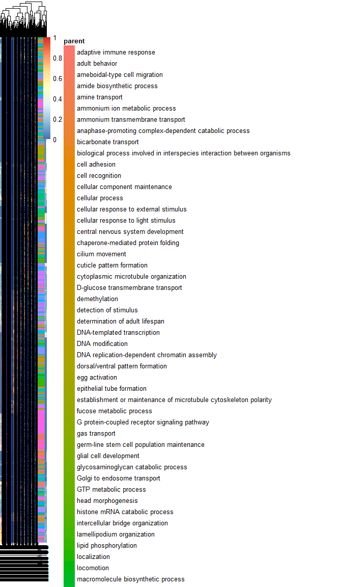

``` r
ggsave("heatmap_GO.png", width = 12, height = 8, dpi = 900)
```

### Scatter plot

Plot GO terms as scattered points. Distances between points represent
the similarity between terms, and axes are the first 2 components of
applying a PCoA to the (di)similarity matrix. Size of the point
represents the provided scores or, in its absence, the number of genes
the GO term contains.

``` r
scatterPlot(simMatrix, reducedTerms,
            onlyParents = FALSE,
            addLabel = TRUE,
            labelSize = 4)
```

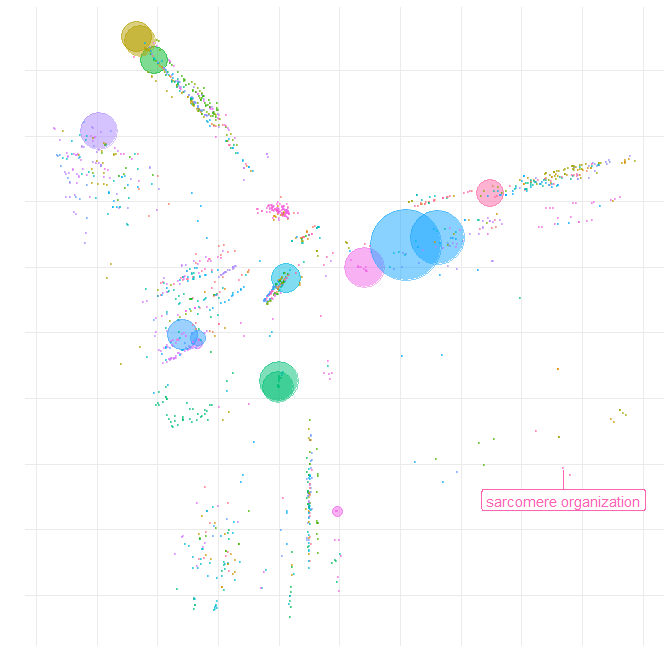

### Treemap plot

Treemaps are space-filling visualization of hierarchical structures. The
terms are grouped (colored) based on their parent, and the space used by
the term is proportional to the score. Treemaps can help with the
interpretation of the summarized results and also comparing different
sets of GO terms.

``` r
treemapPlot(reducedTerms)
```

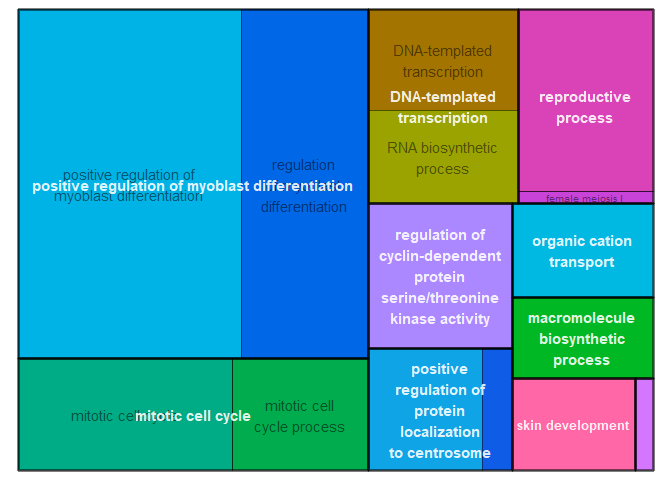

# PVC GEP 1

``` r
reducedTerms_GEP1 <- reducedTerms.anno %>% 
  filter(pattern == 1) %>% # select only GEP1 aka cleavage
  select(!gene) %>% # remove gene row which makes each go distinct
  distinct()# select distinct rows
```

This leaves us with 1271 observed go terms in `reducedTerms_GEP1` , we
now need to make sure we have a matching simMatrix that uses those same
1271 go terms

``` r
# define vector of GEP1 goterms
GEP1_goterms <- reducedTerms_GEP1$go

keep1 <- intersect(colnames(simMatrix), GEP1_goterms)
  
simMatrix_GEP1 <- simMatrix[keep1, keep1, drop = FALSE]
```

## scatter plot

``` r
scatterPlot(simMatrix_GEP1, reducedTerms_GEP1,
            onlyParents = FALSE,
            addLabel = TRUE,
            labelSize = 4)
```

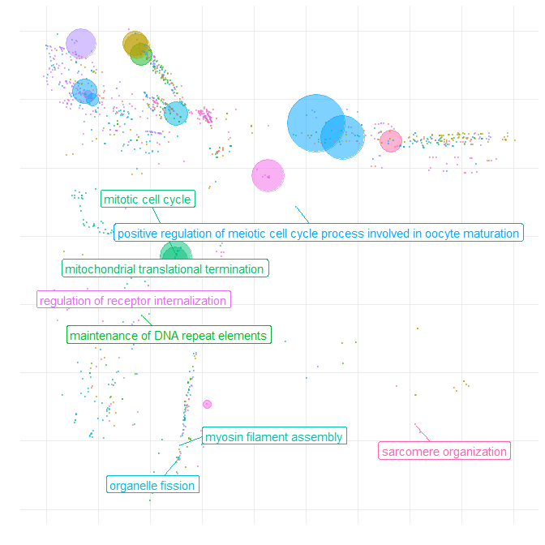

## treemap plot

``` r
treemapPlot(reducedTerms_GEP1)
```

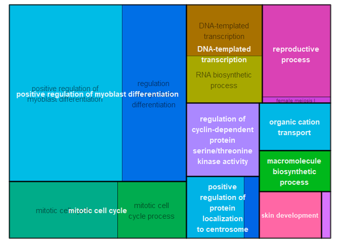

# GEP 2

``` r
reducedTerms_GEP2 <- reducedTerms.anno %>% 
  filter(pattern == 2) %>% # select only GEP1 aka cleavage
  select(!gene) %>% # remove gene row which makes each go distinct
  distinct()# select distinct rows

nrow(reducedTerms_GEP2)
```

    [1] 752

This leaves us with 752 observed go terms in `reducedTerms_GEP2` , we
now need to make sure we have a matching simMatrix that uses those same
go terms

``` r
# define vector of GEP1 goterms
GEP2_goterms <- reducedTerms_GEP2$go

keep2 <- intersect(colnames(simMatrix), GEP2_goterms)
  
simMatrix_GEP2 <- simMatrix[keep2, keep2, drop = FALSE]
```

## scatter plot

``` r
scatterPlot(simMatrix_GEP2, reducedTerms_GEP2,
            onlyParents = FALSE,
            addLabel = TRUE,
            labelSize = 4)
```

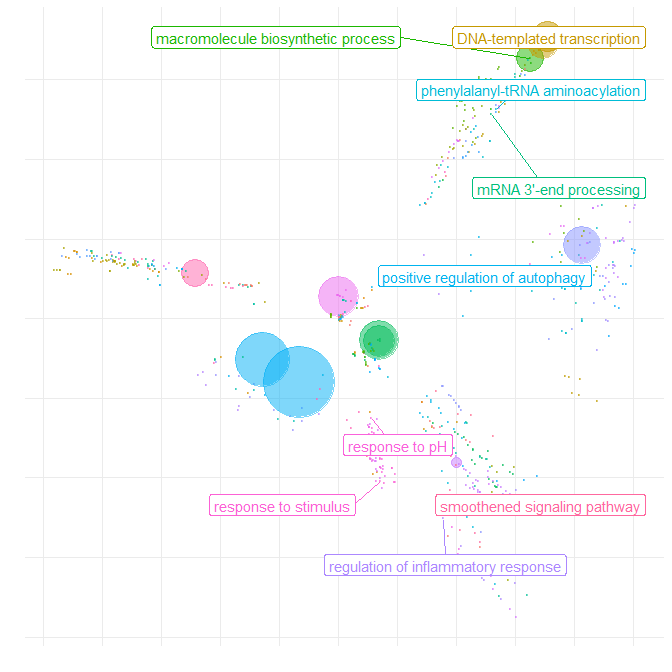

## treemap plot

``` r
treemapPlot(reducedTerms_GEP2)
```

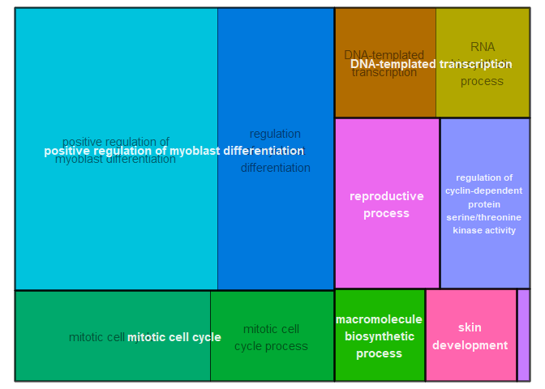

# GEP 3

``` r
reducedTerms_GEP3 <- reducedTerms.anno %>% 
  filter(pattern == 3) %>% # select only GEP1 aka cleavage
  select(!gene) %>% # remove gene row which makes each go distinct
  distinct()# select distinct rows

nrow(reducedTerms_GEP3)
```

    [1] 552

This leaves us with 552 observed go terms in `reducedTerms_GEP2` , we
now need to make sure we have a matching simMatrix that uses those same
go terms

``` r
# define vector of GEP1 goterms
GEP3_goterms <- reducedTerms_GEP3$go

keep3 <- intersect(colnames(simMatrix), GEP3_goterms)
  
simMatrix_GEP3 <- simMatrix[keep3, keep3, drop = FALSE]
```

## scatter plot

``` r
scatterPlot(simMatrix_GEP3, reducedTerms_GEP3,
            onlyParents = FALSE,
            addLabel = TRUE,
            labelSize = 4)
```

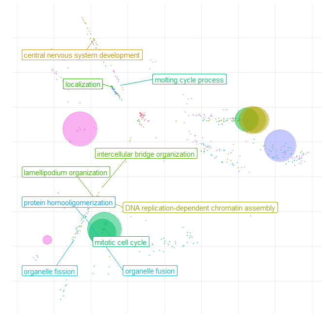

## treemap plot

``` r
treemapPlot(reducedTerms_GEP3)
```

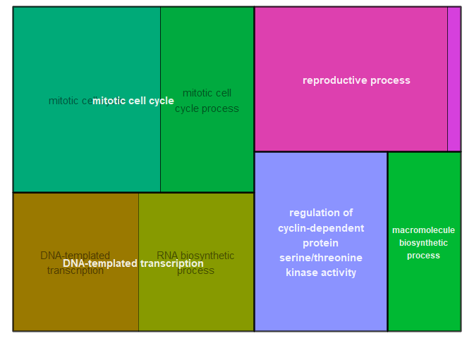

# Manuscript PCA

I want a dataframe that groups my GO terms based on the 5 main clusters
displayed in this PCA. The scatterPlot uses a dimensionality reduction
(PCoA) approach to project GO terms into 2D space and then visually
groups the points into a smaller number of major clusters. These visual
clusters are typically broader groupings, which correspond to
higher-level semantic similarity rather than the narrow clusters from
the cut tree. A possible approach if you want to create a cluster
assignment dataframe matching the 5 visual clusters is to: - Extract the
2D coordinates from the scatterPlot dimensionality reduction output, -
Apply a clustering method on the 2D coordinates (e.g., k-means with
k=5), - Create a new dataframe linking each GO term to its visual
cluster. This approach aligns the clustering with the displayed
scatterPlot clusters rather than the original fine-grained clusters.

``` r
# Distance from similarity matrix
dist <- as.dist(1 - simMatrix)

# PCoA to 2 dimensions
coord <- cmdscale(dist, k = 2)

# Convert to dataframe with GO terms
df_coords <- data.frame(go = rownames(simMatrix), Dim1 = coord[,1], Dim2 = coord[,2])
```

Cluster the terms visually in 2D space Use k-means clustering on the 2D
coordinates with k = 5 (number of desired clusters).

``` r
set.seed(123)  # for reproducibility
centers <- kmeans(df_coords[, c("Dim1", "Dim2")], centers = 8)
df_coords$centers <- as.factor(centers$cluster)
```

``` r
anno <- reducedTerms.anno %>%
  select(!gene) %>% 
  group_by(go) %>%
  mutate(pattern = paste0("GEP", pattern)) %>% 
  mutate(value = 1L) %>% 
  distinct(go, pattern, .keep_all = TRUE) %>% 
  pivot_wider(
    names_from  = pattern,
    values_from = value,
    values_fill = 0
  )
```

Combine cluster info with other GO term data. Merge this dataframe with
your reducedTerms & other GO annotation information.

``` r
final_df <- merge(df_coords, anno, by = "go") 
```

This dataframe `final_df` will now include each GO term, its 2D
coordinates used for visualization, and its assigned cluster
corresponding to 7 major parentTerms.

``` r
head(final_df)
```

              go         Dim1       Dim2 centers cluster     parent score size
    1 GO:0000002  0.049989256 -0.3220208       5       5 GO:0048284     0    8
    2 GO:0000018 -0.270987828  0.1705670       8      58 GO:0006304     0   16
    3 GO:0000054  0.006864591 -0.3519468       5      73 GO:0033750     0    9
    4 GO:0000070  0.017117469 -0.5139788       3      27 GO:0048285     0   88
    5 GO:0000075 -0.203263004 -0.2104707       7      26 GO:0000278     0   61
    6 GO:0000077 -0.205100962 -0.1919804       7      16 GO:0000160     0   40
                                       term                              parentTerm
    1      mitochondrial genome maintenance                        organelle fusion
    2       regulation of DNA recombination                        DNA modification
    3 ribosomal subunit export from nucleus                   ribosome localization
    4  mitotic sister chromatid segregation                       organelle fission
    5       cell cycle checkpoint signaling                      mitotic cell cycle
    6       DNA damage checkpoint signaling phosphorelay signal transduction system
      termUniqueness termUniquenessWithinCluster termDispensability
    1      0.9431686                   0.5800909              0.365
    2      0.8804886                   0.3211842              0.411
    3      0.8993015                   0.3898571              1.000
    4      0.8918111                   0.3405806              0.892
    5      0.8327348                   0.2121452              0.605
    6      0.8329532                   0.4625556              0.401
      over_represented_pvalue under_represented_pvalue numDEInCat numInCat ontology
    1              0.34031273                0.9359752          1       40       BP
    2              0.02552325                0.9963248          3       56       BP
    3              0.12978979                0.9918968          1       13       BP
    4              0.38444940                0.8522094          2      120       BP
    5              0.02287105                0.9944185          5      144       BP
    6              0.02005563                0.9962245          4       92       BP
      bh_adjust GEP1 GEP2 GEP3
    1         1    1    0    0
    2         1    1    1    1
    3         1    1    0    0
    4         1    1    0    1
    5         1    1    0    1
    6         1    1    0    1

Drop size = 0

``` r
final_pcoa <- final_df %>% 
  filter(size > 0)
```

### Interactive plot

For exploration

``` r
p <- ggplot(final_pcoa, aes(
    Dim1, Dim2,
    color = centers,
    size  = size,
    text  = paste0(
      "GO: ", go,
      "<br>Parent Term: ", parentTerm,
      "<br>Term: ", term,
      "<br>Score: ", round(score, 2),
      "<br>Size: ", size
    )
  )) +
  geom_point(alpha = 0.5) +
  coord_equal() +
  labs(color = "Parent Term",
       size  = "Score",
       title = "GO terms clustered in PCoA space") +
  theme_minimal(base_size = 12)+
  theme(
    legend.position = "none",      # remove legend
  )
```

Static

``` r
p
```

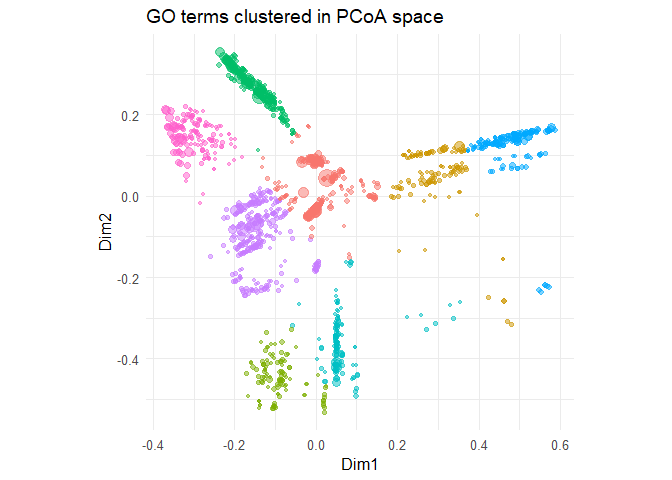

Interactive

``` r
ggplotly(p, tooltip = "text")
```

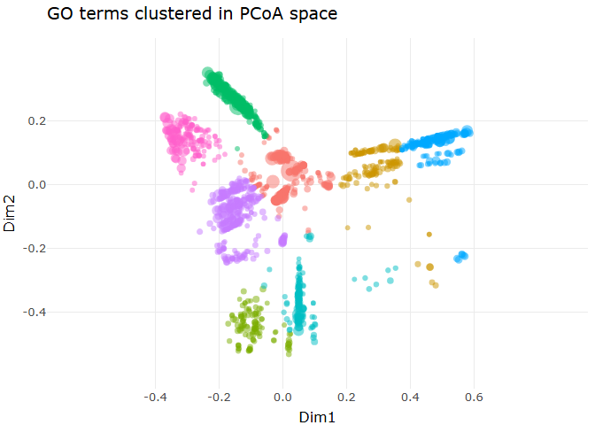

``` r
final_pcoa <- final_pcoa %>% 
  mutate(
    total = GEP1 + GEP2 + GEP3,
    GEP1_prop = ifelse(total == 0, 0, GEP1 / total),
    GEP2_prop = ifelse(total == 0, 0, GEP2 / total),
    GEP3_prop = ifelse(total == 0, 0, GEP3 / total)
  )

head(final_pcoa)
```

              go         Dim1       Dim2 centers cluster     parent score size
    1 GO:0000002  0.049989256 -0.3220208       5       5 GO:0048284     0    8
    2 GO:0000018 -0.270987828  0.1705670       8      58 GO:0006304     0   16
    3 GO:0000054  0.006864591 -0.3519468       5      73 GO:0033750     0    9
    4 GO:0000070  0.017117469 -0.5139788       3      27 GO:0048285     0   88
    5 GO:0000075 -0.203263004 -0.2104707       7      26 GO:0000278     0   61
    6 GO:0000077 -0.205100962 -0.1919804       7      16 GO:0000160     0   40
                                       term                              parentTerm
    1      mitochondrial genome maintenance                        organelle fusion
    2       regulation of DNA recombination                        DNA modification
    3 ribosomal subunit export from nucleus                   ribosome localization
    4  mitotic sister chromatid segregation                       organelle fission
    5       cell cycle checkpoint signaling                      mitotic cell cycle
    6       DNA damage checkpoint signaling phosphorelay signal transduction system
      termUniqueness termUniquenessWithinCluster termDispensability
    1      0.9431686                   0.5800909              0.365
    2      0.8804886                   0.3211842              0.411
    3      0.8993015                   0.3898571              1.000
    4      0.8918111                   0.3405806              0.892
    5      0.8327348                   0.2121452              0.605
    6      0.8329532                   0.4625556              0.401
      over_represented_pvalue under_represented_pvalue numDEInCat numInCat ontology
    1              0.34031273                0.9359752          1       40       BP
    2              0.02552325                0.9963248          3       56       BP
    3              0.12978979                0.9918968          1       13       BP
    4              0.38444940                0.8522094          2      120       BP
    5              0.02287105                0.9944185          5      144       BP
    6              0.02005563                0.9962245          4       92       BP
      bh_adjust GEP1 GEP2 GEP3 total GEP1_prop GEP2_prop GEP3_prop
    1         1    1    0    0     1 1.0000000 0.0000000 0.0000000
    2         1    1    1    1     3 0.3333333 0.3333333 0.3333333
    3         1    1    0    0     1 1.0000000 0.0000000 0.0000000
    4         1    1    0    1     2 0.5000000 0.0000000 0.5000000
    5         1    1    0    1     2 0.5000000 0.0000000 0.5000000
    6         1    1    0    1     2 0.5000000 0.0000000 0.5000000

Now each row has GEP\*\_prop columns that sum to 1 for the groups it
belongs to. Using scatterpie in ggplot2 (recommended) If you can install
packages, scatterpie is the easiest way to draw pie glyphs at arbitrary
x/y coordinates. In geom_scatterpie(), the pie size is controlled by the
aesthetics r (radius) rather than size, so you map your size column to r
inside aes().

``` r
#install.packages("scatterpie")
library(ggplot2)
library(scatterpie)

r_min <- 0.01   # smallest pie radius
r_max <- 0.3   # largest pie radius

final_pcoa <- final_pcoa %>% 
  mutate(
    size_scaled = ifelse(
      max(numDEInCat, na.rm = TRUE) == min(numDEInCat, na.rm = TRUE),
      (r_min + r_max) / 2,  # all same size if no variation
      r_min + (numDEInCat - min(numDEInCat, na.rm = TRUE)) *
        (r_max - r_min) / (max(numDEInCat, na.rm = TRUE) - min(numDEInCat, na.rm = TRUE))
    )
  )

ggplot() +
  geom_scatterpie(
    data = final_pcoa,
    aes(x = Dim1, y = Dim2,
    r  = size_scaled),         # replace with your coordinates
    cols = c("GEP1_prop", "GEP2_prop", "GEP3_prop"),
    color = NA,                # outline color; set to "black" if you want borders
    alpha = 0.9
  ) +
  scale_fill_manual(
    values = c(GEP1_prop = "#E41A1C",
               GEP2_prop = "#377EB8",
               GEP3_prop = "#4DAF4A")
  ) +
  coord_equal()
```

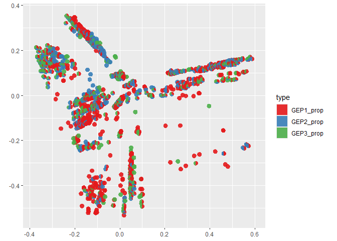

<div class="column-margin">

> [!NOTE]
>
> How to interpret distances
>
> Closer points = more semantically similar GO terms. That means the
> gene sets they represent overlap more or describe conceptually related
> processes.
>
> Farther points = less similar biologically. Their gene sets don’t
> overlap much, and the ontology sees them as describing different
> processes. The PCoA projection does not use your logFCs or
> sample-level values — it uses GO term relationships (semantic
> similarity).
>
> 1.  What your clusters represent
>
> The clusters from the PCoA + k-means are based on the pairwise
> semantic similarity scores across all GO terms.
>
> These are data-driven groupings that capture overall gene overlap +
> ontology proximity.
>
> The algorithm doesn’t “know” about your chosen parentTerm column — it
> just groups terms that have similar meaning.
>
> 2.  What your parentTerm variable is
>
> The “parent term” you merged in is a single hierarchical label from
> the GO DAG (graph).
>
> A GO term can belong under multiple higher-level categories in the
> ontology, but in your dataset it’s probably annotated with just one
> chosen parent (often the most specific or most frequent).
>
> Because the GO graph is not a strict tree, related terms may have
> different parents — so they don’t collapse neatly into one parentTerm
> cluster.
>
> 3.  Why they don’t line up
>
> Ontology is many-to-many: two GO terms might be semantically very
> close (high overlap) but come from different parents in the hierarchy.
>
> Cluster ≠ hierarchy: k-means clusters cut across the graph structure;
> they group by similarity, not by the official ontology tree.
>
> Parent terms are broad: “cellular process” or “metabolic process” can
> cover huge swathes of biology, so those categories span multiple
> similarity clusters.
>
> 4.  How to check alignment
>
> Look at your clusters and check: are terms within a cluster
> biologically coherent even if they span different parents? Often they
> are — they share overlapping gene sets or related functions.
>
> The clusters are “data-driven neighborhoods” of related GO terms. The
> parent terms are “administrative labels” from the GO DAG. They don’t
> always coincide because biology (and the GO ontology) is more tangled
> than a simple tree. Clusters in the 2D space: show neighborhoods of
> semantically similar terms (terms that describe similar biology and
> often share many genes).
>
> Point size (score): tells you which terms were more strongly enriched.
>
> Color by parentTerm: just tags each dot with the one “parent” you
> merged in. The fact that colors are mixed within a cluster shows that
> ontology categories don’t always line up with semantic neighborhoods.

</div>

> [!NOTE]
>
> Based on frequency of enriched terms, the clusters can be described: - 1  
> Developmental, cellular, nuclear division - 2 : Regulation of
> metabolic processes - 3 : cellular stress response , response to
> chemical - 4 : metabolic / catabolic process - 5 : regulation cell
> cycle communication

# Lollipop plot?

``` r
go_lolli <- early_data %>% 
  dplyr::arrange(bh_adjust) %>%
  mutate(percHits=(numDEInCat/numInCat)*100)%>%
  
  ggplot(aes(x=percHits, y=term, fill=bh_adjust, colour=bh_adjust, size=percHits)) +
  facet_grid(ParentTerm ~ ., scales = "free", space='free', labeller = label_wrap_gen(width = 30, multi_line = TRUE))+
  geom_point(aes(group=term))+
  geom_segment(aes(x=0, xend=percHits, y=term, yend=term),linewidth=1) +
  scale_colour_gradientn(name = "Adj. p-value", colours = colorspace::heat_hcl(7))+
  scale_fill_gradientn(name = "Adj. p-value", colours = colorspace::heat_hcl(7))+
  scale_size(name="Hits (%)", range = c(1, 5))+
  theme_classic() +
  ylab("GO Term")+
  xlab("Hits (%)")+
  ggtitle("Early Development (1-38 hpf); 2,679 genes")+
  theme(legend.position = "none",
        axis.text.y = element_text(size=18),
        axis.text.x = element_text(size=18),
        axis.title.y = element_text(size=24, face="bold"),
        axis.title.x = element_text(size = 24, face = "bold"),
        plot.title = element_text(size = 24, face = "bold"), 
        strip.text.y.right=element_text(angle=0, size=18), 
        legend.title=element_text(size=22),
        legend.text=element_text(size=18)); go_plot_earlyA
```

# Summary & next steps

Produced visualizations: - Heatmap of GO term similarity. - Scatter plot
grouping GO terms into 5 major clusters. - Treemap to summarize enriched
functions. Outputs:

- Tables of enriched GO terms, reduced clusters, semantic similarity
  matrices, and gene-to-term assignments.
- Multiple graphical summaries (heatmap, PCA scatter, treemap)

``` r
sessionInfo()
```

    R version 4.5.1 (2025-06-13 ucrt)
    Platform: x86_64-w64-mingw32/x64
    Running under: Windows 11 x64 (build 26200)

    Matrix products: default
      LAPACK version 3.12.1

    locale:
    [1] LC_COLLATE=English_United States.utf8 
    [2] LC_CTYPE=English_United States.utf8   
    [3] LC_MONETARY=English_United States.utf8
    [4] LC_NUMERIC=C                          
    [5] LC_TIME=English_United States.utf8    

    time zone: America/Los_Angeles
    tzcode source: internal

    attached base packages:
    [1] stats     graphics  grDevices utils     datasets  methods   base     

    other attached packages:
     [1] scatterpie_0.2.6   ggrepel_0.9.6      kableExtra_1.4.0   rrvgo_1.20.0      
     [5] lubridate_1.9.4    forcats_1.0.1      stringr_1.6.0      dplyr_1.1.4       
     [9] purrr_1.2.0        readr_2.1.6        tidyr_1.3.1        tibble_3.3.0      
    [13] tidyverse_2.0.0    plotly_4.11.0      GOplot_1.0.2       RColorBrewer_1.1-3
    [17] gridExtra_2.3      ggdendro_0.2.0     ggplot2_4.0.1     

    loaded via a namespace (and not attached):
      [1] rstudioapi_0.17.1       jsonlite_2.0.0          umap_0.2.10.0          
      [4] magrittr_2.0.4          farver_2.1.2            rmarkdown_2.30         
      [7] fs_1.6.6                ragg_1.5.0              vctrs_0.6.5            
     [10] memoise_2.0.1           askpass_1.2.1           htmltools_0.5.8.1      
     [13] htmlwidgets_1.6.4       cachem_1.1.0            igraph_2.2.1           
     [16] mime_0.13               lifecycle_1.0.4         pkgconfig_2.0.3        
     [19] webshot2_0.1.2          Matrix_1.7-4            R6_2.6.1               
     [22] fastmap_1.2.0           GenomeInfoDbData_1.2.14 shiny_1.11.1           
     [25] digest_0.6.38           colorspace_2.1-2        AnnotationDbi_1.70.0   
     [28] S4Vectors_0.46.0        ps_1.9.1                RSpectra_0.16-2        
     [31] textshaping_1.0.4       crosstalk_1.2.2         RSQLite_2.4.4          
     [34] labeling_0.4.3          timechange_0.3.0        httr_1.4.7             
     [37] polyclip_1.10-7         compiler_4.5.1          bit64_4.6.0-1          
     [40] withr_3.0.2             S7_0.2.1                DBI_1.2.3              
     [43] ggforce_0.5.0           R.utils_2.13.0          MASS_7.3-65            
     [46] openssl_2.3.4           rappdirs_0.3.3          tools_4.5.1            
     [49] chromote_0.5.1          otel_0.2.0              httpuv_1.6.16          
     [52] R.oo_1.27.1             glue_1.8.0              GOSemSim_2.34.0        
     [55] promises_1.5.0          grid_4.5.1              gridBase_0.4-7         
     [58] generics_0.1.4          gtable_0.3.6            tzdb_0.5.0             
     [61] R.methodsS3_1.8.2       websocket_1.4.4         data.table_1.17.8      
     [64] hms_1.1.4               xml2_1.4.1              XVector_0.48.0         
     [67] BiocGenerics_0.54.1     pillar_1.11.1           yulab.utils_0.2.1      
     [70] vroom_1.6.6             later_1.4.4             tweenr_2.0.3           
     [73] lattice_0.22-7          bit_4.6.0               tidyselect_1.2.1       
     [76] GO.db_3.21.0            tm_0.7-16               Biostrings_2.76.0      
     [79] knitr_1.50              NLP_0.3-2               IRanges_2.42.0         
     [82] svglite_2.2.2           stats4_4.5.1            xfun_0.54              
     [85] Biobase_2.68.0          pheatmap_1.0.13         stringi_1.8.7          
     [88] UCSC.utils_1.4.0        ggfun_0.2.0             lazyeval_0.2.2         
     [91] yaml_2.3.10             evaluate_1.0.5          wordcloud_2.6          
     [94] cli_3.6.5               xtable_1.8-4            reticulate_1.44.1      
     [97] systemfonts_1.3.1       processx_3.8.6          treemap_2.4-4          
    [100] dichromat_2.0-0.1       Rcpp_1.1.0              GenomeInfoDb_1.44.3    
    [103] png_0.1-8               parallel_4.5.1          blob_1.2.4             
    [106] viridisLite_0.4.2       slam_0.1-55             scales_1.4.0           
    [109] crayon_1.5.3            rlang_1.1.6             KEGGREST_1.48.1        
