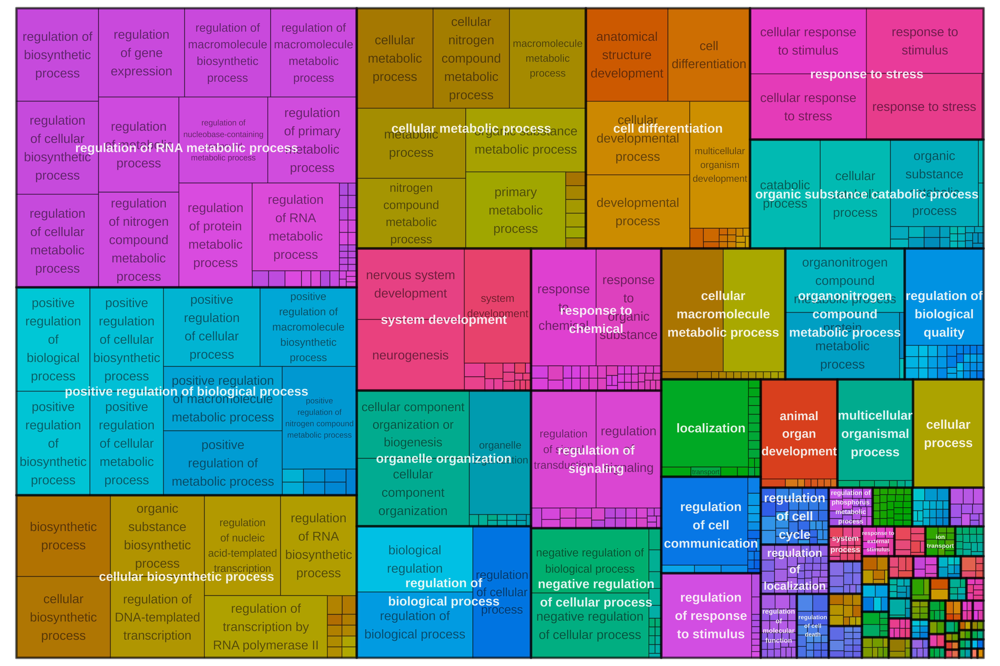
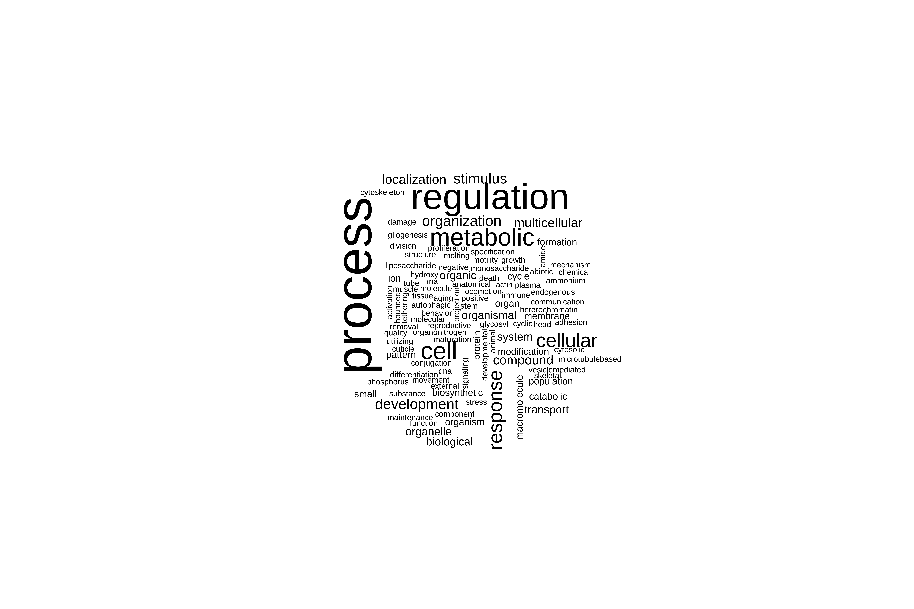

# BLAST
Sarah Tanja
2025-06-17

# Background

We identified 44 genes that were broadly impacted by leachate. Here we
want to know what those genes do! Those 44 genes grouped in

Why is goseq different from other enrichment tools? Typical enrichment
methods (like Fisher’s exact test or hypergeometric tests) assume that
every gene has an equal probability of being selected as a DEG. But in
RNA-Seq longer genes are more likely to be detected as DEGs just because
they accumulate more reads. `goseq` corrects for this bias.

## Inputs

- `LRT_significant_genes_combined_wald.csv` A dataframe of the 12 genes
  and their LRT and Wald test statistics
- functional annotation (version 3) from:
  http://cyanophora.rutgers.edu/montipora/Montipora_capitata_HIv3.genes.EggNog_results.txt.gz
  (EggNog)
- functional annotation
  http://cyanophora.rutgers.edu/montipora/Montipora_capitata_HIv3.genes.KEGG_results.txt.gz
  (KEGG)

## Outputs

# Setup

## Install packages

``` r
if ("Biostrings" %in% rownames(installed.packages()) == 'FALSE') install.packages('Biostrings')
if ("tidyverse" %in% rownames(installed.packages()) == 'FALSE') install.packages('tidyverse')
if ("goseq" %in% rownames(installed.packages()) == 'FALSE') install.packages('goseq')
```

``` r
if (!require("BiocManager", quietly = TRUE))
    install.packages("BiocManager")
BiocManager::install("GenomicRanges")
BiocManager::install("goseq")
BiocManager::install("GO.db")
BiocManager::install("rrvgo")
BiocManager::install("org.Ce.eg.db") # c.elegens genome-wide annotation
```

## Load packages

``` r
library(GenomicRanges)
library(Biostrings)
library(goseq)
library(rrvgo)
library(org.Ce.eg.db)
library(GO.db)
library(tidyverse)
```

## Read in gene lists and counts

``` r
all_genes <- read.csv("../../output/06_deg/interactions/all_genes.csv")
sig_genes <- read.csv("../../output/06_deg/interactions/sig_genes.csv")
sig_counts <- read.csv("../../output/06_deg/interactions/sig_counts.csv", row.names="gene_id", check.names = FALSE)
```

## Import fasta

``` r
# Load your transcriptome
all_seqs <- readDNAStringSet("../../input/genome/Montipora_capitata_HIv3.assembly.fasta")  

# Filter for the 44 significant interaction genes
sig_seqs <- all_seqs[names(all_seqs) %in% sig_genes]

# Save to new FASTA file
writeXStringSet(sig_seqs, "../../output/07_go/significant_genes.fasta")
```

## Download annotation & enrichment files

``` bash
cd ../../input/annotations

wget http://cyanophora.rutgers.edu/montipora/Montipora_capitata_HIv3.genes.EggNog_results.txt.gz
wget http://cyanophora.rutgers.edu/montipora/Montipora_capitata_HIv3.genes.KEGG_results.txt.gz
```

Unzip

``` bash
cd ../../input/annotations
gunzip *.gz
```

## Import to R environment

``` r
# Read in the file (it will include "#query" as a column name)
EggNog_anno <- read_tsv("../../input/annotations/Montipora_capitata_HIv3.genes.EggNog_results.txt")
```

rename “\#query” to `gene_id`

``` r
EggNog_anno <- EggNog_anno %>%
  rename(gene_id="#query")

nrow(EggNog_anno)
```

    [1] 24072

``` r
names(EggNog_anno)
```

     [1] "gene_id"        "seed_ortholog"  "evalue"         "score"         
     [5] "eggNOG_OGs"     "max_annot_lvl"  "COG_category"   "Description"   
     [9] "Preferred_name" "GOs"            "EC"             "KEGG_ko"       
    [13] "KEGG_Pathway"   "KEGG_Module"    "KEGG_Reaction"  "KEGG_rclass"   
    [17] "BRITE"          "KEGG_TC"        "CAZy"           "BiGG_Reaction" 
    [21] "PFAMs"         

> This functional annotation has 24,072 genes. This is 44% of total
> protein predicted genes described in the publication associated with
> this annotation.
> https://academic.oup.com/gigascience/article/doi/10.1093/gigascience/giac098/6815755

# Annotate significant genes

Match up genes in sig_genes dataframe to annotation dataframe

``` r
sig_genes_anno <- inner_join(sig_genes, EggNog_anno, by = "gene_id")

length(sig_genes_anno)
```

    [1] 34

> [!NOTE]
>
> 34 of the 44 significant genes were annotated! The annotation file
> `sig_genes_anno` dataframe now only contains genes that were
> significant and that have annotation information.

Get gene length information.

``` r
#import file
gff <- rtracklayer::import("../../input/genome/Montipora_capitata_HIv3.genes_fixed.gff3") #if this doesn't work, restart R and try again 

transcripts <- subset(gff, type == "transcript") #keep only transcripts 

transcripts_gr <- makeGRangesFromDataFrame(transcripts, keep.extra.columns=TRUE) #extract length information

transcript_lengths <- width(transcripts_gr) #isolate length of each gene

gene_id <- transcripts_gr$ID #extract list of gene id 

lengths <- cbind(gene_id, transcript_lengths)

lengths <- as.data.frame(lengths) #convert to data frame
```

Add in length to the annotation file
(`sig_genes_anno$transcript_lengths`).

``` r
sig_genes_anno <- sig_genes_anno %>% left_join(lengths, by = "gene_id")
```

Format GO terms to remove dashes and quotes.

``` r
#remove dashes, remove quotes from columns and separate by semicolons (replace , with ;) in KEGG_ko, KEGG_pathway, and Annotation.GO.ID columns
head(sig_genes_anno$GOs)
```

    [1] "GO:0000166,GO:0000323,GO:0001775,GO:0001878,GO:0002252,GO:0002263,GO:0002274,GO:0002275,GO:0002283,GO:0002366,GO:0002376,GO:0002443,GO:0002444,GO:0002446,GO:0002576,GO:0003008,GO:0003013,GO:0003674,GO:0003824,GO:0004128,GO:0005488,GO:0005575,GO:0005576,GO:0005622,GO:0005623,GO:0005737,GO:0005739,GO:0005740,GO:0005741,GO:0005764,GO:0005766,GO:0005773,GO:0005775,GO:0005783,GO:0005789,GO:0005794,GO:0005798,GO:0005811,GO:0005829,GO:0005833,GO:0005886,GO:0005975,GO:0005996,GO:0006082,GO:0006732,GO:0006766,GO:0006767,GO:0006810,GO:0006811,GO:0006820,GO:0006887,GO:0006890,GO:0006955,GO:0008015,GO:0008144,GO:0008150,GO:0008152,GO:0009605,GO:0009607,GO:0009620,GO:0009987,GO:0010883,GO:0012505,GO:0012506,GO:0015701,GO:0015711,GO:0016020,GO:0016192,GO:0016208,GO:0016491,GO:0016651,GO:0016653,GO:0017076,GO:0019752,GO:0019852,GO:0019867,GO:0030117,GO:0030120,GO:0030126,GO:0030135,GO:0030137,GO:0030141,GO:0030554,GO:0030659,GO:0030660,GO:0030662,GO:0030663,GO:0030667,GO:0031090,GO:0031091,GO:0031092,GO:0031410,GO:0031966,GO:0031967,GO:0031968,GO:0031974,GO:0031975,GO:0031982,GO:0031983,GO:0031984,GO:0032501,GO:0032553,GO:0032555,GO:0032559,GO:0032879,GO:0032940,GO:0032991,GO:0034774,GO:0035578,GO:0036094,GO:0036230,GO:0042119,GO:0042175,GO:0042582,GO:0043167,GO:0043168,GO:0043169,GO:0043207,GO:0043226,GO:0043227,GO:0043228,GO:0043229,GO:0043231,GO:0043232,GO:0043233,GO:0043299,GO:0043312,GO:0043436,GO:0043531,GO:0044237,GO:0044238,GO:0044281,GO:0044422,GO:0044424,GO:0044425,GO:0044429,GO:0044431,GO:0044432,GO:0044433,GO:0044437,GO:0044444,GO:0044445,GO:0044446,GO:0044464,GO:0045055,GO:0045321,GO:0046903,GO:0048037,GO:0048193,GO:0048475,GO:0050660,GO:0050662,GO:0050789,GO:0050896,GO:0051179,GO:0051186,GO:0051234,GO:0051287,GO:0051704,GO:0051707,GO:0055114,GO:0060205,GO:0065007,GO:0065008,GO:0070013,GO:0071702,GO:0071704,GO:0071944,GO:0071949,GO:0097159,GO:0097367,GO:0097708,GO:0098588,GO:0098796,GO:0098805,GO:0098827,GO:0099503,GO:1901265,GO:1901363,GO:1905952"
    [2] "GO:0000724,GO:0000725,GO:0000733,GO:0003674,GO:0003676,GO:0003677,GO:0003678,GO:0003824,GO:0004003,GO:0004386,GO:0005488,GO:0005575,GO:0005622,GO:0005623,GO:0005634,GO:0005654,GO:0005694,GO:0005737,GO:0006139,GO:0006259,GO:0006281,GO:0006302,GO:0006310,GO:0006725,GO:0006807,GO:0006950,GO:0006974,GO:0006996,GO:0008026,GO:0008094,GO:0008150,GO:0008152,GO:0009378,GO:0009987,GO:0016043,GO:0016462,GO:0016787,GO:0016817,GO:0016818,GO:0016887,GO:0017111,GO:0031974,GO:0031981,GO:0032392,GO:0032508,GO:0033554,GO:0034641,GO:0036310,GO:0042623,GO:0043138,GO:0043140,GO:0043170,GO:0043226,GO:0043227,GO:0043228,GO:0043229,GO:0043231,GO:0043232,GO:0043233,GO:0044237,GO:0044238,GO:0044260,GO:0044422,GO:0044424,GO:0044428,GO:0044446,GO:0044464,GO:0046483,GO:0050896,GO:0051276,GO:0051716,GO:0070013,GO:0070035,GO:0071103,GO:0071704,GO:0071840,GO:0090304,GO:0097159,GO:0097617,GO:0140097,GO:1901360,GO:1901363"                                                                                                                                                                                                                                                                                                                                                                                                                                                                                                                                                                                                                                                                                                                                                                                                                                                                                                                                                                                                                                                                                                                      
    [3] "-"                                                                                                                                                                                                                                                                                                                                                                                                                                                                                                                                                                                                                                                                                                                                                                                                                                                                                                                                                                                                                                                                                                                                                                                                                                                                                                                                                                                                                                                                                                                                                                                                                                                                                                                                                                                                                                                                                                                                                                                                                                                          
    [4] "GO:0003674,GO:0003824,GO:0004518,GO:0004519,GO:0004521,GO:0004523,GO:0004540,GO:0005575,GO:0005622,GO:0005623,GO:0005634,GO:0005654,GO:0005737,GO:0005829,GO:0006139,GO:0006259,GO:0006260,GO:0006261,GO:0006271,GO:0006273,GO:0006281,GO:0006298,GO:0006401,GO:0006725,GO:0006807,GO:0006950,GO:0006974,GO:0008150,GO:0008152,GO:0009056,GO:0009057,GO:0009058,GO:0009059,GO:0009987,GO:0016070,GO:0016787,GO:0016788,GO:0016891,GO:0016893,GO:0019439,GO:0022616,GO:0031974,GO:0031981,GO:0032299,GO:0032991,GO:0033554,GO:0033567,GO:0034641,GO:0034645,GO:0034655,GO:0043137,GO:0043170,GO:0043226,GO:0043227,GO:0043229,GO:0043231,GO:0043233,GO:0044237,GO:0044238,GO:0044248,GO:0044249,GO:0044260,GO:0044265,GO:0044270,GO:0044422,GO:0044424,GO:0044428,GO:0044444,GO:0044446,GO:0044464,GO:0046483,GO:0046700,GO:0050896,GO:0051716,GO:0070013,GO:0071704,GO:0090304,GO:0090305,GO:0090501,GO:0090502,GO:0140098,GO:1901360,GO:1901361,GO:1901575,GO:1901576"                                                                                                                                                                                                                                                                                                                                                                                                                                                                                                                                                                                                                                                                                                                                                                                                                                                                                                                                                                                                                                                                                     
    [5] "GO:0003674,GO:0003824,GO:0004175,GO:0004222,GO:0005575,GO:0005622,GO:0005623,GO:0005737,GO:0005739,GO:0005740,GO:0005758,GO:0006508,GO:0006518,GO:0006807,GO:0008150,GO:0008152,GO:0008233,GO:0008237,GO:0009987,GO:0016787,GO:0019538,GO:0031967,GO:0031970,GO:0031974,GO:0031975,GO:0034641,GO:0043170,GO:0043226,GO:0043227,GO:0043229,GO:0043231,GO:0043233,GO:0043603,GO:0044237,GO:0044238,GO:0044422,GO:0044424,GO:0044429,GO:0044444,GO:0044446,GO:0044464,GO:0070011,GO:0070013,GO:0071704,GO:0140096,GO:1901564"                                                                                                                                                                                                                                                                                                                                                                                                                                                                                                                                                                                                                                                                                                                                                                                                                                                                                                                                                                                                                                                                                                                                                                                                                                                                                                                                                                                                                                                                                                                                  
    [6] "-"                                                                                                                                                                                                                                                                                                                                                                                                                                                                                                                                                                                                                                                                                                                                                                                                                                                                                                                                                                                                                                                                                                                                                                                                                                                                                                                                                                                                                                                                                                                                                                                                                                                                                                                                                                                                                                                                                                                                                                                                                                                          

``` r
sig_genes_anno$GOs <- gsub(",", ";", sig_genes_anno$GOs)
sig_genes_anno$GOs <- gsub('"', "", sig_genes_anno$GOs)
sig_genes_anno$GOs <- gsub("-", NA, sig_genes_anno$GOs)
```

# Conduct functional enrichment

Conduct functional enrichment using goseq and
[rrvgo](https://www.bioconductor.org/packages/release/bioc/vignettes/rrvgo/inst/doc/rrvgo.html).
Compare against all genes detected in the dataset that we have
annotation information for.

Conduct at biological process level. Filter for adjusted p-value \<0.05.

``` r
# Define your DEG list — the genes you're testing
ID.vector <- sig_genes_anno$gene_id  # Replace with your actual gene vector


# All genes detected in the dataset with annotation info
ALL.vector <- all_genes$gene_id # gene_ids for all 12565 genes that we used to make our DESeq2 object
ALL.vector <- ALL.vector[ALL.vector %in% EggNog_anno$gene_id] #filtered down to only genes that are annotated

length(ALL.vector)
```

    [1] 9563

> [!NOTE]
>
> 9563 out of the 12564 genes in our dataset are annotated

``` r
lengths_anno <- lengths %>% 
  filter(gene_id %in% all_genes$gene_id) %>% 
  filter(gene_id %in% EggNog_anno$gene_id)

LENGTH.vector <- as.integer(lengths_anno$transcript_length)
names(LENGTH.vector) <- ALL.vector  # Needed for bias correction

# Gene to GO term mapping
GO.terms <- sig_genes_anno %>%
  dplyr::select(gene_id, GOs)

# Format GO terms to one term per row
split <- strsplit(as.character(GO.terms$GOs), ";")
split2 <- data.frame(
  gene = rep.int(GO.terms$gene, sapply(split, length)),
  GOs = unlist(split)
)

GO.terms <- split2

# Construct named gene vector: 1 = DEG, 0 = not DEG
gene.vector <- as.integer(ALL.vector %in% ID.vector)
names(gene.vector) <- ALL.vector

# Null probability weighting function (bias for gene length)
# nullp is a function from nadiadavidson/goseq
pwf <- nullp(gene.vector, bias.data = LENGTH.vector)
```


About goseq() command:

| Argument                       | Meaning                                                                                                                                                      |
|--------------------------------|--------------------------------------------------------------------------------------------------------------------------------------------------------------|
| `pwf`                          | A **probability weighting function** object from `nullp()`. It contains the DEG status of all genes (1 = DEG, 0 = not DEG), plus gene length bias info.      |
| `gene2cat`                     | A data frame or list mapping **genes to functional categories** (like GO terms). In your case, it’s a long-format table of gene-GO pairs.                    |
| `test.cats = "GO:BP"`          | This limits the enrichment to only **biological process** GO terms (you could also use `"GO:MF"` or `"GO:CC"` for molecular function or cellular component). |
| `method = "Wallenius"`         | This uses the **Wallenius noncentral hypergeometric distribution**, which accounts for sampling bias (like gene length).                                     |
| `use_genes_without_cat = TRUE` | Allows the method to consider genes that **do not have a GO annotation** (prevents them from being excluded by default).                                     |

`goseq()` returns a data frame where each row is a GO term, with:

- The GO ID

- Category (BP, MF, or CC)

- Over-representation p-value (for DEGs)

- Under-representation p-value (less commonly used)

- Number of DEGs in that GO term

- Total number of genes in that GO term

- Other metadata (like GO term name)

## GO enrichment

``` r
# Run GO enrichment for biological process terms
GO.bp <- goseq(
  pwf,
  gene2cat = GO.terms,
  test.cats = c("GO:BP"),
  method = "Wallenius",
  use_genes_without_cat = TRUE
)

# Format and filter results
GO.bp <- GO.bp %>% 
  arrange(over_represented_pvalue)

# Use the Benjamini-Hochberg method to control false discovery rate 
GO.bp$bh_adjust <- p.adjust(GO.bp$over_represented_pvalue, method = "BH")

GO.bp <- GO.bp %>%
  filter(bh_adjust < 0.05) %>%
  arrange(ontology, bh_adjust)

# Optional: write to file
write_csv(GO.bp, file = "../../output/07_go/functional_enrichment_biological_process_goseq.csv")
```

## Reduce redundancy

What is a semantic similarity matrix? \>Calculating the similarity
matrix and reducing GO terms First step is to get the similarity matrix
between terms. The function calculateSimMatrix takes a list of GO terms
for which the semantic simlarity is to be calculated, an OrgDb object
for an organism, the ontology of interest and the method to calculate
the similarity scores.

> NOTE:rrvgo uses the similarity between pairs of terms to compute a
> distance matrix, defined as (1-simMatrix). The terms are then
> hierarchically clustered using complete linkage, and the tree is cut
> at the desired threshold, picking the term with the highest score as
> the representative of each group. Therefore, higher thresholds lead to
> fewer groups, and the threshold should be read as the minimum
> similarity between group representatives.

> If the organism is not supported in Bioconductor, you can still build
> your own OrgDb object usign the AnnotationForge package and rendering
> the necessary data for semantic similarity using the GOSemSim package
> with:

> `my_new_fancy_orgdb_object <- 'org.Zz.eg.db'`
> `hsGO <- GOSemSim::godata(my_new_fancy_orgdb_object, ont="MF")`

\# Create named scores vector: -log10 adjusted p-values

scores \<- setNames(-log10(GO_BP\$bh_adjust), GO_BP\$category)

``` r
# Filter for biological process terms with valid p-values
GO_BP <- GO.bp %>%
  filter(ontology == "BP") %>%
  filter(!is.na(bh_adjust)) %>%
  arrange(bh_adjust)

# Calculate semantic similarity matrix
simMatrix <- calculateSimMatrix(
  GO_BP$category, # the column of go terms
  orgdb="org.Ce.eg.db", #c. elegans database
  ont = "BP",
  method = "Rel"
)
```

Create named scores vector.

::: callout-caution The first time I ran this as:
`scores <- setNames(-log10(GO_BP$bh_adjust), GO_BP$category)` but some
of the bh_adjust values are ~0, and the -log10 of 0 is Inf. This messes
with interpretation and visualization down the line, so instead we
generate the scores using `.Machine$double.xmin`, which is
`~2.225074e-308`, the smallest positive double in R. `pmax()` replaces
any 0 with that minimum before transforming it with `-log10()`.

``` r
# Create named scores vector
scores <- setNames(
  -log10(pmax(GO_BP$bh_adjust, .Machine$double.xmin)),
  GO_BP$category
)

# Reduce GO terms
reducedTerms <- reduceSimMatrix(
  simMatrix,
  scores = scores,
  threshold = 0.7,
  orgdb = "org.Ce.eg.db"
)


# Done! You can now save and plot
write_csv(reducedTerms, "../../output/07_go/reducedTerms.csv")

simMatrix_save <- simMatrix %>%
  as.data.frame() %>% 
  rownames_to_column(var = "GO")

write_csv(simMatrix_save, "../../output/07_go/simMatrix.csv")
```

# Plotting & interpretation

## Similarity matrix heatmap

Plot similarity matrix as a heatmap, with clustering of columns of rows
turned on by default (thus arranging together similar terms).

``` r
heatmapPlot(simMatrix,
            reducedTerms,
            annotateParent=TRUE,
            annotationLabel="parentTerm",
            fontsize=6)
```


## Scatter plot depicting groups and distance between terms

Plot GO terms as scattered points. Distances between points represent
the similarity between terms, and axes are the first 2 components of
applying a PCoA to the (di)similarity matrix. Size of the point
represents the provided scores or, in its absence, the number of genes
the GO term contains.

``` r
scatterPlot(simMatrix, reducedTerms)
```


## Treemap plot

Treemaps are space-filling visualization of hierarchical structures. The
terms are grouped (colored) based on their parent, and the space used by
the term is proportional to the score. Treemaps can help with the
interpretation of the summarized results and also comparing different
sets of GO terms.

``` r
treemapPlot(reducedTerms)
```



## Word cloud

Word clouds are visualizations which reproduce a text putting emphasis
to words which appear frequently in a text. They can help to identify
processes and functions that happen more commonly in a set of enriched
GO terms, as well as comparing between different sets.

``` r
wordcloudPlot(reducedTerms, min.freq=1, colors="black")
```



## Chord diagram
