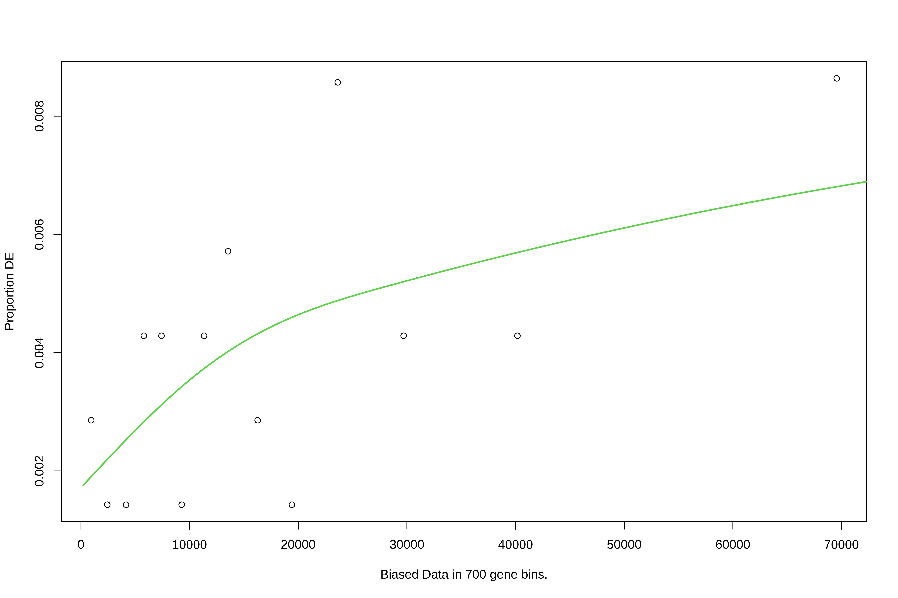
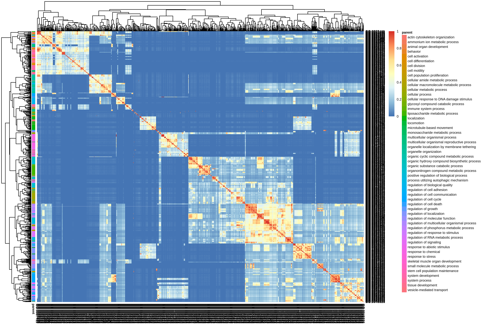
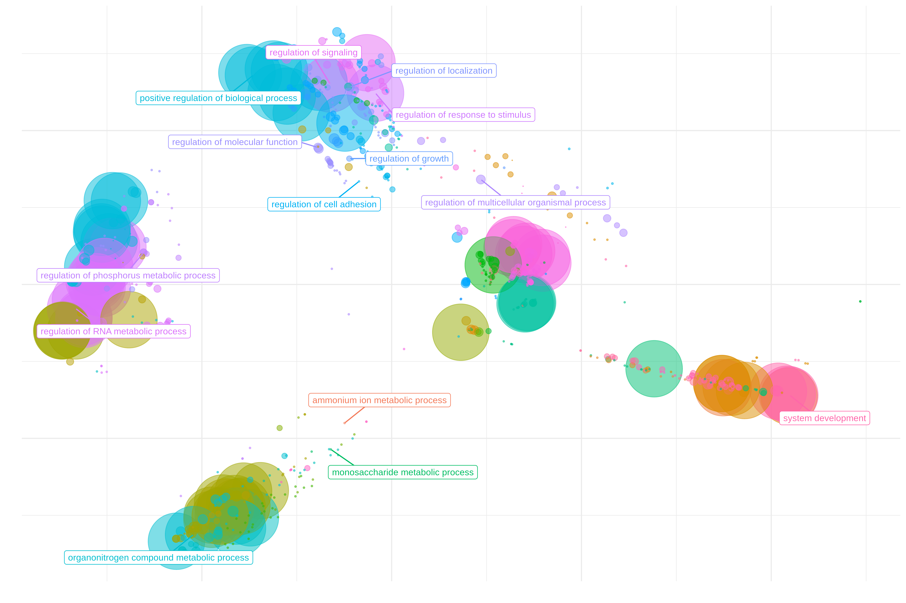
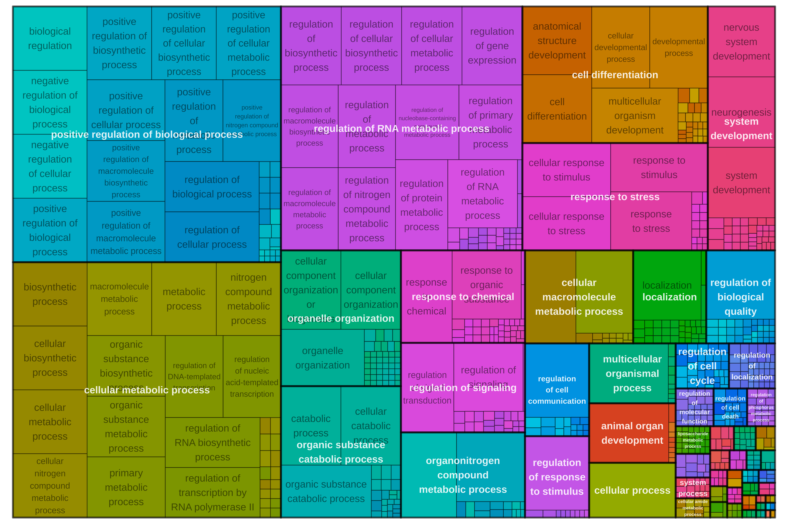
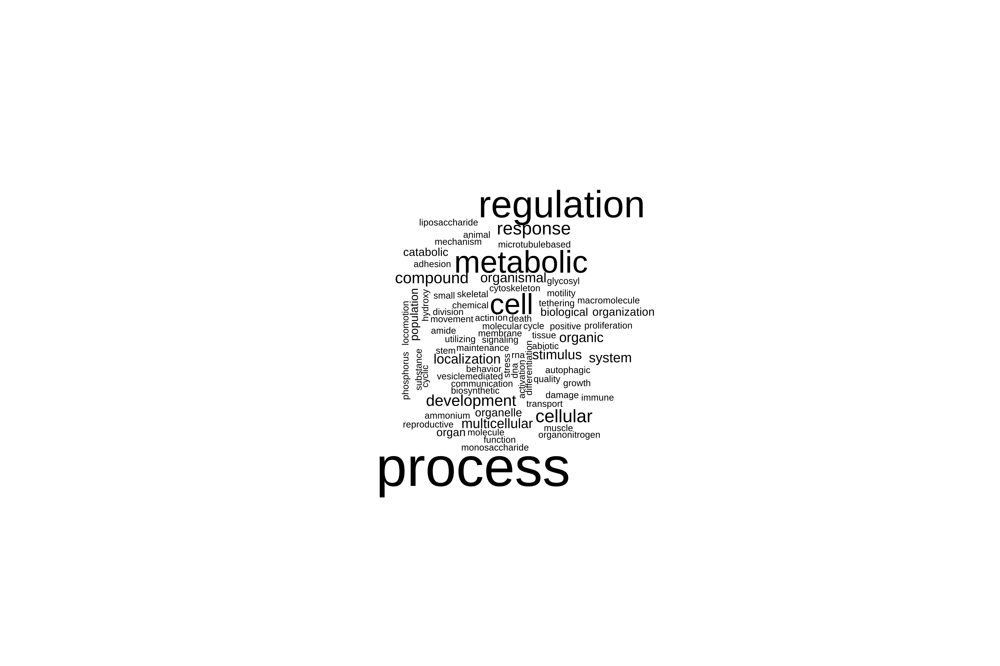
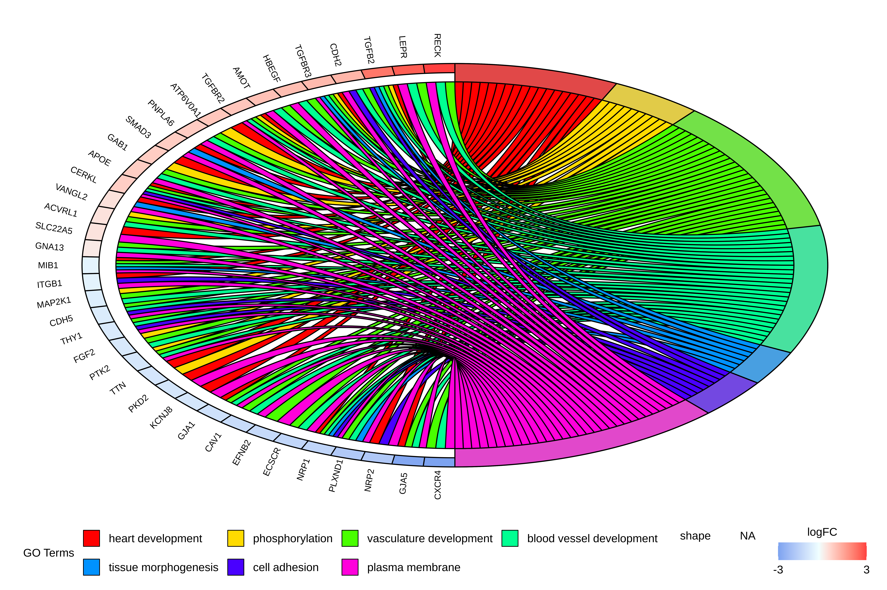

# Gene ontology (GO) term analysis
Sarah Tanja
2025-06-17

# Background

We identified 44 genes that were broadly impacted by leachate across all
stages (meaning transcript abundance of those genes were significantly
different in at least one dose of leachate compared to the control in at
least one stage). Here we want to know what those genes do!

We do this using the R package `goseq`. Why is `goseq` different from
other enrichment tools? Typical enrichment methods (like Fisher’s exact
test or hypergeometric tests) assume that every gene has an equal
probability of being selected as a DEG. But in RNA-Seq longer genes are
more likely to be detected as DEGs just because they accumulate more
reads. `goseq` corrects for this bias.

## Inputs

- `LRT_significant_genes_combined_wald.csv` A dataframe of the 44 genes
  and their LRT and Wald test statistics
- functional annotation:
  http://cyanophora.rutgers.edu/montipora/Montipora_capitata_HIv3.genes.EggNog_results.txt.gz
  (EggNog)
- functional annotation
  http://cyanophora.rutgers.edu/montipora/Montipora_capitata_HIv3.genes.KEGG_results.txt.gz
  (KEGG)

## Outputs

# Setup

## Install packages

``` r
if ("Biostrings" %in% rownames(installed.packages()) == 'FALSE') install.packages('Biostrings')
if ("tidyverse" %in% rownames(installed.packages()) == 'FALSE') install.packages('tidyverse')
if ("goseq" %in% rownames(installed.packages()) == 'FALSE') install.packages('goseq')
install.packages("GOplot")
```

``` r
if (!require("BiocManager", quietly = TRUE))
    install.packages("BiocManager")
BiocManager::install("GenomicRanges")
BiocManager::install("goseq")
BiocManager::install("GO.db")
BiocManager::install("rrvgo")
BiocManager::install("org.Ce.eg.db") # c.elegens genome-wide annotation
BiocManager::install("AnnotationForge")
BiocManager::install("GOSemSim")
```

## Load packages

``` r
library(GenomicRanges)
library(Biostrings)
library(goseq)
library(rrvgo)
library(org.Ce.eg.db)
library(GO.db)
library(GOplot)
library(AnnotationForge)
library(GOSemSim)
library(tidyverse)
```

## Read in gene lists and counts

``` r
all_genes <- read.csv("../../output/06_deg/interactions/all_genes.csv")
sig_genes <- read.csv("../../output/06_deg/interactions/sig_genes.csv")
sig_counts <- read.csv("../../output/06_deg/interactions/sig_counts.csv", row.names="gene_id", check.names = FALSE)
```

## Import fasta

``` r
# Load your transcriptome
all_seqs <- readDNAStringSet("../../input/genome/Montipora_capitata_HIv3.assembly.fasta")  

# Filter for the 44 significant interaction genes
sig_seqs <- all_seqs[names(all_seqs) %in% sig_genes]

# Save to new FASTA file
writeXStringSet(sig_seqs, "../../output/07_go/significant_genes.fasta")
```

## Download annotation & enrichment files

``` bash
cd ../../input/annotations

wget http://cyanophora.rutgers.edu/montipora/Montipora_capitata_HIv3.genes.EggNog_results.txt.gz
wget http://cyanophora.rutgers.edu/montipora/Montipora_capitata_HIv3.genes.KEGG_results.txt.gz
```

Unzip

``` bash
cd ../../input/annotations
gunzip *.gz
```

## Import to R environment

``` r
# Read in the file (it will include "#query" as a column name)
EggNog_anno <- read_tsv("../../input/annotations/Montipora_capitata_HIv3.genes.EggNog_results.txt")
```

rename “\#query” to `gene_id`

``` r
EggNog_anno <- EggNog_anno %>%
  rename(gene_id="#query")

nrow(EggNog_anno)
```

    [1] 24072

``` r
names(EggNog_anno)
```

     [1] "gene_id"        "seed_ortholog"  "evalue"         "score"         
     [5] "eggNOG_OGs"     "max_annot_lvl"  "COG_category"   "Description"   
     [9] "Preferred_name" "GOs"            "EC"             "KEGG_ko"       
    [13] "KEGG_Pathway"   "KEGG_Module"    "KEGG_Reaction"  "KEGG_rclass"   
    [17] "BRITE"          "KEGG_TC"        "CAZy"           "BiGG_Reaction" 
    [21] "PFAMs"         

> This functional annotation has 24,072 genes. This is 44% of total
> protein predicted genes described in the publication associated with
> this annotation.
> https://academic.oup.com/gigascience/article/doi/10.1093/gigascience/giac098/6815755

# Annotate significant genes

Match up genes in sig_genes dataframe to annotation dataframe

``` r
sig_genes_anno <- inner_join(sig_genes, EggNog_anno, by = "gene_id")

nrow(sig_genes_anno)
```

    [1] 37

> [!NOTE]
>
> 37 of the 44 significant genes were annotated! The annotation file
> `sig_genes_anno` dataframe now only contains genes that were
> significant and that have annotation information.

Get gene length information.

``` r
#import file
gff <- rtracklayer::import("../../input/genome/Montipora_capitata_HIv3.genes_fixed.gff3") #if this doesn't work, restart R and try again 

transcripts <- subset(gff, type == "transcript") #keep only transcripts 

transcripts_gr <- makeGRangesFromDataFrame(transcripts, keep.extra.columns=TRUE) #extract length information

transcript_lengths <- width(transcripts_gr) #isolate length of each gene

gene_id <- transcripts_gr$ID #extract list of gene id 

lengths <- cbind(gene_id, transcript_lengths)

lengths <- as.data.frame(lengths) #convert to data frame
```

Add in length to the annotation file
(`sig_genes_anno$transcript_lengths`).

``` r
sig_genes_anno <- sig_genes_anno %>% left_join(lengths, by = "gene_id")
```

Format GO terms to remove dashes and quotes.

``` r
#remove dashes, remove quotes from columns and separate by semicolons (replace , with ;) in KEGG_ko, KEGG_pathway, and Annotation.GO.ID columns
head(sig_genes_anno$GOs)
```

    [1] "GO:0000166,GO:0000323,GO:0001775,GO:0001878,GO:0002252,GO:0002263,GO:0002274,GO:0002275,GO:0002283,GO:0002366,GO:0002376,GO:0002443,GO:0002444,GO:0002446,GO:0002576,GO:0003008,GO:0003013,GO:0003674,GO:0003824,GO:0004128,GO:0005488,GO:0005575,GO:0005576,GO:0005622,GO:0005623,GO:0005737,GO:0005739,GO:0005740,GO:0005741,GO:0005764,GO:0005766,GO:0005773,GO:0005775,GO:0005783,GO:0005789,GO:0005794,GO:0005798,GO:0005811,GO:0005829,GO:0005833,GO:0005886,GO:0005975,GO:0005996,GO:0006082,GO:0006732,GO:0006766,GO:0006767,GO:0006810,GO:0006811,GO:0006820,GO:0006887,GO:0006890,GO:0006955,GO:0008015,GO:0008144,GO:0008150,GO:0008152,GO:0009605,GO:0009607,GO:0009620,GO:0009987,GO:0010883,GO:0012505,GO:0012506,GO:0015701,GO:0015711,GO:0016020,GO:0016192,GO:0016208,GO:0016491,GO:0016651,GO:0016653,GO:0017076,GO:0019752,GO:0019852,GO:0019867,GO:0030117,GO:0030120,GO:0030126,GO:0030135,GO:0030137,GO:0030141,GO:0030554,GO:0030659,GO:0030660,GO:0030662,GO:0030663,GO:0030667,GO:0031090,GO:0031091,GO:0031092,GO:0031410,GO:0031966,GO:0031967,GO:0031968,GO:0031974,GO:0031975,GO:0031982,GO:0031983,GO:0031984,GO:0032501,GO:0032553,GO:0032555,GO:0032559,GO:0032879,GO:0032940,GO:0032991,GO:0034774,GO:0035578,GO:0036094,GO:0036230,GO:0042119,GO:0042175,GO:0042582,GO:0043167,GO:0043168,GO:0043169,GO:0043207,GO:0043226,GO:0043227,GO:0043228,GO:0043229,GO:0043231,GO:0043232,GO:0043233,GO:0043299,GO:0043312,GO:0043436,GO:0043531,GO:0044237,GO:0044238,GO:0044281,GO:0044422,GO:0044424,GO:0044425,GO:0044429,GO:0044431,GO:0044432,GO:0044433,GO:0044437,GO:0044444,GO:0044445,GO:0044446,GO:0044464,GO:0045055,GO:0045321,GO:0046903,GO:0048037,GO:0048193,GO:0048475,GO:0050660,GO:0050662,GO:0050789,GO:0050896,GO:0051179,GO:0051186,GO:0051234,GO:0051287,GO:0051704,GO:0051707,GO:0055114,GO:0060205,GO:0065007,GO:0065008,GO:0070013,GO:0071702,GO:0071704,GO:0071944,GO:0071949,GO:0097159,GO:0097367,GO:0097708,GO:0098588,GO:0098796,GO:0098805,GO:0098827,GO:0099503,GO:1901265,GO:1901363,GO:1905952"
    [2] "GO:0000724,GO:0000725,GO:0000733,GO:0003674,GO:0003676,GO:0003677,GO:0003678,GO:0003824,GO:0004003,GO:0004386,GO:0005488,GO:0005575,GO:0005622,GO:0005623,GO:0005634,GO:0005654,GO:0005694,GO:0005737,GO:0006139,GO:0006259,GO:0006281,GO:0006302,GO:0006310,GO:0006725,GO:0006807,GO:0006950,GO:0006974,GO:0006996,GO:0008026,GO:0008094,GO:0008150,GO:0008152,GO:0009378,GO:0009987,GO:0016043,GO:0016462,GO:0016787,GO:0016817,GO:0016818,GO:0016887,GO:0017111,GO:0031974,GO:0031981,GO:0032392,GO:0032508,GO:0033554,GO:0034641,GO:0036310,GO:0042623,GO:0043138,GO:0043140,GO:0043170,GO:0043226,GO:0043227,GO:0043228,GO:0043229,GO:0043231,GO:0043232,GO:0043233,GO:0044237,GO:0044238,GO:0044260,GO:0044422,GO:0044424,GO:0044428,GO:0044446,GO:0044464,GO:0046483,GO:0050896,GO:0051276,GO:0051716,GO:0070013,GO:0070035,GO:0071103,GO:0071704,GO:0071840,GO:0090304,GO:0097159,GO:0097617,GO:0140097,GO:1901360,GO:1901363"                                                                                                                                                                                                                                                                                                                                                                                                                                                                                                                                                                                                                                                                                                                                                                                                                                                                                                                                                                                                                                                                                                                      
    [3] "-"                                                                                                                                                                                                                                                                                                                                                                                                                                                                                                                                                                                                                                                                                                                                                                                                                                                                                                                                                                                                                                                                                                                                                                                                                                                                                                                                                                                                                                                                                                                                                                                                                                                                                                                                                                                                                                                                                                                                                                                                                                                          
    [4] "GO:0003674,GO:0003824,GO:0004518,GO:0004519,GO:0004521,GO:0004523,GO:0004540,GO:0005575,GO:0005622,GO:0005623,GO:0005634,GO:0005654,GO:0005737,GO:0005829,GO:0006139,GO:0006259,GO:0006260,GO:0006261,GO:0006271,GO:0006273,GO:0006281,GO:0006298,GO:0006401,GO:0006725,GO:0006807,GO:0006950,GO:0006974,GO:0008150,GO:0008152,GO:0009056,GO:0009057,GO:0009058,GO:0009059,GO:0009987,GO:0016070,GO:0016787,GO:0016788,GO:0016891,GO:0016893,GO:0019439,GO:0022616,GO:0031974,GO:0031981,GO:0032299,GO:0032991,GO:0033554,GO:0033567,GO:0034641,GO:0034645,GO:0034655,GO:0043137,GO:0043170,GO:0043226,GO:0043227,GO:0043229,GO:0043231,GO:0043233,GO:0044237,GO:0044238,GO:0044248,GO:0044249,GO:0044260,GO:0044265,GO:0044270,GO:0044422,GO:0044424,GO:0044428,GO:0044444,GO:0044446,GO:0044464,GO:0046483,GO:0046700,GO:0050896,GO:0051716,GO:0070013,GO:0071704,GO:0090304,GO:0090305,GO:0090501,GO:0090502,GO:0140098,GO:1901360,GO:1901361,GO:1901575,GO:1901576"                                                                                                                                                                                                                                                                                                                                                                                                                                                                                                                                                                                                                                                                                                                                                                                                                                                                                                                                                                                                                                                                                     
    [5] "GO:0003674,GO:0003824,GO:0004175,GO:0004222,GO:0005575,GO:0005622,GO:0005623,GO:0005737,GO:0005739,GO:0005740,GO:0005758,GO:0006508,GO:0006518,GO:0006807,GO:0008150,GO:0008152,GO:0008233,GO:0008237,GO:0009987,GO:0016787,GO:0019538,GO:0031967,GO:0031970,GO:0031974,GO:0031975,GO:0034641,GO:0043170,GO:0043226,GO:0043227,GO:0043229,GO:0043231,GO:0043233,GO:0043603,GO:0044237,GO:0044238,GO:0044422,GO:0044424,GO:0044429,GO:0044444,GO:0044446,GO:0044464,GO:0070011,GO:0070013,GO:0071704,GO:0140096,GO:1901564"                                                                                                                                                                                                                                                                                                                                                                                                                                                                                                                                                                                                                                                                                                                                                                                                                                                                                                                                                                                                                                                                                                                                                                                                                                                                                                                                                                                                                                                                                                                                  
    [6] "-"                                                                                                                                                                                                                                                                                                                                                                                                                                                                                                                                                                                                                                                                                                                                                                                                                                                                                                                                                                                                                                                                                                                                                                                                                                                                                                                                                                                                                                                                                                                                                                                                                                                                                                                                                                                                                                                                                                                                                                                                                                                          

``` r
sig_genes_anno$GOs <- gsub(",", ";", sig_genes_anno$GOs)
sig_genes_anno$GOs <- gsub('"', "", sig_genes_anno$GOs)
sig_genes_anno$GOs <- gsub("-", NA, sig_genes_anno$GOs)
```

# Conduct functional enrichment

Conduct functional enrichment using goseq and
[rrvgo](https://www.bioconductor.org/packages/release/bioc/vignettes/rrvgo/inst/doc/rrvgo.html).
Compare against all genes detected in the dataset that we have
annotation information for.

Conduct at biological process level. Filter for adjusted p-value \<0.05.

``` r
# Define your DEG list — the genes you're testing
ID.vector <- sig_genes_anno$gene_id  # Replace with your actual gene vector


# All genes detected in the dataset with annotation info
ALL.vector <- all_genes$gene_id # gene_ids for all 12565 genes that we used to make our DESeq2 object
ALL.vector <- ALL.vector[ALL.vector %in% EggNog_anno$gene_id] #filtered down to only genes that are annotated

length(ALL.vector)
```

    [1] 9563

> [!NOTE]
>
> 9563 out of the 12564 genes in our dataset are annotated

``` r
lengths_anno <- lengths %>% 
  filter(gene_id %in% all_genes$gene_id) %>% 
  filter(gene_id %in% EggNog_anno$gene_id)

LENGTH.vector <- as.integer(lengths_anno$transcript_length)
names(LENGTH.vector) <- ALL.vector  # Needed for bias correction

# Gene to GO term mapping
GO.terms <- sig_genes_anno %>%
  dplyr::select(gene_id, GOs)

# Format GO terms to one term per row
split <- strsplit(as.character(GO.terms$GOs), ";")
split2 <- data.frame(
  gene = rep.int(GO.terms$gene, sapply(split, length)),
  GOs = unlist(split)
)

GO.terms <- split2

# Construct named gene vector: 1 = DEG, 0 = not DEG
gene.vector <- as.integer(ALL.vector %in% ID.vector)
names(gene.vector) <- ALL.vector

# Null probability weighting function (bias for gene length)
# nullp is a function from nadiadavidson/goseq
pwf <- nullp(gene.vector, bias.data = LENGTH.vector)
```



About goseq() command:

| Argument                       | Meaning                                                                                                                                                      |
|--------------------------------|--------------------------------------------------------------------------------------------------------------------------------------------------------------|
| `pwf`                          | A **probability weighting function** object from `nullp()`. It contains the DEG status of all genes (1 = DEG, 0 = not DEG), plus gene length bias info.      |
| `gene2cat`                     | A data frame or list mapping **genes to functional categories** (like GO terms). In your case, it’s a long-format table of gene-GO pairs.                    |
| `test.cats = "GO:BP"`          | This limits the enrichment to only **biological process** GO terms (you could also use `"GO:MF"` or `"GO:CC"` for molecular function or cellular component). |
| `method = "Wallenius"`         | This uses the **Wallenius noncentral hypergeometric distribution**, which accounts for sampling bias (like gene length).                                     |
| `use_genes_without_cat = TRUE` | Allows the method to consider genes that **do not have a GO annotation** (prevents them from being excluded by default).                                     |

`goseq()` returns a data frame where each row is a GO term, with:

- The GO ID

- Category (BP, MF, or CC)

- Over-representation p-value (for DEGs)

- Under-representation p-value (less commonly used)

- Number of DEGs in that GO term

- Total number of genes in that GO term

- Other metadata (like GO term name)

## GO enrichment

``` r
# Run GO enrichment for biological process terms
GO.bp <- goseq(
  pwf,
  gene2cat = GO.terms,
  test.cats = c("GO:BP"),
  method = "Wallenius",
  use_genes_without_cat = TRUE
)

# Format and filter results
GO.bp <- GO.bp %>% 
  arrange(over_represented_pvalue)

# Use the Benjamini-Hochberg method to control false discovery rate 
GO.bp$bh_adjust <- p.adjust(GO.bp$over_represented_pvalue, method = "BH")

GO.bp <- GO.bp %>%
  filter(bh_adjust < 0.05) %>%
  arrange(ontology, bh_adjust)

# Optional: write to file
write_csv(GO.bp, file = "../../output/07_go/functional_enrichment_biological_process_goseq.csv")
```

<div class="column-margin">

##### Why Does Controlling False Discovery Rate Matter in Enrichment Analysis?

The Benjamini-Hochberg procedure controls the proportion of false
positives among all rejected hypotheses, which is especially important
in high-throughput data like gene ontology enrichment.

Controlling the false discovery rate (FDR) is critical in enrichment
analysis, especially when thousands of statistical tests are performed
simultaneously (e.g., testing many gene sets, pathways, or terms for
enrichment): - Multiple Comparisons Increase False Positives: In
enrichment analyses, each hypothesis test (such as whether a specific
gene set is enriched) carries a risk of yielding a false
positive—detecting significance where there is none. When testing
hundreds or thousands of hypotheses, the probability of encountering
several false positives increases dramatically. - FDR Balances Discovery
and Error: Unlike stricter corrections (e.g., Bonferroni), which often
result in missing true findings because they are overly conservative,
controlling FDR allows researchers to detect more significant results
while maintaining a specified proportion of false positives among all
significant findings. - Improves Interpretability of Results: In
practical biological applications, such as genomics and proteomics, FDR
control means that of all reported significant gene sets or pathways,
only a small, known proportion are expected to be false discoveries.
This provides confidence in the reported biological findings and
enhances reproducibility.

The adjusted p-values (bh_adjust) reflect the minimum FDR at which each
test can be called significant. Use these values to determine
significance by comparing them to your desired FDR threshold (e.g.,
0.05).

*Generated from ChatGPT on 09AUG2025*

</div>

## Reduce redundancy

What is a semantic similarity matrix?

> Calculating the similarity matrix and reducing GO terms First step is
> to get the similarity matrix between terms. The function
> calculateSimMatrix takes a list of GO terms for which the semantic
> simlarity is to be calculated, an OrgDb object for an organism, the
> ontology of interest and the method to calculate the similarity
> scores.

> NOTE:rrvgo uses the similarity between pairs of terms to compute a
> distance matrix, defined as (1-simMatrix). The terms are then
> hierarchically clustered using complete linkage, and the tree is cut
> at the desired threshold, picking the term with the highest score as
> the representative of each group. Therefore, higher thresholds lead to
> fewer groups, and the threshold should be read as the minimum
> similarity between group representatives.

``` r
# Filter for biological process terms with valid p-values
GO_BP <- GO.bp %>%
  filter(ontology == "BP") %>%
  filter(!is.na(bh_adjust)) %>%
  arrange(bh_adjust)

# Calculate semantic similarity matrix
simMatrix <- calculateSimMatrix(
  GO_BP$category, # the column of go terms
  orgdb="org.Ce.eg.db", #c. elegans database org.Ce.eg.db
  ont = "BP",
  method = "Rel"
)
```

Create named scores vector.

> [!CAUTION]
>
> The first time I ran this as:
> `scores <- setNames(-log10(GO_BP$bh_adjust), GO_BP$category)` but some
> of the bh_adjust values are ~0, and the -log10 of 0 is Inf. This
> messes with interpretation and visualization down the line, so instead
> we generate the scores using `.Machine$double.xmin`, which is
> `~2.225074e-308`, the smallest positive double in R. `pmax()` replaces
> any 0 with that minimum before transforming it with `-log10()`.

``` r
# Create named scores vector
scores <- setNames(
  -log10(pmax(GO_BP$bh_adjust, .Machine$double.xmin)),
  GO_BP$category
)

# Reduce GO terms
reducedTerms <- reduceSimMatrix(
  simMatrix,
  scores = scores,
  threshold = 0.8,
  orgdb = "org.Ce.eg.db"
)

# Done! You can now save and plot
write_csv(reducedTerms, "../../output/07_go/reducedTerms.csv")

simMatrix_save <- simMatrix %>%
  as.data.frame() %>% 
  rownames_to_column(var = "GO")

write_csv(simMatrix_save, "../../output/07_go/simMatrix.csv")
```

# Plotting & interpretation

[Using the rrvgo
package](https://bioconductor.org/packages/devel/bioc/vignettes/rrvgo/inst/doc/rrvgo.html)

## Similarity matrix heatmap

Plot similarity matrix as a heatmap, with clustering of columns of rows
turned on by default (thus arranging together similar terms).

``` r
heatmapPlot(simMatrix,
            reducedTerms,
            annotateParent=TRUE,
            annotationLabel="parentTerm",
            fontsize=6)
```



## Scatter plot depicting groups and distance between terms

Plot GO terms as scattered points. Distances between points represent
the similarity between terms, and axes are the first 2 components of
applying a PCoA to the (di)similarity matrix. Size of the point
represents the provided scores or, in its absence, the number of genes
the GO term contains.

``` r
scatterPlot(simMatrix, reducedTerms,
            onlyParents = FALSE,
            addLabel = TRUE)
```



I want a dataframe that groups my GO terms based on these 5 main
clusters displayed in this PCA. The scatterPlot uses a dimensionality
reduction (PCoA) approach to project GO terms into 2D space and then
visually groups the points into a smaller number of major clusters.
These visual clusters are typically broader groupings, which correspond
to higher-level semantic similarity rather than the narrow clusters from
the cut tree.A possible approach if you want to create a cluster
assignment dataframe matching the 5 visual clusters is to: - Extract the
2D coordinates from the scatterPlot dimensionality reduction output, -
Apply a clustering method on the 2D coordinates (e.g., k-means with
k=5), - Create a new dataframe linking each GO term to its visual
cluster. This approach aligns the clustering with the displayed
scatterPlot clusters rather than the original fine-grained clusters.

``` r
# Distance from similarity matrix
dist <- as.dist(1 - simMatrix)

# PCoA to 2 dimensions
coord <- cmdscale(dist, k = 2)

# Convert to dataframe with GO terms
df_coords <- data.frame(go = rownames(simMatrix), Dim1 = coord[,1], Dim2 = coord[,2])
```

Cluster the terms visually in 2D space Use k-means clustering on the 2D
coordinates with k = 5 (number of desired clusters).

``` r
set.seed(123)  # for reproducibility
clusters <- kmeans(df_coords[, c("Dim1", "Dim2")], centers = 5)
df_coords$cluster <- as.factor(clusters$cluster)
```

Combine cluster info with other GO term data Merge this dataframe with
your reducedTerms or other GO annotation information as needed.

``` r
final_df <- merge(df_coords, reducedTerms, by.x = "go", by.y = "go")
```

This dataframe `final_df` will now include each GO term, its 2D
coordinates used for visualization, and its assigned cluster
corresponding to the 5 major groups in the scatterPlot.

## Treemap plot

Treemaps are space-filling visualization of hierarchical structures. The
terms are grouped (colored) based on their parent, and the space used by
the term is proportional to the score. Treemaps can help with the
interpretation of the summarized results and also comparing different
sets of GO terms.

``` r
treemapPlot(reducedTerms)
```



## Word cloud

Word clouds are visualizations which reproduce a text putting emphasis
to words which appear frequently in a text. They can help to identify
processes and functions that happen more commonly in a set of enriched
GO terms, as well as comparing between different sets.

``` r
wordcloudPlot(reducedTerms, min.freq=1, colors="black")
```



## Chord diagram

Using
[GOplot](https://cran.r-project.org/web/packages/GOplot/vignettes/GOplot_vignette.html)

### Create circ object using `circle_dat()`

> `circle_dat()` takes two data frames as an input. The first one
> contains the results of the functional analysis and should have at
> least four columns (category, term, genes, adjusted p-value).
> Additionally, a data frame of the selected genes and their logFC is
> needed.

Data object for plotting needs two data frame inputs:

1.  **result** of functional analysis with
    1.  category: GO term annotation type (e.g., “BP”, “MF”, “CC”)
    2.  ID: GO term identifier (e.g., “GO:0008150”)
    3.  term: GO term description
    4.  adj_pval: the `bh_adjust` column from the GO enrichment analysis

> The significance of a term is indicated by the adjusted p-value
> (adj_pval). Terms with an adjusted p-value \< 0.05 are considered as
> **significantly enriched** and are more likely to provide reliable
> information.

`GO_BP` is the result of our functional analysis…

``` r
str(GO_BP)
```

    'data.frame':   997 obs. of  8 variables:
     $ category                : chr  "GO:0006355" "GO:0006357" "GO:0006807" "GO:0006950" ...
     $ over_represented_pvalue : num  0 0 0 0 0 0 0 0 0 0 ...
     $ under_represented_pvalue: num  1 1 1 1 1 1 1 1 1 1 ...
     $ numDEInCat              : int  7 6 12 7 8 8 6 22 14 5 ...
     $ numInCat                : int  7 6 12 7 8 8 6 22 14 5 ...
     $ term                    : chr  "regulation of DNA-templated transcription" "regulation of transcription by RNA polymerase II" "nitrogen compound metabolic process" "response to stress" ...
     $ ontology                : chr  "BP" "BP" "BP" "BP" ...
     $ bh_adjust               : num  0 0 0 0 0 0 0 0 0 0 ...

``` r
results_circ <- GO_BP %>% 
  rename(ID = category,
         category = ontology,
         adj_pval = bh_adjust,
         count = numInCat) %>% 
  select(category, ID, term, adj_pval, count)
```

And even though the vignette doesn’t say you need it, you need a column
of genes for each go term.

``` r
terms_circ <- GO.terms %>% 
  rename(ID = GOs,
         genes = gene)

str(terms_circ)
```

    'data.frame':   3191 obs. of  2 variables:
     $ genes: chr  "Montipora_capitata_HIv3___TS.g26493.t2a" "Montipora_capitata_HIv3___TS.g26493.t2a" "Montipora_capitata_HIv3___TS.g26493.t2a" "Montipora_capitata_HIv3___TS.g26493.t2a" ...
     $ ID   : chr  "GO:0000166" "GO:0000323" "GO:0001775" "GO:0001878" ...

``` r
unique(terms_circ$genes)
```

     [1] "Montipora_capitata_HIv3___TS.g26493.t2a"    
     [2] "Montipora_capitata_HIv3___RNAseq.g5198.t1"  
     [3] "Montipora_capitata_HIv3___TS.g28558.t3a"    
     [4] "Montipora_capitata_HIv3___RNAseq.g6929.t1"  
     [5] "Montipora_capitata_HIv3___RNAseq.g7017.t1"  
     [6] "Montipora_capitata_HIv3___TS.g42133.t1"     
     [7] "Montipora_capitata_HIv3___RNAseq.g10964.t1" 
     [8] "Montipora_capitata_HIv3___RNAseq.g10966.t1" 
     [9] "Montipora_capitata_HIv3___RNAseq.g10968.t1" 
    [10] "Montipora_capitata_HIv3___RNAseq.g11051.t1" 
    [11] "Montipora_capitata_HIv3___RNAseq.g11053.t1" 
    [12] "Montipora_capitata_HIv3___RNAseq.g11129.t1" 
    [13] "Montipora_capitata_HIv3___RNAseq.g11828.t1" 
    [14] "Montipora_capitata_HIv3___TS.g9507.t1"      
    [15] "Montipora_capitata_HIv3___TS.g9699.t2"      
    [16] "Montipora_capitata_HIv3___RNAseq.g40764.t1" 
    [17] "Montipora_capitata_HIv3___TS.g48661.t1"     
    [18] "Montipora_capitata_HIv3___TS.g50653.t2"     
    [19] "Montipora_capitata_HIv3___TS.g50862.t1"     
    [20] "Montipora_capitata_HIv3___RNAseq.g15050.t1" 
    [21] "Montipora_capitata_HIv3___TS.g45793.t1b"    
    [22] "Montipora_capitata_HIv3___RNAseq.g20279.t1" 
    [23] "Montipora_capitata_HIv3___RNAseq.g20824.t1a"
    [24] "Montipora_capitata_HIv3___RNAseq.g21373.t1" 
    [25] "Montipora_capitata_HIv3___RNAseq.g21376.t1" 
    [26] "Montipora_capitata_HIv3___RNAseq.g28195.t1" 
    [27] "Montipora_capitata_HIv3___RNAseq.g30158.t1" 
    [28] "Montipora_capitata_HIv3___TS.g15697.t1"     
    [29] "Montipora_capitata_HIv3___RNAseq.g47569.t1" 
    [30] "Montipora_capitata_HIv3___RNAseq.g49676.t1" 
    [31] "Montipora_capitata_HIv3___RNAseq.g39262.t1" 
    [32] "Montipora_capitata_HIv3___RNAseq.g39743.t1" 
    [33] "Montipora_capitata_HIv3___RNAseq.g15918.t2" 
    [34] "Montipora_capitata_HIv3___RNAseq.g18178.t1" 
    [35] "Montipora_capitata_HIv3___RNAseq.g35580.t1" 
    [36] "Montipora_capitata_HIv3___RNAseq.g7741.t1"  
    [37] "Montipora_capitata_HIv3___RNAseq.g12501.t1" 

So we have to join results_circ to terms_circ

``` r
go_circ <- results_circ %>%  
  full_join(terms_circ, by = "ID") %>% 
  select(category, ID, term, genes, adj_pval, count)

str(go_circ)
```

    'data.frame':   3191 obs. of  6 variables:
     $ category: chr  "BP" "BP" "BP" "BP" ...
     $ ID      : chr  "GO:0006355" "GO:0006355" "GO:0006355" "GO:0006355" ...
     $ term    : chr  "regulation of DNA-templated transcription" "regulation of DNA-templated transcription" "regulation of DNA-templated transcription" "regulation of DNA-templated transcription" ...
     $ genes   : chr  "Montipora_capitata_HIv3___RNAseq.g11129.t1" "Montipora_capitata_HIv3___RNAseq.g11828.t1" "Montipora_capitata_HIv3___TS.g50862.t1" "Montipora_capitata_HIv3___RNAseq.g15050.t1" ...
     $ adj_pval: num  0 0 0 0 0 0 0 0 0 0 ...
     $ count   : int  7 7 7 7 7 7 7 6 6 6 ...

``` r
unique(go_circ$genes)
```

     [1] "Montipora_capitata_HIv3___RNAseq.g11129.t1" 
     [2] "Montipora_capitata_HIv3___RNAseq.g11828.t1" 
     [3] "Montipora_capitata_HIv3___TS.g50862.t1"     
     [4] "Montipora_capitata_HIv3___RNAseq.g15050.t1" 
     [5] "Montipora_capitata_HIv3___RNAseq.g28195.t1" 
     [6] "Montipora_capitata_HIv3___RNAseq.g35580.t1" 
     [7] "Montipora_capitata_HIv3___RNAseq.g7741.t1"  
     [8] "Montipora_capitata_HIv3___RNAseq.g5198.t1"  
     [9] "Montipora_capitata_HIv3___RNAseq.g6929.t1"  
    [10] "Montipora_capitata_HIv3___RNAseq.g7017.t1"  
    [11] "Montipora_capitata_HIv3___RNAseq.g40764.t1" 
    [12] "Montipora_capitata_HIv3___TS.g48661.t1"     
    [13] "Montipora_capitata_HIv3___TS.g15697.t1"     
    [14] "Montipora_capitata_HIv3___RNAseq.g47569.t1" 
    [15] "Montipora_capitata_HIv3___RNAseq.g39262.t1" 
    [16] "Montipora_capitata_HIv3___RNAseq.g30158.t1" 
    [17] "Montipora_capitata_HIv3___TS.g45793.t1b"    
    [18] "Montipora_capitata_HIv3___RNAseq.g20279.t1" 
    [19] "Montipora_capitata_HIv3___RNAseq.g21376.t1" 
    [20] "Montipora_capitata_HIv3___TS.g26493.t2a"    
    [21] "Montipora_capitata_HIv3___RNAseq.g21373.t1" 
    [22] "Montipora_capitata_HIv3___RNAseq.g49676.t1" 
    [23] "Montipora_capitata_HIv3___TS.g28558.t3a"    
    [24] "Montipora_capitata_HIv3___TS.g42133.t1"     
    [25] "Montipora_capitata_HIv3___RNAseq.g10964.t1" 
    [26] "Montipora_capitata_HIv3___RNAseq.g10966.t1" 
    [27] "Montipora_capitata_HIv3___RNAseq.g10968.t1" 
    [28] "Montipora_capitata_HIv3___RNAseq.g11051.t1" 
    [29] "Montipora_capitata_HIv3___RNAseq.g11053.t1" 
    [30] "Montipora_capitata_HIv3___TS.g9507.t1"      
    [31] "Montipora_capitata_HIv3___TS.g9699.t2"      
    [32] "Montipora_capitata_HIv3___TS.g50653.t2"     
    [33] "Montipora_capitata_HIv3___RNAseq.g20824.t1a"
    [34] "Montipora_capitata_HIv3___RNAseq.g39743.t1" 
    [35] "Montipora_capitata_HIv3___RNAseq.g15918.t2" 
    [36] "Montipora_capitata_HIv3___RNAseq.g18178.t1" 
    [37] "Montipora_capitata_HIv3___RNAseq.g12501.t1" 

2.  list of selected **genes** and log2FC from a DESeq2 result
    1.  ID: (Your gene ID (use your long gene IDs directly))
    2.  log2FC: from one of the DESeq2 contrasts

> [!NOTE]
>
> The Log2FC will be displayed on the chord diagram, and you can add in
> additional values from other contrasts after the initial circ object
> is made. For the time being we’re going to select the early gastrula
> low contrast because it had the most DEGs

``` r
genes_circ <- sig_genes_anno %>% 
  select(ID = gene_id, 
         logFC = earlygastrula_low_log2FC)

str(genes_circ)
```

    'data.frame':   37 obs. of  2 variables:
     $ ID   : chr  "Montipora_capitata_HIv3___TS.g26493.t2a" "Montipora_capitata_HIv3___RNAseq.g5198.t1" "Montipora_capitata_HIv3___TS.g28558.t3a" "Montipora_capitata_HIv3___RNAseq.g6929.t1" ...
     $ logFC: num  -5.992 1.734 -0.934 -0.408 2.03 ...

The circle_dat() function will generate a count and a zscore column -
count: Number of genes per GO term - zscore: GO term z-score, typically
calculated as (number of upregulated genes minus downregulated
genes)/sqrt(count) for that term

> [!CAUTION]
>
> The `circle_dat()` function expects your gene ids to be named `genes`
> in your GO results dataframe and `ID` in your gene list dataframe…
> this is tricky, watch out!

The following code checks that the gene id column names are the same in
the two dataframes with differently named columns

``` r
length(intersect(go_circ$genes, genes_circ$ID))
```

    [1] 37

``` r
circ <- circle_dat(go_circ, genes_circ)
```

`circ` is the object that will now be used for plotting!

``` r
# circ from circle_dat()
str(circ)
```

    'data.frame':   3191 obs. of  8 variables:
     $ category: chr  "BP" "BP" "BP" "BP" ...
     $ ID      : chr  "GO:0006355" "GO:0006355" "GO:0006355" "GO:0006355" ...
     $ term    : chr  "regulation of DNA-templated transcription" "regulation of DNA-templated transcription" "regulation of DNA-templated transcription" "regulation of DNA-templated transcription" ...
     $ count   : int  1 1 1 1 1 1 1 1 1 1 ...
     $ genes   : chr  "MONTIPORA_CAPITATA_HIV3___RNASEQ.G11129.T1" "MONTIPORA_CAPITATA_HIV3___RNASEQ.G11828.T1" "MONTIPORA_CAPITATA_HIV3___TS.G50862.T1" "MONTIPORA_CAPITATA_HIV3___RNASEQ.G15050.T1" ...
     $ logFC   : num  -0.153 0.194 2.071 1.784 -0.863 ...
     $ adj_pval: num  0 0 0 0 0 0 0 0 0 0 ...
     $ zscore  : num  -1 1 1 1 -1 1 -1 1 1 1 ...

> [!CAUTION]
>
> `circle_dat()` reformatted the gene ids to be all uppercase

``` r
summary(circ$count)
```

       Min. 1st Qu.  Median    Mean 3rd Qu.    Max. 
          1       1       1       1       1       1 

> [!CAUTION]
>
> Did not appear to calculate `count` correctly… it isn’t counting the
> genes per term but rather the number of times a term is assigned to a
> gene… which is always 1, This also throws off the zscore calculation
> which depends on count.

#### Or manually `circ_df`

``` r
circ_df <- go_circ %>%  
  full_join(genes_circ, by = c("genes" = "ID"))

str(circ_df)
```

    'data.frame':   3191 obs. of  7 variables:
     $ category: chr  "BP" "BP" "BP" "BP" ...
     $ ID      : chr  "GO:0006355" "GO:0006355" "GO:0006355" "GO:0006355" ...
     $ term    : chr  "regulation of DNA-templated transcription" "regulation of DNA-templated transcription" "regulation of DNA-templated transcription" "regulation of DNA-templated transcription" ...
     $ genes   : chr  "Montipora_capitata_HIv3___RNAseq.g11129.t1" "Montipora_capitata_HIv3___RNAseq.g11828.t1" "Montipora_capitata_HIv3___TS.g50862.t1" "Montipora_capitata_HIv3___RNAseq.g15050.t1" ...
     $ adj_pval: num  0 0 0 0 0 0 0 0 0 0 ...
     $ count   : int  7 7 7 7 7 7 7 6 6 6 ...
     $ logFC   : num  -0.153 0.194 2.071 1.784 -0.863 ...

Add zscore column

``` r
circ_df <- circ_df %>%
  group_by(ID) %>%
  mutate(zscore = (sum(logFC > 0) - sum(logFC < 0)) / sqrt(count)) %>%
  ungroup()
```

<div class="column-margin">

> [!NOTE]
>
> ### What does the zscore tell us?
>
> The z-score in your gene ontology (GO) analysis context is a
> statistical measure that helps indicate whether a GO term (biological
> process, molecular function, or cellular component) is more likely to
> be biologically increased or decreased based on the direction of gene
> expression changes.
>
> Specifically, your z-score formula $$
> zscore = \frac{(up - down)}{\sqrt(count)}
> $$ means:
>
> - “up” is the number of genes assigned to that GO term that are
>   up-regulated (logFC \> 0).
>
> - “down” is the number of genes assigned to that GO term that are
>   down-regulated (logFC \< 0).
>
> - “count” is the total number of genes assigned to that GO term.
>
> Interpretation of z-scores:
>
> A positive z-score indicates that the GO term has more up-regulated
> genes than down-regulated genes relative to its size and is therefore
> more likely to be biologically increased or activated.
>
> A negative z-score indicates more down-regulated genes and suggests
> that the GO term is more likely to be biologically decreased or
> inhibited.
>
> The magnitude of the z-score tells you how strong this trend is,
> adjusted for the total number of genes in that GO term.
>
> In your data, z-scores ranging approximately from +2 to -1.73 mean:
>
> Values toward +2 imply that some GO terms show a notable prevalence of
> up-regulated genes, suggesting activation or up-regulation of those
> biological functions or processes.
>
> Values near -1.73 indicate other GO terms have a moderate dominance of
> down-regulated genes, implying suppression or down-regulation.
>
> Typically, a z-score greater than 2 or less than -2 is considered
> significant evidence of activation or inhibition, respectively, though
> borderline values like yours still provide useful directional hints.
>
> This z-score metric provides a simple, normalized way to capture the
> overall regulatory direction of each GO term based on the gene
> expression data from your DESeq2 contrast, giving you an intuitive
> measure to prioritize and visualize the biological processes likely
> impacted in your dataset.
>
> Thus, in your chord diagram or other visualizations, z-score can be
> used to color or weight GO terms and gene links to quickly highlight
> activated vs. repressed functions.
>
> *Generated via perplexity AI on 15AUG2025*

</div>

``` r
# 4. Select and arrange columns to match GOplot 'circ' format
circ <- circ_df %>%
  select(category,
         ID,
         term,
         count,
         genes,
         logFC,
         adj_pval,
         zscore) %>% 
  as.data.frame()
```

### Select processes

``` r
process <- circ_df %>%
  group_by(term) %>% 
  select(term, count, adj_pval, zscore) %>% 
  distinct() %>% 
  arrange(count)

str(process)
```

    gropd_df [998 × 4] (S3: grouped_df/tbl_df/tbl/data.frame)
     $ term    : chr [1:998] "post-Golgi vesicle-mediated transport" "Golgi to endosome transport" "regulation of synaptic assembly at neuromuscular junction" "cytosolic transport" ...
     $ count   : int [1:998] 1 1 1 1 1 1 1 1 1 1 ...
     $ adj_pval: num [1:998] 0.00455 0.00455 0.00455 0.00455 0.00455 ...
     $ zscore  : num [1:998] 1 1 1 1 1 1 1 1 1 1 ...
     - attr(*, "groups")= tibble [998 × 2] (S3: tbl_df/tbl/data.frame)
      ..$ term : chr [1:998] "DNA conformation change" "DNA damage checkpoint signaling" "DNA damage response, signal transduction by p53 class mediator" "DNA damage response, signal transduction by p53 class mediator resulting in cell cycle arrest" ...
      ..$ .rows: list<int> [1:998] 
      .. ..$ : int 457
      .. ..$ : int 612
      .. ..$ : int 682
      .. ..$ : int 653
      .. ..$ : int 456
      .. ..$ : int 455
      .. ..$ : int 687
      .. ..$ : int 552
      .. ..$ : int 454
      .. ..$ : int 553
      .. ..$ : int 101
      .. ..$ : int 109
      .. ..$ : int 111
      .. ..$ : int 108
      .. ..$ : int 103
      .. ..$ : int 102
      .. ..$ : int 804
      .. ..$ : int 121
      .. ..$ : int 172
      .. ..$ : int 2
      .. ..$ : int 528
      .. ..$ : int 157
      .. ..$ : int 809
      .. ..$ : int 106
      .. ..$ : int 862
      .. ..$ : int 115
      .. ..$ : int 116
      .. ..$ : int 174
      .. ..$ : int 175
      .. ..$ : int 706
      .. ..$ : int 681
      .. ..$ : int 668
      .. ..$ : int 191
      .. ..$ : int 190
      .. ..$ : int 245
      .. ..$ : int 194
      .. ..$ : int 49
      .. ..$ : int 307
      .. ..$ : int 283
      .. ..$ : int 281
      .. ..$ : int 356
      .. ..$ : int 266
      .. ..$ : int 783
      .. ..$ : int 427
      .. ..$ : int 390
      .. ..$ : int 976
      .. ..$ : int 727
      .. ..$ : int 380
      .. ..$ : int 32
      .. ..$ : int 918
      .. ..$ : int 940
      .. ..$ : int 879
      .. ..$ : int 148
      .. ..$ : int 700
      .. ..$ : int 702
      .. ..$ : int 171
      .. ..$ : int 729
      .. ..$ : int 695
      .. ..$ : int 808
      .. ..$ : int 107
      .. ..$ : int 747
      .. ..$ : int 730
      .. ..$ : int 701
      .. ..$ : int 703
      .. ..$ : int 649
      .. ..$ : int 744
      .. ..$ : int 651
      .. ..$ : int 633
      .. ..$ : int 636
      .. ..$ : int 722
      .. ..$ : int 418
      .. ..$ : int 278
      .. ..$ : int 97
      .. ..$ : int 77
      .. ..$ : int 76
      .. ..$ : int 565
      .. ..$ : int 406
      .. ..$ : int 405
      .. ..$ : int 154
      .. ..$ : int 992
      .. ..$ : int 997
      .. ..$ : int 928
      .. ..$ : int 73
      .. ..$ : int 150
      .. ..$ : int 614
      .. ..$ : int 724
      .. ..$ : int 537
      .. ..$ : int 31
      .. ..$ : int 21
      .. ..$ : int 739
      .. ..$ : int 396
      .. ..$ : int 395
      .. ..$ : int 691
      .. ..$ : int 143
      .. ..$ : int 156
      .. ..$ : int 645
      .. ..$ : int 642
      .. ..$ : int 638
      .. ..$ : int 640
      .. .. [list output truncated]
      .. ..@ ptype: int(0) 
      ..- attr(*, ".drop")= logi TRUE

### Create binary matrix using `chord_dat()`

> [!CAUTION]
>
> `chord_dat()` expects the `genes =` to have genes in a column named
> `ID`

### Plot chord diagram

``` r
chord <- chord_dat(
  data = circ_df,
  process = c("regulation of RNA metabolic process", 
              "positive regulation of biological process", 
              "cellular metabolic process", 
              "response to stress", 
              "response to chemical"))

# Plot
GOChord(chord, gene.order = "logFC")
```


> [!NOTE]
>
> - Why no LogFC plotted?
> - Make gene names readable

> If the number of genes in your genes argument doesn’t exactly match
> the rows in data, or the number of processes in process doesn’t match
> the columns in data, you get subscript out of bounds.

``` r
# Load the included dataset
data(EC)

# Building the circ object
excirc <- circle_dat(EC$david, EC$genelist)

# Building the binary matrix
exchord <- chord_dat(excirc, EC$genes, EC$process)

GOChord(exchord, gene.order = "logFC")
```



> Therefore, you want to include more than one logFC value per gene. To
> adjust to this situation you should use the nlfc argument. It is a
> numeric value and it defines the number of logFC columns within your
> binary membership matrix. The default is ‘1’ assuming that most of the
> time you just have one contrast and one logFC value per gene.
