# Step 8: Multivariate Differential Gene Expression
Sarah Tanja
2024-12-02

- [Goals](#goals)
- [Install packages](#install-packages)
- [Load packages](#load-packages)
- [Import Gene Count Matrix (gcm)](#import-gene-count-matrix-gcm)
- [Import metadata](#import-metadata)
- [Filter and visualize read counts](#filter-and-visualize-read-counts)
  - [Plot distribution of unfiltered read counts across all
    samples](#plot-distribution-of-unfiltered-read-counts-across-all-samples)
  - [Distibution of normalized, filtered read
    counts](#distibution-of-normalized-filtered-read-counts)
- [MDS plot visualizing experimental
  factors](#mds-plot-visualizing-experimental-factors)
- [Non-linear effects](#non-linear-effects)
- [Plotting non-linear effects](#plotting-non-linear-effects)
- [Interactive effects](#interactive-effects)
  - [Interactive effects: edgeR](#interactive-effects-edger)
  - [Interactive effects: limma-Voom](#interactive-effects-limma-voom)
  - [](#section)
  - [Comparing test statistics: interactive
    effects](#comparing-test-statistics-interactive-effects)

# Goals

To follow the [MarineOmics Fitting Multifactorial Models of Differential
Expression](https://marineomics.github.io/DGE_comparison_v2.html)
walkthrough step-by-step with the gene count matrix from the
coral-embryo-leachate project.

In the tutorial, leachate is the environmental condition with

# Install packages

``` r
if (!require("BiocManager", quietly = TRUE)) install.packages("BiocManager")
BiocManager::install(c("DESeq2", "vsn", "edgeR", "arrayQualityMetrics"))
```

``` r
if ("tidyverse" %in% rownames(installed.packages()) == 'FALSE') install.packages('tidyverse')
if ("DESeq2" %in% rownames(installed.packages()) == 'FALSE') install.packages('DESeq2')
if ("edgeR" %in% rownames(installed.packages()) == 'FALSE') install.packages('edgeR')
if ("ape" %in% rownames(installed.packages()) == 'FALSE') install.packages('ape')
if ("vegan" %in% rownames(installed.packages()) == 'FALSE') install.packages('vegan')
if ("GGally" %in% rownames(installed.packages()) == 'FALSE') install.packages('GGally')
if ("arrayQualityMetrics" %in% rownames(installed.packages()) == 'FALSE') install.packages('arrayQualityMetrics')
if ("rgl" %in% rownames(installed.packages()) == 'FALSE') install.packages('rgl')
#if ("adegenet" %in% rownames(installed.packages()) == 'FALSE') install.packages('adegenet')
if ("MASS" %in% rownames(installed.packages()) == 'FALSE') install.packages('MASS')
if ("data.table" %in% rownames(installed.packages()) == 'FALSE') install.packages('data.table')
if ("plyr" %in% rownames(installed.packages()) == 'FALSE') install.packages('plyr')
if ("lmtest" %in% rownames(installed.packages()) == 'FALSE') install.packages('lmtest')
if ("reshape2" %in% rownames(installed.packages()) == 'FALSE') install.packages('reshape2')
if ("Rmisc" %in% rownames(installed.packages()) == 'FALSE') install.packages('Rmisc')
#if ("lmerTest" %in% rownames(installed.packages()) == 'FALSE') install.packages('lmerTest')
if ("statmod" %in% rownames(installed.packages()) == 'FALSE') install.packages('statmod')
if ("stringr" %in% rownames(installed.packages()) == 'FALSE') install.packages('stringr')
```

# Load packages

``` r
# Load packages
 
library(DESeq2)
library(edgeR)
library(tidyverse)
library(ape)
library(vegan)
library(GGally)
library(arrayQualityMetrics)
library(rgl)
#library(adegenet)
library(MASS)
library(data.table)
library(plyr)
library(lmtest)
library(reshape2)
library(Rmisc)
#library(lmerTest)
library(statmod)
library(stringr)
```

# Import Gene Count Matrix (gcm)

In this count matrix, each row represents a gene, each column a
sequenced RNA library, and the values give the estimated counts of
fragments that were assigned to the respective gene in each library by
`HISAT2`

- `check.names = FALSE` removed the ‘X’ from in front of sample id’s in
  the column headers

``` r
gcm <- read.csv("../output/05_count/gene_count_matrix.csv", row.names="gene_id", check.names = FALSE)
head(gcm)
```

                                              101112C14 101112C4 101112C9 101112H14
    Montipora_capitata_HIv3___RNAseq.g4581.t1       176      458      395       195
    Montipora_capitata_HIv3___RNAseq.g4582.t1      1137      380      934       882
    Montipora_capitata_HIv3___RNAseq.g4588.t1        11        0        0         4
    Montipora_capitata_HIv3___RNAseq.g4583.t1      2043      905     1848      1847
    Montipora_capitata_HIv3___RNAseq.g4584.t1      2641      452      706      1917
    Montipora_capitata_HIv3___TS.g26265.t1            0        0        0         0
                                              101112H4 101112H9 101112L14 101112L4
    Montipora_capitata_HIv3___RNAseq.g4581.t1      144      351       156      187
    Montipora_capitata_HIv3___RNAseq.g4582.t1      326     1337      1101      392
    Montipora_capitata_HIv3___RNAseq.g4588.t1        0        0         0        0
    Montipora_capitata_HIv3___RNAseq.g4583.t1      945     2087      1625     1039
    Montipora_capitata_HIv3___RNAseq.g4584.t1      266      625      2301      367
    Montipora_capitata_HIv3___TS.g26265.t1           0        0         0        0
                                              101112L9 101112M14 101112M4 101112M9
    Montipora_capitata_HIv3___RNAseq.g4581.t1      360       215      199      386
    Montipora_capitata_HIv3___RNAseq.g4582.t1     1195      1311      431     1076
    Montipora_capitata_HIv3___RNAseq.g4588.t1        0         0        0        0
    Montipora_capitata_HIv3___RNAseq.g4583.t1     2367      1875     1176     2230
    Montipora_capitata_HIv3___RNAseq.g4584.t1      668      1963      800      706
    Montipora_capitata_HIv3___TS.g26265.t1           0         2        0        0
                                              123C14 123C4 123C9 123H14 123H4 123H9
    Montipora_capitata_HIv3___RNAseq.g4581.t1     63   714   351    138   384   146
    Montipora_capitata_HIv3___RNAseq.g4582.t1    643   496  1064    927   378   864
    Montipora_capitata_HIv3___RNAseq.g4588.t1      0     0     0      0     0     0
    Montipora_capitata_HIv3___RNAseq.g4583.t1   1349  1591  1529   1377   648  1902
    Montipora_capitata_HIv3___RNAseq.g4584.t1   2724   703   648   3178   497   438
    Montipora_capitata_HIv3___TS.g26265.t1         0     0     6      1     0     0
                                              123L14 123L4 123L9 123M4 123M9
    Montipora_capitata_HIv3___RNAseq.g4581.t1    190   271   304   771   154
    Montipora_capitata_HIv3___RNAseq.g4582.t1    884   270   838   650   516
    Montipora_capitata_HIv3___RNAseq.g4588.t1      0     0     0     0     0
    Montipora_capitata_HIv3___RNAseq.g4583.t1   2007   630  1572  1258   892
    Montipora_capitata_HIv3___RNAseq.g4584.t1   1867   330   366   677   397
    Montipora_capitata_HIv3___TS.g26265.t1         0     0     0     0     0
                                              131415C14 131415C4 131415C9 131415H14
    Montipora_capitata_HIv3___RNAseq.g4581.t1       198      321      371       196
    Montipora_capitata_HIv3___RNAseq.g4582.t1      1184      712     1338      1314
    Montipora_capitata_HIv3___RNAseq.g4588.t1         0        2        0         0
    Montipora_capitata_HIv3___RNAseq.g4583.t1      2175     1667     2190      1932
    Montipora_capitata_HIv3___RNAseq.g4584.t1      1556      510      473      2267
    Montipora_capitata_HIv3___TS.g26265.t1            0        0        0         0
                                              131415H4 131415H9 131415L14 131415L4
    Montipora_capitata_HIv3___RNAseq.g4581.t1      221      410       170       24
    Montipora_capitata_HIv3___RNAseq.g4582.t1      382     1117      1167        0
    Montipora_capitata_HIv3___RNAseq.g4588.t1        0        0         0        0
    Montipora_capitata_HIv3___RNAseq.g4583.t1      716     2219      1817        0
    Montipora_capitata_HIv3___RNAseq.g4584.t1      334      326      2772        0
    Montipora_capitata_HIv3___TS.g26265.t1           0        0         0        0
                                              131415L9 131415M14 131415M4 131415M9
    Montipora_capitata_HIv3___RNAseq.g4581.t1      362       291      271      396
    Montipora_capitata_HIv3___RNAseq.g4582.t1     1500      1376      667     1383
    Montipora_capitata_HIv3___RNAseq.g4588.t1        0         0        0        0
    Montipora_capitata_HIv3___RNAseq.g4583.t1     2102      2108     1395     2314
    Montipora_capitata_HIv3___RNAseq.g4584.t1      534      2296      404      492
    Montipora_capitata_HIv3___TS.g26265.t1           0         0        1        0
                                              13M14 456C4 456H4 456H9 456L14 456L4
    Montipora_capitata_HIv3___RNAseq.g4581.t1    71   196   351   236    125    73
    Montipora_capitata_HIv3___RNAseq.g4582.t1   912   306   458  1301   1306   249
    Montipora_capitata_HIv3___RNAseq.g4588.t1     0     0     0     0      0     0
    Montipora_capitata_HIv3___RNAseq.g4583.t1  1639   651   987  1882   1882  1050
    Montipora_capitata_HIv3___RNAseq.g4584.t1  2194   291   547   488   1736   169
    Montipora_capitata_HIv3___TS.g26265.t1        0     0     0     0      1     0
                                              456L9 456M14 456M4 456M9 45C14 45C9
    Montipora_capitata_HIv3___RNAseq.g4581.t1   274    151   454   250    50  348
    Montipora_capitata_HIv3___RNAseq.g4582.t1  1105   1270   525   967   420  981
    Montipora_capitata_HIv3___RNAseq.g4588.t1     0      0     0     3     0    0
    Montipora_capitata_HIv3___RNAseq.g4583.t1  2506   1649   940  2005   703 2230
    Montipora_capitata_HIv3___RNAseq.g4584.t1   495   1698   522   595  1402  913
    Montipora_capitata_HIv3___TS.g26265.t1        0      0     0     0     0    0
                                              45H14 67C9 6C14 789C4 789H14 789H4
    Montipora_capitata_HIv3___RNAseq.g4581.t1   411  290  114     0    150   516
    Montipora_capitata_HIv3___RNAseq.g4582.t1   590  973 1022     0    862   628
    Montipora_capitata_HIv3___RNAseq.g4588.t1     0    0    0     1      0     0
    Montipora_capitata_HIv3___RNAseq.g4583.t1  1807 1995 1769   106   1633  1128
    Montipora_capitata_HIv3___RNAseq.g4584.t1  1021  310 1435     0   2783   963
    Montipora_capitata_HIv3___TS.g26265.t1        0    0    0     0      0     0
                                              789H9 789L14 789L4 789L9 789M14 789M4
    Montipora_capitata_HIv3___RNAseq.g4581.t1   332    168   148   409    150   461
    Montipora_capitata_HIv3___RNAseq.g4582.t1  1338   1027   445  1326    959   551
    Montipora_capitata_HIv3___RNAseq.g4588.t1     0      0     0     0      0     0
    Montipora_capitata_HIv3___RNAseq.g4583.t1  2429   1616   819  2344   1757  1111
    Montipora_capitata_HIv3___RNAseq.g4584.t1   783   2549   313   686   2913   906
    Montipora_capitata_HIv3___TS.g26265.t1        0      0     0     0      0     0
                                              7C14 89C14 89C9 89M9
    Montipora_capitata_HIv3___RNAseq.g4581.t1  208   235  273  230
    Montipora_capitata_HIv3___RNAseq.g4582.t1  711  1563 1349  823
    Montipora_capitata_HIv3___RNAseq.g4588.t1    0     0    0    0
    Montipora_capitata_HIv3___RNAseq.g4583.t1 1874  2623 2594 1646
    Montipora_capitata_HIv3___RNAseq.g4584.t1 1307  2195  778  624
    Montipora_capitata_HIv3___TS.g26265.t1       0     2    0    0

The count matrix should show counts of whole numbers (integers) … since
each column shows <int> as the data type we know that the counts are
already integers. Each column name represents a sample that is described
by parental crosses (the first string of numbers), the pollution
exposure (C, L, M, H), and the embryonic phase (4, 9, 14).

> [!NOTE]
>
> `gcm` is the unfiltered gene count matrix of all 63 samples

``` r
load("../output/07_exploration/gcm_filt_or.RData")
```

> [!NOTE]
>
> `gcm_filt_or` is the gene count matrix that has been filtered to
> remove low gene counts, and 2 outlier samples ( `131415L4` and `789C4`
> ) identified in “07.1_data_exploration”

# Import metadata

``` r
metadata <- read.csv("../metadata/metadata.csv")
head(metadata)
```

      sample_no sample_name parents group       treatment_group hpf embryonic_stage
    1         1   101112C14  101112   C14 earlygastrula_control  14   earlygastrula
    2         2    101112C4  101112    C4      cleavage_control   4        cleavage
    3         3    101112C9  101112    C9     prawnchip_control   9       prawnchip
    4         4   101112H14  101112   H14    earlygastrula_high  14   earlygastrula
    5         5    101112H4  101112    H4         cleavage_high   4        cleavage
    6         6    101112H9  101112    H9        prawnchip_high   9       prawnchip
      pvc_leachate_level hours_post_fertilization pvc_leachate_concentration_mg.L
    1            control                       14                               0
    2            control                        4                               0
    3            control                        9                               0
    4               high                       14                               1
    5               high                        4                               1
    6               high                        9                               1

``` r
metadata_or <- read.csv("../metadata/metadata_or.csv")
```

`metadata` is all 63 samples

`metadata_or` has the outliers removed, and contains info for 61 samples

The `treatment_group` variable represents the combined levels of an
experimental replicate across all variables (`embryonic_stage` +
`pvc_leachate_level`). The `group` variable represents the same, just
more concise.

Our minimum number of samples that have a unique treatment is 5…

Therefore, we will accept genes that are present in 5 of the samples
because we are hypothesizing different expression by *embryonic_phase \*
pvc_leachate_level*.

# Filter and visualize read counts

Visualize Data for Negative Binomial Distribution

Data must be rounded to nearest integer in order to be fit for negative
binomial distribution

``` r
head(gcm)
```

                                              101112C14 101112C4 101112C9 101112H14
    Montipora_capitata_HIv3___RNAseq.g4581.t1       176      458      395       195
    Montipora_capitata_HIv3___RNAseq.g4582.t1      1137      380      934       882
    Montipora_capitata_HIv3___RNAseq.g4588.t1        11        0        0         4
    Montipora_capitata_HIv3___RNAseq.g4583.t1      2043      905     1848      1847
    Montipora_capitata_HIv3___RNAseq.g4584.t1      2641      452      706      1917
    Montipora_capitata_HIv3___TS.g26265.t1            0        0        0         0
                                              101112H4 101112H9 101112L14 101112L4
    Montipora_capitata_HIv3___RNAseq.g4581.t1      144      351       156      187
    Montipora_capitata_HIv3___RNAseq.g4582.t1      326     1337      1101      392
    Montipora_capitata_HIv3___RNAseq.g4588.t1        0        0         0        0
    Montipora_capitata_HIv3___RNAseq.g4583.t1      945     2087      1625     1039
    Montipora_capitata_HIv3___RNAseq.g4584.t1      266      625      2301      367
    Montipora_capitata_HIv3___TS.g26265.t1           0        0         0        0
                                              101112L9 101112M14 101112M4 101112M9
    Montipora_capitata_HIv3___RNAseq.g4581.t1      360       215      199      386
    Montipora_capitata_HIv3___RNAseq.g4582.t1     1195      1311      431     1076
    Montipora_capitata_HIv3___RNAseq.g4588.t1        0         0        0        0
    Montipora_capitata_HIv3___RNAseq.g4583.t1     2367      1875     1176     2230
    Montipora_capitata_HIv3___RNAseq.g4584.t1      668      1963      800      706
    Montipora_capitata_HIv3___TS.g26265.t1           0         2        0        0
                                              123C14 123C4 123C9 123H14 123H4 123H9
    Montipora_capitata_HIv3___RNAseq.g4581.t1     63   714   351    138   384   146
    Montipora_capitata_HIv3___RNAseq.g4582.t1    643   496  1064    927   378   864
    Montipora_capitata_HIv3___RNAseq.g4588.t1      0     0     0      0     0     0
    Montipora_capitata_HIv3___RNAseq.g4583.t1   1349  1591  1529   1377   648  1902
    Montipora_capitata_HIv3___RNAseq.g4584.t1   2724   703   648   3178   497   438
    Montipora_capitata_HIv3___TS.g26265.t1         0     0     6      1     0     0
                                              123L14 123L4 123L9 123M4 123M9
    Montipora_capitata_HIv3___RNAseq.g4581.t1    190   271   304   771   154
    Montipora_capitata_HIv3___RNAseq.g4582.t1    884   270   838   650   516
    Montipora_capitata_HIv3___RNAseq.g4588.t1      0     0     0     0     0
    Montipora_capitata_HIv3___RNAseq.g4583.t1   2007   630  1572  1258   892
    Montipora_capitata_HIv3___RNAseq.g4584.t1   1867   330   366   677   397
    Montipora_capitata_HIv3___TS.g26265.t1         0     0     0     0     0
                                              131415C14 131415C4 131415C9 131415H14
    Montipora_capitata_HIv3___RNAseq.g4581.t1       198      321      371       196
    Montipora_capitata_HIv3___RNAseq.g4582.t1      1184      712     1338      1314
    Montipora_capitata_HIv3___RNAseq.g4588.t1         0        2        0         0
    Montipora_capitata_HIv3___RNAseq.g4583.t1      2175     1667     2190      1932
    Montipora_capitata_HIv3___RNAseq.g4584.t1      1556      510      473      2267
    Montipora_capitata_HIv3___TS.g26265.t1            0        0        0         0
                                              131415H4 131415H9 131415L14 131415L4
    Montipora_capitata_HIv3___RNAseq.g4581.t1      221      410       170       24
    Montipora_capitata_HIv3___RNAseq.g4582.t1      382     1117      1167        0
    Montipora_capitata_HIv3___RNAseq.g4588.t1        0        0         0        0
    Montipora_capitata_HIv3___RNAseq.g4583.t1      716     2219      1817        0
    Montipora_capitata_HIv3___RNAseq.g4584.t1      334      326      2772        0
    Montipora_capitata_HIv3___TS.g26265.t1           0        0         0        0
                                              131415L9 131415M14 131415M4 131415M9
    Montipora_capitata_HIv3___RNAseq.g4581.t1      362       291      271      396
    Montipora_capitata_HIv3___RNAseq.g4582.t1     1500      1376      667     1383
    Montipora_capitata_HIv3___RNAseq.g4588.t1        0         0        0        0
    Montipora_capitata_HIv3___RNAseq.g4583.t1     2102      2108     1395     2314
    Montipora_capitata_HIv3___RNAseq.g4584.t1      534      2296      404      492
    Montipora_capitata_HIv3___TS.g26265.t1           0         0        1        0
                                              13M14 456C4 456H4 456H9 456L14 456L4
    Montipora_capitata_HIv3___RNAseq.g4581.t1    71   196   351   236    125    73
    Montipora_capitata_HIv3___RNAseq.g4582.t1   912   306   458  1301   1306   249
    Montipora_capitata_HIv3___RNAseq.g4588.t1     0     0     0     0      0     0
    Montipora_capitata_HIv3___RNAseq.g4583.t1  1639   651   987  1882   1882  1050
    Montipora_capitata_HIv3___RNAseq.g4584.t1  2194   291   547   488   1736   169
    Montipora_capitata_HIv3___TS.g26265.t1        0     0     0     0      1     0
                                              456L9 456M14 456M4 456M9 45C14 45C9
    Montipora_capitata_HIv3___RNAseq.g4581.t1   274    151   454   250    50  348
    Montipora_capitata_HIv3___RNAseq.g4582.t1  1105   1270   525   967   420  981
    Montipora_capitata_HIv3___RNAseq.g4588.t1     0      0     0     3     0    0
    Montipora_capitata_HIv3___RNAseq.g4583.t1  2506   1649   940  2005   703 2230
    Montipora_capitata_HIv3___RNAseq.g4584.t1   495   1698   522   595  1402  913
    Montipora_capitata_HIv3___TS.g26265.t1        0      0     0     0     0    0
                                              45H14 67C9 6C14 789C4 789H14 789H4
    Montipora_capitata_HIv3___RNAseq.g4581.t1   411  290  114     0    150   516
    Montipora_capitata_HIv3___RNAseq.g4582.t1   590  973 1022     0    862   628
    Montipora_capitata_HIv3___RNAseq.g4588.t1     0    0    0     1      0     0
    Montipora_capitata_HIv3___RNAseq.g4583.t1  1807 1995 1769   106   1633  1128
    Montipora_capitata_HIv3___RNAseq.g4584.t1  1021  310 1435     0   2783   963
    Montipora_capitata_HIv3___TS.g26265.t1        0    0    0     0      0     0
                                              789H9 789L14 789L4 789L9 789M14 789M4
    Montipora_capitata_HIv3___RNAseq.g4581.t1   332    168   148   409    150   461
    Montipora_capitata_HIv3___RNAseq.g4582.t1  1338   1027   445  1326    959   551
    Montipora_capitata_HIv3___RNAseq.g4588.t1     0      0     0     0      0     0
    Montipora_capitata_HIv3___RNAseq.g4583.t1  2429   1616   819  2344   1757  1111
    Montipora_capitata_HIv3___RNAseq.g4584.t1   783   2549   313   686   2913   906
    Montipora_capitata_HIv3___TS.g26265.t1        0      0     0     0      0     0
                                              7C14 89C14 89C9 89M9
    Montipora_capitata_HIv3___RNAseq.g4581.t1  208   235  273  230
    Montipora_capitata_HIv3___RNAseq.g4582.t1  711  1563 1349  823
    Montipora_capitata_HIv3___RNAseq.g4588.t1    0     0    0    0
    Montipora_capitata_HIv3___RNAseq.g4583.t1 1874  2623 2594 1646
    Montipora_capitata_HIv3___RNAseq.g4584.t1 1307  2195  778  624
    Montipora_capitata_HIv3___TS.g26265.t1       0     2    0    0

We can see that our gene count matrix is already made of whole integers

## Plot distribution of unfiltered read counts across all samples

``` r
ggplot(data = data.frame(rowMeans(gcm)),
  aes(x = rowMeans.gcm.)) +
  geom_histogram(fill = "grey", binwidth = 5) +
  xlim(0, 500) +
  ylim(0, 5000) +
  theme_classic() +
  labs(title = "Distribution of unfiltered reads") +
  labs(y = "Density", x = "Raw read counts",
  title = "Read count distribution: untransformed, unnormalized, unfiltered")
```


As you can see in the above plot, the raw distribution of all read
counts takes on a left-skewed negative binomial distribution.

> Most DE packages assume that read counts possess a negative binomial
> distribution. The negative binomial distribution is an extension of
> distributions for binary variables such as the Poisson distribution,
> allowing for estimations of “equidispersion” and “overdispersion”,
> equal and greater-than-expected variation in expression attributed to
> biological variability . -
> [MarineOmics](https://marineomics.github.io/DGE_comparison_v2.html#:~:text=library(lmerTest)-,Filter%20and%20visualize%20read%20counts,-Before%20model%20fitting)

> While looking at the distribution of your raw reads is useful, these
> are not in fact the data you will be inputting to tests of
> differential expression. Let’s plot the distribution of filtered reads
> normalized by library size, expressed as log2 counts per million reads
> (logCPM). These are the reads we will use in our test, and after we
> plot their distribution, we will conduct one more, slightly more
> robust, test of our data’s fit to the negative binomial distribution
> using residuals from fitted models. -
> [MarineOmics](https://marineomics.github.io/DGE_comparison_v2.html#:~:text=While%20looking%20at,from%20fitted%20models.)

## Distibution of normalized, filtered read counts

``` r
# Make a DGEList object for edgeR
y <- DGEList(counts = gcm, remove.zeros = TRUE)

# Let's remove samples with less than 0.5 cpm (this is ~10 counts in the count file) in fewer then 5/63 samples
keep <- rowSums(cpm(y) > .5) >= 5

table(keep)
```

    keep
    FALSE  TRUE 
    22243 23767 

``` r
# Make a DGEList object for edgeR
y <- DGEList(counts = gcm_filt_or, remove.zeros = TRUE)

# Let's remove samples with less than 0.5 cpm (this is ~10 counts in the count file) in fewer then 3/60 samples
keep <- rowSums(cpm(y) > .5) >= 3

table(keep)
```

    keep
    FALSE  TRUE 
        2 22632 

Ok we’re going to use our `gcm_filt_or` as our prefiltered and outlier
removed gene count matrix from here out

``` r
# Set keep.lib.sizes = F and recalculate library sizes after filtering
y <- y[keep, keep.lib.sizes = FALSE]

y <- calcNormFactors(y)

# Calculate logCPM
df_log <- cpm(y, log = TRUE, prior.count = 2)

# Plot distribution of filtered logCPM values
ggplot(data = data.frame(rowMeans(df_log)), 
       aes(x = rowMeans.df_log.) ) +
  geom_histogram(fill = "grey") +
  theme_classic() +
  labs(y = "Density", x = "Filtered read counts (logCPM)",
       title = "Distribution of normalized, filtered read counts")
```

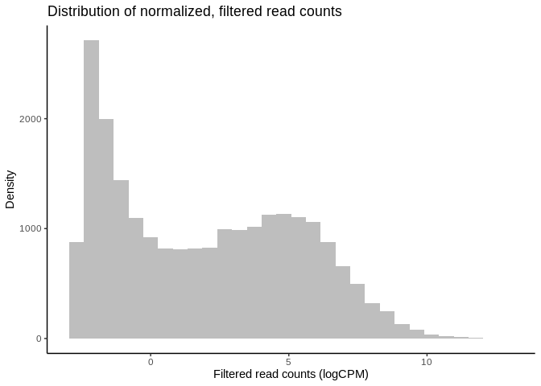

# MDS plot visualizing experimental factors

> Before analyzing our data, it is essential that we look at the
> multivariate relationships between our samples based on
> transcriptome-wide expression levels. Below is example code and output
> for a principal coordinates analysis (PCOA) plot that visualizes
> multifactorial RNA-seq replicates according to two predictor variables
> across major and minor latent variables or PCOA axes.

``` r
# Export pcoa loadings
dds.pcoa = pcoa(vegdist(t(df_log <- cpm(y, log = TRUE, prior.count = 2)),
                          method = "euclidean") / 1000)

# Create df of MDS vector loading
scores <- dds.pcoa$vectors

## Plot pcoa loadings of each sample, grouped by hpf and pvc_leachate_level

# Calculate % variation explained by each eigenvector
percent <- dds.pcoa$values$Eigenvalues
cumulative_percent_variance <- (percent / sum( percent)) * 100

# Prepare information for pcoa plot, then plot
color <- c("steelblue1", "tomato1", "goldenrod1")
par(mfrow = c(1, 1))
plot(
  scores[, 1],
  scores[, 2],
  cex = .5,
  cex.axis = 1,
  cex.lab = 1.25,
  xlab = paste("PC1, ", round(cumulative_percent_variance[1], 2), "%"),
  ylab = paste("PC2, ", round(cumulative_percent_variance[2], 2), "%")
  )

# Add visual groupings to pcoa plot
ordihull(
  scores,
  as.factor(metadata_or$embryonic_stage),
  border = NULL,
  lty = 2,
  lwd = .5,
  label = F,
  col = color,
  draw = "polygon",
  alpha = 100,
  cex = .5
  )

ordispider(scores, as.factor(metadata_or$group), label = F) # Vectors connecting samples in same hpf x leachate group

ordilabel(scores, cex = 0.5) # Label sample IDs
```

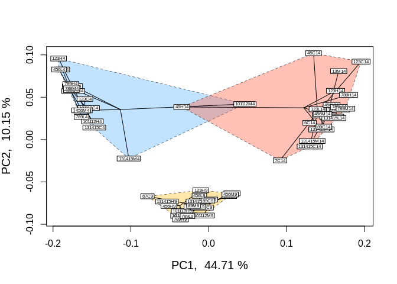

``` r
logCPM.pca <- prcomp(t (df_log))
logCPM.pca.proportionvariances <-
((logCPM.pca$sdev ^ 2) / (sum(logCPM.pca$sdev ^ 2))) * 100

## Do treatment groups fully segregate? Wrap samples by hpf x leachate, not just hpf
# Replot using logCPM.pca
plot(
  logCPM.pca$x,
  type = "n",
  main = NA,
  xlab = paste("PC1, ", round(logCPM.pca.proportionvariances[1], 2), "%"),
  ylab = paste("PC2, ", round(logCPM.pca.proportionvariances[2], 2), "%")
  )

points(logCPM.pca$x,
       col = "black",
       pch = 16,
       cex = 1)
       colors2 <-
       c("steelblue1",
         "dodgerblue2",
         "tomato1",
         "coral",
         "goldenrod1",
         "goldenrod3")
       
       ordihull(
       logCPM.pca$x,
       metadata_or$treatment_group,
       border = NULL,
       lty = 2,
       lwd = .5,
       col = colors2,
       draw = "polygon",
       alpha = 75,
       cex = .5,
       label = T
       )
```

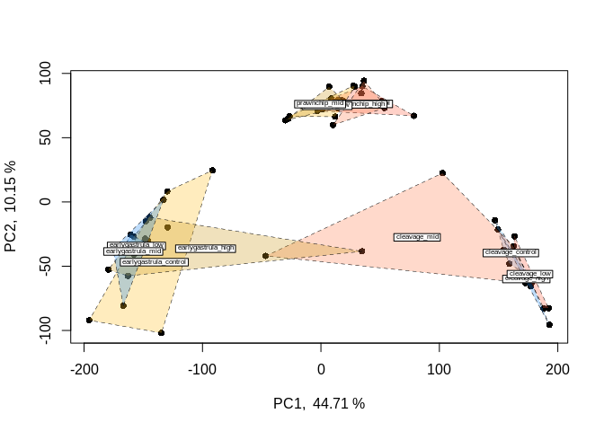

# Non-linear effects

> One of the simplest non-linear relationships that can be fitted to the
> expression of a transcript across an continuous variable is a
> second-order polynomial, otherwise known as a quadratic function,
> which can be expressed as yi=μ+β1x2+β2xyi=μ+β1x2+β2x where yy is the
> abundance of a given transcript (ii), μμ is the intercept, and yy is
> the continuous variable. For the parabola generated by fitting a
> second-order polynomial, β1β1 \> 0 opens the parabola upwards while
> β1β1 \< 0 opens the parabola downwards. The vertex of the parabola is
> controlled by β2β2 such that when β1β1 is negative, greater β2β2
> values result in the vertex falling at higher values of xx.
>
> Quadratic polynomials applied to phenotypic performance curves
> commonly possess negative β1β1 values with positive β2β2 values: a
> downard-opening parabola with a positive vertex. However, quadtratic
> curves fitted to gene expression data can take on a variety of
> postiive or negative forms similar to exponential curves, saturating
> curves, and parabolas. For instance, the expression of a gene may peak
> an intermediate level of an environmental level before crashing or it
> may exponentially decline across that variable. Such trends may better
> model changes in the transcription of a gene compared to a linear
> model. To get started, we will fit non-linear second order polynomials
> before testing for whether model predictions for a given gene are
> significantly improved by a non-linear linear model. -
> [MarineOmics](https://marineomics.github.io/DGE_comparison_v2.html#Filter_and_visualize_read_counts:~:text=for%20differential%20expression.-,Non%2Dlinear%20effects,-Gene%20expression%20traits)

Non-linear effects: example in edgeR Let’s fit a second-order polynomial
for the effect of leachate/leachate using edgeR. Using differential
expression tests, we will then determine whether leachate/leachate
affected a gene’s rate of change in expression and expression maximum by
applying differential expression tests to β1 and β2 parameters. By
testing for differential expression attributed to intereactions between
time and β1 or β2 , we will then test for whether these parameters were
significantly different across exposure times such that 0.5 hpfs and 7
hpfs of acclimation to leachate/leachate altered the rate of change in
expression across leachate/leachate (β1 ) or the maximum of expression
(β2 ).

Since this is the first time we’re fitting models to our data in this
walkthrough, we will also output some important plots to help us explore
and QC model predictions as we work toward testing for differential
expression attributed to non-linear effects.

``` r
# Estimate dispersion coefficients
y1 <- estimateDisp(y, robust = TRUE) # Estimate mean dispersal

# Plot tagwise dispersal and impose w/ mean dispersal and trendline
plotBCV(y1) 
```

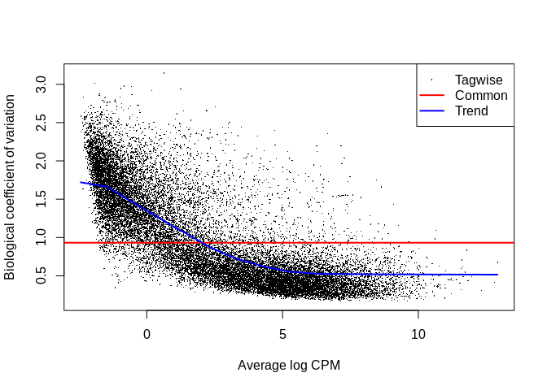

The above figure is an output of the plotBCV() function in edgeR, which
visualises the biological coefficient of variation (otherwise known as
dispersion) parameter fitted to individual genes (black circles), fitted
across gene expression level (blue trendline), and averaged across the
entire transcriptome (red horizontal line).

The BCV/dispersion parameter is a necessary parameter, symbolized as θ
in model specification, that must be estimated in negative binomial
GLMs. θ represents the ‘overdispersion’ or the shape of a negative
binomial distribution and is thus important for defining the
distribution of read count data for a given gene during model fitting.
Dispersion or θ can be input during model fitting in edgeR using the
three estimates visualized in the above regression.

Now that we’ve estimated dispersion, we will use these estimates to fit
negative binomial GLMs to our read count data using the glmQLFit()
function in edgeR, one of the more robust model fitting functions
offered by edgeR.

Using numeric values instead of factors so… hpf = embryonic_stage
(equivalent to hpf in the tutorial… our time component)
pvc_leachate_concentration_mg.L = pvc_leachate_level (equivalent to
leachate/leachate in the tutorial… our environmental condition!)

``` r
# Square environmental condition variable
metadata_or <- metadata_or %>% 
  mutate(leachate = pvc_leachate_concentration_mg.L) %>% 
  mutate(leachate_2 = leachate^2)

# pull out variables values for model
hpf <- metadata_or$hpf
leachate <- metadata_or$pvc_leachate_concentration_mg.L
leachate_2 <- metadata_or$leachate_2


# Fit multifactorial design matrix
design_nl <- model.matrix(~ 1 + leachate_2 + leachate + leachate_2:hpf + leachate:hpf) # Generate multivariate edgeR glm

# Fit quasi-likelihood, neg binom linear regression
nl_fit <-
    glmQLFit(y1, design_nl) # Fit multivariate model to counts

## Test for effect of leachate/leachate and leachate/leachate^2
nl_leachate_2 <-
    glmQLFTest(nl_fit,
    coef = 2,
    contrast = NULL,
    poisson.bound = FALSE) # Estimate significant DEGs
nl_leachate <-
    glmQLFTest(nl_fit,
    coef = 3,
    contrast = NULL,
    poisson.bound = FALSE) # Estimate significant DEGs

# Make contrasts
is.de_nl_leachate <-
  decideTestsDGE(nl_leachate, adjust.method = "fdr", p.value = 0.05)
is.de_nl_leachate_2 <-
  decideTestsDGE(nl_leachate_2, adjust.method = "fdr", p.value = 0.05)
```

``` r
# Summarize differential expression attributed to leachate
summary(is.de_nl_leachate)
```

           leachate
    Down       3352
    NotSig    16346
    Up         2934

``` r
# Summarize differential expression attributed to leachate_2
summary(is.de_nl_leachate_2)
```

           leachate_2
    Down         2489
    NotSig      18221
    Up           1922

We have just fit our first GLM to our read count data and have tested
for differential expression across `leachate/leachate`/`leachate` . At
this stage, it is important to output a few diagnostic plots. For
example, edgeR has the function ‘plotMD()’ which, when input with a
differential expression test object such as a glmQLFTest result, will
produce a plot of differential expression log2 fold change values across
gene expression level (log2 counts per million or logCPM). logCPM is a
major component of gene function and statistical power, and is a useful
variable to plot in order to make initial assessments of differential
expression results.

Visualizations of differential expression (logFC) across baseline logCPM
can be produced by the plotMD() (short for “mean-difference”) function
in edgeR. To do so, plotMD() is input with the results of glmQLFTest,
which we used above to test for differential expression attributable to
the parameters leachate/leachate and leachate/leachate^2. Let’s produce
two such plots for both parameters where “leachate/leachate_2”
represents the leachate/leachate^2 parameter:

``` r
# Plot differential expression due to leachate and leachate^2
plotMD(nl_leachate)
```

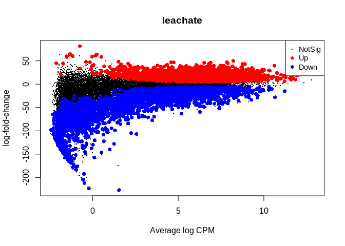

``` r
plotMD(nl_leachate_2)
```

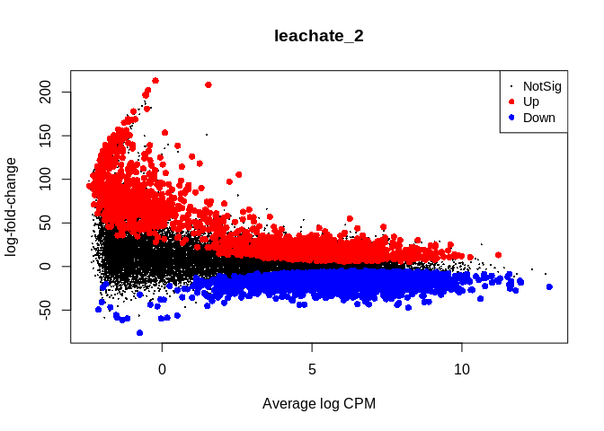

In the two mean-difference plots above, red and blue colored points
represent genes exhibiting significant differential expression
attributed to `leachate` or `leachate_2` . As you can see, there is a
lot of differential expression in this experiment resulting from both of
these parameters. **Part of the reason for this large number of
significant differentially expressed genes (DEGs) is that we have not
applied a cutoff value for logFC.** For example, a logFC cutoff of 2.0
value would not designate any genes with an absolute logFC value less
than 0.05 as a significant DEG. However, deciding on a logFC cutoff is
very tricky! Since we used a continuous predictor for `leachate` during
model fitting, the values in the y-axis of this plot are slopes
representing the rate of change in expression per unit `leachate`
(mg/L). Determining what slope represents a significant change in
expression requires informed reasoning and a strong body of prior data.
For that reason, we are not applying a logFC cutoff in this walkthrough.

Next, we will use glmQLFTest() to test for differential expression
attributed to interactions between `hpf` and `leachate` or `hpf` and
`leachate_2` before producing mean-difference plots visualizing DEGs
derived from these two interactions:

``` r
## Test for interactions between time and leachate or leachate^2
nl_leachate_int <-
  glmQLFTest(nl_fit,
  coef = 4,
  contrast = NULL,
  poisson.bound = FALSE) # Estimate significant DEGs
nl_leachate_2_int <-
  glmQLFTest(nl_fit,
  coef = 5,
  contrast = NULL,
  poisson.bound = FALSE) # Estimate significant DEGs
  
# Make contrasts
is.de_nl_leachate_int <-
  decideTestsDGE(nl_leachate_int, adjust.method = "fdr", p.value = 0.05) # Make contrasts
is.de_nl_leachate_2_int <-
  decideTestsDGE(nl_leachate_2_int, adjust.method = "fdr", p.value = 0.05)
```

``` r
# Summarize differential expression attributed to leachate 
summary(is.de_nl_leachate_int)
```

           leachate_2:hpf
    Down             2572
    NotSig          17143
    Up               2917

``` r
# Summarize differential expression attributed to leachate_2 
summary(is.de_nl_leachate_2_int)
```

           leachate:hpf
    Down           3289
    NotSig        15026
    Up             4317

``` r
plotMD(nl_leachate_int)
```

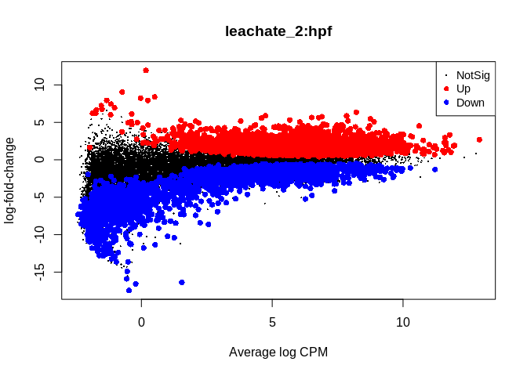

``` r
plotMD(nl_leachate_2_int)
```

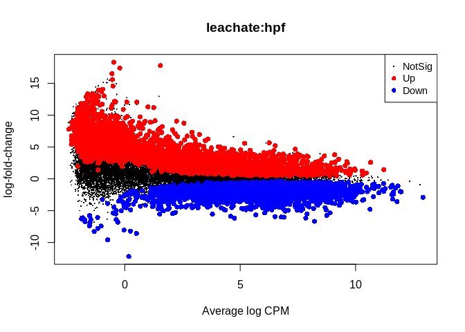

Taking a detour from tests for DEGs attributed to non-linear
interactions, we can now output the residuals of our GLMs in order to
better test for whether our data fit the assumptions of negative
binomial distribution families. If the distribution of residuals from
our GLMs are normal, this indicates that our data meet the assumption of
the negative binomial distribution. We will use the equation for
estimating Pearson residuals:

$$
residual=\frac{observed−fitted}{\sqrt{fitted(dispersion∗fitted)}}
$$

``` r
# Output observed
y_nl <- nl_fit$counts

# Output fitted
mu_nl <- nl_fit$fitted.values

# Output dispersion or coefficient of variation
phi_nl <- nl_fit$dispersion

# Calculate denominator
v_nl <- mu_nl*(1+phi_nl*mu_nl)

# Calculate Pearson residual
resid.pearson <- (y_nl-mu_nl) / sqrt(v_nl)

# Plot distribution of Pearson residuals
ggplot(data = melt(as.data.frame(resid.pearson)), aes(x = value)) +
  geom_histogram(fill = "grey") +
  xlim(-2.5, 5.0) +
  theme_classic() +
  labs(title = "Distribution of negative binomial GLM residuals",
       x = "Pearson residuals",
       y = "Density")
```

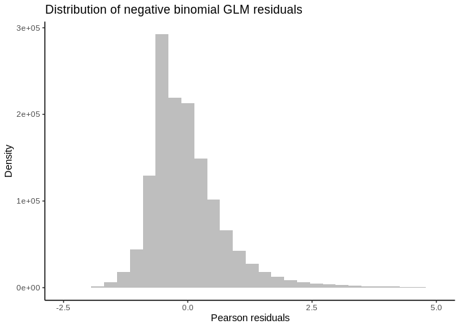

Our residuals appear to be normally distributed, indicating that our
data fit the negative binomial distribution assumed by the GLM.

Now let’s get back to analyzing non-linear effects on gene expression!

# Plotting non-linear effects

``` r
## Bin transcripts based on (i) whether they have a significant positive or negative vertex and then (ii) whether they showed significant interactions between beta1 (vertex value) and time.

# Export diff expression data for transcripts with significant DE associated with leachate^2 parameter
nl_leachate_2_sig <-
  topTags(
  nl_leachate_2,
  n = (2489 + 1922), # the number of up and down degs from is.de_nl_leachate_2
  adjust.method = "BH",
  p.value = 0.05
  )

nl_leachate_2_sig_geneids <- row.names(nl_leachate_2_sig) #Output a list of geneids associated with sig leachate^2 effect

nl_leachate_sig <-
  topTags(
  nl_leachate,
  n = (3352 + 2934), # the number of up and down degs from is.de_nl_leachate
  adjust.method = "BH",
  p.value = 0.05
  )

nl_leachate_sig_geneids <- row.names(nl_leachate_sig) #Output a list of geneids associated with sig leachate effect

# Create tabulated dataframe of mean expression across each leachate level with metadata for transcript ID and timepoint
logCPM_df <- as.data.frame(df_log)

# Create tabularized df containing all replicates using 'melt' function in reshape2
logCPM_df$geneid <- row.names(logCPM_df)

tab_exp_df <- melt(logCPM_df,
                   id = c("geneid"))

# Add covariate information for hpf and leachate
tab_exp_df <- tab_exp_df %>%
  mutate(
    leachate = str_extract(variable, "[CLMHN]"),      # extract treatment letter
    hpf = as.numeric(str_extract(variable, "\\d+$"))  # extract trailing number (e.g. 4, 9, 14)
  )

# Correct leachates to exact values
tab_exp_df <- tab_exp_df %>%
  mutate(
    leachate_code = leachate,  # preserve original letter
    leachate = recode(leachate_code,
      C = 0,
      L = 0.01,
      M = 0.1,
      H = 1
    )
  )

# Create binary variable in df_all_log for significant non-linear expression
tab_exp_df$leachate_2_sig <-
  ifelse(tab_exp_df$geneid %in% nl_leachate_2_sig_geneids, "Yes", "No")
tab_exp_df$leachate_sig <-
  ifelse(tab_exp_df$geneid %in% nl_leachate_sig_geneids, "Yes", "No")

# Create a binary variable related to up or down-regulation
up_genes <- filter(nl_leachate_sig$table, logFC > 0)

tab_exp_df$logFC_dir <-
  ifelse(tab_exp_df$geneid %in% row.names(up_genes), "Up", "Down")

# Add geneid to nl_leachate_int$coefficients
nl_leachate_int$coefficients$geneid <- row.names(nl_leachate_int$coefficients)

# Estimate average logCPM per gene per timepoint
tab_exp_avg <- summarySE(
  measurevar = "value",
  groupvars = c("leachate",     "hpf",       "geneid", 
                "leachate_sig", "leachate_2_sig", "logFC_dir"),
  data = tab_exp_df
  )

# First exploratory plot of non-linear expression grouping by exposure time and direction of differential expression
ggplot(data = filter(tab_exp_avg, leachate_2_sig == "Yes"), 
       aes(x = leachate, y = value)) +
  geom_path(
    alpha = 0.01,
    size = 0.25,
    stat = "identity",
    aes(group = as.factor(geneid))) +
  facet_grid(logFC_dir ~ hpf) +
  theme_classic() +
  theme(strip.background = element_blank()) +
  labs(y = "Avg logCPM", title = "Non-linear changes in GE output by edgeR")
```

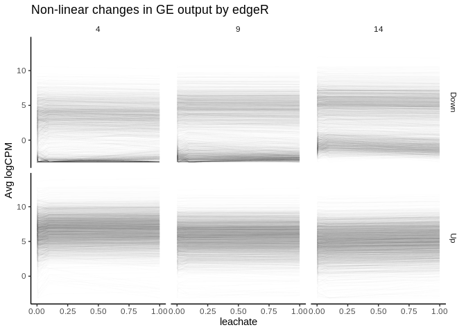

> \[Our plots of non-linear changes in gene expression appear\] to
> include many trends that appear… well, linear. This is a pervasive
> issue in modeling non-linear regressions, and one potential pitfall of
> using outputs from packages such as edgeR or DESeq2 alone in testing
> for non-linear effects. The FDR-adjusted p -values we have used
> determine significance of non-linear effects essentially tell us the
> probability that a parameter value equal to or greater to what we have
> fitted could be generated given a random distribution of read counts.
> The p -value is not a representation of the strength of a non-linear
> effect relative to a linear effect. Numerous genes that nominally show
> significant non-linear effects of leachate may be only weakly
> affected, and a linear effect may in fact be more probable than a
> non-linear one despite what our p-values tell us. Instead of asking
> “for what genes may there be significant, non-linear effects of
> leachate ?”, we should ask “for what genes should we test for
> significant, non-linear effects?”.

> One of the best ways to determine whether a non-linear model is
> appropriate for a transcript is to determine whether it is more
> probable that its expression is linear or non-linear relative to a
> continuous predictor. We can calculate this relative probability using
> a likelihood ratio test (LRT). In the code chunk below, we will fit
> linear and 2nd order non-linear models to the expression of each gene
> before applying LRTs to each transcript. We will then further filter
> our edgeR dataset based on (i) significant differential expression
> attributed to non-linear effects and (ii) a significant LRT ratio
> supporting non-linear effects. Then, we will replot the expression
> levels of this re-filtered set. The code below fits gaussian linear
> models to log2-transformed CPM values, but can be adjusted to fit
> negative binomial GLMs to untransformed CPM similar to edgeR and
> DESeq2 by setting using the MASS package to set ‘family =
> negative_binomial(theta = θ)’ where θ = the dispersion estimate or
> biological coefficient of variation for a given transcript.

``` r
## Using dlply, fit linear and non-linear models to each gene
# Create leachate^2 variable in df_all_log
tab_exp_df$leachate_2 <- tab_exp_df$leachate^2

# Fit linear models - should take about 4 minutes
lms <- dlply(tab_exp_df, c("geneid"), function(df) 
lm(value ~ leachate + hpf + leachate:hpf, data = df))

# Fit non-linear models - should take about 2 minutes
nlms <- dlply(tab_exp_df, c("geneid"), function(df) 
lm(value ~ leachate + leachate_2 + hpf + leachate:hpf + leachate_2:hpf, data = df))

# Output nlm coefficients into dataframe
nlms_coeff <- ldply(nlms, coef)
head(nlms_coeff)
```

                                        geneid (Intercept)   leachate leachate_2
    1 Montipora_capitata_HIv3___RNAseq.10136_t   -3.159690 -11.407978  10.353492
    2 Montipora_capitata_HIv3___RNAseq.10207_t    7.856685   4.561772  -4.092176
    3 Montipora_capitata_HIv3___RNAseq.10214_t    4.248594  10.122254  -9.715703
    4 Montipora_capitata_HIv3___RNAseq.10304_t   -4.165784  -4.771892   4.100583
    5 Montipora_capitata_HIv3___RNAseq.10384_t    4.358606   7.892171  -7.651679
    6 Montipora_capitata_HIv3___RNAseq.10476_t    3.170540  -2.567130   2.624918
              hpf leachate:hpf leachate_2:hpf
    1  0.10053409    1.2935589     -1.1635237
    2 -0.04163802   -0.3823641      0.3646380
    3 -0.18216647   -0.9800713      0.9959617
    4  0.30273782    0.3088917     -0.2799087
    5  0.19102475   -0.4015383      0.3965547
    6  0.06050043    0.1488853     -0.1462869

``` r
## Apply LRTs to lm's and nlm's for each transcript - should take about 2 minutes
lrts <- list() # Create list to add LRT results to

for (i in 1:length(lms)) {
  lrts[[i]] <- lrtest(lms[[i]], nlms[[i]]) # Apply LRTs with for loop
}

## Filter lrt results for transcripts with significantly higher likelihoods of nl model
lrt_dfs <- list()

# Turn list of LRT outputs into list of dataframes containing output info
for (i in 1:length(lrts)) {
  lrt_dfs[[i]] <- data.frame(lrts[i])
}

# Create singular dataframe with geneids and model outputs for chi-squared and LRT p-value
lrt_coeff_df  <- na.omit(bind_rows(lrt_dfs, .id = "column_label")) # na.omit removes first row of each df, which lacks these data

# Add geneid based on element number from original list of LRT outputs
lrt_coeff_df <- merge(lrt_coeff_df,
                      data.frame(geneid = names(nlms),
                      column_label = as.character(seq(length(
                      nlms
                      )))),
                      by = "column_label")
                      
# Apply FDR adjustment to LRT p-values before filtering for sig non-linear effects
lrt_coeff_df$FDR <- p.adjust(lrt_coeff_df$Pr..Chisq., method = "fdr")

# Filter LRT results for sig FDR coeff... produces only 3 genes
lrt_filt <- filter(lrt_coeff_df, FDR < 0.1)

## Plot sig nl genes according to LRT, grouped by timepoint and direction of beta 1 coefficient
# Add beta coefficients to logCPM df
leachate_pos <- filter(nlms_coeff, leachate > 0)
leachate_2_pos <- filter(nlms_coeff, leachate_2 > 0)

# Bin genes based on positive or negative leachate and leachate^2 betas
tab_exp_avg$leachate_binom <- ifelse(tab_exp_avg$geneid %in% leachate_pos$geneid, "Positive", "Negative")
tab_exp_avg$leachate_2_binom <- ifelse(tab_exp_avg$geneid %in% leachate_2_pos$geneid, "Concave", "Convex")

# Filter for how many gene id's with significant likelihood of nl effect in LRT
LRT_filt_df <- filter(tab_exp_avg, geneid %in% lrt_filt$geneid)

# Plot
ggplot(data = LRT_filt_df,
       aes(x = leachate, y = value)) +
  geom_path(
    alpha = .25,
    size = 0.25,
    stat = "identity",
    aes(group = as.factor(geneid))
    ) +
  facet_grid(leachate_2_binom ~ hpf) +
  geom_smooth(method = "loess", se = TRUE, span = 1) +
  theme_classic() +
  theme(strip.background = element_blank()) +
  labs(y = "Avg logCPM", title = "Non-linear changes in GE output by LRTs")
```

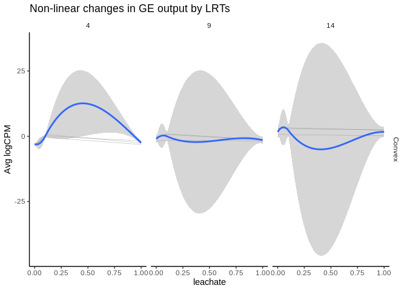

> [!IMPORTANT]
>
> 3 genes had likelihood of non-linear effect (p \< 0.1) as identified
> by LRT

> … the most robust estimate we have for non-linear effects of
> environmental conditions on gene expression over time comes from
> filtering for significant DEGs in edgeR *and* significant LRTs.

> how does gene expression vary between exposure times for genes
> exhibiting significant interactions between *leachate*2^2 and time?
> Let’s produce an exploratory plot of non-linear expression across 0.5
> and 7 hpfs of exposure for such genes identified using edgeR alone.

``` r
# Export diff expression data for transcripts with significant DE associated with interaction between leachate^2 and time
nl_leachate_2_int_sig <- topTags(nl_leachate_2_int, n = (3289 + 4317), adjust.method = "BH",p.value = 0.05)
nl_leachate_2_int_sig_geneids <- row.names(nl_leachate_2_int_sig) #Output a list of geneids associated with sig leachate^2 x time interaction

# Filter down df for gene id's exhibit leachate significant effect in edgeR and significant likelihood of nl effect in LRT 
edgeR_interaction_df <- filter(tab_exp_avg, geneid %in% nl_leachate_2_int_sig_geneids )
edgeR_interaction_df$gene_id_hpf <- paste(edgeR_interaction_df$geneid,
                                           edgeR_interaction_df$hpf,
                                           sep = "_")

# Average logCPM across different groups according to leachate^2 estimate and time
edgeR_interaction_avg <- summarySE(measurevar = "value",
                                   groupvars = c("hpf", "leachate", "leachate_2_binom"),
                                                 data = edgeR_interaction_df)

# Plot 
ggplot(data = edgeR_interaction_avg, 
       aes(
         x = leachate,
         y = value,
         color = as.factor(hpf),
         group = as.factor(hpf)
         )) +
         geom_path(stat = "identity") +
  geom_errorbar(aes(ymin = value - se, ymax = value + se), width = 0) +
  geom_point() +
  facet_wrap(~leachate_2_binom) +
  theme_classic() +
  theme(strip.background = element_blank()) +
  labs(y = "logCPM", color = "Time (hours)", title = "Interactions between leachate^2 and exposure time")
```

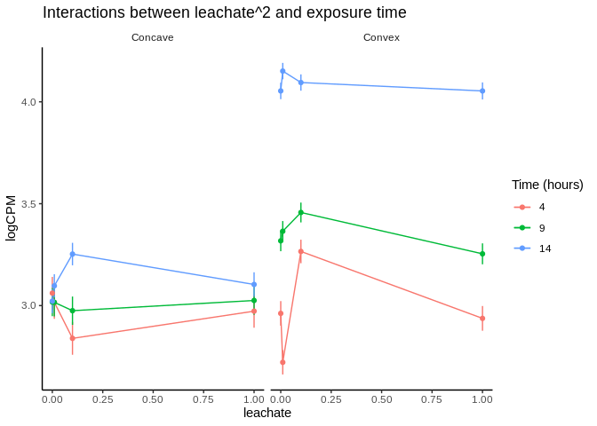

This plot shows changes in gene expression curves across time. logCPM is
the log Counts Per Million and it’s a commonly used metric in **RNA-seq
data analysis** to represent gene expression levels.

**CPM (Counts Per Million)** = normalization of raw read counts by
sequencing depth:

✅ Why logCPM is used:

Normalizes for sequencing depth across samples

Stabilizes variance, especially for high-count genes

Compresses the large dynamic range of gene expression

Works well for linear modeling (e.g., in limma-voom, edgeR, etc.)

> Genes with both concave and convex expression curves across
> *leachate*2 at 4, 9, and 14 hours of exposure exhibited increases in
> expression as the experiment progressed

# Interactive effects

> Interactive effects shaping gene expression are common in nature and
> are becoming increasingly prevalent in models of gene expression
> derived from experimental studies. Below, we go a little bit deeper on
> interactive effects by outlining methods for fitting them using
> categorical and continuous variables in models of expression. We
> provide examples in edgeR, DESeq2, and Voom and point out how
> specification for interactive effects differs between these packages.
> Lastly, we compare correlations between these programs’ fold change
> (logFC) predictions and test statistics. This final comparison of
> model predictions for interaction parameters is as much a tutorial on
> interactive effects as it is a tutorial on how to visualize
> differences in DE packages’ results. Please use section of the code
> for any comparisons between DE packages you may want to make for other
> effect types, not just interactive effects!

## Interactive effects: edgeR

> edgeR and Voom both take the same syntax for interactive effects,
> which we define below using the model.matrix() function as
> ‘design_multi \<- model.matrix( ~1 + leachate + leachate:hpf )’. Then,
> we will use this multifactorial model design in both edgeR and Voom as
> specified below:

``` r
# Fit multifactorial design matrix that includes an interaction term for leachate x hpf
design_multi <-
  model.matrix(~ 1 + leachate + leachate:hpf) #Generate multivariate edgeR glm
  
# Fit quasi-likelihood, neg binom linear regression
multi_fit <-
  glmQLFit(y1, design_multi) # Fit multivariate model to counts
  
# Test for effect of leachate
tr_leachate <-
  glmQLFTest(
  multi_fit,
  coef = 2,
  contrast = NULL,
  poisson.bound = FALSE
  ) # Estimate significant DEGs
  
is.de_tr_leachate <-
  decideTestsDGE(tr_leachate, adjust.method = "fdr", p.value = 0.05) # Make contrasts
  
summary(is.de_tr_leachate)
```

           leachate
    Down       8458
    NotSig    10870
    Up         3304

> [!NOTE]
>
> In edgeR 8458 genes down + 3304 genes up = 11,762 genes total were
> found to be differentially expressed due to the effect of leachate (p
> = 0.05)

``` r
# Test for interaction between leachate and hpf
tr_int <-
  glmQLFTest(multi_fit, coef = 3, poisson.bound = FALSE) # Estimate significant DEGs
  
is.de_int <-
  decideTestsDGE(tr_int, adjust.method = "fdr", p.value = 0.05) # Make contrasts
  
summary(is.de_int)
```

           leachate:hpf
    Down           3294
    NotSig        10997
    Up             8341

> [!NOTE]
>
> 3294 genes down + 8341 genes up = 11,635 genes total were
> differentially expressed with an interaction between leachate and hpf

## Interactive effects: limma-Voom

> Below we will fit the same ‘design_multi’ model (y ~ 1 + *leachate*2 +
> *leachate*2:hpf) to our read counts using Voom rather than edgeR. As
> stated earlier, Voom fits interactions between fixed effects using the
> same syntax as edgeR, so the ‘design_multi’ object can be used by both
> programs. \> \> What *is* different between edgeR and Voom is the
> manner by which Voom accounts for variation between replicates. Rather
> than using gene-wise or averaged estimations of biological
> coefficients of variation and inputting these values as θθ in a
> negative binomial GLM, Voom models what is referred to as the
> mean-variance relationship and incorporates this relationship within a
> linear model rather than a GLM by “weighting” the accuracy of a given
> observation based on its level of expression and modelled variance.
> This mean-variance relationship can be plotted by Voom after model
> fitting as we show below:

``` r
# Perform Voom transformation
Voom <- voom(y, design_multi, plot = T)
```

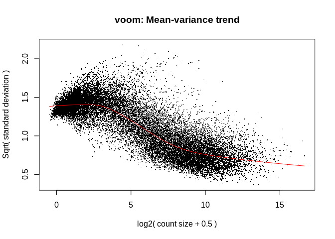

> When deciding between packages for testing DGE, it can be helpful to
> compare model assumptions regarding variance by plotting graphs like
> Voom’s mean-variance relationship above and the output of edgeR’s
> ‘plotBCV()’ function, which we provided an example of earlier and will
> replot below for the sake of making this visual comparison. Take note
> that the y-axes of these variance plots in Voom (square root of
> standard deviation) and edgeR (biological coefficient of variation)
> are different:

``` r
# Estimate dispersion coefficients
y1 <- estimateDisp(y, robust = TRUE) # Estimate mean dispersal

# Plot tagwise dispersal and impose w/ mean dispersal and trendline
plotBCV(y1) 
```


> The mean-variance relationships modelled in edgeR and Voom are
> generally similar, but it appears that Voom assumes even lesser
> variance in expression among genes at the highest expression level.
> One result of this may be that greater statistical power is assumed in
> tests of differential expression by Voom for genes with high
> expression relative to low expression genes. Keep this in mind as we
> continue to move forward with fitting parameters for interactions
> between *`leachate`* and `hpf` in Voom.

``` r
# Fit using Voom
lm_Voom_fit <- lmFit(Voom, design_multi)

# Create a contrast across continuous leachate variable
cont_leachate <- contrasts.fit(lm_Voom_fit, coef = "leachate")

# Create a contrast across interaction etween continuous leachate and time variables
cont_leachate_hpf <- contrasts.fit(lm_Voom_fit, coef = "leachate:hpf")

# Perform empirical Bayes smoothing of standard errors
cont_leachate <- eBayes(cont_leachate)
cont_leachate_hpf <- eBayes(cont_leachate_hpf)

# Output test statistics
leachate_results <-
  topTable(cont_leachate,
  coef = "leachate",
  adjust.method = "fdr",
  n = Inf)

leachate_hpf_results <-
  topTable(cont_leachate_hpf,
  coef = "leachate:hpf",
  adjust.method = "fdr",
  n = Inf)
```

``` r
# How many DEGs are associated with leachate
length(which(leachate_results$adj.P.Val < 0.05))
```

    [1] 9808

``` r
# How many DEGs are associated with leachate:hpf
length(which(leachate_hpf_results$adj.P.Val < 0.05))
```

    [1] 10157

> [!NOTE]
>
> Voom has identified 10,157 genes whose variation is affected by an
> interaction between leachate and hours post fertilization, compared to
> 11,635 genes identified by edgeR.

## 

Interactive effects: DESeq2

DESeq2 requires a slightly different syntax for specifying interactive
effects compared to edgeR and Voom.

``` r
gcounts <- gcm_filt_or

totalCounts <- colSums(gcounts)
# Make a DGEList object for edgeR
y <- DGEList(counts = gcounts, remove.zeros = TRUE)

# Let's remove samples with less then 0.5 cpm (this is ~10 counts in the count file) in fewer then 3/61 samples
keep_g <- rowSums(cpm(gcounts) > .5) >= 3

table(keep_g)
```

    keep_g
    FALSE  TRUE 
        2 22632 

``` r
head(metadata_or)
```

      sample_no sample_name parents group       treatment_group hpf embryonic_stage
    1         1   101112C14  101112   C14 earlygastrula_control  14   earlygastrula
    2         2    101112C4  101112    C4      cleavage_control   4        cleavage
    3         3    101112C9  101112    C9     prawnchip_control   9       prawnchip
    4         4   101112H14  101112   H14    earlygastrula_high  14   earlygastrula
    5         5    101112H4  101112    H4         cleavage_high   4        cleavage
    6         6    101112H9  101112    H9        prawnchip_high   9       prawnchip
      pvc_leachate_level hours_post_fertilization pvc_leachate_concentration_mg.L
    1            control                       14                               0
    2            control                        4                               0
    3            control                        9                               0
    4               high                       14                               1
    5               high                        4                               1
    6               high                        9                               1
      leachate leachate_2
    1        0          0
    2        0          0
    3        0          0
    4        1          1
    5        1          1
    6        1          1

``` r
### WALD TEST - FULL MODEL ###

dds <- DESeqDataSetFromMatrix(gcounts,
                              colData = metadata_or,
                              design = formula( ~ 1 + leachate + hpf : leachate))

rld <- rlog(dds)
rld.df <- assay(rld)

# Wald test for pCO2:day
dds_int <- DESeq(dds, minReplicatesForReplace = Inf)

design <- design(dds_int)

DESeq2_int_result_names <- resultsNames(dds_int)

# Count DEGs due to interaction
DESeq2_int_results <- results(dds_int, lfcThreshold = 0, alpha = 0.05)

summary(DESeq2_int_results)
```


    out of 22634 with nonzero total read count
    adjusted p-value < 0.05
    LFC > 0 (up)       : 8287, 37%
    LFC < 0 (down)     : 3340, 15%
    outliers [1]       : 13, 0.057%
    low counts [2]     : 0, 0%
    (mean count < 1)
    [1] see 'cooksCutoff' argument of ?results
    [2] see 'independentFiltering' argument of ?results

> DESeq2 has identified 8287 up and 3340 down = 11627 genes whose
> variation is affected by an interaction between *`leachate`* and
> `hpf`, compared to 11635 identified by edgeR and 10157 by Voom.

## Comparing test statistics: interactive effects

Differential expression packages can make dramatically different
predictions for both the fold-change and probability of differential
expression. If you find yourself deciding between different packages or
wanting to compare how conservative different approaches are, it helps
to run regressions of model predictions by different packages. Below we
apply the ggpairs() function from GGAlly (Schloerke et al. 2018) to plot
a correlation matrix of logFC values and negative log-transformed
p-values attributed to interactive effects between time and *p*CO22
predicted by edgeR, DESeq2, and Voom:

``` r
# Merge logFC and pval data from each program
Voom_edgeR_deseq_int_comp <- merge( 
  merge(
    data.frame(geneid = row.names(leachate_hpf_results),
               Voom_logFC = leachate_hpf_results$logFC,
               Voom_pval = leachate_hpf_results$P.Value),
    data.frame(geneid = row.names(tr_int$table),
               edgeR_logFC = tr_int$table$logFC,
               edgeR_pval = tr_int$table$PValue), 
    by = "geneid" ),
  data.frame(geneid = row.names(DESeq2_int_results),
             DESeq2_logFC = DESeq2_int_results$log2FoldChange,
             DESeq2_pval = DESeq2_int_results$pvalue),
  by = "geneid")

# Create neg log pvalues
Voom_edgeR_deseq_int_comp$Voom_neglogp <- -log(Voom_edgeR_deseq_int_comp$Voom_pval)
Voom_edgeR_deseq_int_comp$edgeR_neglogp <- -log(Voom_edgeR_deseq_int_comp$edgeR_pval)
Voom_edgeR_deseq_int_comp$DESeq2_neglogp <- -log(Voom_edgeR_deseq_int_comp$DESeq2_pval)

# Create function for adding 1:1 trendline on ggpairs plot and plotting geom_hex instead of geom_point
my_fn <- function(data, mapping, ...){
  p <- ggplot(data = data, mapping = mapping) + 
    geom_hex( bins = 100,
            aes(fill = stat(log(count))), alpha = 1 ) +
    scale_fill_viridis_c() +
    geom_abline(
    slope = 1,
    intercept = 0,
    color = "red",
    lty = 2,
    size = 1,
    alpha = 0.5
    )
  p
}

# Correlation matrix of pvalues
pval_pairs <- ggpairs(data = Voom_edgeR_deseq_int_comp,
                      columns = c(8, 9, 10),
                      mapping = aes(alpha = 0.001),
                      lower = list(continuous = my_fn)) +
  labs(title = "Correlation matrix: interaction p-values")

pval_pairs +
  theme_classic(base_rect_size = 0)
```

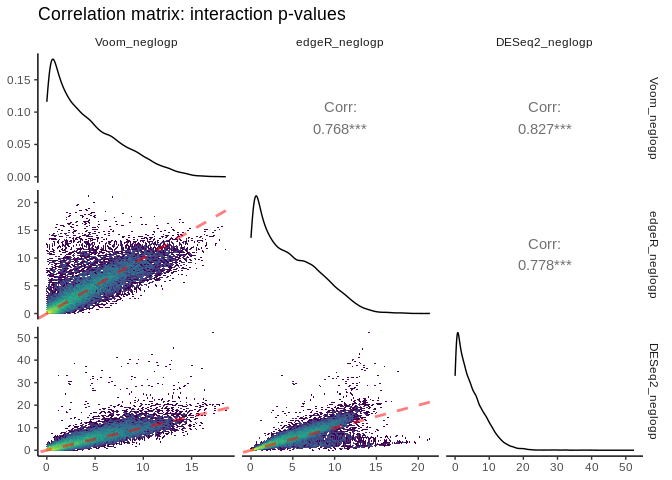

> The above plot is the output of ggpairs() showing correlations between
> negative log-transformed p-values attributed to interactive effects of
> `leachate` and `hpf` estimated between each of the three packages, as
> well as the distributions of this parameter for each package, and
> correlation statistics. Red dashed lines represent a slope equal to 1.
> Yellow colors depict regions of each linear regression with more
> observations.
>
> DESeq2 and edgeR share the largest correlation between p-values
> estimated for an interactive effect of *`leachate:hpf`* on
> differential expression (R22 = 0.827).
>
> Next, let's create a ggpairs() plot contrasting logFC estimates of DE
> attributed to *`leachate:hpf`* in edgeR, Voom, and DESeq2. One might
> think that logFCs should demonstrate stronger correlations between
> programs compared to p-values, but due to the manners by which read
> counts are normalized and transformed in different packages this is
> not always the case!

``` r
# Correlation matrix of logFC's
logFC_pairs <- ggpairs(data = Voom_edgeR_deseq_int_comp,
                       columns = c( 2, 4, 6 ),
                       mapping = aes( alpha = 0.001 ),
                       lower = list(continuous = my_fn)) +
  labs(title = "Correlation matrix: interaction logFC's")

logFC_pairs +
  theme_classic(base_rect_size = 0)
```

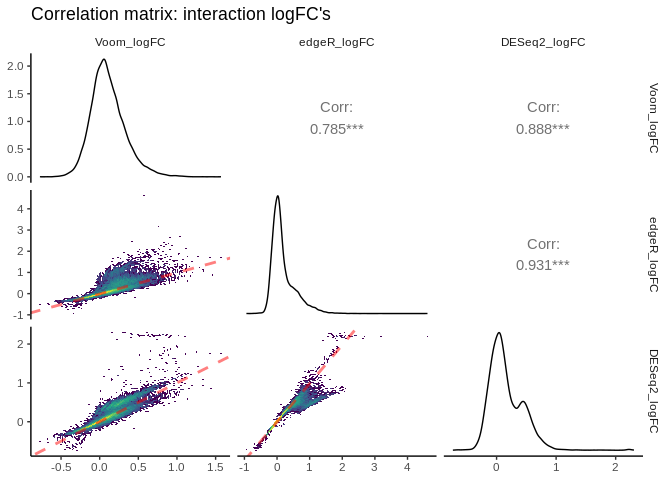

> **Once again, the strongest correlation exists between edgeR and
> Voom.** However, the slope of this correlation is less than 1,
> indicating that absolute edgeR logFC's are lower on average than
> absolute Voom logFCs. The correlation pair that shows a slope closest
> to 1.0 is edgeR vs. DESeq2. edgeR and DESeq2 normalize read counts in
> a similar manner, and thus a value derived from differences in read
> counts across continuous predictors such as logFC is likely to be more
> similar between these packages.

  
