# Pairwise Differential Gene Expression
Sarah Tanja
2025-05-08

- [<span class="toc-section-number">1</span> Background](#background)
- [<span class="toc-section-number">2</span> Setup](#setup)
  - [<span class="toc-section-number">2.1</span> Install
    packages](#install-packages)
  - [<span class="toc-section-number">2.2</span> Load
    packages](#load-packages)
  - [<span class="toc-section-number">2.3</span> Import gene
    counts](#import-gene-counts)
  - [<span class="toc-section-number">2.4</span> Import
    metadata](#import-metadata)
- [<span class="toc-section-number">3</span> 4 hpf](#4-hpf)
  - [<span class="toc-section-number">3.1</span> Format
    metadata](#format-metadata)
  - [<span class="toc-section-number">3.2</span> Filter low
    reads](#filter-low-reads)
  - [<span class="toc-section-number">3.3</span> Make DESeq
    Object](#make-deseq-object)
    - [<span class="toc-section-number">3.3.1</span> Count
      transformations](#count-transformations)
    - [<span class="toc-section-number">3.3.2</span> PCA](#pca)
    - [<span class="toc-section-number">3.3.3</span>
      Clusters](#clusters)
    - [<span class="toc-section-number">3.3.4</span> Heatmap](#heatmap)
    - [<span class="toc-section-number">3.3.5</span> RUVSeq?](#ruvseq)
  - [<span class="toc-section-number">3.4</span> Run
    DESeq2](#run-deseq2)
    - [<span class="toc-section-number">3.4.1</span> Effect of low vs
      control](#effect-of-low-vs-control)
    - [<span class="toc-section-number">3.4.2</span> Effect of mid vs
      control](#effect-of-mid-vs-control)
    - [<span class="toc-section-number">3.4.3</span> Effect of high vs
      control](#effect-of-high-vs-control)
    - [<span class="toc-section-number">3.4.4</span> Effect of low vs
      mid](#effect-of-low-vs-mid)
    - [<span class="toc-section-number">3.4.5</span> Effect of low vs
      high](#effect-of-low-vs-high)
    - [<span class="toc-section-number">3.4.6</span> Effect of mid vs
      high](#effect-of-mid-vs-high)
- [<span class="toc-section-number">4</span> 9 hpf](#9-hpf)
  - [<span class="toc-section-number">4.1</span> Format
    metadata](#format-metadata-1)
  - [<span class="toc-section-number">4.2</span> Filter low
    read](#filter-low-read)
  - [<span class="toc-section-number">4.3</span> Make DESeq
    Object](#make-deseq-object-1)
    - [<span class="toc-section-number">4.3.1</span> Count
      transformations](#count-transformations-1)
    - [<span class="toc-section-number">4.3.2</span> PCA](#pca-1)
    - [<span class="toc-section-number">4.3.3</span>
      Clusters](#clusters-1)
    - [<span class="toc-section-number">4.3.4</span>
      Heatmap](#heatmap-1)
    - [<span class="toc-section-number">4.3.5</span> RUVSeq?](#ruvseq-1)
  - [<span class="toc-section-number">4.4</span> Run
    DESeq2](#run-deseq2-1)
    - [<span class="toc-section-number">4.4.1</span> Effect of low vs
      control](#effect-of-low-vs-control-1)
    - [<span class="toc-section-number">4.4.2</span> Effect of mid vs
      control](#effect-of-mid-vs-control-1)
    - [<span class="toc-section-number">4.4.3</span> Effect of high vs
      control](#effect-of-high-vs-control-1)
    - [<span class="toc-section-number">4.4.4</span> Effect of low vs
      mid](#effect-of-low-vs-mid-1)
    - [<span class="toc-section-number">4.4.5</span> Effect of low vs
      high](#effect-of-low-vs-high-1)
    - [<span class="toc-section-number">4.4.6</span> Effect of mid vs
      high](#effect-of-mid-vs-high-1)
- [<span class="toc-section-number">5</span> 14 hpf](#14-hpf)
  - [<span class="toc-section-number">5.1</span> Format
    metadata](#format-metadata-2)
  - [<span class="toc-section-number">5.2</span> Filter low
    read](#filter-low-read-1)
  - [<span class="toc-section-number">5.3</span> Make DESeq
    Object](#make-deseq-object-2)
    - [<span class="toc-section-number">5.3.1</span> Count
      transformations](#count-transformations-2)
    - [<span class="toc-section-number">5.3.2</span> PCA](#pca-2)
    - [<span class="toc-section-number">5.3.3</span>
      Clusters](#clusters-2)
    - [<span class="toc-section-number">5.3.4</span>
      Heatmap](#heatmap-2)
    - [<span class="toc-section-number">5.3.5</span> RUVSeq?](#ruvseq-2)
  - [<span class="toc-section-number">5.4</span> Run
    DESeq2](#run-deseq2-2)
    - [<span class="toc-section-number">5.4.1</span> Effect of low vs
      control](#effect-of-low-vs-control-2)
    - [<span class="toc-section-number">5.4.2</span> Effect of mid vs
      control](#effect-of-mid-vs-control-2)
    - [<span class="toc-section-number">5.4.3</span> Effect of high vs
      control](#effect-of-high-vs-control-2)
    - [<span class="toc-section-number">5.4.4</span> Effect of low vs
      mid](#effect-of-low-vs-mid-2)
    - [<span class="toc-section-number">5.4.5</span> Effect of low vs
      high](#effect-of-low-vs-high-2)
    - [<span class="toc-section-number">5.4.6</span> Effect of mid vs
      high](#effect-of-mid-vs-high-2)
- [<span class="toc-section-number">6</span> Summary](#summary)

# Background

We did not find any significantly differently expressed genes across all
embryonic stages, we believe, due to the gene expression in our dataset
is clustered by stage, and the effect of leachate was ‘drowned out’ by
the much larger patterns of embryonic stage. This code breaks it down to
look at DGEs within each stage of embryonic development. This reduces
our n to 5 for each group and we have less power with this analysis, but
it will help us get a fuller picture of our data and what it’s telling
us.  
\## Inputs - `gcm_4.csv` is the unfiltered gene count matrix for all
4hpf samples. - `gcm_9.csv` - `gcm_14.csv` - `metadata_4.csv` is the
metadata for 61 samples (two outliers were already removed). -
`metadata_9.csv` - `metadata_14.csv` \## Outputs -
`volcano_facet_pairwise.png`

# Setup

## Install packages

``` r
BiocManager::install("RUVSeq")
BiocManager::install("EDASeq")
```

## Load packages

``` r
library(tidyverse)
library(DESeq2)
library(RUVSeq)
library(EDASeq)
library(pheatmap)
library(RColorBrewer)
library(ashr)
library(flexoki)
library(plotly)
library(cowplot)
```

## Import gene counts

``` r
gcm_4 <- read.csv("../output/06_tidyup/gcm_4.csv", row.names="gene_id", check.names = FALSE)
gcm_9 <- read.csv("../output/06_tidyup/gcm_9.csv", row.names="gene_id", check.names = FALSE)
gcm_14 <- read.csv("../output/06_tidyup/gcm_14.csv", row.names="gene_id", check.names = FALSE)
```

## Import metadata

``` r
metadata_4 <- read.csv("../metadata/metadata_4.csv")
metadata_9 <- read.csv("../metadata/metadata_9.csv")
metadata_14 <- read.csv("../metadata/metadata_14.csv")
```

# 4 hpf

## Format metadata

``` r
str(metadata_4)
```

    'data.frame':   18 obs. of  7 variables:
     $ sample_name    : chr  "101112C4" "101112H4" "101112L4" "101112M4" ...
     $ parents        : int  101112 101112 101112 101112 123 123 123 123 131415 131415 ...
     $ group          : chr  "C4" "H4" "L4" "M4" ...
     $ hpf            : int  4 4 4 4 4 4 4 4 4 4 ...
     $ embryonic_stage: chr  "cleavage" "cleavage" "cleavage" "cleavage" ...
     $ leachate       : chr  "control" "high" "low" "mid" ...
     $ leachate_mgL   : num  0 1 0.01 0.1 0 1 0.01 0.1 0 1 ...

``` r
# Reorder leachate factor
metadata_4$leachate <- as.factor(metadata_4$leachate)
metadata_4$leachate <- fct_relevel(metadata_4$leachate, "control", "low", "mid", "high")

# Make parents a character string
metadata_4$parents <- as.character(metadata_4$parents)
str(metadata_4)
```

    'data.frame':   18 obs. of  7 variables:
     $ sample_name    : chr  "101112C4" "101112H4" "101112L4" "101112M4" ...
     $ parents        : chr  "101112" "101112" "101112" "101112" ...
     $ group          : chr  "C4" "H4" "L4" "M4" ...
     $ hpf            : int  4 4 4 4 4 4 4 4 4 4 ...
     $ embryonic_stage: chr  "cleavage" "cleavage" "cleavage" "cleavage" ...
     $ leachate       : Factor w/ 4 levels "control","low",..: 1 4 2 3 1 4 2 3 1 4 ...
     $ leachate_mgL   : num  0 1 0.01 0.1 0 1 0.01 0.1 0 1 ...

## Filter low reads

``` r
# Filter rows where at least 75% of the columns have a raw count of at least 15
gcm_4_filt <- gcm_4 %>%
  filter(rowSums(across(everything(), ~ . > 50)) >= 0.75 * ncol(gcm_4))
nrow(gcm_4_filt)
```

    [1] 8540

## Make DESeq Object

Make [DESeq Dataset Object from Count
Matrix](https://bioconductor.org/packages/devel/bioc/vignettes/DESeq2/inst/doc/DESeq2.html#count-matrix-input)
Create a DESeqDataSet design from gene count matrix and treatment
conditions.

``` r
dds_4 <- DESeqDataSetFromMatrix(countData = gcm_4_filt,
                              colData = metadata_4, 
                              design = ~leachate)

dds_4 <- estimateSizeFactors(dds_4)
```

Are all size factors less than 4?

``` r
all(sizeFactors(dds_4))<4
```

    [1] TRUE

### Count transformations

Make count transformations (for use in visualizations & clustering)

``` r
rld_4 <- rlog(dds_4, blind = FALSE) 
vsd_4 <- vst(dds_4, blind = FALSE)
log2_4 <- as.data.frame(log2(counts(dds_4, normalized = TRUE) + 1), check.names = FALSE)
```

The distribution should shift via the transformation from a negative
binomial to a approximately normal distribution.

``` r
# Combine all transformations into one long-format dataframe
df_4 <- bind_rows(
  as.data.frame(log2(counts(dds_4, normalized = TRUE) + 1)) %>%
    mutate(transformation = "log2(x + 1)"),
  as.data.frame(assay(vsd_4)) %>%
    mutate(transformation = "vst"),
  as.data.frame(assay(rld_4)) %>%
    mutate(transformation = "rlog")
)

# Pivot to long format: one row per expression value
df_long <- df_4 %>%
  pivot_longer(
    cols = -transformation,
    names_to = "sample",
    values_to = "expression"
  )

# Plot
ggplot(df_long, aes(x = expression)) +
  geom_histogram(bins = 100, fill = "steelblue") +
  facet_wrap(~ transformation) +
  theme_classic() +
  labs(
    title = "Distribution of Transformed Counts Across All Samples (4 hpf)",
    x = "Transformed counts",
    y = "Frequency"
  )
```

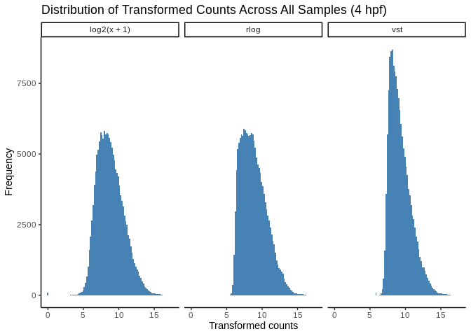

``` r
# VST-transformed matrix
vst_mat <- assay(vst(dds_4, blind = TRUE))

# Convert to long format
df_vst <- as.data.frame(vst_mat)
df_vst$gene <- rownames(df_vst)
df_vst_long <- pivot_longer(df_vst, cols = -gene, names_to = "sample", values_to = "expression")

# Plot
ggplot(df_vst_long, aes(x = expression, group = sample)) +
  geom_density(alpha = 0.2) +
  labs(title = "VST Transformed Counts (Density by Sample)")
```

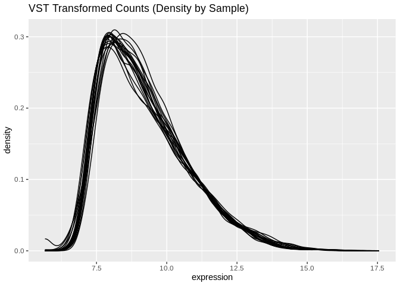

``` r
# Regularized log-transformed matrix
rld_mat <- assay(rld_4)

# Convert to long format
df_rld <- as.data.frame(rld_mat)
df_rld$gene <- rownames(df_rld)
df_rld_long <- pivot_longer(df_rld, cols = -gene, names_to = "sample", values_to = "expression")

# Plot
ggplot(df_rld_long, aes(x = expression, group = sample)) +
  geom_density(alpha = 0.2) +
  labs(title = "RLOG Transformed Counts (Density by Sample)")
```

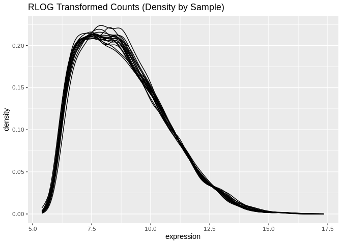

### PCA

#### static

``` r
# Get PCA data (top 500 DEGs by default)
pca_4 <- plotPCA(rld_4, intgroup = "group", returnData = TRUE)
percentVar_4 <- round(100*attr(pca_4, "percentVar"))

# Merge with metadata
pca_4 <- merge(pca_4, metadata_4, by.x = "name", by.y = "sample_name", all.x = TRUE)

# Assign specific colors to each leachate
leachate_colors <- c(
  "control" = flex("green", sat = 200),
  "low" = flex("magenta", sat = 300),
  "mid" = flex("magenta", sat = 600),
  "high" = flex("magenta", sat = 900)
)

# Plot PCA
PCA_4 <- ggplot(pca_4, aes(PC1, PC2, color=leachate)) + 
  geom_point(size=2, alpha = 0.8) +
  ggtitle("M.cap embryos at 4 hpf exposed to pvc leachate, top 500 most variable genes") +
  xlab(paste0("PC1: ",percentVar_4[1],"% variance")) +
  ylab(paste0("PC2: ",percentVar_4[2],"% variance")) + 
  coord_fixed() +
  scale_color_manual(values=leachate_colors)+
  stat_ellipse()+
  theme_minimal()

PCA_4
```

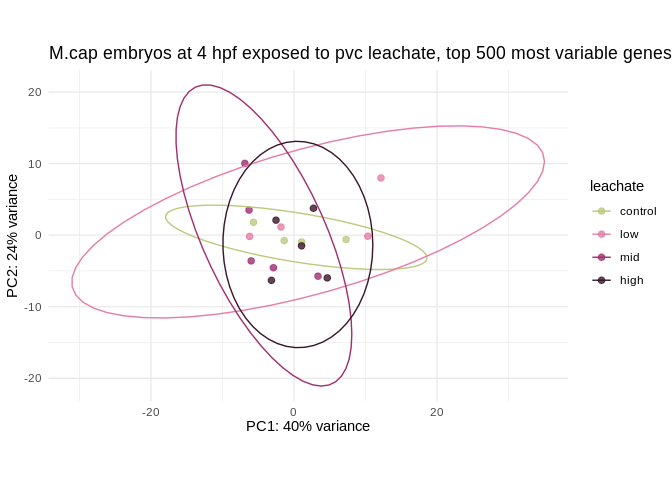

#### tooltip

``` r
pca_4$label <- paste0("Sample: ", pca_4$sample_name,
                        "\nLeachate: ", pca_4$leachate)

# Original ggplot with an interactive tooltip aesthetic
PCA_4 <- ggplot(pca_4, aes(PC1, PC2, color = leachate, label = name)) + 
  geom_point(shape = 21, size = 2) +
  ggtitle("M.cap embryos at 4 hpf exposed to pvc leachate, top 500 most variable genes") +
  xlab(paste0("PC1: ", percentVar_4[1], "% variance")) +
  ylab(paste0("PC2: ", percentVar_4[2], "% variance")) + 
  coord_fixed() +
  scale_color_manual(values = leachate_colors) +
  stat_ellipse() + 
  guides(alpha = "none") +  # hide alpha legend (optional)
  theme_minimal()

# Convert to interactive plot
ggplotly(PCA_4, tooltip = "label")
```

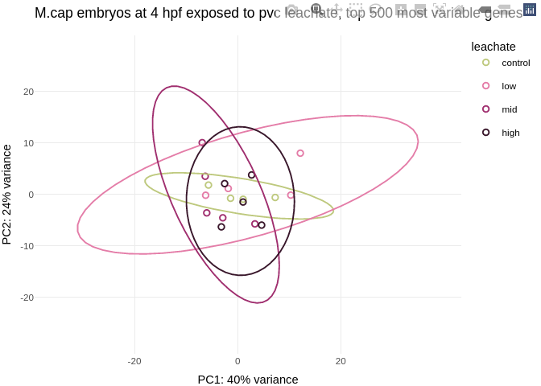

#### parent

``` r
# Plot PCA
PCA_4 <- ggplot(pca_4, aes(PC1, PC2, color=parents)) + 
  geom_point(size=2, alpha = 0.8) +
  ggtitle("M.cap embryos at 4 hpf exposed to pvc leachate, top 500 most variable genes") +
  xlab(paste0("PC1: ",percentVar_4[1],"% variance")) +
  ylab(paste0("PC2: ",percentVar_4[2],"% variance")) + 
  coord_fixed() +
  stat_ellipse()+
  theme_minimal()

PCA_4
```

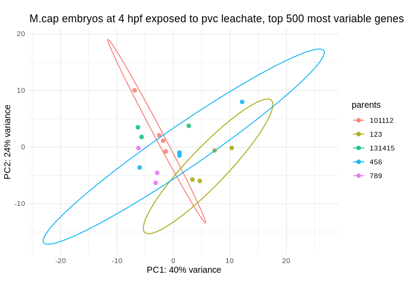

### Clusters

``` r
rdists <- dist(t(assay(rld_4)))
plot(hclust(rdists))
```

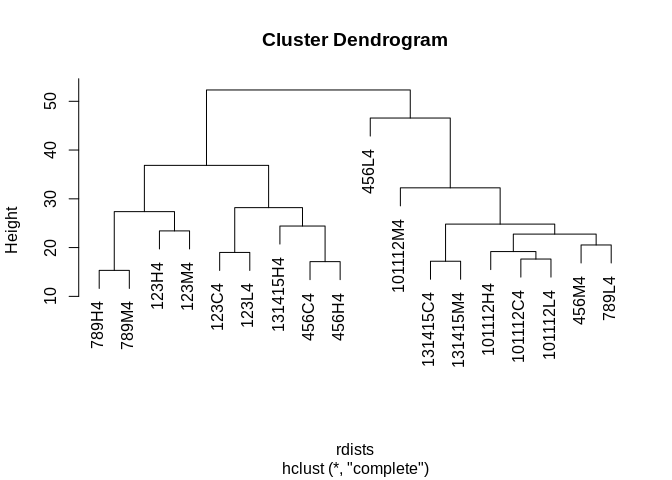

### Heatmap

``` r
# 1. Select the top 50 genes by mean expression
top_genes <- order(rowMeans(counts(dds_4, normalized = TRUE)), decreasing = TRUE)[1:50]

# 2. Extract rlog-transformed matrix
rlog_matrix <- assay(rld_4)[top_genes, ]

# 3. Extract only leachate annotation
annotation_df <- as.data.frame(colData(dds_4)[, "leachate", drop = FALSE])

# Ensure it's a factor in correct order: control, high
annotation_df$leachate <- factor(annotation_df$leachate, levels = c("control", "low", "mid", "high"))

# 4. Order samples by leachate
ordered_cols <- order(annotation_df$leachate)

# Reorder matrix and annotation
rlog_matrix_ordered <- rlog_matrix[, ordered_cols]
annotation_ordered <- annotation_df[ordered_cols, , drop = FALSE]

# 5. Plot heatmap
heatmap_colors <- colorRampPalette(rev(brewer.pal(n = 9, "RdYlBu")))(100)

pheatmap(
  rlog_matrix_ordered,
  cluster_rows = FALSE,
  cluster_cols = FALSE,
  show_rownames = FALSE,
  annotation_col = annotation_ordered,
  annotation_colors = list(
    leachate = leachate_colors
  ),
  color = heatmap_colors,
  main = "4hpf: Top 50 Most Expressed Genes"
)
```

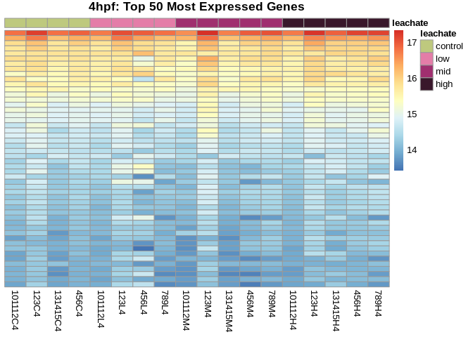

### RUVSeq?

https://bioconductor.org/packages/release/bioc/vignettes/RUVSeq/inst/doc/RUVSeq.html

## Run DESeq2

``` r
dds_4 <- DESeq(dds_4)
```

``` r
resultsNames(dds_4)
```

    [1] "Intercept"                "leachate_low_vs_control" 
    [3] "leachate_mid_vs_control"  "leachate_high_vs_control"

### Effect of low vs control

``` r
# output results of contrast
res_4_low_v_control <- (results(dds_4, name = "leachate_low_vs_control", alpha=0.05)
)

summary(res_4_low_v_control)
```


    out of 8540 with nonzero total read count
    adjusted p-value < 0.05
    LFC > 0 (up)       : 0, 0%
    LFC < 0 (down)     : 0, 0%
    outliers [1]       : 12, 0.14%
    low counts [2]     : 0, 0%
    (mean count < 62)
    [1] see 'cooksCutoff' argument of ?results
    [2] see 'independentFiltering' argument of ?results

### Effect of mid vs control

``` r
# output results of contrast
res_4_mid_v_control <- (results(dds_4, name = "leachate_mid_vs_control", alpha=0.05)
)

summary(res_4_mid_v_control)
```


    out of 8540 with nonzero total read count
    adjusted p-value < 0.05
    LFC > 0 (up)       : 0, 0%
    LFC < 0 (down)     : 0, 0%
    outliers [1]       : 12, 0.14%
    low counts [2]     : 0, 0%
    (mean count < 62)
    [1] see 'cooksCutoff' argument of ?results
    [2] see 'independentFiltering' argument of ?results

### Effect of high vs control

``` r
# output results of contrast
res_4_high_v_control <- (results(dds_4, name = "leachate_high_vs_control", alpha=0.05)
)

summary(res_4_high_v_control)
```


    out of 8540 with nonzero total read count
    adjusted p-value < 0.05
    LFC > 0 (up)       : 0, 0%
    LFC < 0 (down)     : 0, 0%
    outliers [1]       : 12, 0.14%
    low counts [2]     : 0, 0%
    (mean count < 62)
    [1] see 'cooksCutoff' argument of ?results
    [2] see 'independentFiltering' argument of ?results

### Effect of low vs mid

``` r
# output results of contrast
res_4_low_v_mid <- (results(dds_4, contrast = 
                              list(c("leachate_low_vs_control", "leachate_mid_vs_control"))
                            )
                    )

summary(res_4_low_v_mid)
```


    out of 8540 with nonzero total read count
    adjusted p-value < 0.1
    LFC > 0 (up)       : 0, 0%
    LFC < 0 (down)     : 0, 0%
    outliers [1]       : 12, 0.14%
    low counts [2]     : 0, 0%
    (mean count < 62)
    [1] see 'cooksCutoff' argument of ?results
    [2] see 'independentFiltering' argument of ?results

### Effect of low vs high

``` r
# output results of contrast
res_4_low_v_high <- (results(dds_4, contrast = 
                              list(c("leachate_low_vs_control", "leachate_high_vs_control"))
                            )
                    )

summary(res_4_low_v_high)
```


    out of 8540 with nonzero total read count
    adjusted p-value < 0.1
    LFC > 0 (up)       : 0, 0%
    LFC < 0 (down)     : 0, 0%
    outliers [1]       : 12, 0.14%
    low counts [2]     : 0, 0%
    (mean count < 62)
    [1] see 'cooksCutoff' argument of ?results
    [2] see 'independentFiltering' argument of ?results

### Effect of mid vs high

``` r
# output results of contrast
res_4_mid_v_high <- (results(dds_4, contrast = 
                              list(c("leachate_mid_vs_control", "leachate_high_vs_control"))
                            )
                    )

summary(res_4_mid_v_high)
```


    out of 8540 with nonzero total read count
    adjusted p-value < 0.1
    LFC > 0 (up)       : 0, 0%
    LFC < 0 (down)     : 0, 0%
    outliers [1]       : 12, 0.14%
    low counts [2]     : 0, 0%
    (mean count < 62)
    [1] see 'cooksCutoff' argument of ?results
    [2] see 'independentFiltering' argument of ?results

# 9 hpf

## Format metadata

``` r
str(metadata_9)
```

    'data.frame':   21 obs. of  7 variables:
     $ sample_name    : chr  "101112C9" "101112H9" "101112L9" "101112M9" ...
     $ parents        : int  101112 101112 101112 101112 123 123 123 123 131415 131415 ...
     $ group          : chr  "C9" "H9" "L9" "M9" ...
     $ hpf            : int  9 9 9 9 9 9 9 9 9 9 ...
     $ embryonic_stage: chr  "prawnchip" "prawnchip" "prawnchip" "prawnchip" ...
     $ leachate       : chr  "control" "high" "low" "mid" ...
     $ leachate_mgL   : num  0 1 0.01 0.1 0 1 0.01 0.1 0 1 ...

``` r
# Reorder leachate factor
metadata_9$leachate <- as.factor(metadata_9$leachate)
metadata_9$leachate <- fct_relevel(metadata_9$leachate, "control", "low", "mid", "high")

# Make parents a character string
metadata_9$parents <- as.character(metadata_9$parents)
str(metadata_9)
```

    'data.frame':   21 obs. of  7 variables:
     $ sample_name    : chr  "101112C9" "101112H9" "101112L9" "101112M9" ...
     $ parents        : chr  "101112" "101112" "101112" "101112" ...
     $ group          : chr  "C9" "H9" "L9" "M9" ...
     $ hpf            : int  9 9 9 9 9 9 9 9 9 9 ...
     $ embryonic_stage: chr  "prawnchip" "prawnchip" "prawnchip" "prawnchip" ...
     $ leachate       : Factor w/ 4 levels "control","low",..: 1 4 2 3 1 4 2 3 1 4 ...
     $ leachate_mgL   : num  0 1 0.01 0.1 0 1 0.01 0.1 0 1 ...

## Filter low read

``` r
# Filter rows where at least 75% of the columns have a raw count of at least 15
gcm_9_filt <- gcm_9 %>%
  filter(rowSums(across(everything(), ~ . > 50)) >= 0.75 * ncol(gcm_9))
nrow(gcm_9_filt)
```

    [1] 11509

## Make DESeq Object

Make [DESeq Dataset Object from Count
Matrix](https://bioconductor.org/packages/devel/bioc/vignettes/DESeq2/inst/doc/DESeq2.html#count-matrix-input)
Create a DESeqDataSet design from gene count matrix and treatment
conditions.

``` r
dds_9 <- DESeqDataSetFromMatrix(countData = gcm_9_filt,
                              colData = metadata_9, 
                              design = ~leachate)

dds_9 <- estimateSizeFactors(dds_9)
```

Are all size factors less than 4?

``` r
all(sizeFactors(dds_9))<4
```

    [1] TRUE

### Count transformations

Make count transformations (for use in visualizations & clustering)

``` r
rld_9 <- rlog(dds_9, blind = FALSE) 
vsd_9 <- vst(dds_9, blind = FALSE)
log2_9 <- as.data.frame(log2(counts(dds_9, normalized = TRUE) + 1), check.names = FALSE)
```

The distribution should shift via the transformation from a negative
binomial to a approximately normal distribution.

``` r
# Combine all transformations into one long-format dataframe
df_9 <- bind_rows(
  as.data.frame(log2(counts(dds_9, normalized = TRUE) + 1)) %>%
    mutate(transformation = "log2(x + 1)"),
  as.data.frame(assay(vsd_9)) %>%
    mutate(transformation = "vst"),
  as.data.frame(assay(rld_9)) %>%
    mutate(transformation = "rlog")
)

# Pivot to long format: one row per expression value
df_long <- df_9 %>%
  pivot_longer(
    cols = -transformation,
    names_to = "sample",
    values_to = "expression"
  )

# Plot
ggplot(df_long, aes(x = expression)) +
  geom_histogram(bins = 100, fill = "steelblue") +
  facet_wrap(~ transformation) +
  theme_classic() +
  labs(
    title = "Distribution of Transformed Counts Across All Samples (9 hpf)",
    x = "Transformed counts",
    y = "Frequency"
  )
```

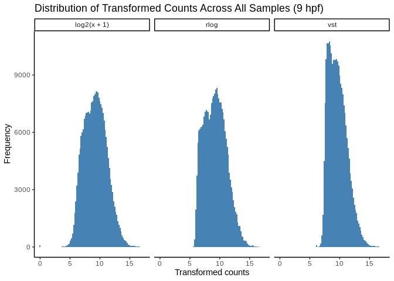

### PCA

#### static

``` r
# Get PCA data (top 500 DEGs by default)
pca_9 <- plotPCA(rld_9, intgroup = "group", returnData = TRUE)
percentVar_9 <- round(100*attr(pca_9, "percentVar"))

# Merge with metadata
pca_9 <- merge(pca_9, metadata_9, by.x = "name", by.y = "sample_name", all.x = TRUE)

# Assign specific colors to each leachate
leachate_colors <- c(
  "control" = flex("green", sat = 200),
  "low" = flex("magenta", sat = 300),
  "mid" = flex("magenta", sat = 600),
  "high" = flex("magenta", sat = 900)
)

# Plot PCA
PCA_9 <- ggplot(pca_9, aes(PC1, PC2, color=leachate)) + 
  geom_point(size=2, alpha = 0.8) +
  ggtitle("M.cap embryos at 9 hpf exposed to pvc leachate, top 500 most variable genes") +
  xlab(paste0("PC1: ",percentVar_9[1],"% variance")) +
  ylab(paste0("PC2: ",percentVar_9[2],"% variance")) + 
  coord_fixed() +
  scale_color_manual(values=leachate_colors)+
  stat_ellipse()+
  theme_minimal()

PCA_9
```

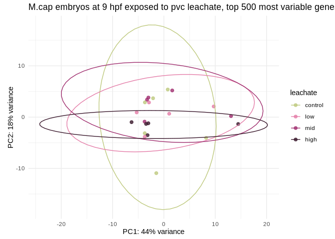

#### tooltip

``` r
pca_9$label <- paste0("Sample: ", pca_9$sample_name,
                        "\nLeachate: ", pca_9$leachate)

# Original ggplot with an interactive tooltip aesthetic
PCA_9 <- ggplot(pca_9, aes(PC1, PC2, color = leachate, label = name)) + 
  geom_point(shape = 21, size = 2) +
  ggtitle("M.cap embryos at 9 hpf exposed to pvc leachate, top 500 most variable genes") +
  xlab(paste0("PC1: ", percentVar_9[1], "% variance")) +
  ylab(paste0("PC2: ", percentVar_9[2], "% variance")) + 
  coord_fixed() +
  scale_color_manual(values = leachate_colors) +
  stat_ellipse() + 
  guides(alpha = "none") +  # hide alpha legend (optional)
  theme_minimal()

# Convert to interactive plot
ggplotly(PCA_9, tooltip = "label")
```

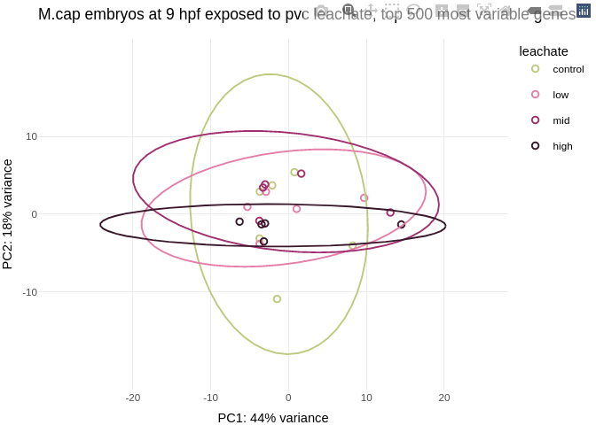

#### parent

``` r
# Plot PCA
PCA_9 <- ggplot(pca_9, aes(PC1, PC2, color=parents)) + 
  geom_point(size=2, alpha = 0.8) +
  ggtitle("M.cap embryos at 9 hpf exposed to pvc leachate, top 500 most variable genes") +
  xlab(paste0("PC1: ",percentVar_9[1],"% variance")) +
  ylab(paste0("PC2: ",percentVar_9[2],"% variance")) + 
  coord_fixed() +
  stat_ellipse()+
  theme_minimal()

PCA_9
```

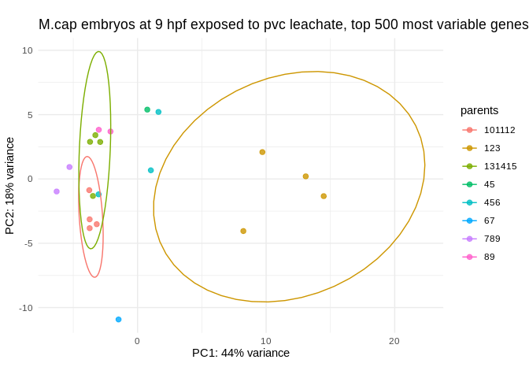

### Clusters

``` r
rdists <- dist(t(assay(rld_9)))
plot(hclust(rdists))
```

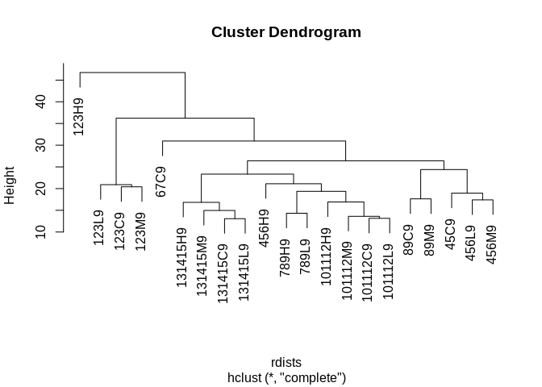

### Heatmap

``` r
# 1. Select the top 50 genes by mean expression
top_genes <- order(rowMeans(counts(dds_9, normalized = TRUE)), decreasing = TRUE)[1:50]

# 2. Extract rlog-transformed matrix
rlog_matrix <- assay(rld_9)[top_genes, ]

# 3. Extract only leachate annotation
annotation_df <- as.data.frame(colData(dds_9)[, "leachate", drop = FALSE])

# Ensure it's a factor in correct order: control, high
annotation_df$leachate <- factor(annotation_df$leachate, levels = c("control", "low", "mid", "high"))

# 9. Order samples by leachate
ordered_cols <- order(annotation_df$leachate)

# Reorder matrix and annotation
rlog_matrix_ordered <- rlog_matrix[, ordered_cols]
annotation_ordered <- annotation_df[ordered_cols, , drop = FALSE]
```

``` r
# 5. Plot heatmap
heatmap_colors <- colorRampPalette(rev(brewer.pal(n = 9, "RdYlBu")))(100)

pheatmap(
  rlog_matrix_ordered,
  cluster_rows = FALSE,
  cluster_cols = FALSE,
  show_rownames = FALSE,
  annotation_col = annotation_ordered,
  annotation_colors = list(
    leachate = leachate_colors
  ),
  color = heatmap_colors,
  main = "9hpf: Top 50 Most Expressed Genes"
)
```

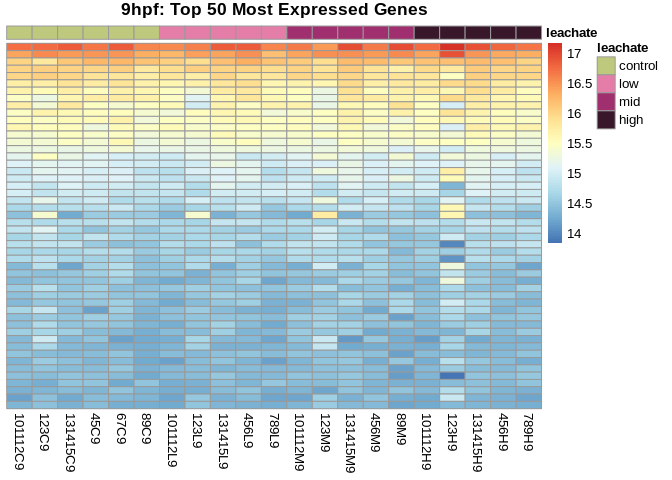

### RUVSeq?

https://bioconductor.org/packages/release/bioc/vignettes/RUVSeq/inst/doc/RUVSeq.html

## Run DESeq2

``` r
dds_9 <- DESeq(dds_9)
```

``` r
resultsNames(dds_9)
```

    [1] "Intercept"                "leachate_low_vs_control" 
    [3] "leachate_mid_vs_control"  "leachate_high_vs_control"

### Effect of low vs control

``` r
# output results of contrast
res_9_low_v_control <- (results(dds_9, name = "leachate_low_vs_control", alpha=0.05)
)

summary(res_9_low_v_control)
```


    out of 11509 with nonzero total read count
    adjusted p-value < 0.05
    LFC > 0 (up)       : 0, 0%
    LFC < 0 (down)     : 0, 0%
    outliers [1]       : 2, 0.017%
    low counts [2]     : 0, 0%
    (mean count < 55)
    [1] see 'cooksCutoff' argument of ?results
    [2] see 'independentFiltering' argument of ?results

### Effect of mid vs control

``` r
# output results of contrast
res_9_mid_v_control <- (results(dds_9, name = "leachate_mid_vs_control", alpha=0.05)
)

summary(res_9_mid_v_control)
```


    out of 11509 with nonzero total read count
    adjusted p-value < 0.05
    LFC > 0 (up)       : 0, 0%
    LFC < 0 (down)     : 0, 0%
    outliers [1]       : 2, 0.017%
    low counts [2]     : 0, 0%
    (mean count < 55)
    [1] see 'cooksCutoff' argument of ?results
    [2] see 'independentFiltering' argument of ?results

### Effect of high vs control

``` r
# output results of contrast
res_9_high_v_control <- (results(dds_9, name = "leachate_high_vs_control", alpha=0.05)
)

summary(res_9_high_v_control)
```


    out of 11509 with nonzero total read count
    adjusted p-value < 0.05
    LFC > 0 (up)       : 0, 0%
    LFC < 0 (down)     : 0, 0%
    outliers [1]       : 2, 0.017%
    low counts [2]     : 0, 0%
    (mean count < 55)
    [1] see 'cooksCutoff' argument of ?results
    [2] see 'independentFiltering' argument of ?results

### Effect of low vs mid

``` r
# output results of contrast
res_9_low_v_mid <- (results(dds_9, contrast = 
                              list(c("leachate_low_vs_control", "leachate_mid_vs_control"))
                            )
                    )

summary(res_9_low_v_mid)
```


    out of 11509 with nonzero total read count
    adjusted p-value < 0.1
    LFC > 0 (up)       : 0, 0%
    LFC < 0 (down)     : 0, 0%
    outliers [1]       : 2, 0.017%
    low counts [2]     : 0, 0%
    (mean count < 55)
    [1] see 'cooksCutoff' argument of ?results
    [2] see 'independentFiltering' argument of ?results

### Effect of low vs high

``` r
# output results of contrast
res_9_low_v_high <- (results(dds_9, contrast = 
                              list(c("leachate_low_vs_control", "leachate_high_vs_control"))
                            )
                    )

summary(res_9_low_v_high)
```


    out of 11509 with nonzero total read count
    adjusted p-value < 0.1
    LFC > 0 (up)       : 0, 0%
    LFC < 0 (down)     : 0, 0%
    outliers [1]       : 2, 0.017%
    low counts [2]     : 0, 0%
    (mean count < 55)
    [1] see 'cooksCutoff' argument of ?results
    [2] see 'independentFiltering' argument of ?results

### Effect of mid vs high

``` r
# output results of contrast
res_9_mid_v_high <- (results(dds_9, contrast = 
                              list(c("leachate_mid_vs_control", "leachate_high_vs_control"))
                            )
                    )

summary(res_9_mid_v_high)
```


    out of 11509 with nonzero total read count
    adjusted p-value < 0.1
    LFC > 0 (up)       : 0, 0%
    LFC < 0 (down)     : 0, 0%
    outliers [1]       : 2, 0.017%
    low counts [2]     : 0, 0%
    (mean count < 55)
    [1] see 'cooksCutoff' argument of ?results
    [2] see 'independentFiltering' argument of ?results

# 14 hpf

## Format metadata

``` r
str(metadata_14)
```

    'data.frame':   22 obs. of  7 variables:
     $ sample_name    : chr  "101112C14" "101112H14" "101112L14" "101112M14" ...
     $ parents        : int  101112 101112 101112 101112 123 123 123 131415 131415 131415 ...
     $ group          : chr  "C14" "H14" "L14" "M14" ...
     $ hpf            : int  14 14 14 14 14 14 14 14 14 14 ...
     $ embryonic_stage: chr  "earlygastrula" "earlygastrula" "earlygastrula" "earlygastrula" ...
     $ leachate       : chr  "control" "high" "low" "mid" ...
     $ leachate_mgL   : num  0 1 0.01 0.1 0 1 0.01 0 1 0.01 ...

``` r
# Reorder leachate factor
metadata_14$leachate <- as.factor(metadata_14$leachate)
metadata_14$leachate <- fct_relevel(metadata_14$leachate, "control", "low", "mid", "high")

# Make parents a character string
metadata_14$parents <- as.character(metadata_14$parents)
str(metadata_14)
```

    'data.frame':   22 obs. of  7 variables:
     $ sample_name    : chr  "101112C14" "101112H14" "101112L14" "101112M14" ...
     $ parents        : chr  "101112" "101112" "101112" "101112" ...
     $ group          : chr  "C14" "H14" "L14" "M14" ...
     $ hpf            : int  14 14 14 14 14 14 14 14 14 14 ...
     $ embryonic_stage: chr  "earlygastrula" "earlygastrula" "earlygastrula" "earlygastrula" ...
     $ leachate       : Factor w/ 4 levels "control","low",..: 1 4 2 3 1 4 2 1 4 2 ...
     $ leachate_mgL   : num  0 1 0.01 0.1 0 1 0.01 0 1 0.01 ...

## Filter low read

``` r
# Filter rows where at least 75% of the columns have a raw count of at least 15
gcm_14_filt <- gcm_14 %>%
  filter(rowSums(across(everything(), ~ . > 50)) >= 0.75 * ncol(gcm_14))
nrow(gcm_14_filt)
```

    [1] 12421

## Make DESeq Object

Make [DESeq Dataset Object from Count
Matrix](https://bioconductor.org/packages/devel/bioc/vignettes/DESeq2/inst/doc/DESeq2.html#count-matrix-input)
Create a DESeqDataSet design from gene count matrix and treatment
conditions.

``` r
dds_14 <- DESeqDataSetFromMatrix(countData = gcm_14_filt,
                              colData = metadata_14, 
                              design = ~leachate)

dds_14 <- estimateSizeFactors(dds_14)
```

Are all size factors less than 4?

``` r
all(sizeFactors(dds_14))<4
```

    [1] TRUE

### Count transformations

Make count transformations (for use in visualizations & clustering)

``` r
rld_14 <- rlog(dds_14, blind = FALSE) 
vsd_14 <- vst(dds_14, blind = FALSE)
log2_14 <- as.data.frame(log2(counts(dds_14, normalized = TRUE) + 1), check.names = FALSE)
```

### PCA

#### static

``` r
# Get PCA data (top 500 DEGs by default)
pca_14 <- plotPCA(rld_14, intgroup = "group", returnData = TRUE)
percentVar_14 <- round(100*attr(pca_14, "percentVar"))

# Merge with metadata
pca_14 <- merge(pca_14, metadata_14, by.x = "name", by.y = "sample_name", all.x = TRUE)

# Assign specific colors to each leachate
leachate_colors <- c(
  "control" = flex("green", sat = 200),
  "low" = flex("magenta", sat = 300),
  "mid" = flex("magenta", sat = 600),
  "high" = flex("magenta", sat = 900)
)

# Plot PCA
PCA_14 <- ggplot(pca_14, aes(PC1, PC2, color=leachate)) + 
  geom_point(size=2, alpha = 0.8) +
  ggtitle("M.cap embryos at 14 hpf exposed to pvc leachate, top 500 most variable genes") +
  xlab(paste0("PC1: ",percentVar_14[1],"% variance")) +
  ylab(paste0("PC2: ",percentVar_14[2],"% variance")) + 
  coord_fixed() +
  scale_color_manual(values=leachate_colors)+
  stat_ellipse()+
  theme_minimal()

PCA_14
```

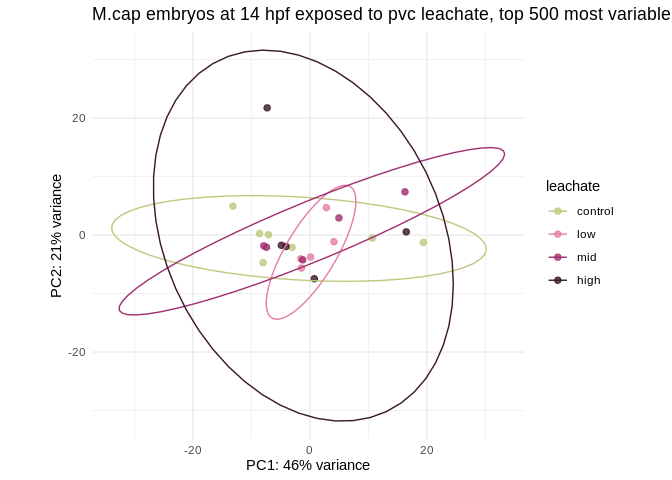

#### tooltip

``` r
pca_14$label <- paste0("Sample: ", pca_14$sample_name,
                        "\nLeachate: ", pca_14$leachate)

# Original ggplot with an interactive tooltip aesthetic
PCA_14 <- ggplot(pca_14, aes(PC1, PC2, color = leachate, label = name)) + 
  geom_point(shape = 21, size = 2) +
  ggtitle("M.cap embryos at 14 hpf exposed to pvc leachate, top 500 most variable genes") +
  xlab(paste0("PC1: ", percentVar_14[1], "% variance")) +
  ylab(paste0("PC2: ", percentVar_14[2], "% variance")) + 
  coord_fixed() +
  scale_color_manual(values = leachate_colors) +
  stat_ellipse() + 
  guides(alpha = "none") +  # hide alpha legend (optional)
  theme_minimal()

# Convert to interactive plot
ggplotly(PCA_14, tooltip = "label")
```

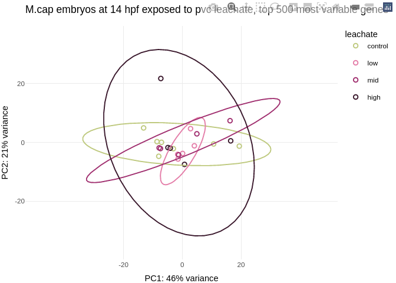

#### parent

``` r
# Plot PCA
PCA_14 <- ggplot(pca_14, aes(PC1, PC2, color=parents)) + 
  geom_point(size=2, alpha = 0.8) +
  ggtitle("M.cap embryos at 14 hpf exposed to pvc leachate, top 500 most variable genes") +
  xlab(paste0("PC1: ",percentVar_14[1],"% variance")) +
  ylab(paste0("PC2: ",percentVar_14[2],"% variance")) + 
  coord_fixed() +
  stat_ellipse()+
  theme_minimal()

PCA_14
```

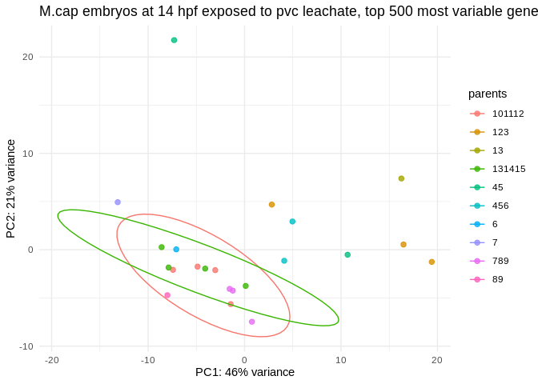

### Clusters

``` r
rdists <- dist(t(assay(rld_14)))
plot(hclust(rdists))
```

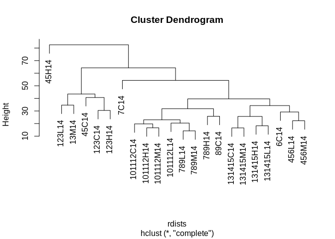

### Heatmap

``` r
# 1. Select the top 50 genes by mean expression
top_genes <- order(rowMeans(counts(dds_14, normalized = TRUE)), decreasing = TRUE)[1:50]

# 2. Extract rlog-transformed matrix
rlog_matrix <- assay(rld_14)[top_genes, ]

# 3. Extract only leachate annotation
annotation_df <- as.data.frame(colData(dds_14)[, "leachate", drop = FALSE])

# Ensure it's a factor in correct order: control, high
annotation_df$leachate <- factor(annotation_df$leachate, levels = c("control", "low", "mid", "high"))

# 14. Order samples by leachate
ordered_cols <- order(annotation_df$leachate)

# Reorder matrix and annotation
rlog_matrix_ordered <- rlog_matrix[, ordered_cols]
annotation_ordered <- annotation_df[ordered_cols, , drop = FALSE]
```

``` r
# 5. Plot heatmap
heatmap_colors <- colorRampPalette(rev(brewer.pal(n = 14, "RdYlBu")))(100)

pheatmap(
  rlog_matrix_ordered,
  cluster_rows = FALSE,
  cluster_cols = FALSE,
  show_rownames = FALSE,
  annotation_col = annotation_ordered,
  annotation_colors = list(
    leachate = leachate_colors
  ),
  color = heatmap_colors,
  main = "14hpf: Top 50 Most Expressed Genes"
)
```

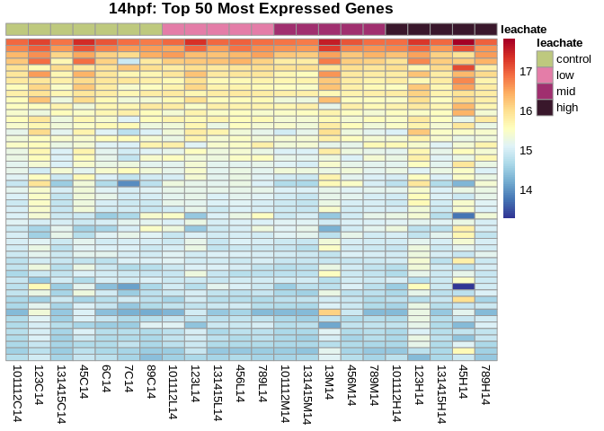

### RUVSeq?

https://bioconductor.org/packages/release/bioc/vignettes/RUVSeq/inst/doc/RUVSeq.html

## Run DESeq2

``` r
dds_14 <- DESeq(dds_14)
```

``` r
resultsNames(dds_14)
```

    [1] "Intercept"                "leachate_low_vs_control" 
    [3] "leachate_mid_vs_control"  "leachate_high_vs_control"

### Effect of low vs control

``` r
# output results of contrast
res_14_low_v_control <- (results(dds_14, name = "leachate_low_vs_control", alpha=0.05)
)

summary(res_14_low_v_control)
```


    out of 12421 with nonzero total read count
    adjusted p-value < 0.05
    LFC > 0 (up)       : 0, 0%
    LFC < 0 (down)     : 0, 0%
    outliers [1]       : 94, 0.76%
    low counts [2]     : 0, 0%
    (mean count < 54)
    [1] see 'cooksCutoff' argument of ?results
    [2] see 'independentFiltering' argument of ?results

### Effect of mid vs control

``` r
# output results of contrast
res_14_mid_v_control <- (results(dds_14, name = "leachate_mid_vs_control", alpha=0.05)
)

summary(res_14_mid_v_control)
```


    out of 12421 with nonzero total read count
    adjusted p-value < 0.05
    LFC > 0 (up)       : 0, 0%
    LFC < 0 (down)     : 0, 0%
    outliers [1]       : 94, 0.76%
    low counts [2]     : 0, 0%
    (mean count < 54)
    [1] see 'cooksCutoff' argument of ?results
    [2] see 'independentFiltering' argument of ?results

### Effect of high vs control

``` r
# output results of contrast
res_14_high_v_control <- (results(dds_14, name = "leachate_high_vs_control", alpha=0.05)
)

summary(res_14_high_v_control)
```


    out of 12421 with nonzero total read count
    adjusted p-value < 0.05
    LFC > 0 (up)       : 0, 0%
    LFC < 0 (down)     : 0, 0%
    outliers [1]       : 94, 0.76%
    low counts [2]     : 0, 0%
    (mean count < 54)
    [1] see 'cooksCutoff' argument of ?results
    [2] see 'independentFiltering' argument of ?results

### Effect of low vs mid

``` r
# output results of contrast
res_14_low_v_mid <- (results(dds_14, contrast = 
                              list(c("leachate_low_vs_control", "leachate_mid_vs_control"))
                            )
                    )

summary(res_14_low_v_mid)
```


    out of 12421 with nonzero total read count
    adjusted p-value < 0.1
    LFC > 0 (up)       : 0, 0%
    LFC < 0 (down)     : 0, 0%
    outliers [1]       : 94, 0.76%
    low counts [2]     : 0, 0%
    (mean count < 54)
    [1] see 'cooksCutoff' argument of ?results
    [2] see 'independentFiltering' argument of ?results

### Effect of low vs high

``` r
# output results of contrast
res_14_low_v_high <- (results(dds_14, contrast = 
                              list(c("leachate_low_vs_control", "leachate_high_vs_control"))
                            )
                    )

summary(res_14_low_v_high)
```


    out of 12421 with nonzero total read count
    adjusted p-value < 0.1
    LFC > 0 (up)       : 0, 0%
    LFC < 0 (down)     : 0, 0%
    outliers [1]       : 94, 0.76%
    low counts [2]     : 0, 0%
    (mean count < 54)
    [1] see 'cooksCutoff' argument of ?results
    [2] see 'independentFiltering' argument of ?results

### Effect of mid vs high

``` r
# output results of contrast
res_14_mid_v_high <- (results(dds_14, contrast = 
                              list(c("leachate_mid_vs_control", "leachate_high_vs_control"))
                            )
                    )

summary(res_14_mid_v_high)
```


    out of 12421 with nonzero total read count
    adjusted p-value < 0.1
    LFC > 0 (up)       : 0, 0%
    LFC < 0 (down)     : 0, 0%
    outliers [1]       : 94, 0.76%
    low counts [2]     : 0, 0%
    (mean count < 54)
    [1] see 'cooksCutoff' argument of ?results
    [2] see 'independentFiltering' argument of ?results

# Summary

> 🤔 Why might you get zero significant genes? Here are common
> reasons: - Weak or no true signal: The effect size may be small, or
> there’s genuinely no strong differential expression. - Insufficient
> power: Not enough replicates or high within-group variability. - Wrong
> contrast or factor levels: If you’re not testing the right comparison,
> you might get no signal. - Batch effects / confounding: Noise can
> drown out signal if not modeled properly.
