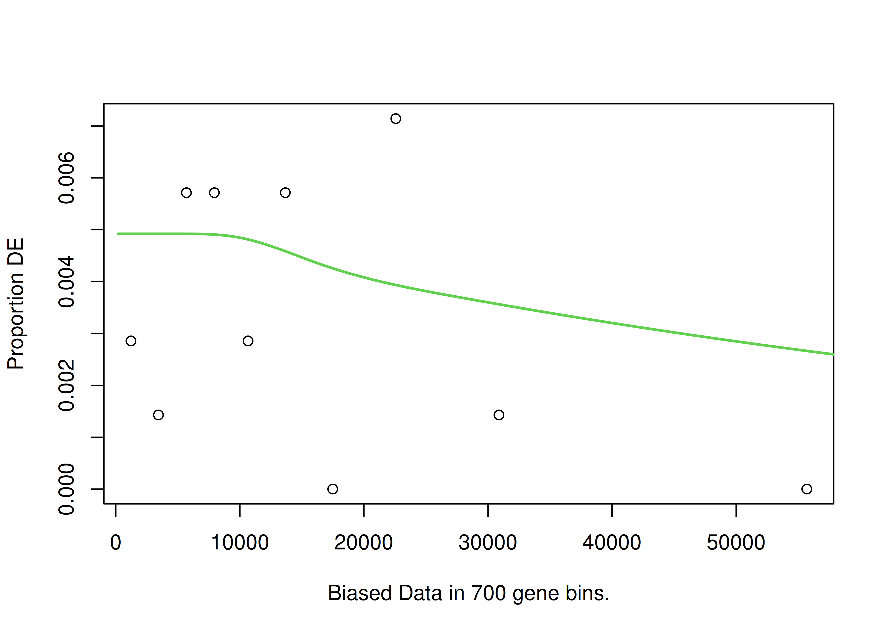
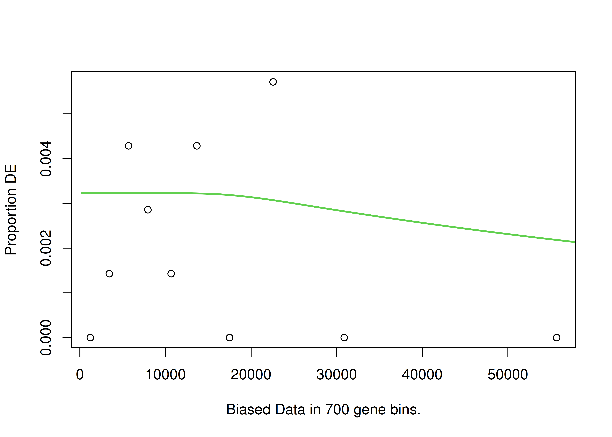
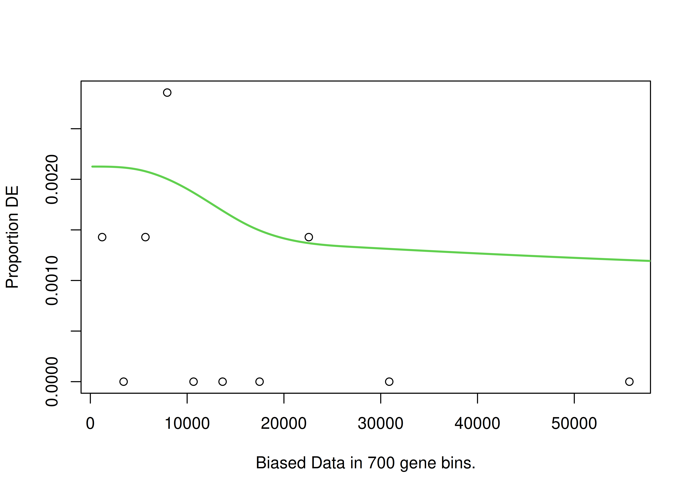
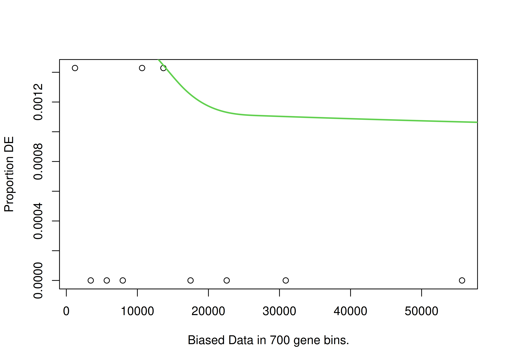
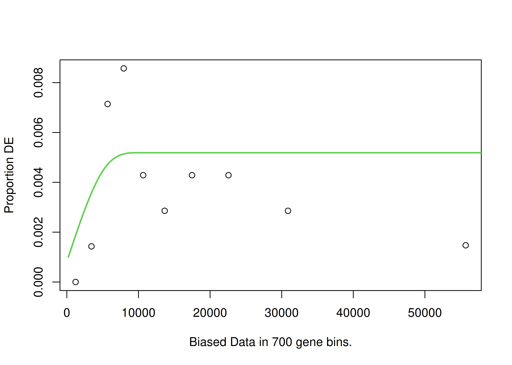
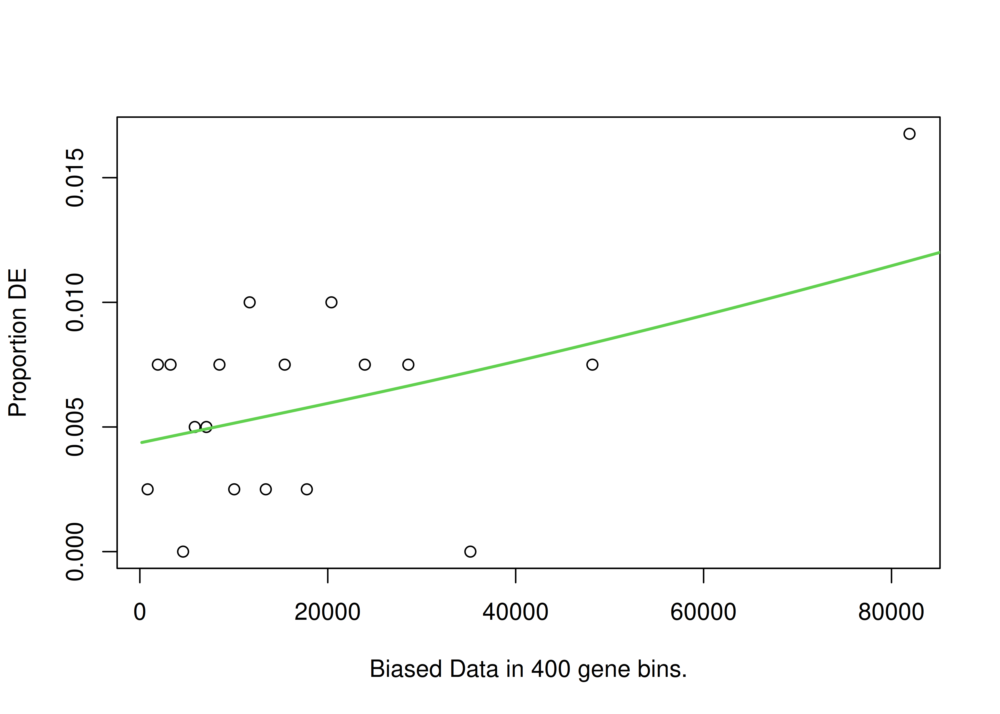
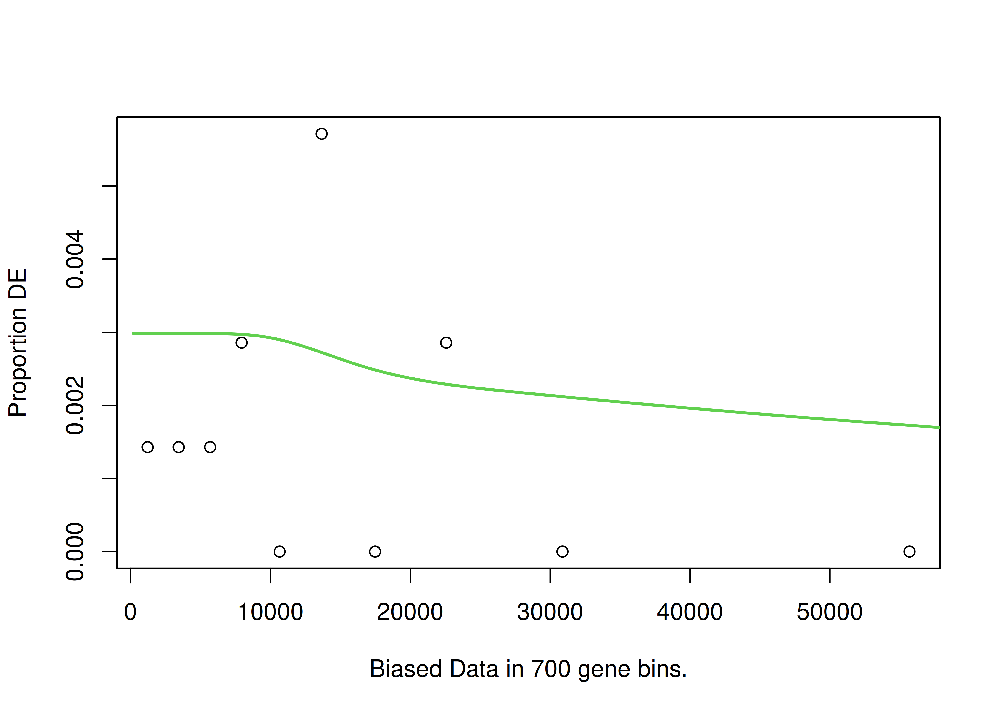
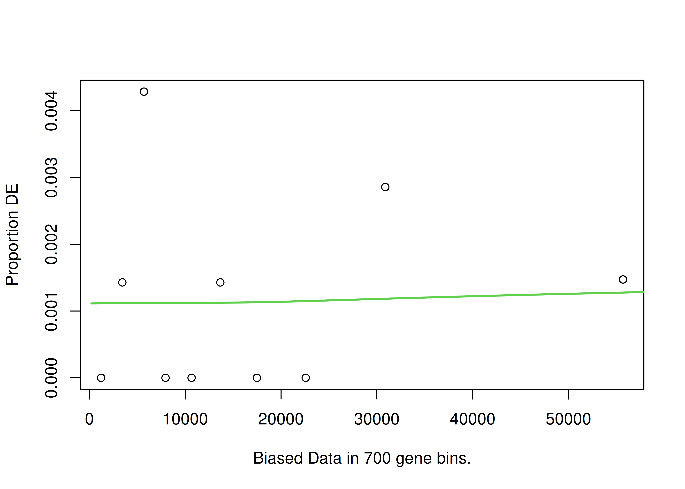

# Gene ontology (GO) term analysis
Sarah Tanja
2025-06-17

# Background

We identified 44 genes that were broadly impacted by leachate across all
stages (meaning transcript abundance of those genes were significantly
different in at least one dose of leachate compared to the control in at
least one stage). Here we want to know what those genes do!

We do this using the R package `goseq`. Why is `goseq` different from
other enrichment tools? Typical enrichment methods (like Fisher’s exact
test or hypergeometric tests) assume that every gene has an equal
probability of being selected as a DEG. But in RNA-Seq longer genes are
more likely to be detected as DEGs just because they accumulate more
reads. `goseq` corrects for this bias.

## Inputs

- `LRT_significant_genes_combined_wald.csv` A dataframe of the 44 genes
  and their LRT and Wald test statistics

- functional annotation:
  http://cyanophora.rutgers.edu/montipora/Montipora_capitata_HIv3.genes.EggNog_results.txt.gz
  (EggNog)

- functional annotation
  http://cyanophora.rutgers.edu/montipora/Montipora_capitata_HIv3.genes.KEGG_results.txt.gz
  (KEGG)

- `output/06_deg/interactions/clusters.csv` A dataframe mapping our 44
  significant leachate interaction genes to 4 main gene expression
  response patterns…. The genes cluster into these 4 patterns:

  

## Outputs

# Setup

## Install packages

``` r
if ("Biostrings" %in% rownames(installed.packages()) == 'FALSE') install.packages('Biostrings')
if ("tidyverse" %in% rownames(installed.packages()) == 'FALSE') install.packages('tidyverse')
if ("goseq" %in% rownames(installed.packages()) == 'FALSE') install.packages('goseq')
install.packages("GOplot")
remotes::install_github("mdscheuerell/flexoki")
```

``` r
if (!require("BiocManager", quietly = TRUE))
    install.packages("BiocManager")
BiocManager::install("GenomicRanges")
BiocManager::install("goseq")
BiocManager::install("GO.db")
BiocManager::install("rrvgo")
BiocManager::install("org.Ce.eg.db") # c.elegens genome-wide annotation
BiocManager::install("AnnotationForge")
BiocManager::install("GOSemSim")
```

## Load packages

``` r
library(GenomicRanges)
library(Biostrings)
library(goseq)
library(rrvgo)
library(org.Ce.eg.db)
library(GO.db)
library(GOplot)
library(AnnotationForge)
library(GOSemSim)
library(tidyverse)
library(flexoki)
library(plotly)
```

## Load inputs

Read in gene lists and counts

``` r
# interaction
all_genes <- read.csv("../../output/06_deg/interactions/all_genes.csv")
sig_genes <- read.csv("../../output/06_deg/interactions/sig_genes.csv")
sig_counts <- read.csv("../../output/06_deg/interactions/sig_counts.csv", row.names="gene_id", check.names = FALSE)

# contrasts
sig_lvc_cl <- read_csv("../../output/06_deg/contrasts/sig_lvc_cl.csv")
sig_mvc_cl <- read_csv("../../output/06_deg/contrasts/sig_mvc_cl.csv")
sig_hvc_cl <- read_csv("../../output/06_deg/contrasts/sig_hvc_cl.csv")
sig_hvc_eg <- read_csv("../../output/06_deg/contrasts/sig_hvc_eg.csv")
```

Read in pattern clusters

``` r
int_deg_patterns <- read.csv("../../output/06_deg/interactions/clusters.csv")
```

Import fasta

``` r
# Load your transcriptome
all_seqs <- readDNAStringSet("../../input/genome/Montipora_capitata_HIv3.assembly.fasta")  

# Filter for the 44 significant interaction genes
sig_seqs <- all_seqs[names(all_seqs) %in% sig_genes]
```

``` r
# Save to new FASTA file
writeXStringSet(sig_seqs, "../../output/08_go/significant_genes.fasta")
```

Download annotation & enrichment files

> [!NOTE]
>
> Only need to do this once!

``` bash
cd ../../input/annotations

wget http://cyanophora.rutgers.edu/montipora/Montipora_capitata_HIv3.genes.EggNog_results.txt.gz
wget http://cyanophora.rutgers.edu/montipora/Montipora_capitata_HIv3.genes.KEGG_results.txt.gz
```

Unzip

> [!NOTE]
>
> Only need to do this once!

``` bash
cd ../../input/annotations
gunzip *.gz
```

Import EggNog to R environment

``` r
# Read in the file (it will include "#query" as a column name)
EggNog_anno <- read_tsv("../../input/annotations/Montipora_capitata_HIv3.genes.EggNog_results.txt")
```

rename “\#query” to `gene_id`

``` r
EggNog_anno <- EggNog_anno %>%
  rename(gene_id="#query")

nrow(EggNog_anno)
```

    [1] 24072

``` r
names(EggNog_anno)
```

     [1] "gene_id"        "seed_ortholog"  "evalue"         "score"         
     [5] "eggNOG_OGs"     "max_annot_lvl"  "COG_category"   "Description"   
     [9] "Preferred_name" "GOs"            "EC"             "KEGG_ko"       
    [13] "KEGG_Pathway"   "KEGG_Module"    "KEGG_Reaction"  "KEGG_rclass"   
    [17] "BRITE"          "KEGG_TC"        "CAZy"           "BiGG_Reaction" 
    [21] "PFAMs"         

> This functional annotation has 24,072 genes. This is 44% of total
> protein predicted genes described in the publication associated with
> this annotation.
> https://academic.oup.com/gigascience/article/doi/10.1093/gigascience/giac098/6815755

# Annotate significant genes

Match up genes in sig_genes dataframe to annotation dataframe

> [!NOTE]
>
> An `inner_join()` only keeps observations from `x` that have a
> matching key in `y`. The most important property of an inner join is
> that unmatched rows in either input are not included in the result.

## Interactions

sig_genes \> sig_genes_anno \> sig_genes_annofilt

``` r
# Annotate the interaction gene list
sig_genes_anno <- inner_join(sig_genes, EggNog_anno, by = "gene_id")

# Filter out any that lack GO term annotation
sig_genes_annofilt <- sig_genes_anno %>% 
  mutate(GOs = na_if(str_trim(GOs), "-")) %>% # treat "-" as missing and trim whitespace
  filter(!is.na(GOs), GOs != "") # keep only rows that have GO terms (remove NA and blank)
```

``` r
paste("Annotated interaction genes:", 
      nrow(sig_genes_anno), "/", 
      nrow(sig_genes), "=",
      round(100*nrow(sig_genes_anno)/nrow(sig_genes),1),"%")
```

    [1] "Annotated interaction genes: 37 / 44 = 84.1 %"

``` r
paste("GO annotated interaction genes:", 
      nrow(sig_genes_annofilt), "/", 
      nrow(sig_genes), "=",
      round(100*nrow(sig_genes_annofilt)/nrow(sig_genes),1),"%")
```

    [1] "GO annotated interaction genes: 23 / 44 = 52.3 %"

> [!IMPORTANT]
>
> - 37 of the 44 (84.1%) significant interaction genes were in the
>   `EggNog_anno` dataframe!
>
> - 23 of the 44 (52.3%) actually had GO terms

## Contrasts

``` r
# Annotate the contrast gene lists
sig_lvc_cl_anno <- inner_join(sig_lvc_cl, EggNog_anno, by = "gene_id")
sig_mvc_cl_anno <- inner_join(sig_mvc_cl, EggNog_anno, by = "gene_id")
sig_hvc_cl_anno <- inner_join(sig_hvc_cl, EggNog_anno, by = "gene_id")
sig_hvc_eg_anno <- inner_join(sig_hvc_eg, EggNog_anno, by = "gene_id")

# Filter out any that lack GO term annotation
sig_lvc_cl_annofilt <- sig_lvc_cl_anno %>% 
  mutate(GOs = na_if(str_trim(GOs), "-")) %>% # treat "-" as missing and trim whitespace
  filter(!is.na(GOs), GOs != "") # keep only rows that have GO terms (remove NA and blank)

sig_mvc_cl_annofilt <- sig_mvc_cl_anno %>% 
  mutate(GOs = na_if(str_trim(GOs), "-")) %>% # treat "-" as missing and trim whitespace
  filter(!is.na(GOs), GOs != "") # keep only rows that have GO terms (remove NA and blank)

sig_hvc_cl_annofilt <- sig_hvc_cl_anno %>% 
  mutate(GOs = na_if(str_trim(GOs), "-")) %>% # treat "-" as missing and trim whitespace
  filter(!is.na(GOs), GOs != "") # keep only rows that have GO terms (remove NA and blank)

sig_hvc_eg_annofilt <- sig_hvc_eg_anno %>% 
  mutate(GOs = na_if(str_trim(GOs), "-")) %>% # treat "-" as missing and trim whitespace
  filter(!is.na(GOs), GOs != "") # keep only rows that have GO terms (remove NA and blank)
```

``` r
# Low vs control (cleavage)
paste("Annotated low vs control cleavage:", 
      nrow(sig_lvc_cl_anno),"/", 
      nrow(sig_lvc_cl),"=",
      round(100*nrow(sig_lvc_cl_anno)/nrow(sig_lvc_cl),1),"%")
```

    [1] "Annotated low vs control cleavage: 36 / 39 = 92.3 %"

``` r
paste("GO annotated low vs control cleavage:", 
      nrow(sig_lvc_cl_annofilt),"/", 
      nrow(sig_lvc_cl),"=",
      round(100*nrow(sig_lvc_cl_annofilt)/nrow(sig_lvc_cl),1),"%")
```

    [1] "GO annotated low vs control cleavage: 26 / 39 = 66.7 %"

``` r
# Mid vs control (cleavage)
paste("Annotated mid vs control cleavage:", 
      nrow(sig_mvc_cl_anno), "/", 
      nrow(sig_mvc_cl),"=",
      round(100*nrow(sig_mvc_cl_anno)/nrow(sig_mvc_cl),1),"%")
```

    [1] "Annotated mid vs control cleavage: 56 / 77 = 72.7 %"

``` r
paste("GO annotated mid vs control cleavage:", 
      nrow(sig_mvc_cl_annofilt), "/", 
      nrow(sig_mvc_cl),"=",
      round(100*nrow(sig_mvc_cl_annofilt)/nrow(sig_mvc_cl),1),"%")
```

    [1] "GO annotated mid vs control cleavage: 40 / 77 = 51.9 %"

``` r
# High vs control (cleavage)
paste("Annotated high vs control cleavage:", 
      nrow(sig_hvc_cl_anno), "/", 
      nrow(sig_hvc_cl),"=",
      round(100*nrow(sig_hvc_cl_anno)/nrow(sig_hvc_cl),1),"%")
```

    [1] "Annotated high vs control cleavage: 16 / 18 = 88.9 %"

``` r
paste("GO annotated high vs control cleavage:", 
      nrow(sig_hvc_cl_annofilt), "/", 
      nrow(sig_hvc_cl),"=",
      round(100*nrow(sig_hvc_cl_annofilt)/nrow(sig_hvc_cl),1),"%")
```

    [1] "GO annotated high vs control cleavage: 11 / 18 = 61.1 %"

``` r
# High vs control (early gastrula)
paste("Annotated high vs control early gastrula:", 
      nrow(sig_hvc_eg_anno), "/", 
      nrow(sig_hvc_eg),"=",
      round(100*nrow(sig_hvc_eg_anno)/nrow(sig_hvc_eg),1),"%")
```

    [1] "Annotated high vs control early gastrula: 10 / 13 = 76.9 %"

``` r
paste("GO annotated high vs control early gastrula:", 
      nrow(sig_hvc_eg_annofilt), "/", 
      nrow(sig_hvc_eg),"=",
      round(100*nrow(sig_hvc_eg_annofilt)/nrow(sig_hvc_eg),1),"%")
```

    [1] "GO annotated high vs control early gastrula: 8 / 13 = 61.5 %"

> [!IMPORTANT]
>
> ### Results
>
> - 36 of the 39 (92.3%) significant low vs control cleavage genes were
>   in the `EggNog_anno` dataframe!
>
> - 26 of the 39 (66.7%) were annotated with GO terms
>
> - 56 of the 77 (72.7%) significant mid vs control cleavage genes were
>   in the `EggNog_anno` dataframe!
>
> - 40 of the 77 (51.9%) were annotated with GO terms
>
> - 16 of the 18 (88.9%) significant high vs control cleavage genes were
>   in the `EggNog_anno` dataframe!
>
> - 11 of the 18 (61.1%) were annotated with GO terms
>
> - 10 of the 13 (76.9%) significant high vs control early gastrula
>   genes were in the `EggNog_anno` dataframe!
>
> - 8 of the 13 (61.5%) were annotated with GO terms

> [!IMPORTANT]
>
> 23 of the 44 significant genes were annotated with GO terms! The
> annotation file `sig_genes_annofilt` dataframe now only contains genes
> that were significant *and* have GO annotation information.
>
> Previously I didn’t filter out the genes with NA GO terms and my
> results were different… not sure why that is as I select only the GOs
> in the mapping step. I think it’s because I included genes without GOs
> in the universe for bias correction. I’ve changed this so that I
> filter out any that lack GO terms.
>
> One bummer about this is the category ‘response to chemical’ dropped…
> which was a category that made biological sense to the leachate
> pollution exposure.

## Get gene lengths

``` r
#import file
gff <- rtracklayer::import("../../input/genome/Montipora_capitata_HIv3.genes_fixed.gff3") #if this doesn't work, restart R and try again 

transcripts <- subset(gff, type == "transcript") #keep only transcripts 

transcripts_gr <- makeGRangesFromDataFrame(transcripts, keep.extra.columns=TRUE) #extract length information

transcript_lengths <- width(transcripts_gr) #isolate length of each gene

gene_id <- transcripts_gr$ID #extract list of gene id 

lengths <- cbind(gene_id, transcript_lengths)

lengths <- as.data.frame(lengths) #convert to data frame
```

Add in length to the annotation dataframes

``` r
# Interaction genes
sig_genes_af <- sig_genes_annofilt %>% left_join(lengths, by = "gene_id")

# Contrasts
sig_lvc_cl_af <- sig_lvc_cl_annofilt %>% left_join(lengths, by = "gene_id")
sig_mvc_cl_af <- sig_mvc_cl_annofilt %>% left_join(lengths, by = "gene_id")
sig_hvc_cl_af <- sig_hvc_cl_annofilt %>% left_join(lengths, by = "gene_id")
sig_hvc_eg_af <- sig_hvc_eg_annofilt %>% left_join(lengths, by = "gene_id")
```

## Add interaction deg pattern clusters

Add column indicating deg pattern (1-4)

``` r
sig_genes_afp <- inner_join(sig_genes_af, int_deg_patterns, by = "gene_id")
str(sig_genes_afp)
```

    'data.frame':   23 obs. of  36 variables:
     $ gene_id                  : chr  "Montipora_capitata_HIv3___TS.g26493.t2a" "Montipora_capitata_HIv3___RNAseq.g5198.t1" "Montipora_capitata_HIv3___RNAseq.g6929.t1" "Montipora_capitata_HIv3___RNAseq.g7017.t1" ...
     $ prawnchip_high_log2FC    : num  -3.435 2.579 -0.608 -0.509 5.763 ...
     $ prawnchip_high_padj      : num  0.9996 0.7138 0.9996 0.9996 0.0262 ...
     $ prawnchip_mid_log2FC     : num  -7.67 -0.28 -0.816 -3.894 1.04 ...
     $ prawnchip_mid_padj       : num  6.47e-06 1.00 1.23e-01 4.36e-02 1.00 ...
     $ prawnchip_low_log2FC     : num  -6.27 1.94 -0.13 2.68 -0.23 ...
     $ prawnchip_low_padj       : num  0.00308 0.95276 0.99971 0.99971 0.99971 ...
     $ earlygastrula_high_log2FC: num  -3.697 2.723 -0.842 -1.03 6.273 ...
     $ earlygastrula_high_padj  : num  0.855 0.3468 0.1387 0.9997 0.0027 ...
     $ earlygastrula_mid_log2FC : num  -7.602 -0.491 -0.788 -3.612 1.21 ...
     $ earlygastrula_mid_padj   : num  6.49e-06 1.00 7.20e-02 NA NA ...
     $ earlygastrula_low_log2FC : num  -5.992 1.734 -0.408 2.03 -0.153 ...
     $ earlygastrula_low_padj   : num  0.00414 0.73669 0.805 0.82336 0.98416 ...
     $ any_sig                  : logi  TRUE FALSE FALSE TRUE TRUE FALSE ...
     $ seed_ortholog            : chr  "45351.EDO39808" "45351.EDO32632" "7739.XP_002592334.1" "45351.EDO38082" ...
     $ evalue                   : num  1.17e-147 1.37e-257 1.98e-124 2.50e-305 1.20e-70 ...
     $ score                    : num  424 729 364 856 222 175 565 517 192 108 ...
     $ eggNOG_OGs               : chr  "COG0543@1|root,KOG0534@2759|Eukaryota,38GQ8@33154|Opisthokonta,3BEKR@33208|Metazoa" "COG0514@1|root,KOG0353@2759|Eukaryota,39KMJ@33154|Opisthokonta,3CNVK@33208|Metazoa" "COG0164@1|root,KOG2299@2759|Eukaryota,38CTA@33154|Opisthokonta,3BF6H@33208|Metazoa,3CWR5@33213|Bilateria,47ZQ8@7711|Chordata" "COG0339@1|root,KOG2089@2759|Eukaryota,38SFI@33154|Opisthokonta,3B98M@33208|Metazoa" ...
     $ max_annot_lvl            : chr  "33208|Metazoa" "33208|Metazoa" "33208|Metazoa" "33208|Metazoa" ...
     $ COG_category             : chr  "C" "L" "L" "O" ...
     $ Description              : chr  "cytochrome-b5 reductase activity, acting on NAD(P)H" "Belongs to the helicase family. RecQ subfamily" "DNA replication, removal of RNA primer" "metalloendopeptidase activity" ...
     $ Preferred_name           : chr  "CYB5R3" "RECQL" "RNASEH2A" "-" ...
     $ GOs                      : chr  "GO:0000166,GO:0000323,GO:0001775,GO:0001878,GO:0002252,GO:0002263,GO:0002274,GO:0002275,GO:0002283,GO:0002366,G"| __truncated__ "GO:0000724,GO:0000725,GO:0000733,GO:0003674,GO:0003676,GO:0003677,GO:0003678,GO:0003824,GO:0004003,GO:0004386,G"| __truncated__ "GO:0003674,GO:0003824,GO:0004518,GO:0004519,GO:0004521,GO:0004523,GO:0004540,GO:0005575,GO:0005622,GO:0005623,G"| __truncated__ "GO:0003674,GO:0003824,GO:0004175,GO:0004222,GO:0005575,GO:0005622,GO:0005623,GO:0005737,GO:0005739,GO:0005740,G"| __truncated__ ...
     $ EC                       : chr  "1.6.2.2" "3.6.4.12" "3.1.26.4" "3.4.24.70" ...
     $ KEGG_ko                  : chr  "ko:K00326" "ko:K10899" "ko:K10743" "ko:K01414,ko:K08202" ...
     $ KEGG_Pathway             : chr  "ko00520,map00520" "-" "ko03030,map03030" "ko05231,map05231" ...
     $ KEGG_Module              : chr  "-" "-" "-" "-" ...
     $ KEGG_Reaction            : chr  "R00100" "-" "-" "-" ...
     $ KEGG_rclass              : chr  "-" "-" "-" "-" ...
     $ BRITE                    : chr  "ko00000,ko00001,ko01000" "ko00000,ko01000,ko03400" "ko00000,ko00001,ko01000,ko03032" "ko00000,ko00001,ko01000,ko01002,ko02000" ...
     $ KEGG_TC                  : chr  "-" "-" "-" "2.A.1.19.2,2.A.1.19.3" ...
     $ CAZy                     : chr  "-" "-" "-" "-" ...
     $ BiGG_Reaction            : chr  "-" "-" "-" "-" ...
     $ PFAMs                    : chr  "FAD_binding_6,NAD_binding_1" "DEAD,Helicase_C,RQC,RecQ_Zn_bind" "RNase_HII" "Peptidase_M3" ...
     $ transcript_lengths       : chr  "18020" "13493" "3622" "27999" ...
     $ leachate_cluster         : int  1 1 1 2 3 1 2 3 1 1 ...

Subset annotated dataframe to each deg pattern (1-4)

``` r
sig_genes_af1 <- sig_genes_afp %>% 
  filter(leachate_cluster == 1)

sig_genes_af2 <- sig_genes_afp %>% 
  filter(leachate_cluster == 2)

sig_genes_af3 <- sig_genes_afp %>% 
  filter(leachate_cluster == 3)

sig_genes_af4 <- sig_genes_afp %>% 
  filter(leachate_cluster == 4)

nrow(sig_genes_af1)
```

    [1] 14

``` r
nrow(sig_genes_af2)
```

    [1] 5

``` r
nrow(sig_genes_af3)
```

    [1] 3

``` r
nrow(sig_genes_af4)
```

    [1] 1

> [!NOTE]
>
> All interaction genes with GO annotations: 23
>
> DGE pattern 1 : 14 genes
>
> DGE pattern 2: 5 genes
>
> DGE pattern 3: 3 genes
>
> DGE pattern 4: 1 gene
>
> It doesn’t seem like it would be appropriate to do functional
> enrichment on 1 gene… Maybe I should go back to the dg code and
> increase the minimum number of genes assigned to a pattern to bin more
> genes together. Ex. I’m certain that the 1 gene in pattern 4 would bin
> most closely with the others in pattern 3.
>
> > NOPE.. that’s not how the clustering works… it just drops the genes
> > that don’t meet the pattern similarity, it doesn’t group them in to
> > ‘close enough’ pattern. We’ll stick with the 4 patterns. And see
> > what happens with functional enrichment of 1 gene….
>
> JK can’t do it with 1 gene! Have to simply report functional
> annotation.

# Get annotation for ONE gene

``` r
# Print nicely
knitr::kable(t(sig_genes_af4), col.names = c("Annotation"))
```

|                           | Annotation                                                                                                                                                                                                                                                                                                                                                                                                                                                                                                                                                                                                                                                                                                                                                                                                                                                                                                                                                                                                                                                                                                                                                                              |
|:--------------------------|:----------------------------------------------------------------------------------------------------------------------------------------------------------------------------------------------------------------------------------------------------------------------------------------------------------------------------------------------------------------------------------------------------------------------------------------------------------------------------------------------------------------------------------------------------------------------------------------------------------------------------------------------------------------------------------------------------------------------------------------------------------------------------------------------------------------------------------------------------------------------------------------------------------------------------------------------------------------------------------------------------------------------------------------------------------------------------------------------------------------------------------------------------------------------------------------|
| gene_id                   | Montipora_capitata_HIv3\_\_\_TS.g15697.t1                                                                                                                                                                                                                                                                                                                                                                                                                                                                                                                                                                                                                                                                                                                                                                                                                                                                                                                                                                                                                                                                                                                                               |
| prawnchip_high_log2FC     | -0.7921954                                                                                                                                                                                                                                                                                                                                                                                                                                                                                                                                                                                                                                                                                                                                                                                                                                                                                                                                                                                                                                                                                                                                                                              |
| prawnchip_high_padj       | 0.9996309                                                                                                                                                                                                                                                                                                                                                                                                                                                                                                                                                                                                                                                                                                                                                                                                                                                                                                                                                                                                                                                                                                                                                                               |
| prawnchip_mid_log2FC      | -0.3528228                                                                                                                                                                                                                                                                                                                                                                                                                                                                                                                                                                                                                                                                                                                                                                                                                                                                                                                                                                                                                                                                                                                                                                              |
| prawnchip_mid_padj        | 0.9999932                                                                                                                                                                                                                                                                                                                                                                                                                                                                                                                                                                                                                                                                                                                                                                                                                                                                                                                                                                                                                                                                                                                                                                               |
| prawnchip_low_log2FC      | 5.714333                                                                                                                                                                                                                                                                                                                                                                                                                                                                                                                                                                                                                                                                                                                                                                                                                                                                                                                                                                                                                                                                                                                                                                                |
| prawnchip_low_padj        | 0.009065834                                                                                                                                                                                                                                                                                                                                                                                                                                                                                                                                                                                                                                                                                                                                                                                                                                                                                                                                                                                                                                                                                                                                                                             |
| earlygastrula_high_log2FC | -0.2356104                                                                                                                                                                                                                                                                                                                                                                                                                                                                                                                                                                                                                                                                                                                                                                                                                                                                                                                                                                                                                                                                                                                                                                              |
| earlygastrula_high_padj   | 0.9997162                                                                                                                                                                                                                                                                                                                                                                                                                                                                                                                                                                                                                                                                                                                                                                                                                                                                                                                                                                                                                                                                                                                                                                               |
| earlygastrula_mid_log2FC  | -0.666113                                                                                                                                                                                                                                                                                                                                                                                                                                                                                                                                                                                                                                                                                                                                                                                                                                                                                                                                                                                                                                                                                                                                                                               |
| earlygastrula_mid_padj    | NA                                                                                                                                                                                                                                                                                                                                                                                                                                                                                                                                                                                                                                                                                                                                                                                                                                                                                                                                                                                                                                                                                                                                                                                      |
| earlygastrula_low_log2FC  | 5.603631                                                                                                                                                                                                                                                                                                                                                                                                                                                                                                                                                                                                                                                                                                                                                                                                                                                                                                                                                                                                                                                                                                                                                                                |
| earlygastrula_low_padj    | 0.00909326                                                                                                                                                                                                                                                                                                                                                                                                                                                                                                                                                                                                                                                                                                                                                                                                                                                                                                                                                                                                                                                                                                                                                                              |
| any_sig                   | TRUE                                                                                                                                                                                                                                                                                                                                                                                                                                                                                                                                                                                                                                                                                                                                                                                                                                                                                                                                                                                                                                                                                                                                                                                    |
| seed_ortholog             | 45351.EDO33172                                                                                                                                                                                                                                                                                                                                                                                                                                                                                                                                                                                                                                                                                                                                                                                                                                                                                                                                                                                                                                                                                                                                                                          |
| evalue                    | 4.1e-84                                                                                                                                                                                                                                                                                                                                                                                                                                                                                                                                                                                                                                                                                                                                                                                                                                                                                                                                                                                                                                                                                                                                                                                 |
| score                     | 278                                                                                                                                                                                                                                                                                                                                                                                                                                                                                                                                                                                                                                                                                                                                                                                                                                                                                                                                                                                                                                                                                                                                                                                     |
| eggNOG_OGs                | KOG0401@1\|root,KOG0401@2759\|Eukaryota,38BXU@33154\|Opisthokonta,3B9GC@33208\|Metazoa                                                                                                                                                                                                                                                                                                                                                                                                                                                                                                                                                                                                                                                                                                                                                                                                                                                                                                                                                                                                                                                                                                  |
| max_annot_lvl             | 33208\|Metazoa                                                                                                                                                                                                                                                                                                                                                                                                                                                                                                                                                                                                                                                                                                                                                                                                                                                                                                                                                                                                                                                                                                                                                                          |
| COG_category              | J                                                                                                                                                                                                                                                                                                                                                                                                                                                                                                                                                                                                                                                                                                                                                                                                                                                                                                                                                                                                                                                                                                                                                                                       |
| Description               | regulation of mRNA cap binding                                                                                                                                                                                                                                                                                                                                                                                                                                                                                                                                                                                                                                                                                                                                                                                                                                                                                                                                                                                                                                                                                                                                                          |
| Preferred_name            | Eif4g                                                                                                                                                                                                                                                                                                                                                                                                                                                                                                                                                                                                                                                                                                                                                                                                                                                                                                                                                                                                                                                                                                                                                                                   |
| GOs                       | GO:0000003,GO:0000280,GO:0000339,GO:0000340,GO:0003006,GO:0003674,GO:0003676,GO:0003723,GO:0003743,GO:0005488,GO:0005515,GO:0005575,GO:0005622,GO:0005623,GO:0005737,GO:0005829,GO:0006412,GO:0006413,GO:0006417,GO:0006518,GO:0006807,GO:0006996,GO:0007049,GO:0007140,GO:0007276,GO:0007281,GO:0007283,GO:0008135,GO:0008150,GO:0008152,GO:0008190,GO:0008283,GO:0009058,GO:0009059,GO:0009889,GO:0009987,GO:0010467,GO:0010468,GO:0010556,GO:0010608,GO:0016043,GO:0016281,GO:0019222,GO:0019538,GO:0019953,GO:0022402,GO:0022412,GO:0022414,GO:0030154,GO:0031323,GO:0031326,GO:0031369,GO:0032268,GO:0032501,GO:0032502,GO:0032504,GO:0032991,GO:0034248,GO:0034641,GO:0034645,GO:0043043,GO:0043170,GO:0043603,GO:0043604,GO:0044237,GO:0044238,GO:0044249,GO:0044260,GO:0044267,GO:0044271,GO:0044424,GO:0044444,GO:0044464,GO:0044703,GO:0048134,GO:0048136,GO:0048137,GO:0048232,GO:0048285,GO:0048468,GO:0048515,GO:0048609,GO:0048856,GO:0048869,GO:0050789,GO:0050794,GO:0051171,GO:0051246,GO:0051301,GO:0051321,GO:0051704,GO:0060255,GO:0065007,GO:0071704,GO:0071840,GO:0080090,GO:0097159,GO:0140013,GO:1901363,GO:1901564,GO:1901566,GO:1901576,GO:1903046,GO:2000112 |
| EC                        | \-                                                                                                                                                                                                                                                                                                                                                                                                                                                                                                                                                                                                                                                                                                                                                                                                                                                                                                                                                                                                                                                                                                                                                                                      |
| KEGG_ko                   | ko:K03260                                                                                                                                                                                                                                                                                                                                                                                                                                                                                                                                                                                                                                                                                                                                                                                                                                                                                                                                                                                                                                                                                                                                                                               |
| KEGG_Pathway              | ko03013,ko05416,map03013,map05416                                                                                                                                                                                                                                                                                                                                                                                                                                                                                                                                                                                                                                                                                                                                                                                                                                                                                                                                                                                                                                                                                                                                                       |
| KEGG_Module               | M00428                                                                                                                                                                                                                                                                                                                                                                                                                                                                                                                                                                                                                                                                                                                                                                                                                                                                                                                                                                                                                                                                                                                                                                                  |
| KEGG_Reaction             | \-                                                                                                                                                                                                                                                                                                                                                                                                                                                                                                                                                                                                                                                                                                                                                                                                                                                                                                                                                                                                                                                                                                                                                                                      |
| KEGG_rclass               | \-                                                                                                                                                                                                                                                                                                                                                                                                                                                                                                                                                                                                                                                                                                                                                                                                                                                                                                                                                                                                                                                                                                                                                                                      |
| BRITE                     | ko00000,ko00001,ko00002,ko03012,ko03019                                                                                                                                                                                                                                                                                                                                                                                                                                                                                                                                                                                                                                                                                                                                                                                                                                                                                                                                                                                                                                                                                                                                                 |
| KEGG_TC                   | \-                                                                                                                                                                                                                                                                                                                                                                                                                                                                                                                                                                                                                                                                                                                                                                                                                                                                                                                                                                                                                                                                                                                                                                                      |
| CAZy                      | \-                                                                                                                                                                                                                                                                                                                                                                                                                                                                                                                                                                                                                                                                                                                                                                                                                                                                                                                                                                                                                                                                                                                                                                                      |
| BiGG_Reaction             | \-                                                                                                                                                                                                                                                                                                                                                                                                                                                                                                                                                                                                                                                                                                                                                                                                                                                                                                                                                                                                                                                                                                                                                                                      |
| PFAMs                     | MA3,MIF4G,W2                                                                                                                                                                                                                                                                                                                                                                                                                                                                                                                                                                                                                                                                                                                                                                                                                                                                                                                                                                                                                                                                                                                                                                            |
| transcript_lengths        | 11394                                                                                                                                                                                                                                                                                                                                                                                                                                                                                                                                                                                                                                                                                                                                                                                                                                                                                                                                                                                                                                                                                                                                                                                   |
| leachate_cluster          | 4                                                                                                                                                                                                                                                                                                                                                                                                                                                                                                                                                                                                                                                                                                                                                                                                                                                                                                                                                                                                                                                                                                                                                                                       |

``` r
cat(paste(
  "Gene", sig_genes_af4$gene_id, "is described as", sig_genes_af4$Description, ".",
  "GO terms:", sig_genes_af4$GOs, ".",
  "KEGG pathways:", sig_genes_af4$KEGG_Pathway, ".",
  "COG category:", sig_genes_af4$COG_category, ".",
  "PFAMs:", sig_genes_af4$PFAMs
))
```

    Gene Montipora_capitata_HIv3___TS.g15697.t1 is described as regulation of mRNA cap binding . GO terms: GO:0000003,GO:0000280,GO:0000339,GO:0000340,GO:0003006,GO:0003674,GO:0003676,GO:0003723,GO:0003743,GO:0005488,GO:0005515,GO:0005575,GO:0005622,GO:0005623,GO:0005737,GO:0005829,GO:0006412,GO:0006413,GO:0006417,GO:0006518,GO:0006807,GO:0006996,GO:0007049,GO:0007140,GO:0007276,GO:0007281,GO:0007283,GO:0008135,GO:0008150,GO:0008152,GO:0008190,GO:0008283,GO:0009058,GO:0009059,GO:0009889,GO:0009987,GO:0010467,GO:0010468,GO:0010556,GO:0010608,GO:0016043,GO:0016281,GO:0019222,GO:0019538,GO:0019953,GO:0022402,GO:0022412,GO:0022414,GO:0030154,GO:0031323,GO:0031326,GO:0031369,GO:0032268,GO:0032501,GO:0032502,GO:0032504,GO:0032991,GO:0034248,GO:0034641,GO:0034645,GO:0043043,GO:0043170,GO:0043603,GO:0043604,GO:0044237,GO:0044238,GO:0044249,GO:0044260,GO:0044267,GO:0044271,GO:0044424,GO:0044444,GO:0044464,GO:0044703,GO:0048134,GO:0048136,GO:0048137,GO:0048232,GO:0048285,GO:0048468,GO:0048515,GO:0048609,GO:0048856,GO:0048869,GO:0050789,GO:0050794,GO:0051171,GO:0051246,GO:0051301,GO:0051321,GO:0051704,GO:0060255,GO:0065007,GO:0071704,GO:0071840,GO:0080090,GO:0097159,GO:0140013,GO:1901363,GO:1901564,GO:1901566,GO:1901576,GO:1903046,GO:2000112 . KEGG pathways: ko03013,ko05416,map03013,map05416 . COG category: J . PFAMs: MA3,MIF4G,W2

<div class="column-margin">

# Can you do GO enrichment on 1 gene?

No, you cannot meaningfully perform GO enrichment analysis on just one
gene.

Here’s why:

GO enrichment is a statistical test: The goal is to see whether certain
GO terms are overrepresented in a list of genes (e.g., your DEGs)
compared to a background/universe set of genes. This requires comparing
the frequency of GO terms in your gene set to their frequency in the
background. With only 1 gene, there is no enrichment: There are no
“frequencies” or “overrepresentation” to test—your single gene either
has a GO term or it doesn’t. Any statistical test (like Fisher’s exact
test, hypergeometric test, or Wallenius test) will be meaningless, since
there is no distribution to compare. Most GO tools will either error or
trivially return the GO terms of your one gene: Some packages might run,
but the result just mirrors the annotation of that gene, not an
enrichment or statistical significance. What should you do?

If you have only one gene in a cluster/pattern, you should just report
its functional annotation—not attempt enrichment. If you want to do GO
enrichment, you need a reasonably sized gene list (ideally \>10, but
minimum at least 3–5 genes for very basic results). In summary: GO
enrichment analysis is not appropriate for a single gene. Just report
the GO terms for that gene directly.

</div>

Map GO term IDs to names/descriptions for a single gene 1. Extract GO
term IDs

``` r
# Extract the GO term string
go_string <- sig_genes_af4$GOs[1]

# Split into a character vector of GO IDs
go_ids <- unlist(strsplit(go_string, ","))
head(go_ids)
```

    [1] "GO:0000003" "GO:0000280" "GO:0000339" "GO:0000340" "GO:0003006"
    [6] "GO:0003674"

2.  Use `GO.db` to map IDs to names

``` r
# Make sure GO IDs are character
go_ids <- as.character(go_ids)

# Get names (may return NA for obsolete/unmapped terms)
go_names <- Term(go_ids)

# Combine into a dataframe for reporting
go_map <- data.frame(GO_ID = go_ids, GO_Name = go_names, stringsAsFactors = FALSE)

# Preview
head(go_map, 10)
```

            GO_ID                                        GO_Name
    1  GO:0000003                                   reproduction
    2  GO:0000280                               nuclear division
    3  GO:0000339                                RNA cap binding
    4  GO:0000340              RNA 7-methylguanosine cap binding
    5  GO:0003006 developmental process involved in reproduction
    6  GO:0003674                             molecular_function
    7  GO:0003676                           nucleic acid binding
    8  GO:0003723                                    RNA binding
    9  GO:0003743         translation initiation factor activity
    10 GO:0005488                                        binding

3.  Filter by ontology

``` r
go_ontology <- Ontology(go_ids)
go_map <- data.frame(GO_ID = go_ids, GO_Name = go_names, Ontology = go_ontology, stringsAsFactors = FALSE)
head(go_map, 10)
```

            GO_ID                                        GO_Name Ontology
    1  GO:0000003                                   reproduction       BP
    2  GO:0000280                               nuclear division       BP
    3  GO:0000339                                RNA cap binding       MF
    4  GO:0000340              RNA 7-methylguanosine cap binding       MF
    5  GO:0003006 developmental process involved in reproduction       BP
    6  GO:0003674                             molecular_function       MF
    7  GO:0003676                           nucleic acid binding       MF
    8  GO:0003723                                    RNA binding       MF
    9  GO:0003743         translation initiation factor activity       MF
    10 GO:0005488                                        binding       MF

4.  Report

``` r
knitr::kable(go_map[!is.na(go_map$GO_Name), ])  # Exclude unmapped for pretty display
```

|     | GO_ID      | GO_Name                                                             | Ontology |
|:----|:-----------|:--------------------------------------------------------------------|:---------|
| 1   | GO:0000003 | reproduction                                                        | BP       |
| 2   | GO:0000280 | nuclear division                                                    | BP       |
| 3   | GO:0000339 | RNA cap binding                                                     | MF       |
| 4   | GO:0000340 | RNA 7-methylguanosine cap binding                                   | MF       |
| 5   | GO:0003006 | developmental process involved in reproduction                      | BP       |
| 6   | GO:0003674 | molecular_function                                                  | MF       |
| 7   | GO:0003676 | nucleic acid binding                                                | MF       |
| 8   | GO:0003723 | RNA binding                                                         | MF       |
| 9   | GO:0003743 | translation initiation factor activity                              | MF       |
| 10  | GO:0005488 | binding                                                             | MF       |
| 11  | GO:0005515 | protein binding                                                     | MF       |
| 12  | GO:0005575 | cellular_component                                                  | CC       |
| 13  | GO:0005622 | intracellular anatomical structure                                  | CC       |
| 15  | GO:0005737 | cytoplasm                                                           | CC       |
| 16  | GO:0005829 | cytosol                                                             | CC       |
| 17  | GO:0006412 | translation                                                         | BP       |
| 18  | GO:0006413 | translational initiation                                            | BP       |
| 19  | GO:0006417 | regulation of translation                                           | BP       |
| 20  | GO:0006518 | peptide metabolic process                                           | BP       |
| 21  | GO:0006807 | nitrogen compound metabolic process                                 | BP       |
| 22  | GO:0006996 | organelle organization                                              | BP       |
| 23  | GO:0007049 | cell cycle                                                          | BP       |
| 24  | GO:0007140 | male meiotic nuclear division                                       | BP       |
| 25  | GO:0007276 | gamete generation                                                   | BP       |
| 26  | GO:0007281 | germ cell development                                               | BP       |
| 27  | GO:0007283 | spermatogenesis                                                     | BP       |
| 28  | GO:0008135 | translation factor activity, RNA binding                            | MF       |
| 29  | GO:0008150 | biological_process                                                  | BP       |
| 30  | GO:0008152 | metabolic process                                                   | BP       |
| 31  | GO:0008190 | eukaryotic initiation factor 4E binding                             | MF       |
| 32  | GO:0008283 | cell population proliferation                                       | BP       |
| 33  | GO:0009058 | biosynthetic process                                                | BP       |
| 34  | GO:0009059 | macromolecule biosynthetic process                                  | BP       |
| 35  | GO:0009889 | regulation of biosynthetic process                                  | BP       |
| 36  | GO:0009987 | cellular process                                                    | BP       |
| 37  | GO:0010467 | gene expression                                                     | BP       |
| 38  | GO:0010468 | regulation of gene expression                                       | BP       |
| 39  | GO:0010556 | regulation of macromolecule biosynthetic process                    | BP       |
| 40  | GO:0010608 | post-transcriptional regulation of gene expression                  | BP       |
| 41  | GO:0016043 | cellular component organization                                     | BP       |
| 42  | GO:0016281 | eukaryotic translation initiation factor 4F complex                 | CC       |
| 43  | GO:0019222 | regulation of metabolic process                                     | BP       |
| 44  | GO:0019538 | protein metabolic process                                           | BP       |
| 45  | GO:0019953 | sexual reproduction                                                 | BP       |
| 46  | GO:0022402 | cell cycle process                                                  | BP       |
| 47  | GO:0022412 | cellular process involved in reproduction in multicellular organism | BP       |
| 48  | GO:0022414 | reproductive process                                                | BP       |
| 49  | GO:0030154 | cell differentiation                                                | BP       |
| 50  | GO:0031323 | regulation of cellular metabolic process                            | BP       |
| 51  | GO:0031326 | regulation of cellular biosynthetic process                         | BP       |
| 52  | GO:0031369 | translation initiation factor binding                               | MF       |
| 53  | GO:0032268 | regulation of cellular protein metabolic process                    | BP       |
| 54  | GO:0032501 | multicellular organismal process                                    | BP       |
| 55  | GO:0032502 | developmental process                                               | BP       |
| 56  | GO:0032504 | multicellular organism reproduction                                 | BP       |
| 57  | GO:0032991 | protein-containing complex                                          | CC       |
| 58  | GO:0034248 | regulation of cellular amide metabolic process                      | BP       |
| 59  | GO:0034641 | cellular nitrogen compound metabolic process                        | BP       |
| 60  | GO:0034645 | cellular macromolecule biosynthetic process                         | BP       |
| 61  | GO:0043043 | peptide biosynthetic process                                        | BP       |
| 62  | GO:0043170 | macromolecule metabolic process                                     | BP       |
| 63  | GO:0043603 | cellular amide metabolic process                                    | BP       |
| 64  | GO:0043604 | amide biosynthetic process                                          | BP       |
| 65  | GO:0044237 | cellular metabolic process                                          | BP       |
| 66  | GO:0044238 | primary metabolic process                                           | BP       |
| 67  | GO:0044249 | cellular biosynthetic process                                       | BP       |
| 68  | GO:0044260 | cellular macromolecule metabolic process                            | BP       |
| 70  | GO:0044271 | cellular nitrogen compound biosynthetic process                     | BP       |
| 74  | GO:0044703 | multi-organism reproductive process                                 | BP       |
| 75  | GO:0048134 | germ-line cyst formation                                            | BP       |
| 76  | GO:0048136 | male germ-line cyst formation                                       | BP       |
| 77  | GO:0048137 | spermatocyte division                                               | BP       |
| 78  | GO:0048232 | male gamete generation                                              | BP       |
| 79  | GO:0048285 | organelle fission                                                   | BP       |
| 80  | GO:0048468 | cell development                                                    | BP       |
| 81  | GO:0048515 | spermatid differentiation                                           | BP       |
| 82  | GO:0048609 | multicellular organismal reproductive process                       | BP       |
| 83  | GO:0048856 | anatomical structure development                                    | BP       |
| 84  | GO:0048869 | cellular developmental process                                      | BP       |
| 85  | GO:0050789 | regulation of biological process                                    | BP       |
| 86  | GO:0050794 | regulation of cellular process                                      | BP       |
| 87  | GO:0051171 | regulation of nitrogen compound metabolic process                   | BP       |
| 88  | GO:0051246 | regulation of protein metabolic process                             | BP       |
| 89  | GO:0051301 | cell division                                                       | BP       |
| 90  | GO:0051321 | meiotic cell cycle                                                  | BP       |
| 92  | GO:0060255 | regulation of macromolecule metabolic process                       | BP       |
| 93  | GO:0065007 | biological regulation                                               | BP       |
| 94  | GO:0071704 | organic substance metabolic process                                 | BP       |
| 95  | GO:0071840 | cellular component organization or biogenesis                       | BP       |
| 96  | GO:0080090 | regulation of primary metabolic process                             | BP       |
| 97  | GO:0097159 | organic cyclic compound binding                                     | MF       |
| 98  | GO:0140013 | meiotic nuclear division                                            | BP       |
| 99  | GO:1901363 | heterocyclic compound binding                                       | MF       |
| 100 | GO:1901564 | organonitrogen compound metabolic process                           | BP       |
| 101 | GO:1901566 | organonitrogen compound biosynthetic process                        | BP       |
| 102 | GO:1901576 | organic substance biosynthetic process                              | BP       |
| 103 | GO:1903046 | meiotic cell cycle process                                          | BP       |
| 104 | GO:2000112 | regulation of cellular macromolecule biosynthetic process           | BP       |

``` r
cat(paste(na.omit(go_names), collapse = "; "))
```

    reproduction; nuclear division; RNA cap binding; RNA 7-methylguanosine cap binding; developmental process involved in reproduction; molecular_function; nucleic acid binding; RNA binding; translation initiation factor activity; binding; protein binding; cellular_component; intracellular anatomical structure; cytoplasm; cytosol; translation; translational initiation; regulation of translation; peptide metabolic process; nitrogen compound metabolic process; organelle organization; cell cycle; male meiotic nuclear division; gamete generation; germ cell development; spermatogenesis; translation factor activity, RNA binding; biological_process; metabolic process; eukaryotic initiation factor 4E binding; cell population proliferation; biosynthetic process; macromolecule biosynthetic process; regulation of biosynthetic process; cellular process; gene expression; regulation of gene expression; regulation of macromolecule biosynthetic process; post-transcriptional regulation of gene expression; cellular component organization; eukaryotic translation initiation factor 4F complex; regulation of metabolic process; protein metabolic process; sexual reproduction; cell cycle process; cellular process involved in reproduction in multicellular organism; reproductive process; cell differentiation; regulation of cellular metabolic process; regulation of cellular biosynthetic process; translation initiation factor binding; regulation of cellular protein metabolic process; multicellular organismal process; developmental process; multicellular organism reproduction; protein-containing complex; regulation of cellular amide metabolic process; cellular nitrogen compound metabolic process; cellular macromolecule biosynthetic process; peptide biosynthetic process; macromolecule metabolic process; cellular amide metabolic process; amide biosynthetic process; cellular metabolic process; primary metabolic process; cellular biosynthetic process; cellular macromolecule metabolic process; cellular nitrogen compound biosynthetic process; multi-organism reproductive process; germ-line cyst formation; male germ-line cyst formation; spermatocyte division; male gamete generation; organelle fission; cell development; spermatid differentiation; multicellular organismal reproductive process; anatomical structure development; cellular developmental process; regulation of biological process; regulation of cellular process; regulation of nitrogen compound metabolic process; regulation of protein metabolic process; cell division; meiotic cell cycle; regulation of macromolecule metabolic process; biological regulation; organic substance metabolic process; cellular component organization or biogenesis; regulation of primary metabolic process; organic cyclic compound binding; meiotic nuclear division; heterocyclic compound binding; organonitrogen compound metabolic process; organonitrogen compound biosynthetic process; organic substance biosynthetic process; meiotic cell cycle process; regulation of cellular macromolecule biosynthetic process

``` r
write_csv(go_map, "../../output/08_go/functional_annotation_Montipora_capitata_HIv3___TS.g15697.t1.csv")
```

<div class="column-margin">

# How do you report functional annotation of 1 gene?

To summarize and report the functional annotation of a single gene, you
should focus on clearly presenting all available annotation information
for that gene, rather than attempting any statistical enrichment. - Tips
for Reporting If you want GO term names (not just IDs), map GO IDs to
their names using GO.db or online lookup. You can display each
annotation category as a bullet point or sub-table for clarity. If
multiple genes must be reported, use a table; if just one, a narrative
or simple table is best. Summary: When you have just one gene, simply
report all its functional annotation fields clearly—no statistics or
enrichment. This helps readers understand what is known about the gene’s
possible roles.

</div>

## Annotate contrast DEG lists

# Functional enrichment

Conduct functional enrichment using goseq and
[rrvgo](https://www.bioconductor.org/packages/release/bioc/vignettes/rrvgo/inst/doc/rrvgo.html).
Compare against all genes detected in the dataset that we have GO
annotation information for.

Conduct at biological process level. Filter for adjusted p-value \<0.05.

## Turn DEG lists into vectors

``` r
# Define your DEG lists — the genes you're testing
## Interaction
### significant interaction genes
ID.vector.int <- sig_genes_af$gene_id 

### all sig interaction genes that fall into cluster 1
ID.vector.1 <- sig_genes_af1$gene_id 

### all sig interaction genes that fall into cluster 2
ID.vector.2 <- sig_genes_af2$gene_id 

### all sig interaction genes that fall into cluster 3
ID.vector.3 <- sig_genes_af3$gene_id 


## Contrasts
# all sig genes low vs control cleavage contrast
ID.vector.lvc_cl <- sig_lvc_cl_af$gene_id

# all sig genes mid vs control cleavage contrast
ID.vector.mvc_cl <- sig_mvc_cl_af$gene_id 

# all sig genes high vs control cleavage contrast
ID.vector.hvc_cl <- sig_hvc_cl_af$gene_id 

# all sig genes high vs control early gastrula contrast
ID.vector.hvc_eg <- sig_hvc_eg_af$gene_id 
```

## Create gene universe for bias correction

``` r
# Universe for bias correction
# All genes detected in our filtered DEG tested genes with GO annotation info
ALL.vector <- EggNog_anno %>%
  mutate(GOs = na_if(str_trim(GOs), "-")) %>% # treat "-" as missing and trim whitespace
  filter(!is.na(GOs), GOs != "") %>% # keep only rows that have GO terms (remove NA and blank)
  pull(gene_id) %>% # make gene_id column a vector
  intersect(all_genes$gene_id) #keep only genes from our DESeq2 set used to generate our DEG lists

paste(length(ALL.vector), "genes out of 12564 genes in our DESeq2 dataset have GO annotations")
```

    [1] "6979 genes out of 12564 genes in our DESeq2 dataset have GO annotations"

``` r
paste(length(ID.vector.int), "genes out of 44 significant interaction genes have GO annotations")
```

    [1] "23 genes out of 44 significant interaction genes have GO annotations"

``` r
paste(length(ID.vector.1), "of the 23 bin into deg pattern 1")
```

    [1] "14 of the 23 bin into deg pattern 1"

``` r
paste(length(ID.vector.2), "of the 23 bin into deg pattern 2")
```

    [1] "5 of the 23 bin into deg pattern 2"

``` r
paste(length(ID.vector.3), "of the 23 bin into deg pattern 3")
```

    [1] "3 of the 23 bin into deg pattern 3"

``` r
paste("There are", length(ID.vector.lvc_cl), "low vs control cleavage GO annotated DE genes")
```

    [1] "There are 26 low vs control cleavage GO annotated DE genes"

``` r
paste("There are", length(ID.vector.mvc_cl), "mid vs control cleavage GO annotated DE genes")
```

    [1] "There are 40 mid vs control cleavage GO annotated DE genes"

``` r
paste("There are", length(ID.vector.hvc_cl), "high vs control cleavage GO annotated DE genes")
```

    [1] "There are 11 high vs control cleavage GO annotated DE genes"

``` r
paste("There are", length(ID.vector.hvc_eg), "high vs control early gastrula GO annotated DE genes")
```

    [1] "There are 8 high vs control early gastrula GO annotated DE genes"

> [!IMPORTANT]
>
> - “6979 genes out of 12564 genes in our DESeq2 dataset have GO
>   annotations”
>
> - “23 genes out of 44 significant interaction genes have GO
>   annotations”
>
> - “14 of the 23 bin into deg pattern 1”
>
> - “5 of the 23 bin into deg pattern 2”
>
> - “3 of the 23 bin into deg pattern 3”
>
> - “There are 26 low vs control cleavage GO annotated DE genes”
>
> - “There are 40 mid vs control cleavage GO annotated DE genes”
>
> - “There are 11 high vs control cleavage GO annotated DE genes”
>
> - “There are 8 high vs control early gastrula GO annotated DE genes”

## GO term mapping

About goseq() command:

| Argument                       | Meaning                                                                                                                                                      |
|--------------------------------|--------------------------------------------------------------------------------------------------------------------------------------------------------------|
| `pwf`                          | A **probability weighting function** object from `nullp()`. It contains the DEG status of all genes (1 = DEG, 0 = not DEG), plus gene length bias info.      |
| `gene2cat`                     | A data frame or list mapping **genes to functional categories** (like GO terms). In your case, it’s a long-format table of gene-GO pairs.                    |
| `test.cats = "GO:BP"`          | This limits the enrichment to only **biological process** GO terms (you could also use `"GO:MF"` or `"GO:CC"` for molecular function or cellular component). |
| `method = "Wallenius"`         | This uses the **Wallenius noncentral hypergeometric distribution**, which accounts for sampling bias (like gene length).                                     |
| `use_genes_without_cat = TRUE` | Allows the method to consider genes that **do not have a GO annotation** (prevents them from being excluded by default).                                     |

`goseq()` returns a data frame where each row is a GO term, with:

- The GO ID

- Category (BP, MF, or CC)

- Over-representation p-value (for DEGs)

- Under-representation p-value (less commonly used)

- Number of DEGs in that GO term

- Total number of genes in that GO term

- Other metadata (like GO term name)

``` r
# Gene to GO term mapping
## Interaction
GO.terms.int <- sig_genes_af %>%
  dplyr::select(gene_id, GOs)

## Interaction patterns
GO.terms.1 <- sig_genes_af1 %>%
  dplyr::select(gene_id, GOs)

GO.terms.2 <- sig_genes_af2 %>%
  dplyr::select(gene_id, GOs) 

GO.terms.3 <- sig_genes_af3 %>%
  dplyr::select(gene_id, GOs)


## Contrasts
GO.terms.lvccl <- sig_lvc_cl_af %>% 
  dplyr::select(gene_id, GOs)

GO.terms.mvccl <- sig_mvc_cl_af %>% 
  dplyr::select(gene_id, GOs)

GO.terms.hvccl <- sig_hvc_cl_af %>% 
  dplyr::select(gene_id, GOs)

GO.terms.hvceg <- sig_hvc_eg_af %>% 
  dplyr::select(gene_id, GOs)
```

Function to split GO terms to a single term per row

``` r
split_go <- function(df, gene_col = "gene_id", go_col = "GOs") {
  df %>%
    mutate(across(all_of(c(gene_col, go_col)), as.character)) %>%
    separate_rows(!!rlang::sym(go_col), sep = ",") %>%
    mutate(!!rlang::sym(go_col) := str_trim(!!rlang::sym(go_col))) %>%
    filter(!is.na(!!rlang::sym(go_col)), !!rlang::sym(go_col) != "") %>%
    dplyr::select(all_of(c(gene_col, go_col))) %>%      # keep only 2 cols
    as.data.frame(stringsAsFactors = FALSE)            # <- base data.frame
}
```

``` r
# Format GO terms to one term per row
## Interaction
GO.terms.int <- split_go(GO.terms.int)

## Interaction patterns
GO.terms.1 <- split_go(GO.terms.1) 
GO.terms.2 <- split_go(GO.terms.2) 
GO.terms.3 <- split_go(GO.terms.3) 

## Contrasts
GO.terms.lvccl <- split_go(GO.terms.lvccl)
GO.terms.mvccl <- split_go(GO.terms.mvccl)
GO.terms.hvccl <- split_go(GO.terms.hvccl)
GO.terms.hvceg <- split_go(GO.terms.hvceg)
```

Get vector of gene lengths

``` r
lengths_anno <- lengths %>% 
  dplyr::filter(gene_id %in% all_genes$gene_id) %>% 
  dplyr::filter(gene_id %in% EggNog_anno$gene_id)

LENGTH.vector <- as.integer(lengths_anno$transcript_length)
names(LENGTH.vector) <- ALL.vector  # Needed for bias correction
```

Make gene vector function

``` r
# --- Safety helper -----------------------------------------------------------
make_gene_vector <- function(all_ids, de_ids, label = "DE set") {
  # Normalize to clean character vectors
  all_ids <- as.character(all_ids)
  de_ids  <- unique(trimws(as.character(de_ids)))

  # Hard checks on ALL.vector
  if (anyNA(all_ids)) stop("ALL.vector contains NA gene IDs.")
  if (anyDuplicated(all_ids)) {
    dups <- unique(all_ids[duplicated(all_ids)])
    stop("ALL.vector has duplicated gene IDs (e.g., ", paste(head(dups, 5), collapse = ", "), ").")
  }

  # Soft check: DE IDs not in ALL
  extras <- setdiff(de_ids, all_ids)
  if (length(extras) > 0) {
    warning(length(extras), " ", label, " IDs not found in ALL.vector (showing up to 5): ",
            paste(head(extras, 5), collapse = ", "))
    # Drop them so %in% works as intended
    de_ids <- intersect(de_ids, all_ids)
  }

  # Construct 0/1 vector aligned to ALL.vector
  vec <- as.integer(all_ids %in% de_ids)
  names(vec) <- all_ids

  # Final sanity
  stopifnot(length(vec) == length(all_ids), all(vec %in% c(0L, 1L)))
  vec
}
```

``` r
# Interaction
gene.vector.int  <- make_gene_vector(ALL.vector, ID.vector.int,  "interaction")

# Interaction patterns
gene.vector.1    <- make_gene_vector(ALL.vector, ID.vector.1,    "pattern 1")
gene.vector.2    <- make_gene_vector(ALL.vector, ID.vector.2,    "pattern 2")
gene.vector.3    <- make_gene_vector(ALL.vector, ID.vector.3,    "pattern 3")

# Contrasts
gene.vector.lvccl <- make_gene_vector(ALL.vector, ID.vector.lvc_cl, "low vs control (cleavage)")
gene.vector.mvccl <- make_gene_vector(ALL.vector, ID.vector.mvc_cl, "mid vs control (cleavage)")
gene.vector.hvccl <- make_gene_vector(ALL.vector, ID.vector.hvc_cl, "high vs control (cleavage)")
gene.vector.hvceg <- make_gene_vector(ALL.vector, ID.vector.hvc_eg, "high vs control (earlygastrula)")
```

### Null probability weighting function (bias for gene length)

> What “weighting by sequence length” means in goseq In RNA-seq, longer
> genes tend to produce more reads at the same per-base expression, so
> they’re more likely to be called DE simply because statistical power
> is higher. If you ran GO enrichment naively, GO categories enriched
> for long genes could look significant even under the null. goseq fixes
> this by estimating a probability weighting function (PWF): a smooth
> curve of Pr(DE \| length) from your data. Then, when it tests each GO
> category, it reweights genes by their PWF values so long-gene
> categories aren’t unfairly favored.

``` r
# LENGTH.vector must be a named numeric vector with names == gene IDs
stopifnot(is.numeric(LENGTH.vector), !is.null(names(LENGTH.vector)))

# Keep only genes present in ALL.vector and align the order
LENGTH.vector <- LENGTH.vector[ALL.vector]
stopifnot(identical(names(LENGTH.vector), ALL.vector))
```

``` r
# nullp is a function from nadiadavidson/goseq
## Interactions
pwf.int <- nullp(gene.vector.int, bias.data = LENGTH.vector)
```



``` r
## Interaction patterns
pwf.1 <- nullp(gene.vector.1, bias.data = LENGTH.vector)
```



``` r
pwf.2 <- nullp(gene.vector.2, bias.data = LENGTH.vector)
```



``` r
pwf.3 <- nullp(gene.vector.3, bias.data = LENGTH.vector)
```



``` r
## Contrasts
pwf.lvccl <- nullp(gene.vector.lvccl, bias.data = LENGTH.vector)
```



``` r
pwf.mvccl <- nullp(gene.vector.mvccl, bias.data = LENGTH.vector)
```



``` r
pwf.hvccl <- nullp(gene.vector.hvccl, bias.data = LENGTH.vector)
```



``` r
pwf.hvceg <- nullp(gene.vector.hvceg, bias.data = LENGTH.vector)
```



> You should typically see an **increasing** trend: longer genes →
> higher DE probability. If it's flat, length bias is minimal (fine!).
> If it's erratic, check inputs.

## GO enrichment

``` r
# Run GO enrichment for biological process terms
GO.bp.int <- goseq(
  pwf.int,
  gene2cat = GO.terms.int,
  test.cats = c("GO:BP"),
  method = "Wallenius",
  use_genes_without_cat = TRUE
)

GO.bp.1 <- goseq(
  pwf.1,
  gene2cat = GO.terms.1,
  test.cats = c("GO:BP"),
  method = "Wallenius",
  use_genes_without_cat = TRUE
)

GO.bp.2 <- goseq(
  pwf.2,
  gene2cat = GO.terms.2,
  test.cats = c("GO:BP"),
  method = "Wallenius",
  use_genes_without_cat = TRUE
)

GO.bp.3 <- goseq(
  pwf.3,
  gene2cat = GO.terms.3,
  test.cats = c("GO:BP"),
  method = "Wallenius",
  use_genes_without_cat = TRUE
)


GO.bp.lvccl <- goseq(
  pwf.lvccl,
  gene2cat = GO.terms.lvccl,
  test.cats = c("GO:BP"),
  method = "Wallenius",
  use_genes_without_cat = TRUE
)

GO.bp.mvccl <- goseq(
  pwf.mvccl,
  gene2cat = GO.terms.mvccl,
  test.cats = c("GO:BP"),
  method = "Wallenius",
  use_genes_without_cat = TRUE
)

GO.bp.hvccl <- goseq(
  pwf.hvccl,
  gene2cat = GO.terms.hvccl,
  test.cats = c("GO:BP"),
  method = "Wallenius",
  use_genes_without_cat = TRUE
)

GO.bp.hvceg <- goseq(
  pwf.hvceg,
  gene2cat = GO.terms.hvceg,
  test.cats = c("GO:BP"),
  method = "Wallenius",
  use_genes_without_cat = TRUE
)
```

Use the Benjamini-Hochberg method to control false discovery rate

``` r
# Interactions
GO.bp.int$bh_adjust <- p.adjust(GO.bp.int$over_represented_pvalue, method = "BH")

# Interaction patterns
GO.bp.1$bh_adjust <- p.adjust(GO.bp.1$over_represented_pvalue, method = "BH")
GO.bp.2$bh_adjust <- p.adjust(GO.bp.2$over_represented_pvalue, method = "BH")
GO.bp.3$bh_adjust <- p.adjust(GO.bp.3$over_represented_pvalue, method = "BH")

# Contrasts
GO.bp.lvccl$bh_adjust <- p.adjust(GO.bp.lvccl$over_represented_pvalue, method = "BH")
GO.bp.mvccl$bh_adjust <- p.adjust(GO.bp.mvccl$over_represented_pvalue, method = "BH")
GO.bp.hvccl$bh_adjust <- p.adjust(GO.bp.hvccl$over_represented_pvalue, method = "BH")
GO.bp.hvceg$bh_adjust <- p.adjust(GO.bp.hvceg$over_represented_pvalue, method = "BH")
```

Filter for biological process terms with valid p-values

``` r
# Interaction
GO.BP.int <- GO.bp.int %>%
  filter(ontology == "BP") %>%
  filter(!is.na(bh_adjust)) %>% 
  filter(bh_adjust < 0.05) %>%
  arrange(ontology, bh_adjust)

# Interaction patterns
GO.BP.1 <- GO.bp.1 %>%
  filter(ontology == "BP") %>%
  filter(!is.na(bh_adjust)) %>% 
  filter(bh_adjust < 0.05) %>%
  arrange(ontology, bh_adjust)

GO.BP.2 <- GO.bp.2 %>%
  filter(ontology == "BP") %>%
  filter(!is.na(bh_adjust)) %>% 
  filter(bh_adjust < 0.05) %>%
  arrange(ontology, bh_adjust)

GO.BP.3 <- GO.bp.3 %>%
  filter(ontology == "BP") %>%
  filter(!is.na(bh_adjust)) %>% 
  filter(bh_adjust < 0.05) %>%
  arrange(ontology, bh_adjust)


# Contrasts
GO.BP.lvccl <- GO.bp.lvccl %>%
  filter(ontology == "BP") %>%
  filter(!is.na(bh_adjust)) %>% 
  filter(bh_adjust < 0.05) %>%
  arrange(ontology, bh_adjust)

GO.BP.mvccl <- GO.bp.mvccl %>%
  filter(ontology == "BP") %>%
  filter(!is.na(bh_adjust)) %>% 
  filter(bh_adjust < 0.05) %>%
  arrange(ontology, bh_adjust)

GO.BP.hvccl <- GO.bp.hvccl %>%
  filter(ontology == "BP") %>%
  filter(!is.na(bh_adjust)) %>% 
  filter(bh_adjust < 0.05) %>%
  arrange(ontology, bh_adjust)

GO.BP.hvceg <- GO.bp.hvceg %>%
  filter(ontology == "BP") %>%
  filter(!is.na(bh_adjust)) %>% 
  filter(bh_adjust < 0.05) %>%
  arrange(ontology, bh_adjust)
```

Write to csv

``` r
# Interactions 
write_csv(GO.BP.int, 
          file = "../../output/08_go/functional_enrichment_goseq_44int.csv")

# Interaction patterns
write_csv(GO.BP.1, 
          file = "../../output/08_go/functional_enrichment_goseq_44intclust1.csv")
write_csv(GO.BP.2, 
          file = "../../output/08_go/functional_enrichment_goseq_44intclust2.csv")
write_csv(GO.BP.3, 
          file = "../../output/08_go/functional_enrichment_goseq_44intclust3.csv")

# Contrasts
write_csv(GO.BP.lvccl, 
          file = "../../output/08_go/functional_enrichment_goseq_lvc_cl.csv")
write_csv(GO.BP.mvccl, 
          file = "../../output/08_go/functional_enrichment_goseq_mvc_cl.csv")
write_csv(GO.BP.hvccl, 
          file = "../../output/08_go/functional_enrichment_goseq_hvc_cl.csv")
write_csv(GO.BP.hvceg, 
          file = "../../output/08_go/functional_enrichment_goseq_hvc_eg.csv")
```

<div class="column-margin">

Why Does Controlling False Discovery Rate Matter in Enrichment Analysis?

The Benjamini-Hochberg procedure controls the proportion of false
positives among all rejected hypotheses, which is especially important
in high-throughput data like gene ontology enrichment.

Controlling the false discovery rate (FDR) is critical in enrichment
analysis, especially when thousands of statistical tests are performed
simultaneously (e.g., testing many gene sets, pathways, or terms for
enrichment): - Multiple Comparisons Increase False Positives: In
enrichment analyses, each hypothesis test (such as whether a specific
gene set is enriched) carries a risk of yielding a false
positive—detecting significance where there is none. When testing
hundreds or thousands of hypotheses, the probability of encountering
several false positives increases dramatically. - FDR Balances Discovery
and Error: Unlike stricter corrections (e.g., Bonferroni), which often
result in missing true findings because they are overly conservative,
controlling FDR allows researchers to detect more significant results
while maintaining a specified proportion of false positives among all
significant findings. - Improves Interpretability of Results: In
practical biological applications, such as genomics and proteomics, FDR
control means that of all reported significant gene sets or pathways,
only a small, known proportion are expected to be false discoveries.
This provides confidence in the reported biological findings and
enhances reproducibility.

The adjusted p-values (bh_adjust) reflect the minimum FDR at which each
test can be called significant. Use these values to determine
significance by comparing them to your desired FDR threshold (e.g.,
0.05).

*Generated from ChatGPT on 09AUG2025*

</div>

## Reduce redundancy

What is a semantic similarity matrix?

> Calculating the similarity matrix and reducing GO terms First step is
> to get the similarity matrix between terms. The function
> calculateSimMatrix takes a list of GO terms for which the semantic
> simlarity is to be calculated, an OrgDb object for an organism, the
> ontology of interest and the method to calculate the similarity
> scores.

> NOTE:rrvgo uses the similarity between pairs of terms to compute a
> distance matrix, defined as (1-simMatrix). The terms are then
> hierarchically clustered using complete linkage, and the tree is cut
> at the desired threshold, picking the term with the highest score as
> the representative of each group. Therefore, higher thresholds lead to
> fewer groups, and the threshold should be read as the minimum
> similarity between group representatives.

Calculate semantic similarity matrix

``` r
# Interaction
simMatrix.int <- calculateSimMatrix(
  GO.BP.int$category, # the column of go terms
  orgdb="org.Ce.eg.db", #c. elegans database org.Ce.eg.db
  ont = "BP",
  method = "Rel"
)

# Interaction patterns
simMatrix.1 <- calculateSimMatrix(
  GO.BP.1$category, # the column of go terms
  orgdb="org.Ce.eg.db", #c. elegans database org.Ce.eg.db
  ont = "BP",
  method = "Rel"
)

simMatrix.2 <- calculateSimMatrix(
  GO.BP.2$category, # the column of go terms
  orgdb="org.Ce.eg.db", #c. elegans database org.Ce.eg.db
  ont = "BP",
  method = "Rel"
)

simMatrix.3 <- calculateSimMatrix(
  GO.BP.3$category, # the column of go terms
  orgdb="org.Ce.eg.db", #c. elegans database org.Ce.eg.db
  ont = "BP",
  method = "Rel"
)

# Contrasts

simMatrix.lvccl <- calculateSimMatrix(
  GO.BP.lvccl$category, # the column of go terms
  orgdb="org.Ce.eg.db", #c. elegans database org.Ce.eg.db
  ont = "BP",
  method = "Rel"
)


simMatrix.mvccl <- calculateSimMatrix(
  GO.BP.mvccl$category, # the column of go terms
  orgdb="org.Ce.eg.db", #c. elegans database org.Ce.eg.db
  ont = "BP",
  method = "Rel"
)


simMatrix.hvccl <- calculateSimMatrix(
  GO.BP.hvccl$category, # the column of go terms
  orgdb="org.Ce.eg.db", #c. elegans database org.Ce.eg.db
  ont = "BP",
  method = "Rel"
)


simMatrix.hvceg <- calculateSimMatrix(
  GO.BP.hvceg$category, # the column of go terms
  orgdb="org.Ce.eg.db", #c. elegans database org.Ce.eg.db
  ont = "BP",
  method = "Rel"
)
```

Create named scores vectors

> [!CAUTION]
>
> The first time I ran this as:
> `scores <- setNames(-log10(GO_BP$bh_adjust), GO_BP$category)` but some
> of the bh_adjust values are ~0, and the -log10 of 0 is Inf. This
> messes with interpretation and visualization down the line, so instead
> we generate the scores using `.Machine$double.xmin`, which is
> `~2.225074e-308`, the smallest positive double in R. `pmax()` replaces
> any 0 with that minimum before transforming it with `-log10()`.

``` r
# Interaction
scores.int <- setNames(
  -log10(pmax(GO.BP.int$bh_adjust, .Machine$double.xmin)),
  GO.BP.int$category
)

# Interaction patterns
scores.1 <- setNames(
  -log10(pmax(GO.BP.1$bh_adjust, .Machine$double.xmin)),
  GO.BP.1$category
)

scores.2 <- setNames(
  -log10(pmax(GO.BP.2$bh_adjust, .Machine$double.xmin)),
  GO.BP.2$category
)

scores.3 <- setNames(
  -log10(pmax(GO.BP.3$bh_adjust, .Machine$double.xmin)),
  GO.BP.3$category
)

# Contrasts
scores.lvccl <- setNames(
  -log10(pmax(GO.BP.lvccl$bh_adjust, .Machine$double.xmin)),
  GO.BP.lvccl$category
)

scores.mvccl <- setNames(
  -log10(pmax(GO.BP.mvccl$bh_adjust, .Machine$double.xmin)),
  GO.BP.mvccl$category
)

scores.hvccl <- setNames(
  -log10(pmax(GO.BP.hvccl$bh_adjust, .Machine$double.xmin)),
  GO.BP.hvccl$category
)

scores.hvceg <- setNames(
  -log10(pmax(GO.BP.hvceg$bh_adjust, .Machine$double.xmin)),
  GO.BP.hvceg$category
)
```

Reduce terms with similarity matrix.

``` r
# Interaction
reducedTerms.int <- reduceSimMatrix(
  simMatrix.int,
  scores = scores.int,
  threshold = 0.8,
  orgdb = "org.Ce.eg.db"
)

# Interaction patterns
reducedTerms.1 <- reduceSimMatrix(
  simMatrix.1,
  scores = scores.1,
  threshold = 0.8,
  orgdb = "org.Ce.eg.db"
)

reducedTerms.2 <- reduceSimMatrix(
  simMatrix.2,
  scores = scores.2,
  threshold = 0.8,
  orgdb = "org.Ce.eg.db"
)

reducedTerms.3 <- reduceSimMatrix(
  simMatrix.3,
  scores = scores.3,
  threshold = 0.8,
  orgdb = "org.Ce.eg.db"
)

# Contrasts

reducedTerms.lvccl <- reduceSimMatrix(
  simMatrix.lvccl,
  scores = scores.lvccl,
  threshold = 0.8,
  orgdb = "org.Ce.eg.db"
)

reducedTerms.mvccl <- reduceSimMatrix(
  simMatrix.mvccl,
  scores = scores.mvccl,
  threshold = 0.8,
  orgdb = "org.Ce.eg.db"
)

reducedTerms.hvccl <- reduceSimMatrix(
  simMatrix.hvccl,
  scores = scores.hvccl,
  threshold = 0.8,
  orgdb = "org.Ce.eg.db"
)

reducedTerms.hvceg <- reduceSimMatrix(
  simMatrix.hvceg,
  scores = scores.hvceg,
  threshold = 0.8,
  orgdb = "org.Ce.eg.db"
)
```

# Save files

``` r
## Reduced Terms
write_csv(reducedTerms.int, "../../output/08_go/reducedTerms_int.csv")
write_csv(reducedTerms.1, "../../output/08_go/reducedTerms_1.csv")
write_csv(reducedTerms.2, "../../output/08_go/reducedTerms_2.csv")
write_csv(reducedTerms.3, "../../output/08_go/reducedTerms_3.csv")

write_csv(reducedTerms.lvccl, "../../output/08_go/reducedTerms_lvccl.csv")
write_csv(reducedTerms.mvccl, "../../output/08_go/reducedTerms_mvccl.csv")
write_csv(reducedTerms.hvccl, "../../output/08_go/reducedTerms_hvccl.csv")
write_csv(reducedTerms.hvceg, "../../output/08_go/reducedTerms_hvceg.csv")

## Similarity matrices
### Interaction
simMatrix_int <- simMatrix.int %>%
  as.data.frame() %>% 
  rownames_to_column(var = "GO")
write_csv(simMatrix_int, "../../output/08_go/simMatrix_int.csv")

### Interaction patterns
simMatrix_1 <- simMatrix.1 %>%
  as.data.frame() %>% 
  rownames_to_column(var = "GO")
write_csv(simMatrix_1, "../../output/08_go/simMatrix_1.csv")

simMatrix_2 <- simMatrix.2 %>%
  as.data.frame() %>% 
  rownames_to_column(var = "GO")
write_csv(simMatrix_2, "../../output/08_go/simMatrix_2.csv")

simMatrix_3 <- simMatrix.3 %>%
  as.data.frame() %>% 
  rownames_to_column(var = "GO")
write_csv(simMatrix_3, "../../output/08_go/simMatrix_3.csv")


### Contrasts
simMatrix_lvccl <- simMatrix.lvccl %>%
  as.data.frame() %>% 
  rownames_to_column(var = "GO")
write_csv(simMatrix_lvccl, "../../output/08_go/simMatrix_lvccl.csv")

simMatrix_mvccl <- simMatrix.mvccl %>%
  as.data.frame() %>% 
  rownames_to_column(var = "GO")
write_csv(simMatrix_mvccl, "../../output/08_go/simMatrix_mvccl.csv")

simMatrix_hvccl <- simMatrix.hvccl %>%
  as.data.frame() %>% 
  rownames_to_column(var = "GO")
write_csv(simMatrix_hvccl, "../../output/08_go/simMatrix_hvccl.csv")

simMatrix_hvceg <- simMatrix.hvceg %>%
  as.data.frame() %>% 
  rownames_to_column(var = "GO")
write_csv(simMatrix_hvceg, "../../output/08_go/simMatrix_hvceg.csv")
```

# Summary & next steps
