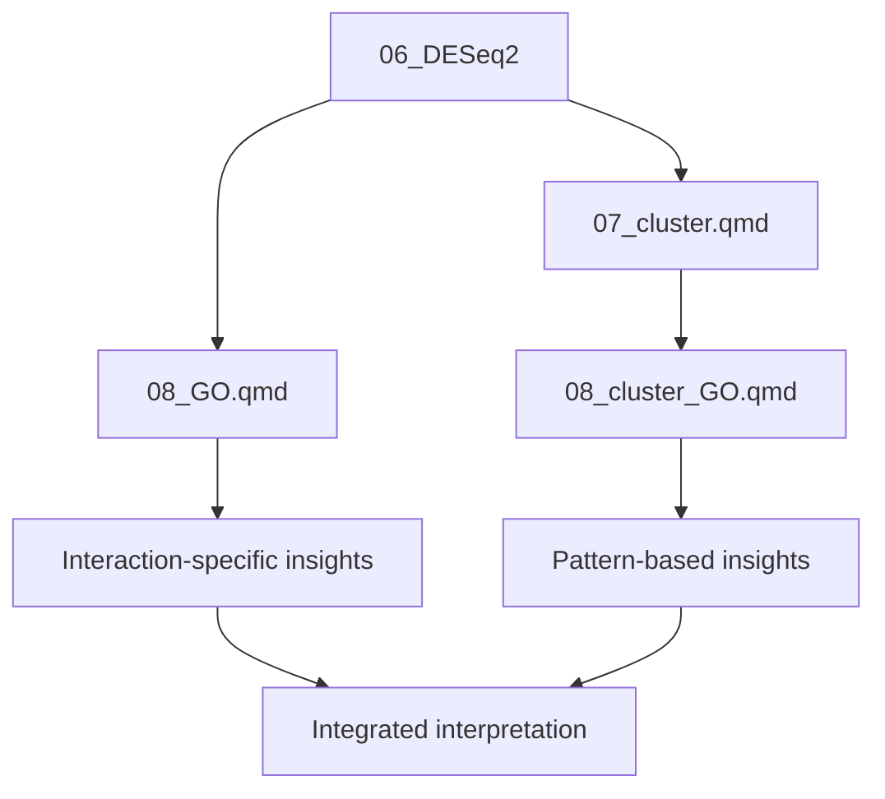

# Comparison: 08_GO.qmd vs 08_cluster_GO.qmd

## Quick Reference

| Aspect | 08_GO.qmd | 08_cluster_GO.qmd |
|--------|-----------|-------------------|
| **Purpose** | GO enrichment for interaction effects and contrasts | GO enrichment for expression clusters |
| **Gene Sets** | 44 interaction genes + 4 contrast sets | 151 significant genes grouped into 3 clusters |
| **Clustering** | 4 DEG patterns (interaction-based) | 3 leachate response patterns (cluster-based) |
| **Input Data** | `sig_genes.csv` (interaction), contrast results | `sig_all.csv`, `gene_clusters.csv` |
| **Focus** | Stage × leachate interaction effects | Overall leachate response patterns |
| **Cluster Sizes** | Pattern 1: 14, Pattern 2: 5, Pattern 3: 3, Pattern 4: 1 | Cluster 1: 97, Cluster 2: 28, Cluster 3: 24 |

## Analysis Approach

### 08_GO.qmd
- Tests specific contrasts (low vs control, mid vs control, etc.)
- Analyzes interaction effects separately from main effects
- Includes both interaction genes and stage-specific contrasts
- 4 expression patterns based on DEG cluster analysis

### 08_cluster_GO.qmd  
- Uses all 151 significant genes from any test
- Groups genes by their expression pattern across leachate doses
- 3 broader expression clusters from `degPatterns()` analysis
- Focus is on leachate response regardless of stage

## When to Use Each

**Use 08_GO.qmd when:**
- Investigating stage-specific leachate effects
- Testing specific dose contrasts (low, mid, high vs control)
- Analyzing interaction between stage and leachate
- Focusing on genes with significant interaction terms

**Use 08_cluster_GO.qmd when:**
- Characterizing overall leachate response patterns
- Working with the full set of significant genes
- Comparing expression trajectories across doses
- Interested in broader patterns across all stages

## Complementary Nature

These analyses complement each other:
- **08_GO.qmd** provides detailed, hypothesis-driven comparisons
- **08_cluster_GO.qmd** provides exploratory pattern characterization
- Together they give both targeted and exploratory perspectives
- Results can be cross-referenced to identify convergent findings

## Workflow Integration

## Output Organization

Both analyses save to `../../output/08_go/` but with distinct naming:

**08_GO.qmd outputs:**
- `GO.BP.int.csv`, `GO.BP.1.csv`, `GO.BP.2.csv`, `GO.BP.3.csv`
- `GO.BP.lvccl.csv`, `GO.BP.mvccl.csv`, etc.
- `reducedTerms_int.csv`, `reducedTerms_1.csv`, etc.

**08_cluster_GO.qmd outputs:**
- `GO.BP.cluster1.csv`, `GO.BP.cluster2.csv`, `GO.BP.cluster3.csv`
- `reducedTerms_cluster1.csv`, `reducedTerms_cluster2.csv`, etc.
- `sig_all_clusters.csv`

## Key Methodological Notes

### Both files:
- Use `goseq` for length-bias corrected enrichment
- Apply Benjamini-Hochberg FDR correction
- Use `rrvgo` for GO term redundancy reduction
- Focus on Biological Process (BP) terms
- Use C. elegans database for GO semantics

### Differences:
- 08_GO.qmd: Fixed contrast-based comparisons
- 08_cluster_GO.qmd: Data-driven clustering approach
- Different background gene sets in some cases
- Different biological questions being addressed
