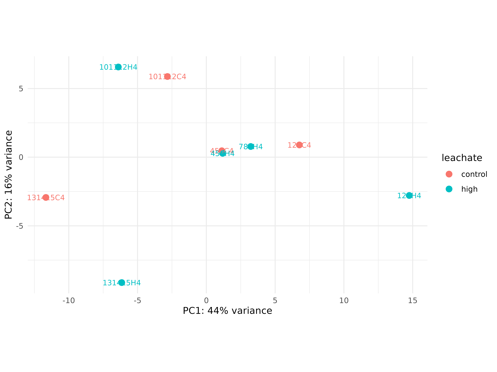
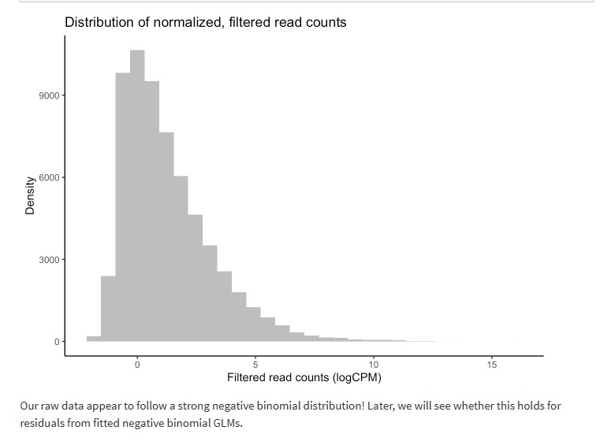
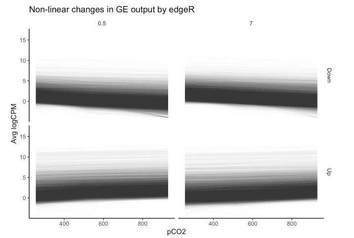

```{r setup, include=FALSE}
knitr::opts_chunk$set(
  echo = TRUE,         # Display code chunks
  eval = TRUE,        # Evaluate code chunks
  warning = FALSE,     # Hide warnings
  message = FALSE,     # Hide messages
  comment = ""         # Prevents appending '##' to beginning of lines in code output
)
```

# Goals

To follow the [MarineOmics Fitting Multifactorial Models of Differential Expression](https://marineomics.github.io/DGE_comparison_v2.html) walkthrough step-by-step with the gene count matrix from the [coral-embryo-RNAseq](https://github.com/sarahtanja/coral-embryo-RNAseq) project. I've copied and pasted many of the tutorial instructions and explanations in order for me to understand my data in context. Anything copied from [MarineOmics](https://marineomics.github.io/index.html) is in blockquotes. I have simply replaced their `pC02` environmental condition variable with `leachate` and their `day` time variable with hours post-fertilization, `hpf` .

# Experimental design

-   Egg-sperm bundles were cross-fertilized from genetically distinct parent colonies resulting in \~30 embryos per vial

-   4 leachate levels (continuous variable)

    -   0, 0.01, 0.1, 1 mg/L concentrations

-   3 embryonic stages (discrete variable)

    -   4, 9, 14 hours post fertilization

    -   cleavage, prawn chip, early gastrula

-   12 treatments, n = 4 or 5 per treatment

-   Each pooled samples therefore represents genetic variation of up to 6 distinct colonies


## Exploratory PCAs

All 63 samples across 12 treatments grouped by hours post fertilization  The outliers were removed reducing our dataset to 61 samples


I ran a pairwise DESeq2 analysis between our control and highest leachate exposure for each time point (4, 9, & 14). There were 0 DEGs across all timepoints between control and high treatments. 

# Setup
## Install packages

```{r}
if (!require("BiocManager", quietly = TRUE)) install.packages("BiocManager")
BiocManager::install(c("DESeq2", "vsn", "edgeR", "arrayQualityMetrics"))
```

```{r}
if ("tidyverse" %in% rownames(installed.packages()) == 'FALSE') 
  install.packages('tidyverse')
if ("DESeq2" %in% rownames(installed.packages()) == 'FALSE')
  install.packages('DESeq2')
if ("edgeR" %in% rownames(installed.packages()) == 'FALSE') 
  install.packages('edgeR')
if ("ape" %in% rownames(installed.packages()) == 'FALSE') 
  install.packages('ape')
if ("vegan" %in% rownames(installed.packages()) == 'FALSE') 
  install.packages('vegan')
if ("GGally" %in% rownames(installed.packages()) == 'FALSE') 
  install.packages('GGally')
if ("arrayQualityMetrics" %in% rownames(installed.packages()) == 'FALSE') 
  install.packages('arrayQualityMetrics')
if ("rgl" %in% rownames(installed.packages()) == 'FALSE') 
  install.packages('rgl')
if ("MASS" %in% rownames(installed.packages()) == 'FALSE') 
  install.packages('MASS')
if ("data.table" %in% rownames(installed.packages()) == 'FALSE') 
  install.packages('data.table')
if ("plyr" %in% rownames(installed.packages()) == 'FALSE') 
  install.packages('plyr')
if ("lmtest" %in% rownames(installed.packages()) == 'FALSE') 
  install.packages('lmtest')
if ("reshape2" %in% rownames(installed.packages()) == 'FALSE') 
  install.packages('reshape2')
if ("Rmisc" %in% rownames(installed.packages()) == 'FALSE') 
  install.packages('Rmisc')
if ("statmod" %in% rownames(installed.packages()) == 'FALSE') 
  install.packages('statmod')
if ("stringr" %in% rownames(installed.packages()) == 'FALSE') 
  install.packages('stringr')
```

## Load packages

```{r}
# Load packages
library(DESeq2)
library(edgeR)
library(tidyverse)
library(ape)
library(vegan)
library(GGally)
library(arrayQualityMetrics)
library(rgl)
#library(adegenet)
library(MASS)
library(data.table)
library(plyr)
library(lmtest)
library(reshape2)
library(Rmisc)
#library(lmerTest)
library(statmod)
library(stringr)
```

## Import gene counts

In this count matrix, each row represents a gene, each column a sequenced RNA library, and the values give the estimated counts of fragments that were assigned to the respective gene in each library by `HISAT2`

-   `check.names = FALSE` removed the 'X' from in front of sample id's in the column headers

```{r}
gcm <- read.csv("../output/05_count/gene_count_matrix.csv", row.names="gene_id", check.names = FALSE)
head(gcm)
```

::: callout-note
`gcm` is the unfiltered gene count matrix of all 63 samples
:::

-   The raw unfiltered, untransformed, count matrix shows counts of whole numbers (integers)
-   Each column is a sample
-   Each row is a gene
-   A sample id describes parental crosses (the first string of numbers), the pollution exposure (C, L, M, H), and the embryonic stage (4, 9, 14)

```{r}
gcm_filt <- gcm %>% 
  dplyr::select(-`131415L4`, -`789C4`)
head(gcm_filt)
```

::: callout-note
`gcm_filt` is the gene count matrix that has been filtered to remove 2 outlier samples ( `131415L4` and `789C4` ) that had poor HISAT alignment and did not group in the exploratory PCA
:::

## Import metadata

```{r}
metadata <- read_csv("../metadata/metadata.csv")
```

::: callout-note
`metadata` is all 63 samples
:::

```{r}
metadata_filt <- read_csv("../metadata/metadata_filt.csv")

# Reorder factors
metadata_filt$embryonic_stage <- as.factor(metadata_filt$embryonic_stage) %>% fct_relevel("cleavage", "prawnchip", "earlygastrula")
 
metadata_filt$pvc_leachate_level <- as.factor(metadata_filt$pvc_leachate_level) %>% fct_relevel("control", "low", "mid", "high")

metadata_filt$hpf <- as.factor(metadata_filt$hpf) %>%  fct_relevel("4", "9", "14")

# Show group balances
table(metadata_filt$group)
table(metadata_filt$hpf)
table(metadata_filt$leachate)
```


::: callout-note
`metadata_filt` is prefiltered to remove low gene counts and has 2 outlier samples removed, containing info for 61 samples
:::

# edgeR
## Make DGEList object
```{r}
# Make a DGEList object for edgeR
y <- DGEList(counts = gcm_filt, remove.zeros = TRUE)
nrow(gcm)
nrow(y$counts)
```
- the argument `remove.zeros = TRUE` tells `edgeR` to automatically remove any genes (rows) that have zero counts in *all* samples.
- There are 54,384 genes in the *Montipora capitata* genome (shown by `nrow(gcm)`)
- Here we have 22,631 genes with some level of expression in at least 1 sample. 


## Filter 

### Plot distribution of unfiltered reads

```{r distr_unfiltered_reads}

ggplot(data = data.frame(rowMeans(gcm)),
  aes(x = rowMeans.gcm.)) +
  geom_histogram(fill = "grey", binwidth = 5) +
  xlim(0, 500) +
  ylim(0, 5000) +
  theme_classic() +
  labs(title = "Distribution of unfiltered reads") +
  labs(y = "Density", x = "Raw read counts",
  title = "Read count distribution: untransformed, unnormalized, unfiltered")
  
```

::: callout-note
As you can see in the above plot, the raw distribution of all read counts takes on a left-skewed negative binomial distribution.
:::

> Most DE packages assume that read counts possess a negative binomial distribution. The negative binomial distribution is an extension of distributions for binary variables such as the Poisson distribution, allowing for estimations of "equidispersion" and "overdispersion", equal and greater-than-expected variation in expression attributed to biological variability. - [MarineOmics](https://marineomics.github.io/DGE_comparison_v2.html#:~:text=library(lmerTest)-,Filter%20and%20visualize%20read%20counts,-Before%20model%20fitting)

> While looking at the distribution of your raw reads is useful, these are not in fact the data you will be inputting to tests of differential expression. Let's plot the distribution of filtered reads normalized by library size, expressed as log2 counts per million reads (logCPM). These are the reads we will use in our test, and after we plot their distribution, we will conduct one more, slightly more robust, test of our data's fit to the negative binomial distribution using residuals from fitted models. - [MarineOmics](https://marineomics.github.io/DGE_comparison_v2.html#:~:text=While%20looking%20at,from%20fitted%20models.)


### Filter by CPM

CPM is counts per million

$$
\text{CPM} = \frac{\text{Raw count for a gene}}{\text{Total counts in the sample}} \times 10^6
$$

$$
\text{logCPM} = \log_2\left(\text{CPM} + \text{offset}\right)
$$

### Visualize filter thresholds

```{r}

# Compute CPM matrix once
cpm_mat <- cpm(y)
total_samples <- ncol(cpm_mat)

# Define CPM cutoffs and sample thresholds
cpm_cutoffs <- 1:12
min_sample_cutoffs <- 1:total_samples

# Expand grid
params_df <- expand.grid(
  cpm_cutoff = cpm_cutoffs,
  min_samples = min_sample_cutoffs
)

# Use purrr::pmap to compute genes retained
params_df$genes_retained <- purrr::pmap_int(
  params_df,
  function(cpm_cutoff, min_samples) {
    sum(rowSums(cpm_mat > cpm_cutoff) >= min_samples)
  }
)

# Plot
ggplot(params_df, aes(x = min_samples, y = genes_retained, color = factor(cpm_cutoff))) +
  geom_line(size = 1) +
  labs(
    x = "Minimum number of samples with CPM > cutoff",
    y = "Number of genes retained",
    color = "CPM cutoff",
    title = "Gene retention across CPM cutoffs and sample thresholds"
  ) +
  theme_minimal(base_size = 14)

```


### Minimize BCV

```{r}
# Get CPM matrix
cpm_mat <- cpm(y)
total_samples <- ncol(cpm_mat)

# Store results
bcv_results <- data.frame()

# Loop over filtering thresholds
for (n in 1:total_samples) {
  keep <- rowSums(cpm_mat > 12) >= n
  y_filtered <- y[keep, , keep.lib.sizes=FALSE]
  y_filtered <- calcNormFactors(y_filtered)
  y_filtered <- estimateDisp(y_filtered, robust = TRUE)  # replace `design` with your actual design matrix
  
  # Extract average BCV
  avg_bcv <- mean(sqrt(y_filtered$tagwise.dispersion))
  
  bcv_results <- rbind(bcv_results, data.frame(
    min_samples = n,
    genes_retained = sum(keep),
    avg_bcv = avg_bcv
  ))
}
```

```{r}
ggplot(bcv_results, aes(x = min_samples)) +
  geom_line(aes(y = avg_bcv), color = "darkorange", size = 1.2) +
  geom_point(aes(y = avg_bcv), color = "darkorange") +
  labs(
    x = "Minimum number of samples with CPM > 12",
    y = "Average BCV",
    title = "Filtering threshold vs. average BCV"
  ) +
  theme_minimal(base_size = 14)
```
Reasonable Average BCV Values....
| Dataset Type                                                  | Expected Average BCV |
| ------------------------------------------------------------- | -------------------- |
| Well-controlled inbred lab samples (e.g., cell lines, mice)   | **0.1 – 0.2**        |
| Typical human/marine/fish/field samples                       | **0.3 – 0.5**        |
| Highly heterogeneous samples (e.g., tumors, wild populations) | **0.5 – 1.0+**       |


What is the average library size (in millions) ? 
```{r}
lib_sizes <- colSums(y$counts) / 1e6  # y is your DGEList
summary(lib_sizes)
```
```{r}
hist(lib_sizes,
     breaks = 61,
     main = "Distribution of Library Sizes",
     xlab = "Library size (millions of reads)",
     col = "steelblue")
```
| Library Size (M) | Raw Count for 10 CPM                                         |
| ---------------- | ------------------------------------------------------------ |
| 5.46             | $\frac{10 \times 5.46 \times 10^6}{10^6} =$ **54.6 reads**   |
| 17.44            | $\frac{10 \times 17.44 \times 10^6}{10^6} =$ **174.4 reads** |
| 29.21            | $\frac{10 \times 29.21 \times 10^6}{10^6} =$ **292.1 reads** |

A CPM of 10 corresponds to ~55–290 raw reads, depending on the sample.

Let's remove samples with less than 10 cpm (this is ~54-292 raw counts) in fewer than 20/61 samples
There are ~20 samples in each embryonic stage, since our exploratory PCA grouped strongly by embryonic stage, we choose to keep any genes strongly expressed in at least 20/60 samples.
Our data is showing a lot of zeros... 
```{r}
keep <- rowSums(cpm(y) > 12) >= 46

table(keep)
```

::: callout-important
7055 genes were retained after manual filtering for low gene counts
:::

### Plot distribution of filtered, normalized reads
```{r}
# Set keep.lib.sizes = F and recalculate library sizes after filtering
y <- y[keep, keep.lib.sizes = FALSE]

y <- calcNormFactors(y)

# Calculate logCPM
df_log <- cpm(y, log = TRUE, prior.count = 2)

# Plot distribution of filtered logCPM values
ggplot(data = data.frame(rowMeans(df_log)), 
       aes(x = rowMeans.df_log.) ) +
  geom_histogram(fill = "grey") +
  theme_classic() +
  labs(y = "Density", x = "Filtered read counts (logCPM)",
       title = "Distribution of normalized, filtered read counts")

```
::: callout-note
| Region of Plot             | Interpretation                                        |
|-------------------------|-----------------------------------------------|
| **Left tail** (steep drop) | Near-zero or low-expression genes, NB distribution    |
| **Middle bulk**            | Actively expressed genes --- roughly normal in logCPM |
| **Right tail**             | Highly expressed genes (often a small fraction)       |
:::

[](https://marineomics.github.io/FUN_01_DGE_comparison_v2_files/figure-html/unnamed-chunk-5-1.png)

## Non-linear effects: example in edgeR
> One of the simplest non-linear relationships that can be fitted to the expression of a transcript across an continuous variable is a **second-order polynomial, otherwise known as a quadratic function, which can be expressed as yi=μ+β1x2+β2xyi=μ+β1x2+β2x where yy is the abundance of a given transcript (ii), μμ is the intercept, and yy is the continuous variable.** For the parabola generated by fitting a second-order polynomial, β1β1 \> 0 opens the parabola upwards while β1β1 \< 0 opens the parabola downwards. The vertex of the parabola is controlled by β2β2 such that when β1β1 is negative, greater β2β2 values result in the vertex falling at higher values of xx.
>
> Quadratic polynomials applied to phenotypic performance curves commonly possess negative β1β1 values with positive β2β2 values: a downard-opening parabola with a positive vertex. However, **quadtratic curves fitted to gene expression data can take on a variety of postiive or negative forms similar to exponential curves, saturating curves, and parabolas.** For instance, the expression of a gene may peak an intermediate level of an environmental level before crashing or it may exponentially decline across that variable. Such trends may better model changes in the transcription of a gene compared to a linear model. To get started, we will fit non-linear second order polynomials before testing for whether model predictions for a given gene are significantly improved by a non-linear linear model. - [MarineOmics](https://marineomics.github.io/DGE_comparison_v2.html#Filter_and_visualize_read_counts:~:text=for%20differential%20expression.-,Non%2Dlinear%20effects,-Gene%20expression%20traits)

![From Rivera et al. 2021 "Transcriptomic resilience and timing. (a) Gene expression reaction norms of four strategies during recovery after a stressor. We use triangles again for patterns that may confer tolerance and circles for patterns associated with stress sensitivity. While all triangle paths show a return to baseline (resilience) the pink (frontloading) and yellow (dampening) are also depicting differences in baseline and plasticity and are therefore labelled differently. (b) Adapted from the rolling ball analogy commonly used for ecological resilience and depicted in Hodgson et al. (2015). Each ball represents a gene showing a color-matched expression pattern in (a). Landscapes represent expression possibilities during a stress event. In the absence of stress, the ball will settle in a trough, representing baseline expression levels. Elasticity (rate of return to the baseline) is represented by the size of the arrow (i.e., larger arrows have faster rates of return). Pink dotted line is the expression landscape for the frontloaded ball. (c) Using Torres et al. (2016) loops through disease space as an alternative framework of an organism's path through stress response and recovery. The color gradient represents the resulting phenotype for a given path through stress and recovery space, though x-and y-axis can denote any two parameters that are correlated but with a time lag."](rivera2021-nonlinear-concept.jpg)

### Estimate dispersion

> Let's fit a second-order polynomial for the effect of leachate using edgeR. Using differential expression tests, we will then determine whether leachate affected a gene's rate of change in expression and expression maximum by applying differential expression tests to β1 and β2 parameters. By testing for differential expression attributed to intereactions between time and β1 or β2 , we will then test for whether these parameters were significantly different across exposure times of 4, 9 and 14 hours acclimation to leachate altered the rate of change in expression across leachate (β1 ) or the maximum of expression (β2 ).- >[MarineOmics](https://marineomics.github.io/DGE_comparison_v2.html#Non-linear_effects:~:text=linear%20linear%20model.-,Non%2Dlinear%20effects%3A%20example%20in%20edgeR,-Let%E2%80%99s%20fit%20a)

```{r estimate-dispersion}
# Estimate dispersion coefficients
y1 <- estimateDisp(y, robust = TRUE) # Estimate mean dispersal

# Plot tagwise dispersal and impose w/ mean dispersal and trendline
plotBCV(y1) 
```

> The above figure is an output of the plotBCV() function in edgeR, which visualises the biological coefficient of variation (otherwise known as dispersion) parameter fitted to individual genes (black circles), fitted across gene expression level (blue trendline), and averaged across the entire transcriptome (red horizontal line).
>
> The BCV/dispersion parameter is a necessary parameter, symbolized as θ in model specification, that must be estimated in negative binomial GLMs. θ represents the 'overdispersion' or the shape of a negative binomial distribution and is thus important for defining the distribution of read count data for a given gene during model fitting. Dispersion or θ can be input during model fitting in edgeR using the three estimates visualized in the above regression.

::: callout-note
\- The blue line slopes down --- dispersion tends to decrease with increasing expression, then flattens out.
:::


### Fit multifactorial design matrix

```{r}
# Make leachate^2
metadata_filt <- metadata_filt %>% 
  mutate(leachate_2 = leachate^2)

# Fit multifactorial design matrix
#design_hpf_nl <- model.matrix(~ 1 + hpf + leachate + leachate_2 + hpf:leachate + hpf:leachate_2, data=metadata_filt) 
design_nl <- model.matrix(~ 1 + leachate + leachate_2 + hpf:leachate + hpf:leachate_2, data=metadata_filt)

# Fit quasi-likelihood, neg binom linear regression
#fit_hpf_nl <- glmQLFit(y1, design_hpf_nl)
fit_nl <- glmQLFit(y1, design_nl) 
```

### Confirm data fit to negative binomial

> Taking a detour from tests for DEGs attributed to non-linear interactions, we can now output the residuals of our GLMs in order to better test for whether our data fit the assumptions of negative binomial distribution families. If the distribution of residuals from our GLMs are normal, this indicates that our data meet the assumption of the negative binomial distribution. We will use the equation for estimating Pearson residuals:
>
> $$
> residual=\frac{observed−fitted}{\sqrt{fitted(dispersion∗fitted)}}
> $$

```{r}
# Output observed
y_nl <- fit_nl$counts

# Output fitted
mu_nl <- fit_nl$fitted.values

# Output dispersion or coefficient of variation
phi_nl <- fit_nl$dispersion

# Calculate denominator
v_nl <- mu_nl*(1+phi_nl*mu_nl)

# Calculate Pearson residual
resid.pearson <- (y_nl-mu_nl) / sqrt(v_nl)

# Plot distribution of Pearson residuals
ggplot(data = melt(as.data.frame(resid.pearson)), aes(x = value)) +
  geom_histogram(fill = "grey") +
  xlim(-2.5, 5.0) +
  theme_classic() +
  labs(title = "Distribution of negative binomial GLM residuals",
       x = "Pearson residuals",
       y = "Density")

```

::: callout-note
Our residuals appear to be normally distributed, indicating that our data fit the negative binomial distribution assumed by the GLM.
:::

```{r}
colnames(fit_nl$design)
```
| Coefficient      | What it Represents                                                                             |
|----------------|--------------------------------------------------------|
| **(Intercept)**  | The baseline expression: at `hpf = 4` and `leachate = 0`                                       |
| **hpf9**         | The difference in expression at `9 hpf` vs `4 hpf` (when leachate = 0)                         |
| **hpf14**        | The difference in expression at `14 hpf` vs `4 hpf` (when leachate = 0)                        |
| **leachate**     | The effect of increasing leachate at **4 hpf**                                                 |
| leachate_2       | The non-linear effect of increasing leachate                                                   |
| hpf9:leachate_2  | How the non-linear leachate effect at `9 hpf` **differs** from the leachate effect at `4 hpf`  |
| hpf14:leachate_2 | How the non-linear leachate effect at `14 hpf` **differs** from the leachate effect at `4 hpf` |
| hpf9:leachate    | How the leachate effect at `9 hpf` **differs** from the leachate effect at `4 hpf`             |
| hpf14:leachate   | How the leachate effect at `14 hpf` **differs** from the leachate effect at `4 hpf`            |

```{r test-terms}
## Test each term of the model
# linear effect of leachate
nl_leachate <-
    glmQLFTest(fit_nl,
    coef = 2,
    contrast = NULL,
    poisson.bound = FALSE) # Estimate significant DEGs

# non linear effect of leachate (leachate^2)
nl_leachate2 <-
    glmQLFTest(fit_nl,
    coef = 3,
    contrast = NULL,
    poisson.bound = FALSE) # Estimate significant DEGs

# interaction of hpf and leachate
nl_leachate_hpf9 <-
  glmQLFTest(fit_nl,
  coef = 4,
  contrast = NULL,
  poisson.bound = FALSE) # Estimate significant DEGs

# interaction of hpf and leachate
nl_leachate_hpf14 <-
  glmQLFTest(fit_nl,
  coef = 5,
  contrast = NULL,
  poisson.bound = FALSE) # Estimate significant DEGs

# interaction of hpf and leachate^2
nl_leachate2_hpf9 <-
  glmQLFTest(fit_nl,
  coef = 6,
  contrast = NULL,
  poisson.bound = FALSE) # Estimate significant DEGs

# interaction of hpf and leachate^2
nl_leachate2_hpf14 <-
  glmQLFTest(fit_nl,
  coef = 7,
  contrast = NULL,
  poisson.bound = FALSE) # Estimate significant DEGs
```

```{r make-contrasts}
# Make contrasts
is.de_nl_leachate <-
  decideTestsDGE(nl_leachate, adjust.method = "fdr", p.value = 0.05)

is.de_nl_leachate2 <-
  decideTestsDGE(nl_leachate2, adjust.method = "fdr", p.value = 0.05)

is.de_nl_leachate_hpf9 <-
  decideTestsDGE(nl_leachate_hpf9, adjust.method = "fdr", p.value = 0.05) 

is.de_nl_leachate_hpf14 <-
  decideTestsDGE(nl_leachate_hpf14, adjust.method = "fdr", p.value = 0.05)

is.de_nl_leachate2_hpf9 <-
  decideTestsDGE(nl_leachate2_hpf9, adjust.method = "fdr", p.value = 0.05)

is.de_nl_leachate2_hpf14 <-
  decideTestsDGE(nl_leachate2_hpf14, adjust.method = "fdr", p.value = 0.05)
```

### DE summaries & plotMDs

Visualizations of differential expression (logFC) across baseline logCPM can be produced by the plotMD() (short for "mean-difference") function in edgeR. To do so, plotMD() is input with the results of glmQLFTest, which we used above to test for differential expression attributable to the parameters leachate/leachate and leachate/leachate\^2. Let's produce two such plots for both parameters where "leachate/leachate_2" represents the leachate/leachate\^2 parameter:

```{r}
# Plot differential expression 
summary(is.de_nl_leachate)
plotMD(nl_leachate)
```

```{r}
summary(is.de_nl_leachate2)
plotMD(nl_leachate2)
```

```{r}
summary(is.de_nl_leachate_hpf9)
plotMD(nl_leachate_hpf9)
```

```{r}
summary(is.de_nl_leachate_hpf14)
plotMD(nl_leachate_hpf14)
```
```{r}
summary(is.de_nl_leachate2_hpf9)
plotMD(nl_leachate2_hpf9)
```

```{r}
summary(is.de_nl_leachate2_hpf14)
plotMD(nl_leachate2_hpf14)
```

::: callout-caution
The non-linear term appears to be a perfect flip of the linear term. Is this expected? Or does this indicate the non-linear term doesn't describe the data any better than the linear term? The pattern is expected to be a mirror, but we'd expect the scale of the y axis to change. In our data, it does not. Note also the log fold change scales in each plot! Log fold changes of 60, 40, 30... they are red flags! These scales are huge, indicating some imbalance... Even if genes are filtered for expression, edgeR can still return huge logFCs when a gene is high in one group and absent in the rest. Zeros or low counts can produce huge logFCs if the gene is only present in one small group. 
:::

| Step                       | Verdict                                                 |
| -------------------------- | ------------------------------------------------------- |
| **Filtering**              | ✅ Already stringent                                      |
| **prior.count = 2**        | ✅ Reasonable, no need to increase further                                                
| **Extreme logFCs remain?** | 🔍 Due to real group differences, not low counts                        |
| **Action**                 | Try limma-Voom, Visualize gene, check group sizes, possibly flag/remove |


# limma-Voom


# DESeq2


### Filter
```{r}
# Filter rows where at least 30% of the columns have a count of ~200
gcm_filt_des <- gcm_filt %>%
  filter(rowSums(across(everything(), ~ . > 15)) >= 0.75 * ncol(gcm_filt))

nrow(gcm_filt_des)
```
## Make DESeq2 object
```{r}
### WALD TEST - FULL MODEL ###

dds <- DESeqDataSetFromMatrix(countData = gcm_filt_des,
                              colData = metadata_filt,
                              design = formula( ~ 1 + hpf + leachate + hpf:leachate))

# Transform count (variance stabilized) 
vsd <- vst(dds)
```

### plot distribution of filtered, normalized reads
```{r}

# Extract VST-transformed expression matrix
vsd_mat <- assay(vsd)

# Flatten it into a vector
vsd_vals <- as.vector(vsd_mat)

# Create a dataframe for ggplot
df_vsd <- data.frame(vsd_count = vsd_vals)

# Plot
ggplot(df_vsd, aes(x = vsd_count)) +
  geom_histogram(fill = "grey") +
  theme_classic() +
  labs(
    title = "Histogram of Variance-Stabilized Counts",
    x = "VST-transformed read count",
    y = "Frequency"
  )

```
VST compresses the high-end of the count distribution and expands the low-end, making the variance roughly constant across the range.

The resulting values are on an approximate log2 scale but not exact log2(count + 1) — VST is more nuanced, especially for low counts.

A range of 5 to 15 corresponds roughly to raw counts ranging from 2³² to 2¹⁵ ≈ 32 to 32,000, so it’s realistic for RNA-seq gene expression data.

### Run DESeq Test
```{r}
dds <- DESeq(dds, test="LRT", reduced=~hpf+leachate)
resultsNames(dds)  # see what contrast names are available
```
```{r}
# Main effect of leachate (baseline hpf level)
res_leachate <- results(dds, name = "leachate")
summary(res_leachate)

sig_leachate <- as.data.frame(subset(res_leachate, padj<0.05))
sig_leachate$gene <- rownames(sig_leachate)
rownames(sig_leachate) <- NULL
write_csv(sig_leachate, file = "../output/09_deg_multifactorial/sig_leachate.csv")

plotMA(res_leachate, alpha = 0.05, ylim = c(-5, 5), main = "MA Plot: Leachate Effect")

```

```{r}
# Main effect of hpf levels (because hpf is a factor with levels  4, 9, 14)
res_hpf9 <- results(dds, name = "hpf_9_vs_4")  # if reference is hpf4
summary(res_hpf9)

sig_hpf9 <- as.data.frame(subset(res_hpf9, padj<0.05))
sig_hpf9$gene <- rownames(sig_hpf9)
rownames(sig_hpf9) <- NULL
write_csv(sig_hpf9, file = "../output/09_deg_multifactorial/sig_hpf9.csv")

plotMA(res_hpf9, ylim = c(-5, 5), main = "MA Plot: hpf 9 vs 4")
```

```{r}
# Main effect of hpf levels (becuase hpf is a factor with levels 4, 9, 14)
res_hpf14 <- results(dds, name = "hpf_14_vs_4")
summary(res_hpf14)

sig_hpf14 <- as.data.frame(subset(res_hpf14, padj<0.05))
sig_hpf14$gene <- rownames(sig_hpf14)
rownames(sig_hpf14) <- NULL
write_csv(sig_hpf14, file = "../output/09_deg_multifactorial/sig_hpf14.csv")

plotMA(res_hpf14, ylim = c(-5, 5), main = "MA Plot: hpf 14 vs 4")
```

```{r}
# Interaction effects
res_interaction_9 <- results(dds, name = "hpf9.leachate")
summary(res_interaction_9)

sig_interaction_9 <- as.data.frame(subset(res_interaction_9, padj<0.05))
sig_interaction_9$gene <- rownames(sig_interaction_9)
rownames(sig_interaction_9) <- NULL
write_csv(sig_interaction_9, file = "../output/09_deg_multifactorial/sig_interaction_9.csv")

plotMA(res_interaction_9, ylim = c(-5, 5), main = "MA Plot: hpf9 x leachate interaction")
```

```{r}
res_interaction_14 <- results(dds, name = "hpf14.leachate")
summary(res_interaction_14)

sig_interaction_14 <- as.data.frame(subset(res_interaction_14, padj<0.05))
sig_interaction_14$gene <- rownames(sig_interaction_14)
rownames(sig_interaction_14) <- NULL
write_csv(sig_interaction_14, file = "../output/09_deg_multifactorial/sig_interaction_14.csv")


plotMA(res_interaction_14, ylim = c(-5, 5), main = "MA Plot: hpf14 x leachate interaction")
```


## Plotting non-linear effects

```{r}
## Bin transcripts based on (i) whether they have a significant positive or negative vertex and then (ii) whether they showed significant interactions between beta1 (vertex value) and time.

# Export diff expression data for transcripts with significant DE associated with leachate^2 parameter
nl_leachate_2_sig <-
  topTags(
  nl_leachate_2,
  n = Inf, 
  adjust.method = "BH",
  p.value = 0.05
  )

nl_leachate_2_sig_geneids <- row.names(nl_leachate_2_sig) #Output a list of geneids associated with sig leachate^2 effect

nl_leachate_sig <-
  topTags(
  nl_leachate,
  n = Inf, 
  adjust.method = "BH",
  p.value = 0.05
  )

nl_leachate_sig_geneids <- row.names(nl_leachate_sig) #Output a list of geneids associated with sig leachate effect

# Create tabulated dataframe of mean expression across each leachate level with metadata for transcript ID and timepoint
logCPM_df <- as.data.frame(df_log)

# Create tabularized df containing all replicates using 'melt' function in reshape2
logCPM_df$geneid <- row.names(logCPM_df)

tab_exp_df <- melt(logCPM_df,
                   id = c("geneid"))

# Add covariate information for hpf and leachate
tab_exp_df <- tab_exp_df %>%
  mutate(
    leachate = str_extract(variable, "[CLMHN]"),      # extract treatment letter
    hpf = as.numeric(str_extract(variable, "\\d+$"))  # extract trailing number (e.g. 4, 9, 14)
  )

# Correct leachates to exact values
tab_exp_df <- tab_exp_df %>%
  mutate(
    leachate_code = leachate,  # preserve original letter
    leachate = recode(leachate_code,
      C = 0,
      L = 0.01,
      M = 0.1,
      H = 1
    )
  )

# Create binary variable in df_all_log for significant non-linear expression
tab_exp_df$leachate_2_sig <-
  ifelse(tab_exp_df$geneid %in% nl_leachate_2_sig_geneids, "Yes", "No")
tab_exp_df$leachate_sig <-
  ifelse(tab_exp_df$geneid %in% nl_leachate_sig_geneids, "Yes", "No")

# Create a binary variable related to up or down-regulation
up_genes <- filter(nl_leachate_sig$table, logFC > 0)

tab_exp_df$logFC_dir <-
  ifelse(tab_exp_df$geneid %in% row.names(up_genes), "Up", "Down")

# Add geneid to nl_leachate_int$coefficients
#nl_leachate_int$coefficients$geneid <- row.names(nl_leachate_int$coefficients)

# Estimate average logCPM per gene per timepoint
tab_exp_avg <- summarySE(
  measurevar = "value",
  groupvars = c("leachate",     "hpf",       "geneid", 
                "leachate_sig", "leachate_2_sig", "logFC_dir"),
  data = tab_exp_df
  )

# First exploratory plot of non-linear expression grouping by exposure time and direction of differential expression
ggplot(data = filter(tab_exp_avg, leachate_2_sig == "Yes"), 
       aes(x = leachate, y = value)) +
  geom_path(
    alpha = 0.2,
    size = 0.25,
    stat = "identity",
    aes(group = as.factor(geneid))) +
  facet_grid(logFC_dir ~ hpf) +
  theme_classic() +
  theme(strip.background = element_blank()) +
  labs(y = "Avg logCPM", title = "Non-linear changes in GE output by edgeR")
```



> Our plots of non-linear changes in gene expression appear to include many trends that appear... well, linear. This is a pervasive issue in modeling non-linear regressions, and one potential pitfall of using outputs from packages such as edgeR or DESeq2 alone in testing for non-linear effects. The FDR-adjusted p -values we have used determine significance of non-linear effects essentially tell us the probability that a parameter value equal to or greater to what we have fitted could be generated given a random distribution of read counts. The p -value is not a representation of the strength of a non-linear effect relative to a linear effect. Numerous genes that nominally show significant non-linear effects of leachate may be only weakly affected, and a linear effect may in fact be more probable than a non-linear one despite what our p-values tell us. Instead of asking "for what genes may there be significant, non-linear effects of leachate ?", we should ask "for what genes should we test for significant, non-linear effects?".

# Is non-linear model term appropriate?

> One of the best ways to determine whether a non-linear model is appropriate for a transcript is to determine whether it is more probable that its expression is linear or non-linear relative to a continuous predictor. We can calculate this relative probability using a likelihood ratio test (LRT). In the code chunk below, we will fit linear and 2nd order non-linear models to the expression of each gene before applying LRTs to each transcript. We will then further filter our edgeR dataset based on (i) significant differential expression attributed to non-linear effects and (ii) a significant LRT ratio supporting non-linear effects. Then, we will replot the expression levels of this re-filtered set. The code below fits gaussian linear models to log2-transformed CPM values, but can be adjusted to fit negative binomial GLMs to untransformed CPM similar to edgeR and DESeq2 by setting using the MASS package to set 'family = negative_binomial(theta = θ)' where θ = the dispersion estimate or biological coefficient of variation for a given transcript.

```{r}
## Using dlply, fit linear and non-linear models to each gene
# Create leachate^2 variable in df_all_log
tab_exp_df$leachate_2 <- tab_exp_df$leachate^2

# Fit linear models - should take about 4 minutes
lms <- dlply(tab_exp_df, c("geneid"), function(df) 
lm(value ~ hpf + leachate + hpf:leachate, data = df))

# Fit non-linear models - should take about 2 minutes
nlms <- dlply(tab_exp_df, c("geneid"), function(df) 
lm(value ~ hpf + leachate + leachate_2 + hpf:leachate + hpf:leachate_2 , data = df))

# Output nlm coefficients into dataframe
nlms_coeff <- ldply(nlms, coef)
head(nlms_coeff)
```

## LRT

```{r}
## Apply LRTs to lm's and nlm's for each transcript - should take about 2 minutes
lrts <- list() # Create list to add LRT results to

for (i in 1:length(lms)) {
  lrts[[i]] <- lrtest(lms[[i]], nlms[[i]]) # Apply LRTs with for loop
}

## Filter lrt results for transcripts with significantly higher likelihoods of nl model
lrt_dfs <- list()

# Turn list of LRT outputs into list of dataframes containing output info
for (i in 1:length(lrts)) {
  lrt_dfs[[i]] <- data.frame(lrts[i])
}

# Create singular dataframe with geneids and model outputs for chi-squared and LRT p-value
lrt_coeff_df  <- na.omit(bind_rows(lrt_dfs, .id = "column_label")) # na.omit removes first row of each df, which lacks these data

# Add geneid based on element number from original list of LRT outputs
lrt_coeff_df <- merge(lrt_coeff_df,
                      data.frame(geneid = names(nlms),
                      column_label = as.character(seq(length(
                      nlms
                      )))),
                      by = "column_label")
                      
# Apply FDR adjustment to LRT p-values before filtering for sig non-linear effects
lrt_coeff_df$FDR <- p.adjust(lrt_coeff_df$Pr..Chisq., method = "fdr")

# Filter LRT results for sig FDR coeff... produces only 3 genes for pval 0.1!
lrt_filt <- filter(lrt_coeff_df, FDR < 0.1)

## Plot sig nl genes according to LRT, grouped by timepoint and direction of beta 1 coefficient
# Add beta coefficients to logCPM df
leachate_pos <- filter(nlms_coeff, leachate > 0)
leachate_2_pos <- filter(nlms_coeff, leachate_2 > 0)

# Bin genes based on positive or negative leachate and leachate^2 betas
tab_exp_avg$leachate_binom <- ifelse(tab_exp_avg$geneid %in% leachate_pos$geneid, "Positive", "Negative")
tab_exp_avg$leachate_2_binom <- ifelse(tab_exp_avg$geneid %in% leachate_2_pos$geneid, "Concave", "Convex")

# Filter for how many gene id's with significant likelihood of nl effect in LRT
LRT_filt_df <- filter(tab_exp_avg, geneid %in% lrt_filt$geneid)

# Plot
ggplot(data = LRT_filt_df,
       aes(x = leachate, y = value)) +
  geom_path(
    alpha = .25,
    size = 0.25,
    stat = "identity",
    aes(group = as.factor(geneid))
    ) +
  facet_grid(leachate_2_binom ~ hpf) +
  geom_smooth(method = "loess", se = TRUE, span = 1) +
  theme_classic() +
  theme(strip.background = element_blank()) +
  labs(y = "Avg logCPM", title = "Non-linear changes in GE output by LRTs")
```

::: callout-important
o genes had likelihood of non-linear effect (p \< 0.05)

And only 3 genes had likelihood of non-linear effect (p \< 0.1)

This was the same when hpf was an integer, not a factor!
:::

> ... the most robust estimate we have for non-linear effects of environmental conditions on gene expression over time comes from filtering for significant DEGs in edgeR *and* significant LRTs.
