# Multifactorial Differential Gene Expression
Sarah Tanja
2024-12-02

- [<span class="toc-section-number">1</span> Background](#background)
  - [<span class="toc-section-number">1.1</span> Inputs](#inputs)
  - [<span class="toc-section-number">1.2</span> Install
    packages](#install-packages)
  - [<span class="toc-section-number">1.3</span> Load
    packages](#load-packages)
  - [<span class="toc-section-number">1.4</span> Import gene
    counts](#import-gene-counts)
  - [<span class="toc-section-number">1.5</span> Import
    metadata](#import-metadata)
- [<span class="toc-section-number">2</span> Filter](#filter)
- [<span class="toc-section-number">3</span> Make DESeq2
  object](#make-deseq2-object)
  - [<span class="toc-section-number">3.1</span> Explore
    PCAs](#explore-pcas)
  - [<span class="toc-section-number">3.2</span> Plot
    distribution](#plot-distribution)
- [<span class="toc-section-number">4</span> Run DESeq
  Test](#run-deseq-test)
  - [<span class="toc-section-number">4.1</span> Plot
    dispersion](#plot-dispersion)
- [<span class="toc-section-number">5</span> Build
  contrasts](#build-contrasts)
  - [<span class="toc-section-number">5.1</span> Effect of high exposure
    at 14 hpf](#effect-of-high-exposure-at-14-hpf)
    - [<span class="toc-section-number">5.1.1</span> Extract significant
      genes](#extract-significant-genes)
    - [<span class="toc-section-number">5.1.2</span> Volcano
      plots](#volcano-plots)
  - [<span class="toc-section-number">5.2</span> Effect of mid exposure
    at 14 hpf](#effect-of-mid-exposure-at-14-hpf)
    - [<span class="toc-section-number">5.2.1</span> Extract significant
      genes](#extract-significant-genes-1)
    - [<span class="toc-section-number">5.2.2</span> Volcano
      plots](#volcano-plots-1)
  - [<span class="toc-section-number">5.3</span> Effect of low exposure
    at 14 hpf](#effect-of-low-exposure-at-14-hpf)
    - [<span class="toc-section-number">5.3.1</span> Extract significant
      genes](#extract-significant-genes-2)
    - [<span class="toc-section-number">5.3.2</span> Volcano
      plots](#volcano-plots-2)
  - [<span class="toc-section-number">5.4</span> Effect of high exposure
    at 9 hpf](#effect-of-high-exposure-at-9-hpf)
    - [<span class="toc-section-number">5.4.1</span> Extract significant
      genes](#extract-significant-genes-3)
    - [<span class="toc-section-number">5.4.2</span> Volcano
      plots](#volcano-plots-3)
  - [<span class="toc-section-number">5.5</span> Effect of mid exposure
    at 9 hpf](#effect-of-mid-exposure-at-9-hpf)
    - [<span class="toc-section-number">5.5.1</span> Extract significant
      genes](#extract-significant-genes-4)
    - [<span class="toc-section-number">5.5.2</span> Volcano
      plots](#volcano-plots-4)
  - [<span class="toc-section-number">5.6</span> Effect of low exposure
    at 9 hpf](#effect-of-low-exposure-at-9-hpf)
    - [<span class="toc-section-number">5.6.1</span> Extract significant
      genes](#extract-significant-genes-5)
    - [<span class="toc-section-number">5.6.2</span> Volcano
      plots](#volcano-plots-5)
  - [<span class="toc-section-number">5.7</span> Effect of high exposure
    at 4 hpf](#effect-of-high-exposure-at-4-hpf)
    - [<span class="toc-section-number">5.7.1</span> Extract significant
      genes](#extract-significant-genes-6)
    - [<span class="toc-section-number">5.7.2</span> Volcano
      plots](#volcano-plots-6)
  - [<span class="toc-section-number">5.8</span> Effect of mid exposure
    at 4 hpf](#effect-of-mid-exposure-at-4-hpf)
    - [<span class="toc-section-number">5.8.1</span> Extract significant
      genes](#extract-significant-genes-7)
    - [<span class="toc-section-number">5.8.2</span> Volcano
      plots](#volcano-plots-7)
  - [<span class="toc-section-number">5.9</span> Effect of low exposure
    at 4 hpf](#effect-of-low-exposure-at-4-hpf)
    - [<span class="toc-section-number">5.9.1</span> Extract significant
      genes](#extract-significant-genes-8)
    - [<span class="toc-section-number">5.9.2</span> Volcano
      plots](#volcano-plots-8)
- [<span class="toc-section-number">6</span> Summary](#summary)
  - [<span class="toc-section-number">6.1</span> Facet volcano
    plot](#facet-volcano-plot)

# Background

## Inputs

- `gcm.csv` is the unfiltered gene count matrix for all 63 samples.
- `metadata_filt.csv` is the metadata for 61 samples (two outliers were
  already removed). \## Outputs
- `volcano_facet.png` \# Setup

## Install packages

``` r
if ("tidyverse" %in% rownames(installed.packages()) == 'FALSE') 
  install.packages('tidyverse')
if ("DESeq2" %in% rownames(installed.packages()) == 'FALSE')
  install.packages('DESeq2')
if ("ashr" %in% rownames(installed.packages()) == 'FALSE')
  install.packages('ashr')
if ("plotly" %in% rownames(installed.packages()) == 'FALSE')
  install.packages('plotly')
if ("cowplot" %in% rownames(installed.packages()) == 'FALSE')
  install.packages('cowplot')
if ("pak" %in% rownames(installed.packages()) == 'FALSE')
  install.packages('pak')
```

``` r
#if (!require("BiocManager", quietly = TRUE))
#    install.packages("BiocManager")
#BiocManager::install("EnhancedVolcano")
```

## Load packages

``` r
# Load packages
library(DESeq2)
library(tidyverse)
library(EnhancedVolcano)
library(ashr)
library(flexoki)
library(plotly)
library(cowplot)
pak::pak("mdscheuerell/flexoki")
```

## Import gene counts

In this count matrix, each row represents a gene, each column a
sequenced RNA library, and the values give the estimated counts of
fragments that were assigned to the respective gene in each library by
`HISAT2`

- `check.names = FALSE` removed the ‘X’ from in front of sample id’s in
  the column headers

``` r
gcm <- read.csv("../output/05_count/gene_count_matrix.csv", row.names="gene_id", check.names = FALSE)
head(gcm)
```

                                              101112C14 101112C4 101112C9 101112H14
    Montipora_capitata_HIv3___RNAseq.g4581.t1       176      458      395       195
    Montipora_capitata_HIv3___RNAseq.g4582.t1      1137      380      934       882
    Montipora_capitata_HIv3___RNAseq.g4588.t1        11        0        0         4
    Montipora_capitata_HIv3___RNAseq.g4583.t1      2043      905     1848      1847
    Montipora_capitata_HIv3___RNAseq.g4584.t1      2641      452      706      1917
    Montipora_capitata_HIv3___TS.g26265.t1            0        0        0         0
                                              101112H4 101112H9 101112L14 101112L4
    Montipora_capitata_HIv3___RNAseq.g4581.t1      144      351       156      187
    Montipora_capitata_HIv3___RNAseq.g4582.t1      326     1337      1101      392
    Montipora_capitata_HIv3___RNAseq.g4588.t1        0        0         0        0
    Montipora_capitata_HIv3___RNAseq.g4583.t1      945     2087      1625     1039
    Montipora_capitata_HIv3___RNAseq.g4584.t1      266      625      2301      367
    Montipora_capitata_HIv3___TS.g26265.t1           0        0         0        0
                                              101112L9 101112M14 101112M4 101112M9
    Montipora_capitata_HIv3___RNAseq.g4581.t1      360       215      199      386
    Montipora_capitata_HIv3___RNAseq.g4582.t1     1195      1311      431     1076
    Montipora_capitata_HIv3___RNAseq.g4588.t1        0         0        0        0
    Montipora_capitata_HIv3___RNAseq.g4583.t1     2367      1875     1176     2230
    Montipora_capitata_HIv3___RNAseq.g4584.t1      668      1963      800      706
    Montipora_capitata_HIv3___TS.g26265.t1           0         2        0        0
                                              123C14 123C4 123C9 123H14 123H4 123H9
    Montipora_capitata_HIv3___RNAseq.g4581.t1     63   714   351    138   384   146
    Montipora_capitata_HIv3___RNAseq.g4582.t1    643   496  1064    927   378   864
    Montipora_capitata_HIv3___RNAseq.g4588.t1      0     0     0      0     0     0
    Montipora_capitata_HIv3___RNAseq.g4583.t1   1349  1591  1529   1377   648  1902
    Montipora_capitata_HIv3___RNAseq.g4584.t1   2724   703   648   3178   497   438
    Montipora_capitata_HIv3___TS.g26265.t1         0     0     6      1     0     0
                                              123L14 123L4 123L9 123M4 123M9
    Montipora_capitata_HIv3___RNAseq.g4581.t1    190   271   304   771   154
    Montipora_capitata_HIv3___RNAseq.g4582.t1    884   270   838   650   516
    Montipora_capitata_HIv3___RNAseq.g4588.t1      0     0     0     0     0
    Montipora_capitata_HIv3___RNAseq.g4583.t1   2007   630  1572  1258   892
    Montipora_capitata_HIv3___RNAseq.g4584.t1   1867   330   366   677   397
    Montipora_capitata_HIv3___TS.g26265.t1         0     0     0     0     0
                                              131415C14 131415C4 131415C9 131415H14
    Montipora_capitata_HIv3___RNAseq.g4581.t1       198      321      371       196
    Montipora_capitata_HIv3___RNAseq.g4582.t1      1184      712     1338      1314
    Montipora_capitata_HIv3___RNAseq.g4588.t1         0        2        0         0
    Montipora_capitata_HIv3___RNAseq.g4583.t1      2175     1667     2190      1932
    Montipora_capitata_HIv3___RNAseq.g4584.t1      1556      510      473      2267
    Montipora_capitata_HIv3___TS.g26265.t1            0        0        0         0
                                              131415H4 131415H9 131415L14 131415L4
    Montipora_capitata_HIv3___RNAseq.g4581.t1      221      410       170       24
    Montipora_capitata_HIv3___RNAseq.g4582.t1      382     1117      1167        0
    Montipora_capitata_HIv3___RNAseq.g4588.t1        0        0         0        0
    Montipora_capitata_HIv3___RNAseq.g4583.t1      716     2219      1817        0
    Montipora_capitata_HIv3___RNAseq.g4584.t1      334      326      2772        0
    Montipora_capitata_HIv3___TS.g26265.t1           0        0         0        0
                                              131415L9 131415M14 131415M4 131415M9
    Montipora_capitata_HIv3___RNAseq.g4581.t1      362       291      271      396
    Montipora_capitata_HIv3___RNAseq.g4582.t1     1500      1376      667     1383
    Montipora_capitata_HIv3___RNAseq.g4588.t1        0         0        0        0
    Montipora_capitata_HIv3___RNAseq.g4583.t1     2102      2108     1395     2314
    Montipora_capitata_HIv3___RNAseq.g4584.t1      534      2296      404      492
    Montipora_capitata_HIv3___TS.g26265.t1           0         0        1        0
                                              13M14 456C4 456H4 456H9 456L14 456L4
    Montipora_capitata_HIv3___RNAseq.g4581.t1    71   196   351   236    125    73
    Montipora_capitata_HIv3___RNAseq.g4582.t1   912   306   458  1301   1306   249
    Montipora_capitata_HIv3___RNAseq.g4588.t1     0     0     0     0      0     0
    Montipora_capitata_HIv3___RNAseq.g4583.t1  1639   651   987  1882   1882  1050
    Montipora_capitata_HIv3___RNAseq.g4584.t1  2194   291   547   488   1736   169
    Montipora_capitata_HIv3___TS.g26265.t1        0     0     0     0      1     0
                                              456L9 456M14 456M4 456M9 45C14 45C9
    Montipora_capitata_HIv3___RNAseq.g4581.t1   274    151   454   250    50  348
    Montipora_capitata_HIv3___RNAseq.g4582.t1  1105   1270   525   967   420  981
    Montipora_capitata_HIv3___RNAseq.g4588.t1     0      0     0     3     0    0
    Montipora_capitata_HIv3___RNAseq.g4583.t1  2506   1649   940  2005   703 2230
    Montipora_capitata_HIv3___RNAseq.g4584.t1   495   1698   522   595  1402  913
    Montipora_capitata_HIv3___TS.g26265.t1        0      0     0     0     0    0
                                              45H14 67C9 6C14 789C4 789H14 789H4
    Montipora_capitata_HIv3___RNAseq.g4581.t1   411  290  114     0    150   516
    Montipora_capitata_HIv3___RNAseq.g4582.t1   590  973 1022     0    862   628
    Montipora_capitata_HIv3___RNAseq.g4588.t1     0    0    0     1      0     0
    Montipora_capitata_HIv3___RNAseq.g4583.t1  1807 1995 1769   106   1633  1128
    Montipora_capitata_HIv3___RNAseq.g4584.t1  1021  310 1435     0   2783   963
    Montipora_capitata_HIv3___TS.g26265.t1        0    0    0     0      0     0
                                              789H9 789L14 789L4 789L9 789M14 789M4
    Montipora_capitata_HIv3___RNAseq.g4581.t1   332    168   148   409    150   461
    Montipora_capitata_HIv3___RNAseq.g4582.t1  1338   1027   445  1326    959   551
    Montipora_capitata_HIv3___RNAseq.g4588.t1     0      0     0     0      0     0
    Montipora_capitata_HIv3___RNAseq.g4583.t1  2429   1616   819  2344   1757  1111
    Montipora_capitata_HIv3___RNAseq.g4584.t1   783   2549   313   686   2913   906
    Montipora_capitata_HIv3___TS.g26265.t1        0      0     0     0      0     0
                                              7C14 89C14 89C9 89M9
    Montipora_capitata_HIv3___RNAseq.g4581.t1  208   235  273  230
    Montipora_capitata_HIv3___RNAseq.g4582.t1  711  1563 1349  823
    Montipora_capitata_HIv3___RNAseq.g4588.t1    0     0    0    0
    Montipora_capitata_HIv3___RNAseq.g4583.t1 1874  2623 2594 1646
    Montipora_capitata_HIv3___RNAseq.g4584.t1 1307  2195  778  624
    Montipora_capitata_HIv3___TS.g26265.t1       0     2    0    0

> [!NOTE]
>
> `gcm` is the unfiltered gene count matrix of all 63 samples

- The raw unfiltered, untransformed, count matrix shows counts of whole
  numbers (integers)
- Each column is a sample
- Each row is a gene
- A sample id describes parental crosses (the first string of numbers),
  the pollution exposure (C, L, M, H), and the embryonic stage (4, 9,
  14)

``` r
gcm_filt <- gcm %>% 
  dplyr::select(-`131415L4`, -`789C4`)
head(gcm_filt)
```

                                              101112C14 101112C4 101112C9 101112H14
    Montipora_capitata_HIv3___RNAseq.g4581.t1       176      458      395       195
    Montipora_capitata_HIv3___RNAseq.g4582.t1      1137      380      934       882
    Montipora_capitata_HIv3___RNAseq.g4588.t1        11        0        0         4
    Montipora_capitata_HIv3___RNAseq.g4583.t1      2043      905     1848      1847
    Montipora_capitata_HIv3___RNAseq.g4584.t1      2641      452      706      1917
    Montipora_capitata_HIv3___TS.g26265.t1            0        0        0         0
                                              101112H4 101112H9 101112L14 101112L4
    Montipora_capitata_HIv3___RNAseq.g4581.t1      144      351       156      187
    Montipora_capitata_HIv3___RNAseq.g4582.t1      326     1337      1101      392
    Montipora_capitata_HIv3___RNAseq.g4588.t1        0        0         0        0
    Montipora_capitata_HIv3___RNAseq.g4583.t1      945     2087      1625     1039
    Montipora_capitata_HIv3___RNAseq.g4584.t1      266      625      2301      367
    Montipora_capitata_HIv3___TS.g26265.t1           0        0         0        0
                                              101112L9 101112M14 101112M4 101112M9
    Montipora_capitata_HIv3___RNAseq.g4581.t1      360       215      199      386
    Montipora_capitata_HIv3___RNAseq.g4582.t1     1195      1311      431     1076
    Montipora_capitata_HIv3___RNAseq.g4588.t1        0         0        0        0
    Montipora_capitata_HIv3___RNAseq.g4583.t1     2367      1875     1176     2230
    Montipora_capitata_HIv3___RNAseq.g4584.t1      668      1963      800      706
    Montipora_capitata_HIv3___TS.g26265.t1           0         2        0        0
                                              123C14 123C4 123C9 123H14 123H4 123H9
    Montipora_capitata_HIv3___RNAseq.g4581.t1     63   714   351    138   384   146
    Montipora_capitata_HIv3___RNAseq.g4582.t1    643   496  1064    927   378   864
    Montipora_capitata_HIv3___RNAseq.g4588.t1      0     0     0      0     0     0
    Montipora_capitata_HIv3___RNAseq.g4583.t1   1349  1591  1529   1377   648  1902
    Montipora_capitata_HIv3___RNAseq.g4584.t1   2724   703   648   3178   497   438
    Montipora_capitata_HIv3___TS.g26265.t1         0     0     6      1     0     0
                                              123L14 123L4 123L9 123M4 123M9
    Montipora_capitata_HIv3___RNAseq.g4581.t1    190   271   304   771   154
    Montipora_capitata_HIv3___RNAseq.g4582.t1    884   270   838   650   516
    Montipora_capitata_HIv3___RNAseq.g4588.t1      0     0     0     0     0
    Montipora_capitata_HIv3___RNAseq.g4583.t1   2007   630  1572  1258   892
    Montipora_capitata_HIv3___RNAseq.g4584.t1   1867   330   366   677   397
    Montipora_capitata_HIv3___TS.g26265.t1         0     0     0     0     0
                                              131415C14 131415C4 131415C9 131415H14
    Montipora_capitata_HIv3___RNAseq.g4581.t1       198      321      371       196
    Montipora_capitata_HIv3___RNAseq.g4582.t1      1184      712     1338      1314
    Montipora_capitata_HIv3___RNAseq.g4588.t1         0        2        0         0
    Montipora_capitata_HIv3___RNAseq.g4583.t1      2175     1667     2190      1932
    Montipora_capitata_HIv3___RNAseq.g4584.t1      1556      510      473      2267
    Montipora_capitata_HIv3___TS.g26265.t1            0        0        0         0
                                              131415H4 131415H9 131415L14 131415L9
    Montipora_capitata_HIv3___RNAseq.g4581.t1      221      410       170      362
    Montipora_capitata_HIv3___RNAseq.g4582.t1      382     1117      1167     1500
    Montipora_capitata_HIv3___RNAseq.g4588.t1        0        0         0        0
    Montipora_capitata_HIv3___RNAseq.g4583.t1      716     2219      1817     2102
    Montipora_capitata_HIv3___RNAseq.g4584.t1      334      326      2772      534
    Montipora_capitata_HIv3___TS.g26265.t1           0        0         0        0
                                              131415M14 131415M4 131415M9 13M14
    Montipora_capitata_HIv3___RNAseq.g4581.t1       291      271      396    71
    Montipora_capitata_HIv3___RNAseq.g4582.t1      1376      667     1383   912
    Montipora_capitata_HIv3___RNAseq.g4588.t1         0        0        0     0
    Montipora_capitata_HIv3___RNAseq.g4583.t1      2108     1395     2314  1639
    Montipora_capitata_HIv3___RNAseq.g4584.t1      2296      404      492  2194
    Montipora_capitata_HIv3___TS.g26265.t1            0        1        0     0
                                              456C4 456H4 456H9 456L14 456L4 456L9
    Montipora_capitata_HIv3___RNAseq.g4581.t1   196   351   236    125    73   274
    Montipora_capitata_HIv3___RNAseq.g4582.t1   306   458  1301   1306   249  1105
    Montipora_capitata_HIv3___RNAseq.g4588.t1     0     0     0      0     0     0
    Montipora_capitata_HIv3___RNAseq.g4583.t1   651   987  1882   1882  1050  2506
    Montipora_capitata_HIv3___RNAseq.g4584.t1   291   547   488   1736   169   495
    Montipora_capitata_HIv3___TS.g26265.t1        0     0     0      1     0     0
                                              456M14 456M4 456M9 45C14 45C9 45H14
    Montipora_capitata_HIv3___RNAseq.g4581.t1    151   454   250    50  348   411
    Montipora_capitata_HIv3___RNAseq.g4582.t1   1270   525   967   420  981   590
    Montipora_capitata_HIv3___RNAseq.g4588.t1      0     0     3     0    0     0
    Montipora_capitata_HIv3___RNAseq.g4583.t1   1649   940  2005   703 2230  1807
    Montipora_capitata_HIv3___RNAseq.g4584.t1   1698   522   595  1402  913  1021
    Montipora_capitata_HIv3___TS.g26265.t1         0     0     0     0    0     0
                                              67C9 6C14 789H14 789H4 789H9 789L14
    Montipora_capitata_HIv3___RNAseq.g4581.t1  290  114    150   516   332    168
    Montipora_capitata_HIv3___RNAseq.g4582.t1  973 1022    862   628  1338   1027
    Montipora_capitata_HIv3___RNAseq.g4588.t1    0    0      0     0     0      0
    Montipora_capitata_HIv3___RNAseq.g4583.t1 1995 1769   1633  1128  2429   1616
    Montipora_capitata_HIv3___RNAseq.g4584.t1  310 1435   2783   963   783   2549
    Montipora_capitata_HIv3___TS.g26265.t1       0    0      0     0     0      0
                                              789L4 789L9 789M14 789M4 7C14 89C14
    Montipora_capitata_HIv3___RNAseq.g4581.t1   148   409    150   461  208   235
    Montipora_capitata_HIv3___RNAseq.g4582.t1   445  1326    959   551  711  1563
    Montipora_capitata_HIv3___RNAseq.g4588.t1     0     0      0     0    0     0
    Montipora_capitata_HIv3___RNAseq.g4583.t1   819  2344   1757  1111 1874  2623
    Montipora_capitata_HIv3___RNAseq.g4584.t1   313   686   2913   906 1307  2195
    Montipora_capitata_HIv3___TS.g26265.t1        0     0      0     0    0     2
                                              89C9 89M9
    Montipora_capitata_HIv3___RNAseq.g4581.t1  273  230
    Montipora_capitata_HIv3___RNAseq.g4582.t1 1349  823
    Montipora_capitata_HIv3___RNAseq.g4588.t1    0    0
    Montipora_capitata_HIv3___RNAseq.g4583.t1 2594 1646
    Montipora_capitata_HIv3___RNAseq.g4584.t1  778  624
    Montipora_capitata_HIv3___TS.g26265.t1       0    0

> [!NOTE]
>
> `gcm_filt` is the gene count matrix that has been filtered to remove 2
> outlier samples ( `131415L4` and `789C4` ) that had poor HISAT
> alignment and did not group in the exploratory PCA

## Import metadata

``` r
metadata_filt <- read_csv("../metadata/metadata_filt.csv")
str(metadata_filt)
```

    spc_tbl_ [61 × 7] (S3: spec_tbl_df/tbl_df/tbl/data.frame)
     $ sample_name    : chr [1:61] "101112C14" "101112C4" "101112C9" "101112H14" ...
     $ parents        : num [1:61] 101112 101112 101112 101112 101112 ...
     $ group          : chr [1:61] "C14" "C4" "C9" "H14" ...
     $ hpf            : num [1:61] 14 4 9 14 4 9 14 4 9 14 ...
     $ embryonic_stage: chr [1:61] "earlygastrula" "cleavage" "prawnchip" "earlygastrula" ...
     $ leachate_lvl   : chr [1:61] "control" "control" "control" "high" ...
     $ leachate_mgL   : num [1:61] 0 0 0 1 1 1 0.01 0.01 0.01 0.1 ...
     - attr(*, "spec")=
      .. cols(
      ..   sample_name = col_character(),
      ..   parents = col_double(),
      ..   group = col_character(),
      ..   hpf = col_double(),
      ..   embryonic_stage = col_character(),
      ..   leachate_lvl = col_character(),
      ..   leachate_mgL = col_double()
      .. )
     - attr(*, "problems")=<externalptr> 

``` r
# Reorder factors
metadata_filt$embryonic_stage <- as.factor(metadata_filt$embryonic_stage)
metadata_filt$embryonic_stage <- fct_relevel(metadata_filt$embryonic_stage, "cleavage", "prawnchip", "earlygastrula")
 
metadata_filt$leachate <- as.factor(metadata_filt$leachate_lvl)
metadata_filt$leachate <- fct_relevel(metadata_filt$leachate_lvl, "control", "low", "mid", "high")

metadata_filt$hpf <- as.factor(metadata_filt$hpf)
metadata_filt$hpf <- fct_relevel(metadata_filt$hpf, "4", "9", "14")
str(metadata_filt)
```

    spc_tbl_ [61 × 8] (S3: spec_tbl_df/tbl_df/tbl/data.frame)
     $ sample_name    : chr [1:61] "101112C14" "101112C4" "101112C9" "101112H14" ...
     $ parents        : num [1:61] 101112 101112 101112 101112 101112 ...
     $ group          : chr [1:61] "C14" "C4" "C9" "H14" ...
     $ hpf            : Factor w/ 3 levels "4","9","14": 3 1 2 3 1 2 3 1 2 3 ...
     $ embryonic_stage: Factor w/ 3 levels "cleavage","prawnchip",..: 3 1 2 3 1 2 3 1 2 3 ...
     $ leachate_lvl   : chr [1:61] "control" "control" "control" "high" ...
     $ leachate_mgL   : num [1:61] 0 0 0 1 1 1 0.01 0.01 0.01 0.1 ...
     $ leachate       : Factor w/ 4 levels "control","low",..: 1 1 1 4 4 4 2 2 2 3 ...
     - attr(*, "spec")=
      .. cols(
      ..   sample_name = col_character(),
      ..   parents = col_double(),
      ..   group = col_character(),
      ..   hpf = col_double(),
      ..   embryonic_stage = col_character(),
      ..   leachate_lvl = col_character(),
      ..   leachate_mgL = col_double()
      .. )
     - attr(*, "problems")=<externalptr> 

> [!NOTE]
>
> `metadata_filt` contains metadata for 61 samples where explanatory
> variables `hpf` is a factor with 3 levels (4, 9, 14) and `leachate` is
> a continuous numerical variable representing leachate concentrations
> with values 0 mg/L, 0.01 mg/L, 0.1 mg/L, and 1 mg/L

# Filter

``` r
# Filter rows where at least 75% of the columns have a raw count of ~50
gcm_filt <- gcm_filt %>%
  filter(rowSums(across(everything(), ~ . > 120)) >= 0.90 * ncol(gcm_filt))

nrow(gcm_filt)
```

    [1] 6466

> [!NOTE]
>
> This is an aggressive filter!

# Make DESeq2 object

``` r
dds <- DESeqDataSetFromMatrix(countData = gcm_filt,
                              colData = metadata_filt,
                              design = formula( ~ 1 + hpf + leachate + hpf:leachate))
```

## Explore PCAs

> [!NOTE]
>
> 73% of variance explained by dim1 (0.57) and dim2 (0.16) in
> untransformed counts

``` r
plotPCA(vst(dds), intgroup = "group", returnData = TRUE)
```

                      PC1        PC2 group group.1      name
    101112C14 -29.0376116  -7.287694   C14     C14 101112C14
    101112C4   32.6735699  -6.537459    C4      C4  101112C4
    101112C9    2.6981216  18.047675    C9      C9  101112C9
    101112H14 -27.6626190  -5.124910   H14     H14 101112H14
    101112H4   27.5443257  -4.396042    H4      H4  101112H4
    101112H9    4.1385532  15.763158    H9      H9  101112H9
    101112L14 -36.2942514  -6.528957   L14     L14 101112L14
    101112L4   29.6177040  -5.511712    L4      L4  101112L4
    101112L9    1.4575590  18.353380    L9      L9  101112L9
    101112M14 -27.9805295  -2.207003   M14     M14 101112M14
    101112M4    8.7299788  -9.959515    M4      M4  101112M4
    101112M9   -2.0357996  19.401942    M9      M9  101112M9
    123C14    -43.9010903 -19.633163   C14     C14    123C14
    123C4      38.9041232 -11.881837    C4      C4     123C4
    123C9       5.0863244  16.475532    C9      C9     123C9
    123H14    -42.3861085 -11.279191   H14     H14    123H14
    123H4      42.4130483 -16.673095    H4      H4     123H4
    123H9      10.8837550   3.552911    H9      H9     123H9
    123L14    -28.6004451  -9.822658   L14     L14    123L14
    123L4      40.2168351 -15.524095    L4      L4     123L4
    123L9       0.1790447  14.407179    L9      L9     123L9
    123M4      40.7831459 -10.887799    M4      M4     123M4
    123M9      -0.2567755  13.438342    M9      M9     123M9
    131415C14 -23.5006573   2.149255   C14     C14 131415C14
    131415C4   27.8248737  -1.950916    C4      C4  131415C4
    131415C9    1.4956454  16.327403    C9      C9  131415C9
    131415H14 -28.3036700  -2.756067   H14     H14 131415H14
    131415H4   35.6425477 -11.754995    H4      H4  131415H4
    131415H9    7.9800546  13.980122    H9      H9  131415H9
    131415L14 -32.6340862  -3.862245   L14     L14 131415L14
    131415L9    1.8426063  16.392702    L9      L9  131415L9
    131415M14 -26.7275392   1.145033   M14     M14 131415M14
    131415M4   21.9492336   2.548495    M4      M4  131415M4
    131415M9    2.7419725  14.138505    M9      M9  131415M9
    13M14     -33.0666639 -20.618230   M14     M14     13M14
    456C4      34.9114235 -10.858727    C4      C4     456C4
    456H4      36.2063868 -10.065801    H4      H4     456H4
    456H9       3.2684953  17.292743    H9      H9     456H9
    456L14    -34.9790426  -7.024415   L14     L14    456L14
    456L4      37.5811510 -17.213373    L4      L4     456L4
    456L9       4.1237320  11.145485    L9      L9     456L9
    456M14    -29.5804891  -4.169915   M14     M14    456M14
    456M4      31.2439164  -5.496466    M4      M4     456M4
    456M9      -2.3936991  11.211101    M9      M9     456M9
    45C14     -37.1844450 -18.605974   C14     C14     45C14
    45C9       -1.0648473  13.734621    C9      C9      45C9
    45H14      13.2181905 -10.374496   H14     H14     45H14
    67C9        6.0057115  16.099487    C9      C9      67C9
    6C14      -29.0614337  -3.211473   C14     C14      6C14
    789H14    -38.5601256 -11.005394   H14     H14    789H14
    789H4      39.2408962 -11.554906    H4      H4     789H4
    789H9       1.4389742  21.118812    H9      H9     789H9
    789L14    -32.6655623  -8.154478   L14     L14    789L14
    789L4      28.6868712  -3.310952    L4      L4     789L4
    789L9       0.7489743  19.494666    L9      L9     789L9
    789M14    -31.9342985  -7.538913   M14     M14    789M14
    789M4      37.8615768 -10.404972    M4      M4     789M4
    7C14      -20.2273604   5.926283   C14     C14      7C14
    89C14     -31.2741163  -2.157101   C14     C14     89C14
    89C9        3.2415362  11.374039    C9      C9      89C9
    89M9        8.7324086  11.826069    M9      M9      89M9

pca_all \<- plotPCA(vst(dds), intgroup = “group”, returnData = TRUE,
ntop=nrow(all))

``` r
# Get PCA data (top 500 DEGs by default)
pca_500 <- plotPCA(vst(dds), intgroup = "group", returnData = TRUE)
percentVar_500 <- round(100*attr(pca_500, "percentVar"))

# Merge with metadata
pca_500 <- merge(pca_500, metadata_filt, by.x = "name", by.y = "sample_name", all.x = TRUE)


# Assign specific colors to each hpf
hpf_colors <- c(
  "4" = flex("cyan", sat=500),
  "9" = flex("green", sat =500),
  "14" = flex("yellow", sat=500)
)

# Plot PCAs
PCA_500 <- ggplot(pca_500, aes(PC1, PC2, color=hpf, shape=leachate)) + 
  geom_point(size=2, alpha = 0.8) +
  ggtitle("M.cap embryos exposed to pvc leachate, top 500 most variable genes") +
  xlab(paste0("PC1: ",percentVar_500[1],"% variance")) +
  ylab(paste0("PC2: ",percentVar_500[2],"% variance")) + 
  coord_fixed() +
  scale_color_manual(values=hpf_colors)+
  stat_ellipse()+
  theme_minimal()

PCA_500
```

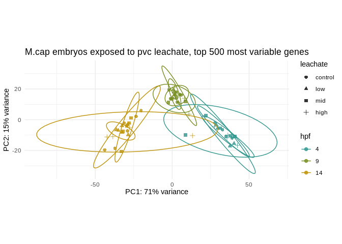

``` r
pca_500$label <- paste0("Sample: ", pca_500$sample_name,
                        "\nHPF: ", pca_500$hpf,
                        "\nLeachate: ", pca_500$leachate)

leachate_alpha_map <- c("control" = 0.3, "low" = 0.5, "mid" = 0.7, "high" = 1)
pca_500$alpha_val <- leachate_alpha_map[pca_500$leachate]
```

``` r
# Original ggplot with a tooltip aesthetic
PCA_500 <- ggplot(pca_500, aes(PC1, PC2, color = hpf, label = name, alpha = alpha_val)) + 
  geom_point(shape = 21, size = 2) +
  ggtitle("M.cap embryos exposed to pvc leachate, top 500 most variable genes") +
  xlab(paste0("PC1: ", percentVar_500[1], "% variance")) +
  ylab(paste0("PC2: ", percentVar_500[2], "% variance")) + 
  coord_fixed() +
  scale_color_manual(values = hpf_colors) +
  stat_ellipse() + 
  guides(alpha = "none") +  # hide alpha legend (optional)
  theme_minimal()

# Convert to interactive plot
ggplotly(PCA_500, tooltip = "label")
```

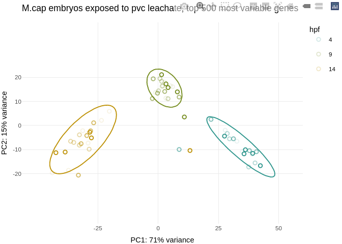

## Plot distribution

``` r
# Extract VST-transformed expression matrix
vsd_mat <- assay(vst(dds))

# Flatten it into a vector
vsd_vals <- as.vector(vsd_mat)

# Create a dataframe for ggplot
df_vsd <- data.frame(vsd_count = vsd_vals)

# Plot
ggplot(df_vsd, aes(x = vsd_count)) +
  geom_histogram(fill = "grey") +
  theme_classic() +
  labs(
    title = "Histogram of Variance-Stabilized Counts",
    x = "VST-transformed read count",
    y = "Frequency"
  )
```

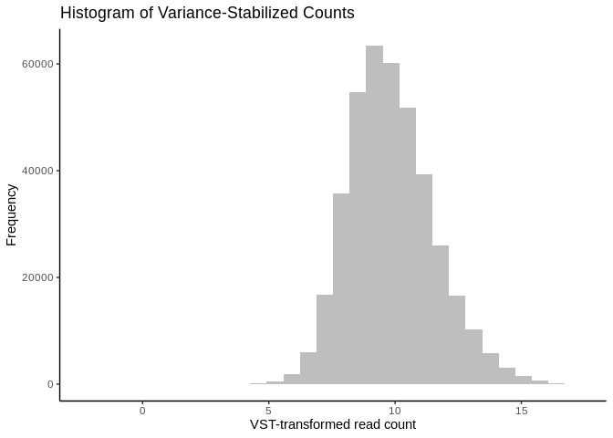

VST compresses the high-end of the count distribution and expands the
low-end, making the variance roughly constant across the range. The
resulting values are on an approximate log2 scale but not exact
log2(count + 1) — VST is more nuanced, especially for low counts. A
range of 5 to 15 corresponds roughly to raw counts ranging from 2³² to
2¹⁵ ≈ 32 to 32,000, so it’s realistic for RNA-seq gene expression data.

# Run DESeq Test

This calculates the log2fold change between factors

``` r
dds <- DESeq(dds, test="LRT", reduced=~1)
```

## Plot dispersion

``` r
plotDispEsts(dds)
```

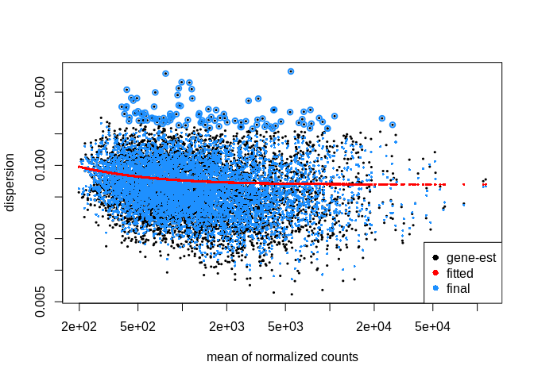

> [!NOTE]
>
> Dispersion trend line is hovering around 0.1, and bulk spread of
> tag-wise gene estimates is from 0.02 to 0.5

# Build contrasts

``` r
resultsNames(dds)  # see what contrast names are available
```

     [1] "Intercept"                "hpf_9_vs_4"              
     [3] "hpf_14_vs_4"              "leachate_low_vs_control" 
     [5] "leachate_mid_vs_control"  "leachate_high_vs_control"
     [7] "hpf9.leachatelow"         "hpf14.leachatelow"       
     [9] "hpf9.leachatemid"         "hpf14.leachatemid"       
    [11] "hpf9.leachatehigh"        "hpf14.leachatehigh"      

| Coef | Name                         | Meaning                                                              |
|------|------------------------------|----------------------------------------------------------------------|
| 1    | `"Intercept"`                | Baseline expression: `hpf = 4` and `leachate = control`              |
| 2    | `"hpf_9_vs_4"`               | Change from 4 hpf → 9 hpf, at **control** exposure                   |
| 3    | `"hpf_14_vs_4"`              | Change from 4 hpf → 14 hpf, at **control** exposure                  |
| 4    | `"leachate_low_vs_control"`  | Change from control → low exposure, at **4 hpf**                     |
| 5    | `"leachate_mid_vs_control"`  | Change from control → mid exposure, at **4 hpf**                     |
| 6    | `"leachate_high_vs_control"` | Change from control → high exposure, **4 hpf**                       |
| 7    | `"hpf9.leachatelow"`         | **Interaction term**: extra effect of low exposure at 9 hpf vs 4 hpf |
| 8    | `"hpf14.leachatelow"`        | Extra effect at 14 hpf vs 4 hpf                                      |
| 9    | `"hpf9.leachatemid"`         | Extra effect of mid exposure at 9 hpf vs 4 hpf                       |
| 10   | `"hpf14.leachatemid"`        | … at 14 hpf                                                          |
| 11   | `"hpf9.leachatehigh"`        | … for high                                                           |
| 12   | `"hpf14.leachatehigh"`       | … for high at 14 hpf                                                 |

To get the effect of leachate at a specific time:

| What you want            | Use this contrast                                    |
|--------------------------|------------------------------------------------------|
| Low vs Control at 4 hpf  | `"leachate_low_vs_control"`                          |
| Low vs Control at 9 hpf  | `c("leachate_low_vs_control", "hpf9.leachatelow")`   |
| Mid vs Control at 14 hpf | `c("leachate_mid_vs_control", "hpf14.leachatemid")`  |
| High vs Control at 9 hpf | `c("leachate_high_vs_control", "hpf9.leachatehigh")` |

## Effect of high exposure at 14 hpf

When you test for main effects of leachate (e.g.,
“leachate_high_vs_control”), it’s at the reference timepoint (hpf = 4).
The interaction terms model how the leachate effect changes relative to
that baseline as development progresses.

What’s the effect of high exposure at 14 hpf? You must combine: -
“leachate_high_vs_control”: main leachate effect at 4 hpf -
“hpf14.leachatehigh”: additional effect at 14 hpf

``` r
# output results of contrast
res_14hpf_high <- (results(dds, contrast = list(
  c("leachate_high_vs_control", "hpf14.leachatehigh")
)))

summary(res_14hpf_high)
```


    out of 6466 with nonzero total read count
    adjusted p-value < 0.1
    LFC > 0 (up)       : 2993, 46%
    LFC < 0 (down)     : 2940, 45%
    outliers [1]       : 0, 0%
    low counts [2]     : 0, 0%
    (mean count < 199)
    [1] see 'cooksCutoff' argument of ?results
    [2] see 'independentFiltering' argument of ?results

### Extract significant genes

``` r
padj.cutoff <- 0.05
lfc.cutoff <- 0.5
```

``` r
# Convert results table into tibble
res_14hpf_high_tb <- res_14hpf_high %>%
  data.frame() %>%
  rownames_to_column(var="gene") %>%
  as_tibble()

# subset that table to only keep the significant genes using our pre-defined thresholds:
sig_14hpf_high_noLFCcutoff <- res_14hpf_high_tb %>%
  filter(padj < padj.cutoff)

sig_14hpf_high <- sig_14hpf_high_noLFCcutoff %>% 
  filter(abs(log2FoldChange) > lfc.cutoff)
```

``` r
paste("Number of significant DEGs 14 hpf at high exposure level:", nrow(sig_14hpf_high_noLFCcutoff), "(padj<", padj.cutoff, ")")
```

    [1] "Number of significant DEGs 14 hpf at high exposure level: 5817 (padj< 0.05 )"

``` r
paste("Number of significant DEGs 14 hpf at high exposure level:", nrow(sig_14hpf_high), "(padj<", padj.cutoff, ", log-fold change >", lfc.cutoff, ")")
```

    [1] "Number of significant DEGs 14 hpf at high exposure level: 336 (padj< 0.05 , log-fold change > 0.5 )"

``` r
write_csv(sig_14hpf_high, "../output/09_deg_multifactorial/sig_14hpf_high.csv")
write_csv(sig_14hpf_high_noLFCcutoff, "../output/09_deg_multifactorial/sig_14hpf_high_noLFCcutoff.csv")
```

### Volcano plots

``` r
# shrink lfc for visualizations
res_14hpf_high_ashr <- lfcShrink(dds, contrast = list(c("leachate_high_vs_control", "hpf14.leachatehigh")), type = "ashr")

plotMA(res_14hpf_high)
```

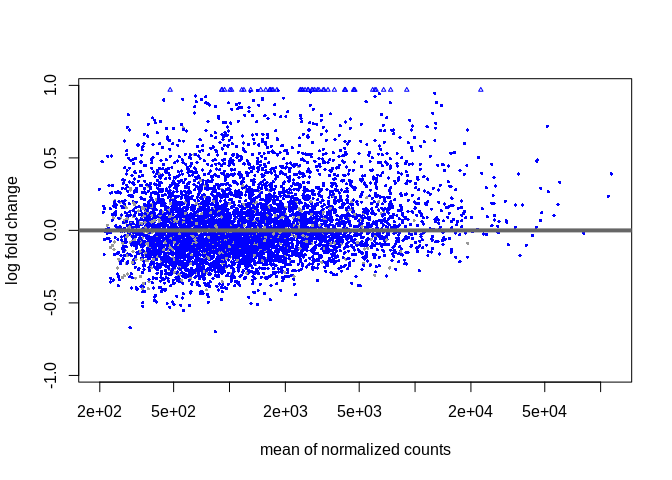

``` r
plotMA(res_14hpf_high_ashr)
```

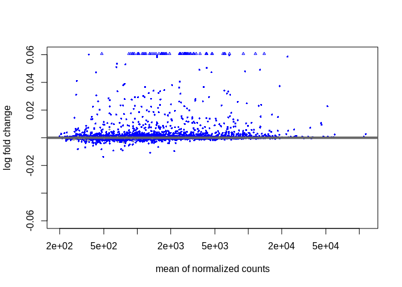

``` r
EnhancedVolcano(res_14hpf_high,
    lab = rownames(res_14hpf_high),
    x = 'log2FoldChange',
    y = 'padj',  # or 'padj' for adjusted p-values
    pCutoff = 0.05,
    FCcutoff = 0.5,
    title = 'Volcano plot',
    subtitle = 'Effect of high exposure at 14 hpf',
    pointSize = 1.0,
    labSize = 3.0,
    col = c('grey30', 'forestgreen', 'royalblue', 'red2')
)
```

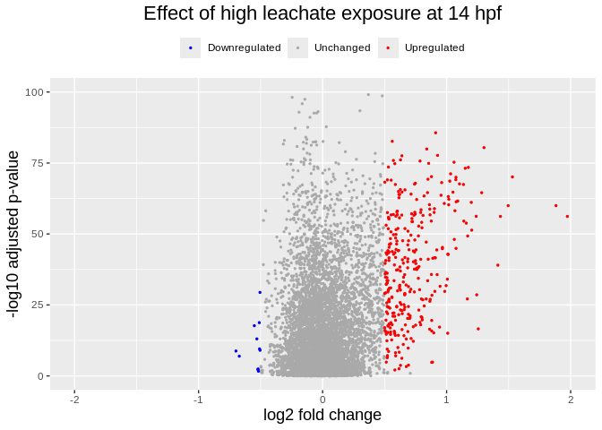

``` r
v14high <- 
  ggplot(res_14hpf_high) +
  # Plot all
  geom_point(aes(x=log2FoldChange, y=-log10(padj),color="unchanged"),
             size=.5) +
  # Overlay all significantly upregulated in red
  geom_point(data = sig_14hpf_high[sig_14hpf_high$log2FoldChange > 0, ], 
             aes(x=log2FoldChange, y=-log10(padj), color="upregulated"), 
             size=.5) +
  # Overlay all significantly downregulated in blue
  geom_point(data = sig_14hpf_high[sig_14hpf_high$log2FoldChange < 0, ], 
             aes(x=log2FoldChange, y=-log10(padj), color="downregulated"), 
             size=.5) +
  ggtitle("Effect of high leachate exposure at 14 hpf") +
  xlab("log2 fold change") + 
  ylab("-log10 adjusted p-value") +
  scale_x_continuous(limits = c(-2,2)) +
  scale_y_continuous(limits = c(0,100)) +
  scale_color_manual(values = c("unchanged" = "darkgrey", "upregulated" = "red", "downregulated" = "blue"),
                     labels = c("unchanged" = "Unchanged", "upregulated" = "Upregulated", "downregulated" = "Downregulated"),
                     name = NULL) +
  theme(legend.position = "top",
        plot.title = element_text(size = rel(1.5), hjust = 0.5),
        axis.title = element_text(size = rel(1.25)))

v14high
```


## Effect of mid exposure at 14 hpf

``` r
# output results of contrast
res_14hpf_mid <- (results(dds, contrast = list(
  c("leachate_mid_vs_control", "hpf14.leachatemid")
)))

summary(res_14hpf_mid)
```


    out of 6466 with nonzero total read count
    adjusted p-value < 0.1
    LFC > 0 (up)       : 2881, 45%
    LFC < 0 (down)     : 3052, 47%
    outliers [1]       : 0, 0%
    low counts [2]     : 0, 0%
    (mean count < 199)
    [1] see 'cooksCutoff' argument of ?results
    [2] see 'independentFiltering' argument of ?results

### Extract significant genes

``` r
# Convert results table into tibble
res_14hpf_mid_tb <- res_14hpf_mid %>%
  data.frame() %>%
  rownames_to_column(var="gene") %>%
  as_tibble()

# subset that table to only keep the significant genes using our pre-defined thresholds:
sig_14hpf_mid_noLFCcutoff <- res_14hpf_mid_tb %>%
  filter(padj < padj.cutoff)

sig_14hpf_mid <- sig_14hpf_mid_noLFCcutoff %>% 
  filter(abs(log2FoldChange) > lfc.cutoff)
```

``` r
paste("Number of significant DEGs 14 hpf at mid exposure level:", nrow(sig_14hpf_mid_noLFCcutoff), "(padj<", padj.cutoff, ")")
```

    [1] "Number of significant DEGs 14 hpf at mid exposure level: 5817 (padj< 0.05 )"

``` r
paste("Number of significant DEGs 14 hpf at mid exposure level:", nrow(sig_14hpf_mid), "(padj<", padj.cutoff, ", log-fold change >", lfc.cutoff, ")")
```

    [1] "Number of significant DEGs 14 hpf at mid exposure level: 34 (padj< 0.05 , log-fold change > 0.5 )"

``` r
write_csv(sig_14hpf_mid, "../output/09_deg_multifactorial/sig_14hpf_mid.csv")
write_csv(sig_14hpf_mid_noLFCcutoff, "../output/09_deg_multifactorial/sig_14hpf_mid_noLFCcutoff.csv")
```

### Volcano plots

``` r
# shrink lfc for visualizations
res_14hpf_mid_ashr <- lfcShrink(dds, contrast = list(c("leachate_mid_vs_control", "hpf14.leachatemid")), type = "ashr")

plotMA(res_14hpf_mid)
```

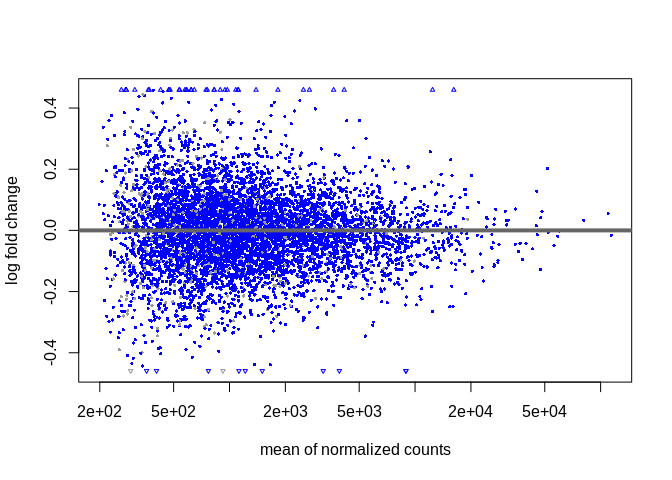

``` r
plotMA(res_14hpf_mid_ashr)
```

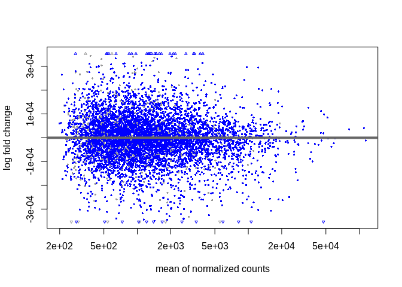

``` r
EnhancedVolcano(res_14hpf_mid,
    lab = rownames(res_14hpf_mid),
    x = 'log2FoldChange',
    y = 'padj',  # or 'padj' for adjusted p-values
    pCutoff = 0.05,
    FCcutoff = 0.5,
    title = 'Volcano plot',
    subtitle = 'Effect of mid exposure at 14 hpf',
    pointSize = 1.0,
    labSize = 3.0,
    col = c('grey30', 'forestgreen', 'royalblue', 'red2')
)
```

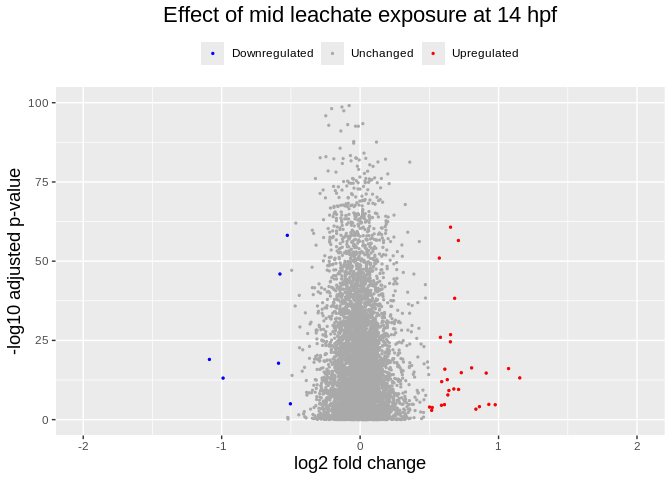

``` r
v14mid <- 
  ggplot(res_14hpf_mid) +
  # Plot all
  geom_point(aes(x=log2FoldChange, y=-log10(padj),color="unchanged"),
             size=.5) +
  # Overlay all significantly upregulated in red
  geom_point(data = sig_14hpf_mid[sig_14hpf_mid$log2FoldChange > 0, ], 
             aes(x=log2FoldChange, y=-log10(padj), color="upregulated"), 
             size=.5) +
  # Overlay all significantly downregulated in blue
  geom_point(data = sig_14hpf_mid[sig_14hpf_mid$log2FoldChange < 0, ], 
             aes(x=log2FoldChange, y=-log10(padj), color="downregulated"), 
             size=.5) +
  ggtitle("Effect of mid leachate exposure at 14 hpf") +
  xlab("log2 fold change") + 
  ylab("-log10 adjusted p-value") +
  scale_x_continuous(limits = c(-2,2)) +
  scale_y_continuous(limits = c(0,100)) +
  scale_color_manual(values = c("unchanged" = "darkgrey", "upregulated" = "red", "downregulated" = "blue"),
                     labels = c("unchanged" = "Unchanged", "upregulated" = "Upregulated", "downregulated" = "Downregulated"),
                     name = NULL) +
  theme(legend.position = "top",
        plot.title = element_text(size = rel(1.5), hjust = 0.5),
        axis.title = element_text(size = rel(1.25)))

v14mid
```


## Effect of low exposure at 14 hpf

``` r
# output results of contrast
res_14hpf_low <- (results(dds, contrast = list(
  c("leachate_low_vs_control", "hpf14.leachatelow")
)))

summary(res_14hpf_low)
```


    out of 6466 with nonzero total read count
    adjusted p-value < 0.1
    LFC > 0 (up)       : 2665, 41%
    LFC < 0 (down)     : 3268, 51%
    outliers [1]       : 0, 0%
    low counts [2]     : 0, 0%
    (mean count < 199)
    [1] see 'cooksCutoff' argument of ?results
    [2] see 'independentFiltering' argument of ?results

### Extract significant genes

``` r
# Convert results table into tibble
res_14hpf_low_tb <- res_14hpf_low %>%
  data.frame() %>%
  rownames_to_column(var="gene") %>%
  as_tibble()

# subset that table to only keep the significant genes using our pre-defined thresholds:
sig_14hpf_low_noLFCcutoff <- res_14hpf_low_tb %>%
  filter(padj < padj.cutoff)

sig_14hpf_low <- sig_14hpf_low_noLFCcutoff %>% 
  filter(abs(log2FoldChange) > lfc.cutoff)
```

``` r
paste("Number of significant DEGs 14 hpf at low exposure level:", nrow(sig_14hpf_low_noLFCcutoff), "(padj<", padj.cutoff, ")")
```

    [1] "Number of significant DEGs 14 hpf at low exposure level: 5817 (padj< 0.05 )"

``` r
paste("Number of significant DEGs 14 hpf at low exposure level:", nrow(sig_14hpf_low), "(padj<", padj.cutoff, ", log-fold change >", lfc.cutoff, ")")
```

    [1] "Number of significant DEGs 14 hpf at low exposure level: 16 (padj< 0.05 , log-fold change > 0.5 )"

``` r
write_csv(sig_14hpf_low, "../output/09_deg_multifactorial/sig_14hpf_low.csv")
write_csv(sig_14hpf_low_noLFCcutoff, "../output/09_deg_multifactorial/sig_14hpf_low_noLFCcutoff.csv")
```

### Volcano plots

``` r
# shrink lfc for visualizations
res_14hpf_low_ashr <- lfcShrink(dds, contrast = list(c("leachate_low_vs_control", "hpf14.leachatelow")), type = "ashr")

plotMA(res_14hpf_low)
```

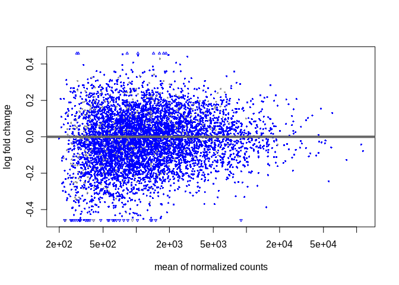

``` r
plotMA(res_14hpf_low_ashr)
```

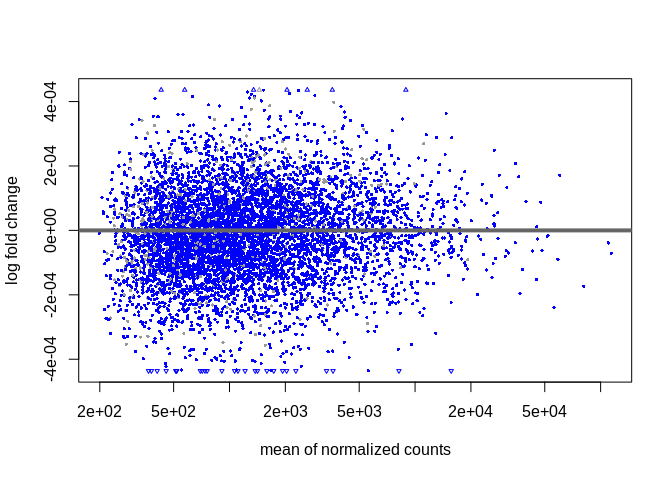

``` r
EnhancedVolcano(res_14hpf_low,
    lab = rownames(res_14hpf_low),
    x = 'log2FoldChange',
    y = 'padj',  # or 'padj' for adjusted p-values
    pCutoff = 0.05,
    FCcutoff = 0.5,
    title = 'Volcano plot',
    subtitle = 'Effect of low exposure at 14 hpf',
    pointSize = 1.0,
    labSize = 3.0,
    col = c('grey30', 'forestgreen', 'royalblue', 'red2')
)
```


``` r
v14low <- 
  ggplot(res_14hpf_low) +
  # Plot all
  geom_point(aes(x=log2FoldChange, y=-log10(padj),color="unchanged"),
             size=.5) +
  # Overlay all significantly upregulated in red
  geom_point(data = sig_14hpf_low[sig_14hpf_low$log2FoldChange > 0, ], 
             aes(x=log2FoldChange, y=-log10(padj), color="upregulated"), 
             size=.5) +
  # Overlay all significantly downregulated in blue
  geom_point(data = sig_14hpf_low[sig_14hpf_low$log2FoldChange < 0, ], 
             aes(x=log2FoldChange, y=-log10(padj), color="downregulated"), 
             size=.5) +
  ggtitle("Effect of low leachate exposure at 14 hpf") +
  xlab("log2 fold change") + 
  ylab("-log10 adjusted p-value") +
  scale_x_continuous(limits = c(-2,2)) +
  scale_y_continuous(limits = c(0,100)) +
  scale_color_manual(values = c("unchanged" = "darkgrey", "upregulated" = "red", "downregulated" = "blue"),
                     labels = c("unchanged" = "Unchanged", "upregulated" = "Upregulated", "downregulated" = "Downregulated"),
                     name = NULL) +
  theme(legend.position = "top",
        plot.title = element_text(size = rel(1.5), hjust = 0.5),
        axis.title = element_text(size = rel(1.25)))

v14low
```

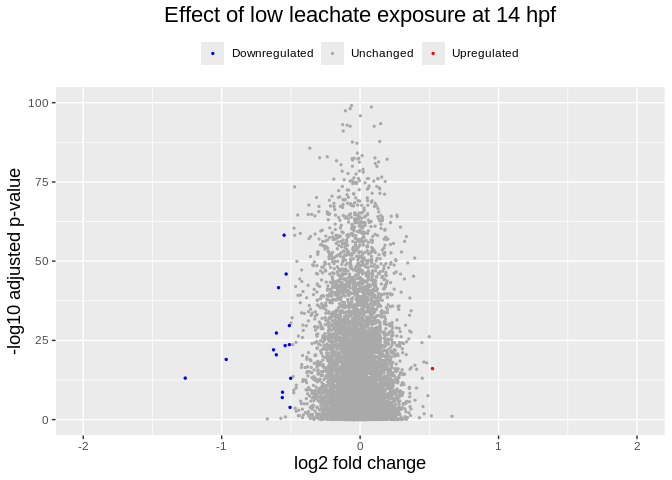

## Effect of high exposure at 9 hpf

``` r
# output results of contrast
res_9hpf_high <- (results(dds, contrast = list(
  c("leachate_high_vs_control", "hpf9.leachatehigh")
)))

summary(res_9hpf_high)
```


    out of 6466 with nonzero total read count
    adjusted p-value < 0.1
    LFC > 0 (up)       : 3001, 46%
    LFC < 0 (down)     : 2932, 45%
    outliers [1]       : 0, 0%
    low counts [2]     : 0, 0%
    (mean count < 199)
    [1] see 'cooksCutoff' argument of ?results
    [2] see 'independentFiltering' argument of ?results

### Extract significant genes

``` r
# Convert results table into tibble
res_9hpf_high_tb <- res_9hpf_high %>%
  data.frame() %>%
  rownames_to_column(var="gene") %>%
  as_tibble()

# subset that table to only keep the significant genes using our pre-defined thresholds:
sig_9hpf_high_noLFCcutoff <- res_9hpf_high_tb %>%
  filter(padj < padj.cutoff)

sig_9hpf_high <- sig_9hpf_high_noLFCcutoff %>% 
  filter(abs(log2FoldChange) > lfc.cutoff)
```

``` r
paste("Number of significant DEGs 9 hpf at high exposure level:", nrow(sig_9hpf_high_noLFCcutoff), "(padj<", padj.cutoff, ")")
```

    [1] "Number of significant DEGs 9 hpf at high exposure level: 5817 (padj< 0.05 )"

``` r
paste("Number of significant DEGs 9 hpf at high exposure level:", nrow(sig_9hpf_high), "(padj<", padj.cutoff, ", log-fold change >", lfc.cutoff, ")")
```

    [1] "Number of significant DEGs 9 hpf at high exposure level: 33 (padj< 0.05 , log-fold change > 0.5 )"

``` r
write_csv(sig_9hpf_high, "../output/09_deg_multifactorial/sig_9hpf_high.csv")
write_csv(sig_9hpf_high_noLFCcutoff, "../output/09_deg_multifactorial/sig_9hpf_high_noLFCcutoff.csv")
```

### Volcano plots

``` r
# shrink lfc for visualizations
res_9hpf_high_ashr <- lfcShrink(dds, contrast = list(c("leachate_high_vs_control", "hpf9.leachatehigh")), type = "ashr")

plotMA(res_9hpf_high)
```

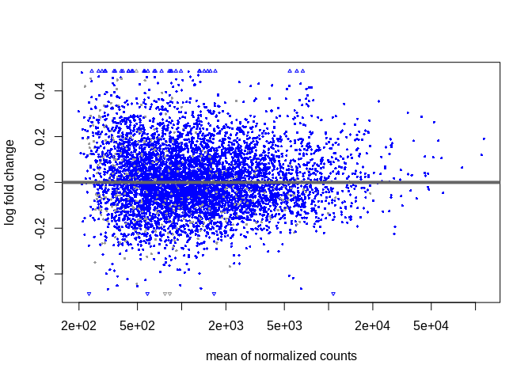

``` r
plotMA(res_9hpf_high_ashr)
```

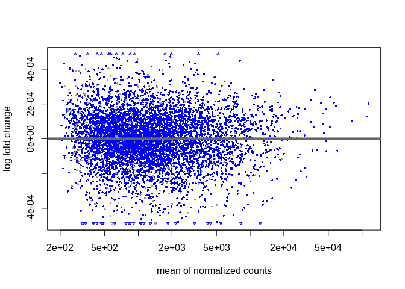

``` r
EnhancedVolcano(res_9hpf_high,
    lab = rownames(res_9hpf_high),
    x = 'log2FoldChange',
    y = 'padj',  # or 'padj' for adjusted p-values
    pCutoff = 0.05,
    FCcutoff = 0.5,
    title = 'Volcano plot',
    subtitle = 'Effect of high exposure at 9 hpf',
    pointSize = 1.0,
    labSize = 3.0,
    col = c('grey30', 'forestgreen', 'royalblue', 'red2')
)
```


``` r
v9high <- 
  ggplot(res_9hpf_high) +
  # Plot all
  geom_point(aes(x=log2FoldChange, y=-log10(padj),color="unchanged"),
             size=.5) +
  # Overlay all significantly upregulated in red
  geom_point(data = sig_9hpf_high[sig_9hpf_high$log2FoldChange > 0, ], 
             aes(x=log2FoldChange, y=-log10(padj), color="upregulated"), 
             size=.5) +
  # Overlay all significantly downregulated in blue
  geom_point(data = sig_9hpf_high[sig_9hpf_high$log2FoldChange < 0, ], 
             aes(x=log2FoldChange, y=-log10(padj), color="downregulated"), 
             size=.5) +
  ggtitle("Effect of high leachate exposure at 9 hpf") +
  xlab("log2 fold change") + 
  ylab("-log10 adjusted p-value") +
  scale_x_continuous(limits = c(-2,2)) +
  scale_y_continuous(limits = c(0,100)) +
  scale_color_manual(values = c("unchanged" = "darkgrey", "upregulated" = "red", "downregulated" = "blue"),
                     labels = c("unchanged" = "Unchanged", "upregulated" = "Upregulated", "downregulated" = "Downregulated"),
                     name = NULL) +
  theme(legend.position = "top",
        plot.title = element_text(size = rel(1.5), hjust = 0.5),
        axis.title = element_text(size = rel(1.25)))

v9high
```

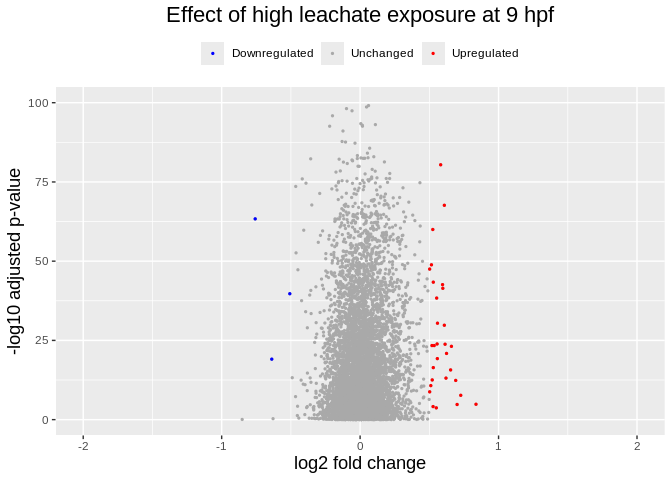

## Effect of mid exposure at 9 hpf

``` r
# output results of contrast
res_9hpf_mid <- (results(dds, contrast = list(
  c("leachate_mid_vs_control", "hpf9.leachatemid")
)))

summary(res_9hpf_mid)
```


    out of 6466 with nonzero total read count
    adjusted p-value < 0.1
    LFC > 0 (up)       : 2923, 45%
    LFC < 0 (down)     : 3010, 47%
    outliers [1]       : 0, 0%
    low counts [2]     : 0, 0%
    (mean count < 199)
    [1] see 'cooksCutoff' argument of ?results
    [2] see 'independentFiltering' argument of ?results

### Extract significant genes

``` r
# Convert results table into tibble
res_9hpf_mid_tb <- res_9hpf_mid %>%
  data.frame() %>%
  rownames_to_column(var="gene") %>%
  as_tibble()

# subset that table to only keep the significant genes using our pre-defined thresholds:
sig_9hpf_mid_noLFCcutoff <- res_9hpf_mid_tb %>%
  filter(padj < padj.cutoff)

sig_9hpf_mid <- sig_9hpf_mid_noLFCcutoff %>% 
  filter(abs(log2FoldChange) > lfc.cutoff)
```

``` r
paste("Number of significant DEGs 9 hpf at mid exposure level:", nrow(sig_9hpf_mid_noLFCcutoff), "(padj<", padj.cutoff, ")")
```

    [1] "Number of significant DEGs 9 hpf at mid exposure level: 5817 (padj< 0.05 )"

``` r
paste("Number of significant DEGs 9 hpf at mid exposure level:", nrow(sig_9hpf_mid), "(padj<", padj.cutoff, ", log-fold change >", lfc.cutoff, ")")
```

    [1] "Number of significant DEGs 9 hpf at mid exposure level: 9 (padj< 0.05 , log-fold change > 0.5 )"

``` r
write_csv(sig_9hpf_mid, "../output/09_deg_multifactorial/sig_9hpf_mid.csv")
write_csv(sig_9hpf_mid_noLFCcutoff, "../output/09_deg_multifactorial/sig_9hpf_mid_noLFCcutoff.csv")
```

### Volcano plots

``` r
# shrink lfc for visualizations
res_9hpf_mid_ashr <- lfcShrink(dds, contrast = list(c("leachate_mid_vs_control", "hpf9.leachatemid")), type = "ashr")

plotMA(res_9hpf_mid)
```

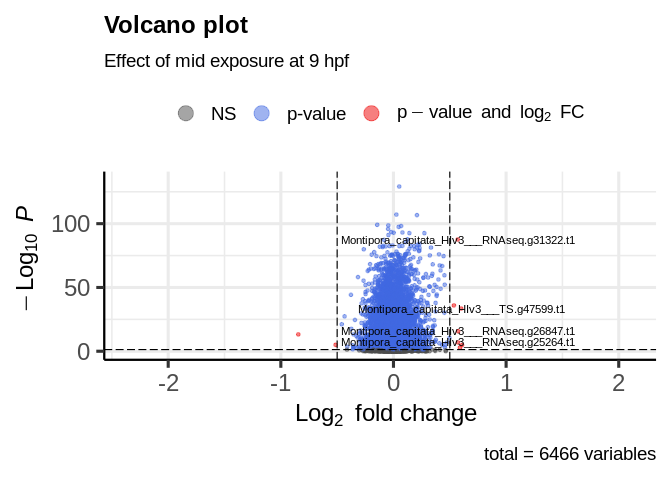

``` r
plotMA(res_9hpf_mid_ashr)
```

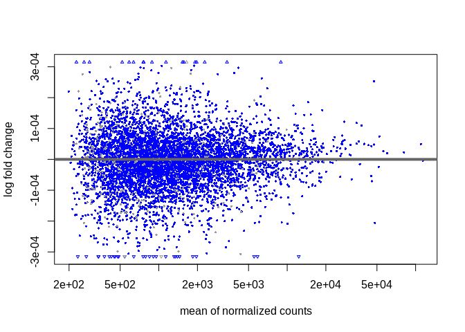

``` r
EnhancedVolcano(res_9hpf_mid,
    lab = rownames(res_9hpf_mid),
    x = 'log2FoldChange',
    y = 'padj',  # or 'padj' for adjusted p-values
    pCutoff = 0.05,
    FCcutoff = 0.5,
    title = 'Volcano plot',
    subtitle = 'Effect of mid exposure at 9 hpf',
    pointSize = 1.0,
    labSize = 3.0,
    col = c('grey30', 'forestgreen', 'royalblue', 'red2')
)
```

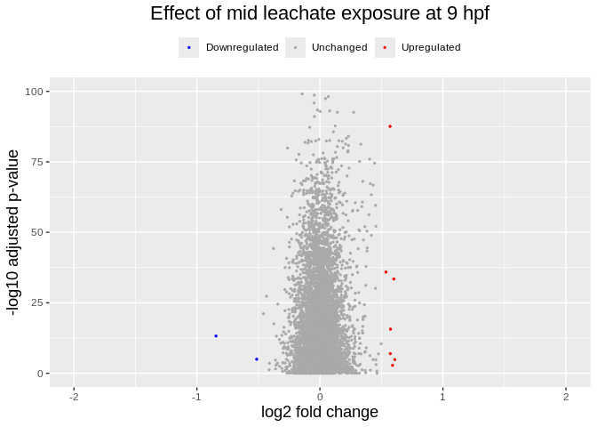

``` r
v9mid <- 
  ggplot(res_9hpf_mid) +
  # Plot all
  geom_point(aes(x=log2FoldChange, y=-log10(padj),color="unchanged"),
             size=.5) +
  # Overlay all significantly upregulated in red
  geom_point(data = sig_9hpf_mid[sig_9hpf_mid$log2FoldChange > 0, ], 
             aes(x=log2FoldChange, y=-log10(padj), color="upregulated"), 
             size=.5) +
  # Overlay all significantly downregulated in blue
  geom_point(data = sig_9hpf_mid[sig_9hpf_mid$log2FoldChange < 0, ], 
             aes(x=log2FoldChange, y=-log10(padj), color="downregulated"), 
             size=.5) +
  ggtitle("Effect of mid leachate exposure at 9 hpf") +
  xlab("log2 fold change") + 
  ylab("-log10 adjusted p-value") +
  scale_x_continuous(limits = c(-2,2)) +
  scale_y_continuous(limits = c(0,100)) +
  scale_color_manual(values = c("unchanged" = "darkgrey", "upregulated" = "red", "downregulated" = "blue"),
                     labels = c("unchanged" = "Unchanged", "upregulated" = "Upregulated", "downregulated" = "Downregulated"),
                     name = NULL) +
  theme(legend.position = "top",
        plot.title = element_text(size = rel(1.5), hjust = 0.5),
        axis.title = element_text(size = rel(1.25)))

v9mid
```


## Effect of low exposure at 9 hpf

``` r
# output results of contrast
res_9hpf_low <- (results(dds, contrast = list(
  c("leachate_low_vs_control", "hpf9.leachatelow")
)))

summary(res_9hpf_low)
```


    out of 6466 with nonzero total read count
    adjusted p-value < 0.1
    LFC > 0 (up)       : 2662, 41%
    LFC < 0 (down)     : 3271, 51%
    outliers [1]       : 0, 0%
    low counts [2]     : 0, 0%
    (mean count < 199)
    [1] see 'cooksCutoff' argument of ?results
    [2] see 'independentFiltering' argument of ?results

### Extract significant genes

``` r
# Convert results table into tibble
res_9hpf_low_tb <- res_9hpf_low %>%
  data.frame() %>%
  rownames_to_column(var="gene") %>%
  as_tibble()

# subset that table to only keep the significant genes using our pre-defined thresholds:
sig_9hpf_low_noLFCcutoff <- res_9hpf_low_tb %>%
  filter(padj < padj.cutoff)

sig_9hpf_low <- sig_9hpf_low_noLFCcutoff %>% 
  filter(abs(log2FoldChange) > lfc.cutoff)
```

``` r
paste("Number of significant DEGs 9 hpf at low exposure level:", nrow(sig_9hpf_low_noLFCcutoff), "(padj<", padj.cutoff, ")")
```

    [1] "Number of significant DEGs 9 hpf at low exposure level: 5817 (padj< 0.05 )"

``` r
paste("Number of significant DEGs 9 hpf at low exposure level:", nrow(sig_9hpf_low), "(padj<", padj.cutoff, ", log-fold change >", lfc.cutoff, ")")
```

    [1] "Number of significant DEGs 9 hpf at low exposure level: 4 (padj< 0.05 , log-fold change > 0.5 )"

``` r
write_csv(sig_9hpf_low, "../output/09_deg_multifactorial/sig_9hpf_low.csv")
write_csv(sig_9hpf_low_noLFCcutoff, "../output/09_deg_multifactorial/sig_9hpf_low_noLFCcutoff.csv")
```

### Volcano plots

``` r
# shrink lfc for visualizations
res_9hpf_low_ashr <- lfcShrink(dds, contrast = list(c("leachate_low_vs_control", "hpf9.leachatelow")), type = "ashr")

plotMA(res_9hpf_low)
```

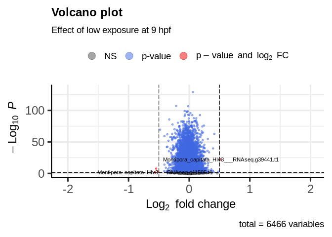

``` r
plotMA(res_9hpf_low_ashr)
```

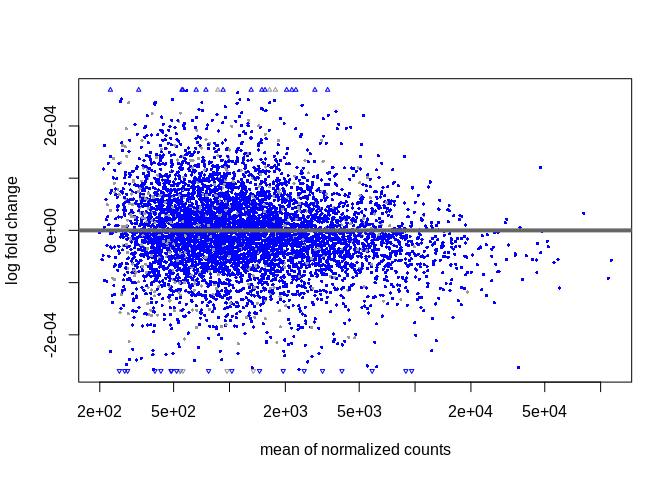

``` r
EnhancedVolcano(res_9hpf_low,
    lab = rownames(res_9hpf_low),
    x = 'log2FoldChange',
    y = 'padj',  # or 'padj' for adjusted p-values
    pCutoff = 0.05,
    FCcutoff = 0.5,
    title = 'Volcano plot',
    subtitle = 'Effect of low exposure at 9 hpf',
    pointSize = 1.0,
    labSize = 3.0,
    col = c('grey30', 'forestgreen', 'royalblue', 'red2')
)
```


``` r
v9low <- 
  ggplot(res_9hpf_low) +
  # Plot all
  geom_point(aes(x=log2FoldChange, y=-log10(padj),color="unchanged"),
             size=.5) +
  # Overlay all significantly upregulated in red
  geom_point(data = sig_9hpf_low[sig_9hpf_low$log2FoldChange > 0, ], 
             aes(x=log2FoldChange, y=-log10(padj), color="upregulated"), 
             size=.5) +
  # Overlay all significantly downregulated in blue
  geom_point(data = sig_9hpf_low[sig_9hpf_low$log2FoldChange < 0, ], 
             aes(x=log2FoldChange, y=-log10(padj), color="downregulated"), 
             size=.5) +
  ggtitle("Effect of low leachate exposure at 9 hpf") +
  xlab("log2 fold change") + 
  ylab("-log10 adjusted p-value") +
  scale_x_continuous(limits = c(-2,2)) +
  scale_y_continuous(limits = c(0,100)) +
  scale_color_manual(values = c("unchanged" = "darkgrey", "upregulated" = "red", "downregulated" = "blue"),
                     labels = c("unchanged" = "Unchanged", "upregulated" = "Upregulated", "downregulated" = "Downregulated"),
                     name = NULL) +
  theme(legend.position = "top",
        plot.title = element_text(size = rel(1.5), hjust = 0.5),
        axis.title = element_text(size = rel(1.25)))

v9low
```

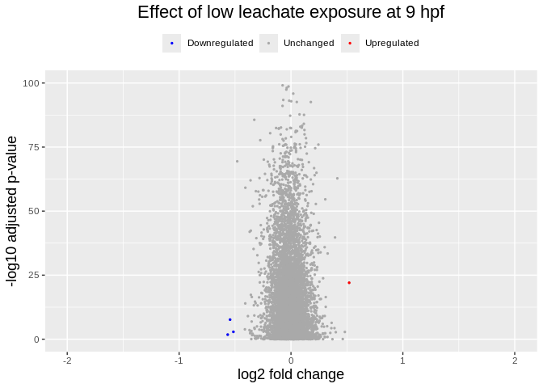

## Effect of high exposure at 4 hpf

``` r
# output results of contrast
res_4hpf_high <- (results(dds, name = "leachate_high_vs_control")
)

summary(res_4hpf_high)
```


    out of 6466 with nonzero total read count
    adjusted p-value < 0.1
    LFC > 0 (up)       : 3064, 47%
    LFC < 0 (down)     : 2869, 44%
    outliers [1]       : 0, 0%
    low counts [2]     : 0, 0%
    (mean count < 199)
    [1] see 'cooksCutoff' argument of ?results
    [2] see 'independentFiltering' argument of ?results

### Extract significant genes

``` r
# Convert results table into tibble
res_4hpf_high_tb <- res_4hpf_high %>%
  data.frame() %>%
  rownames_to_column(var="gene") %>%
  as_tibble()

# subset that table to only keep the significant genes using our pre-defined thresholds:
sig_4hpf_high_noLFCcutoff <- res_4hpf_high_tb %>%
  filter(padj < padj.cutoff)

sig_4hpf_high <- sig_4hpf_high_noLFCcutoff %>% 
  filter(abs(log2FoldChange) > lfc.cutoff)
```

``` r
paste("Number of significant DEGs 4 hpf at high exposure level:", nrow(sig_4hpf_high_noLFCcutoff), "(padj<", padj.cutoff, ")")
```

    [1] "Number of significant DEGs 4 hpf at high exposure level: 5817 (padj< 0.05 )"

``` r
paste("Number of significant DEGs 4 hpf at high exposure level:", nrow(sig_4hpf_high), "(padj<", padj.cutoff, ", log-fold change >", lfc.cutoff, ")")
```

    [1] "Number of significant DEGs 4 hpf at high exposure level: 205 (padj< 0.05 , log-fold change > 0.5 )"

``` r
write_csv(sig_4hpf_high, "../output/09_deg_multifactorial/sig_4hpf_high.csv")
write_csv(sig_4hpf_high_noLFCcutoff, "../output/09_deg_multifactorial/sig_4hpf_high_noLFCcutoff.csv")
```

### Volcano plots

``` r
# shrink lfc for visualizations
res_4hpf_high_ashr <- lfcShrink(dds, coef = 6 , type = "ashr")

plotMA(res_4hpf_high)
```

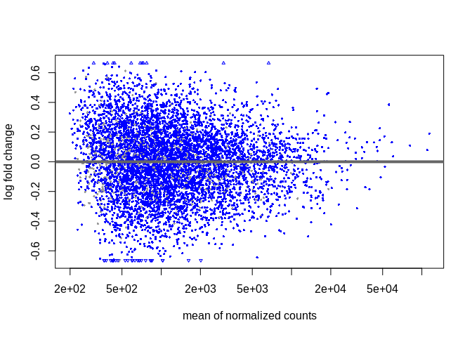

``` r
plotMA(res_4hpf_high_ashr)
```

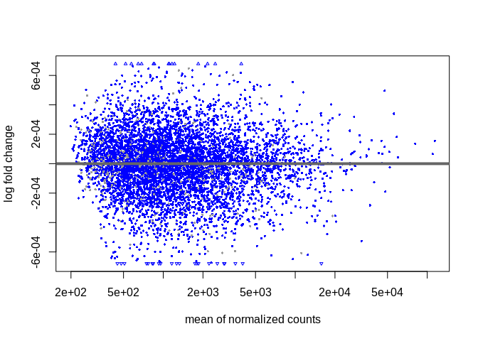

``` r
EnhancedVolcano(res_4hpf_high,
    lab = rownames(res_4hpf_high),
    x = 'log2FoldChange',
    y = 'padj',  # or 'padj' for adjusted p-values
    pCutoff = 0.05,
    FCcutoff = 0.5,
    title = 'Volcano plot',
    subtitle = 'Effect of high exposure at 4 hpf',
    pointSize = 1.0,
    labSize = 3.0,
    col = c('grey30', 'forestgreen', 'royalblue', 'red2')
)
```

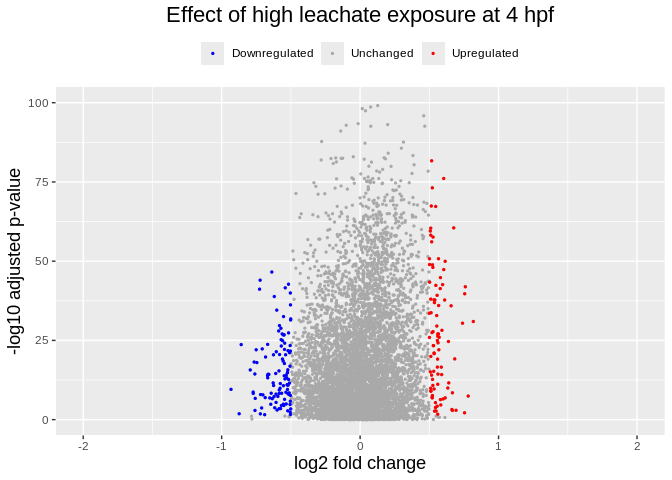

``` r
v4high <- 
  ggplot(res_4hpf_high) +
  # Plot all
  geom_point(aes(x=log2FoldChange, y=-log10(padj),color="unchanged"),
             size=.5) +
  # Overlay all significantly upregulated in red
  geom_point(data = sig_4hpf_high[sig_4hpf_high$log2FoldChange > 0, ], 
             aes(x=log2FoldChange, y=-log10(padj), color="upregulated"), 
             size=.5) +
  # Overlay all significantly downregulated in blue
  geom_point(data = sig_4hpf_high[sig_4hpf_high$log2FoldChange < 0, ], 
             aes(x=log2FoldChange, y=-log10(padj), color="downregulated"), 
             size=.5) +
  ggtitle("Effect of high leachate exposure at 4 hpf") +
  xlab("log2 fold change") + 
  ylab("-log10 adjusted p-value") +
  scale_x_continuous(limits = c(-2,2)) +
  scale_y_continuous(limits = c(0,100)) +
  scale_color_manual(values = c("unchanged" = "darkgrey", "upregulated" = "red", "downregulated" = "blue"),
                     labels = c("unchanged" = "Unchanged", "upregulated" = "Upregulated", "downregulated" = "Downregulated"),
                     name = NULL) +
  theme(legend.position = "top",
        plot.title = element_text(size = rel(1.5), hjust = 0.5),
        axis.title = element_text(size = rel(1.25)))

v4high
```


## Effect of mid exposure at 4 hpf

``` r
# output results of contrast
res_4hpf_mid <- (results(dds, name = "leachate_mid_vs_control")
)

summary(res_4hpf_mid)
```


    out of 6466 with nonzero total read count
    adjusted p-value < 0.1
    LFC > 0 (up)       : 3083, 48%
    LFC < 0 (down)     : 2850, 44%
    outliers [1]       : 0, 0%
    low counts [2]     : 0, 0%
    (mean count < 199)
    [1] see 'cooksCutoff' argument of ?results
    [2] see 'independentFiltering' argument of ?results

### Extract significant genes

``` r
# Convert results table into tibble
res_4hpf_mid_tb <- res_4hpf_mid %>%
  data.frame() %>%
  rownames_to_column(var="gene") %>%
  as_tibble()

# subset that table to only keep the significant genes using our pre-defined thresholds:
sig_4hpf_mid_noLFCcutoff <- res_4hpf_mid_tb %>%
  filter(padj < padj.cutoff)

sig_4hpf_mid <- sig_4hpf_mid_noLFCcutoff %>% 
  filter(abs(log2FoldChange) > lfc.cutoff)
```

``` r
paste("Number of significant DEGs 4 hpf at mid exposure level:", nrow(sig_4hpf_mid_noLFCcutoff), "(padj<", padj.cutoff, ")")
```

    [1] "Number of significant DEGs 4 hpf at mid exposure level: 5817 (padj< 0.05 )"

``` r
paste("Number of significant DEGs 4 hpf at mid exposure level:", nrow(sig_4hpf_mid), "(padj<", padj.cutoff, ", log-fold change >", lfc.cutoff, ")")
```

    [1] "Number of significant DEGs 4 hpf at mid exposure level: 278 (padj< 0.05 , log-fold change > 0.5 )"

``` r
write_csv(sig_4hpf_mid, "../output/09_deg_multifactorial/sig_4hpf_mid.csv")
write_csv(sig_4hpf_mid_noLFCcutoff, "../output/09_deg_multifactorial/sig_4hpf_mid_noLFCcutoff.csv")
```

### Volcano plots

``` r
# shrink lfc for visualizations
res_4hpf_mid_ashr <- lfcShrink(dds, coef = 5 , type = "ashr")

plotMA(res_4hpf_mid)
```

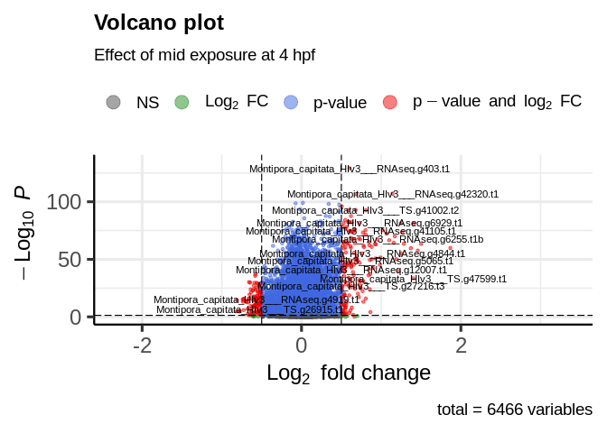

``` r
plotMA(res_4hpf_mid_ashr)
```

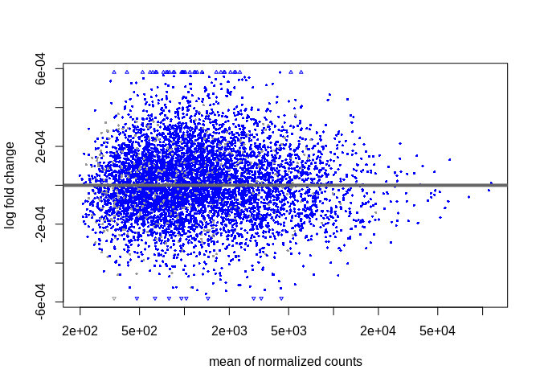

``` r
EnhancedVolcano(res_4hpf_mid,
    lab = rownames(res_4hpf_mid),
    x = 'log2FoldChange',
    y = 'padj',  # or 'padj' for adjusted p-values
    pCutoff = 0.05,
    FCcutoff = 0.5,
    title = 'Volcano plot',
    subtitle = 'Effect of mid exposure at 4 hpf',
    pointSize = 1.0,
    labSize = 3.0,
    col = c('grey30', 'forestgreen', 'royalblue', 'red2')
)
```


``` r
v4mid <- 
  ggplot(res_4hpf_mid) +
  # Plot all
  geom_point(aes(x=log2FoldChange, y=-log10(padj),color="unchanged"),
             size=.5) +
  # Overlay all significantly upregulated in red
  geom_point(data = sig_4hpf_mid[sig_4hpf_mid$log2FoldChange > 0, ], 
             aes(x=log2FoldChange, y=-log10(padj), color="upregulated"), 
             size=.5) +
  # Overlay all significantly downregulated in blue
  geom_point(data = sig_4hpf_mid[sig_4hpf_mid$log2FoldChange < 0, ], 
             aes(x=log2FoldChange, y=-log10(padj), color="downregulated"), 
             size=.5) +
  ggtitle("Effect of mid leachate exposure at 4 hpf") +
  xlab("log2 fold change") + 
  ylab("-log10 adjusted p-value") +
  scale_x_continuous(limits = c(-2,2)) +
  scale_y_continuous(limits = c(0,100)) +
  scale_color_manual(values = c("unchanged" = "darkgrey", "upregulated" = "red", "downregulated" = "blue"),
                     labels = c("unchanged" = "Unchanged", "upregulated" = "Upregulated", "downregulated" = "Downregulated"),
                     name = NULL) +
  theme(legend.position = "top",
        plot.title = element_text(size = rel(1.5), hjust = 0.5),
        axis.title = element_text(size = rel(1.25)))

v4mid
```

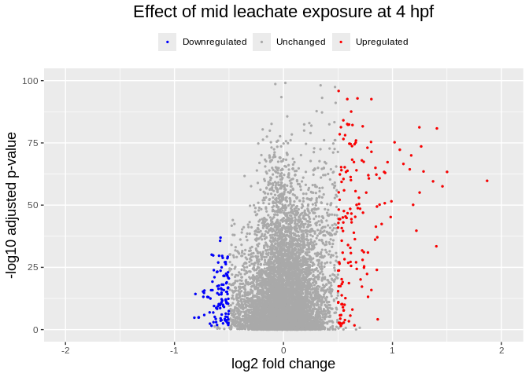

## Effect of low exposure at 4 hpf

``` r
# output results of contrast
res_4hpf_low <- (results(dds, name = "leachate_low_vs_control", alpha=0.05)
)

summary(res_4hpf_low)
```


    out of 6466 with nonzero total read count
    adjusted p-value < 0.05
    LFC > 0 (up)       : 2979, 46%
    LFC < 0 (down)     : 2838, 44%
    outliers [1]       : 0, 0%
    low counts [2]     : 0, 0%
    (mean count < 199)
    [1] see 'cooksCutoff' argument of ?results
    [2] see 'independentFiltering' argument of ?results

### Extract significant genes

``` r
# Convert results table into tibble
res_4hpf_low_tb <- res_4hpf_low %>%
  data.frame() %>%
  rownames_to_column(var="gene") %>%
  as_tibble()

# subset that table to only keep the significant genes using our pre-defined thresholds:
sig_4hpf_low_noLFCcutoff <- res_4hpf_low_tb %>%
  filter(padj < padj.cutoff)

sig_4hpf_low <- sig_4hpf_low_noLFCcutoff %>% 
  filter(abs(log2FoldChange) > lfc.cutoff)
```

``` r
paste("Number of significant DEGs 4 hpf at low exposure level:", nrow(sig_4hpf_low_noLFCcutoff), "(padj<", padj.cutoff, ")")
```

    [1] "Number of significant DEGs 4 hpf at low exposure level: 5817 (padj< 0.05 )"

``` r
paste("Number of significant DEGs 4 hpf at low exposure level:", nrow(sig_4hpf_low), "(padj<", padj.cutoff, ", log-fold change >", lfc.cutoff, ")")
```

    [1] "Number of significant DEGs 4 hpf at low exposure level: 469 (padj< 0.05 , log-fold change > 0.5 )"

``` r
write_csv(sig_4hpf_low, "../output/09_deg_multifactorial/sig_4hpf_low.csv")
write_csv(sig_4hpf_low_noLFCcutoff, "../output/09_deg_multifactorial/sig_4hpf_low_noLFCcutoff.csv")
```

### Volcano plots

``` r
# shrink lfc for visualizations
res_4hpf_low_ashr <- lfcShrink(dds, coef = 4 , type = "ashr")
plotMA(res_4hpf_low)
```


``` r
plotMA(res_4hpf_low_ashr)
```

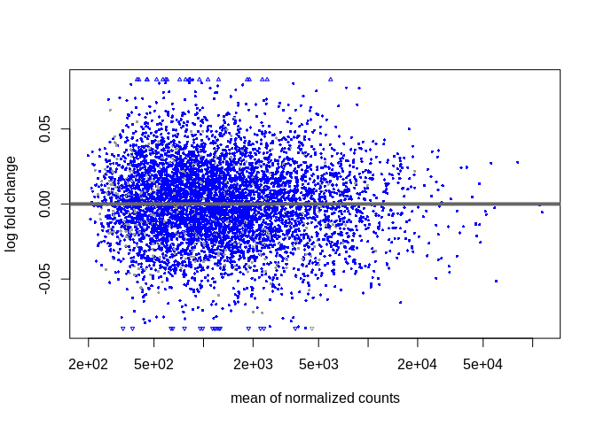

``` r
EnhancedVolcano(res_4hpf_low,
    lab = rownames(res_4hpf_low),
    x = 'log2FoldChange',
    y = 'padj',  # or 'padj' for adjusted p-values
    pCutoff = 0.05,
    FCcutoff = 0.5,
    title = 'Volcano plot',
    subtitle = 'Effect of low exposure at 4 hpf',
    pointSize = 1.0,
    labSize = 3.0,
    col = c('grey30', 'forestgreen', 'royalblue', 'red2')
)
```

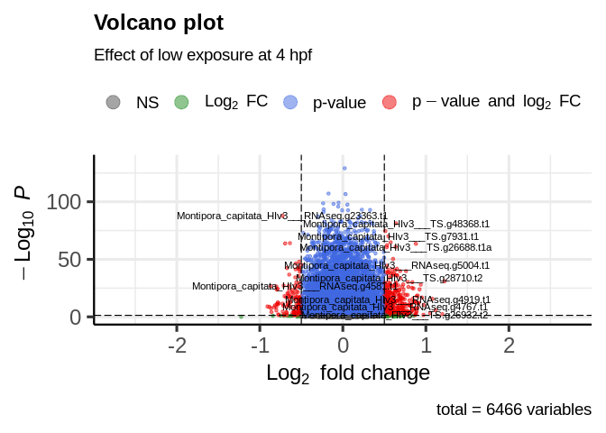

``` r
v4low <- 
  ggplot(res_4hpf_low) +
  # Plot all
  geom_point(aes(x=log2FoldChange, y=-log10(padj),color="unchanged"),
             size=.5) +
  # Overlay all significantly upregulated in red
  geom_point(data = sig_4hpf_low[sig_4hpf_low$log2FoldChange > 0, ], 
             aes(x=log2FoldChange, y=-log10(padj), color="upregulated"), 
             size=.5) +
  # Overlay all significantly downregulated in blue
  geom_point(data = sig_4hpf_low[sig_4hpf_low$log2FoldChange < 0, ], 
             aes(x=log2FoldChange, y=-log10(padj), color="downregulated"), 
             size=.5) +
  ggtitle("Effect of low leachate exposure at 4 hpf") +
  xlab("log2 fold change") + 
  ylab("-log10 adjusted p-value") +
  scale_x_continuous(limits = c(-2,2)) +
  scale_y_continuous(limits = c(0,100)) +
  scale_color_manual(values = c("unchanged" = "darkgrey", "upregulated" = "red", "downregulated" = "blue"),
                     labels = c("unchanged" = "Unchanged", "upregulated" = "Upregulated", "downregulated" = "Downregulated"),
                     name = NULL) +
  theme(legend.position = "top",
        plot.title = element_text(size = rel(1.5), hjust = 0.5),
        axis.title = element_text(size = rel(1.25)))

v4low
```


# Summary

## Facet volcano plot

``` r
# First, strip labels from all individual ggplot objects
# (You can do this in a loop if the plots are in a list)

remove_labels <- function(p) {
  p +
    theme(
      axis.title.x = element_blank(),
      axis.title.y = element_blank(),
      legend.position = "none",
      plot.title = element_text(size = 8)  # adjust title size here
    )
}

# Example: if your plots are named v4control, v4low, etc.
plots <- list( 
   v4low, v9low, v14low,
   v4mid, v9mid, v14mid,
   v4high, v9high, v14high
)

plots_clean <- lapply(plots, remove_labels)

# Now plot in 3 rows × 3 columns
volcano_facet <- plot_grid(
  plotlist = plots_clean,
  nrow = 3,
  ncol = 3,
  labels = NULL,
  label_size = 0,
  align = "hv"
)

volcano_facet
```

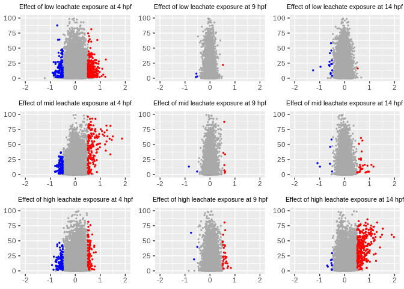

``` r
ggsave("../output/09_deg_multifactorial/volcano_facet.png", volcano_facet, width = 16, height = 12, dpi = 300)
```

> [!WARNING]
>
> Why do volcano plots not look like volcanos!?
>
> Batch Effects or Low Biological Signal If your experimental design has
> confounding factors (e.g., batch effects), or the leachate treatment
> has low impact, then few genes will show strong changes.
>
> Extreme p-values Your plot shows points with -log10(padj) values above
> 20–30. That means padj is very close to 0, which could indicate: -
> Very large sample size - Very consistent effect - Or something off
> with the dispersion estimate or p-value adjustment (e.g., if some
> genes had zero variance across groups)
