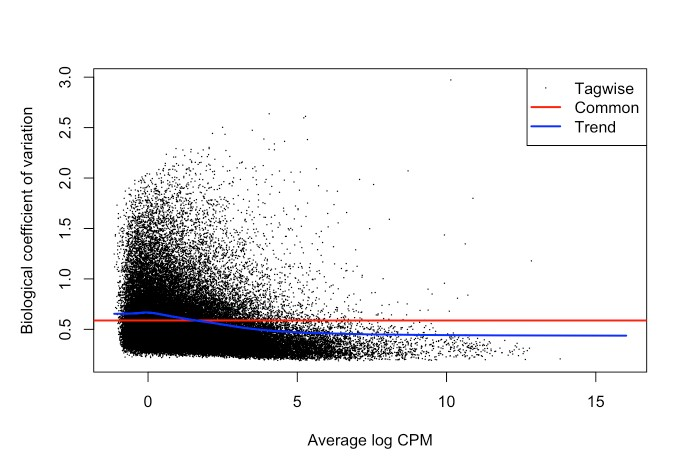
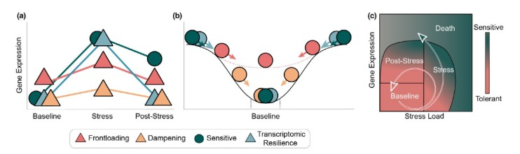

# Images Directory

This directory contains reference figures and experimental design diagrams used throughout the RNA-seq analysis of *Montipora capitata* embryos exposed to PVC leachate.

## Figures

### Experimental Assay Design

Experimental design showing the single-stressor ecotoxicology assay with three PVC leachate treatment levels (control, low, mid, high) and three developmental stages (cleavage, prawnchip, early gastrula) of *Montipora capitata* embryos.

### Reference Figures from MarineOmics Tutorial

The following figures are reference examples from the [MarineOmics DGE comparison tutorial](https://marineomics.github.io/FUN_01_DGE_comparison_v2.html) used for comparison and methodological guidance.

#### Filtered Read Counts Distribution

Example of filtered read counts distribution from MarineOmics tutorial showing typical count data patterns.

#### Non-linear Gene Expression

Example of non-linear gene expression patterns from MarineOmics tutorial.

#### Biological Coefficient of Variation

MarineOmics biological coefficient of variation plot for comparison with our analysis.

### Conceptual Framework from Rivera et al. 2021

#### Transcriptomic Resilience and Timing Concept

From Rivera et al. 2021: "Transcriptomic resilience and timing. (a) Gene expression reaction norms of four strategies during recovery after a stressor. We use triangles again for patterns that may confer tolerance and circles for patterns associated with stress sensitivity. While all triangle paths show a return to baseline (resilience) the pink (frontloading) and yellow (dampening) are also depicting differences in baseline and plasticity and are therefore labelled differently. (b) Adapted from the rolling ball analogy commonly used for ecological resilience and depicted in Hodgson et al. (2015). Each ball represents a gene showing a color-matched expression pattern in (a). Landscapes represent expression possibilities during a stress event. In the absence of stress, the ball will settle in a trough, representing baseline expression levels. Elasticity (rate of return to the baseline) is represented by the size of the arrow (i.e., larger arrows have faster rates of return). Pink dotted line is the expression landscape for the frontloaded ball. (c) Using Torres et al. (2016) loops through disease space as an alternative framework of an organism's path through stress response and recovery. The color gradient represents the resulting phenotype for a given path through stress and recovery space, though x-and y-axis can denote any two parameters that are correlated but with a time lag."

## File Formats

- **PNG files**: High-resolution experimental design diagrams
- **JPEG/JPG files**: Reference figures from literature and tutorials

## Notes

The `Experimental_Assay_Design` image is available in both PNG (12MB, 9000x4200) and JPEG (4MB, 6000x4200) formats. The PNG version is embedded above and used in the main README for higher quality display.
