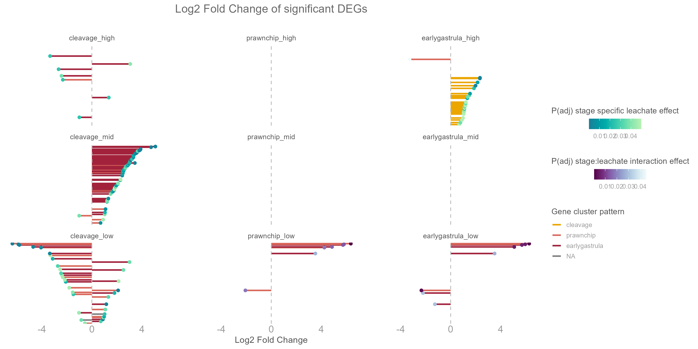
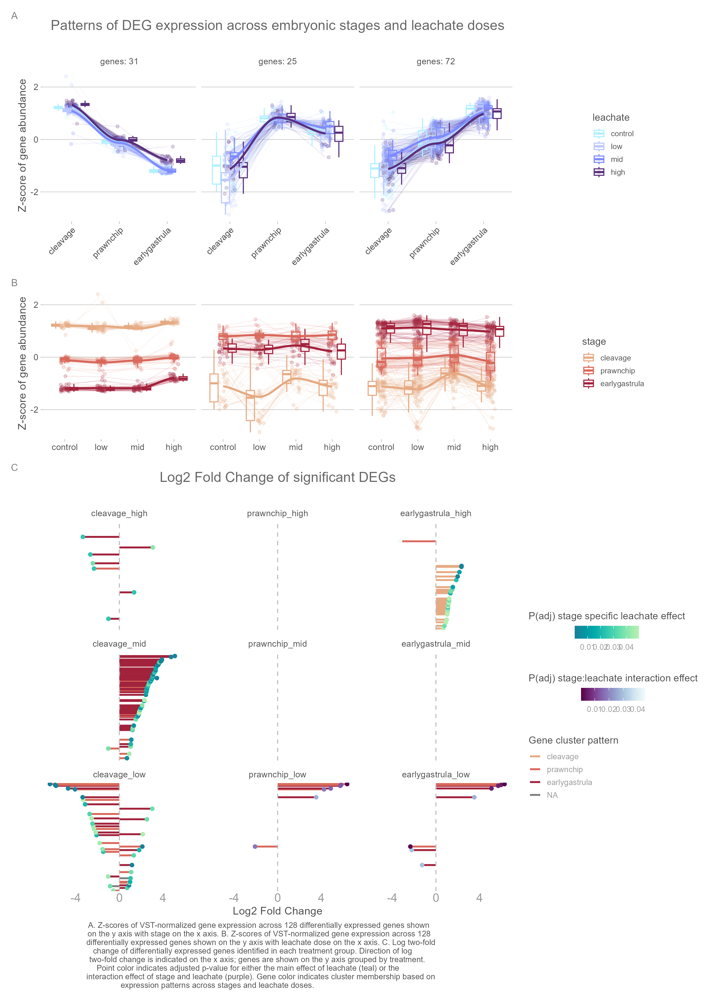
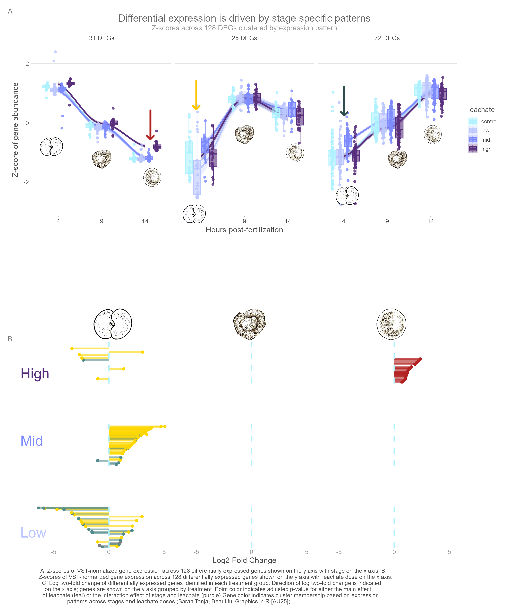
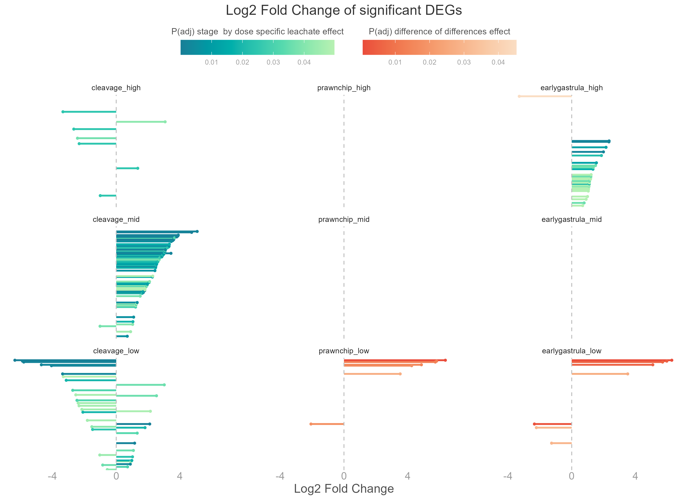
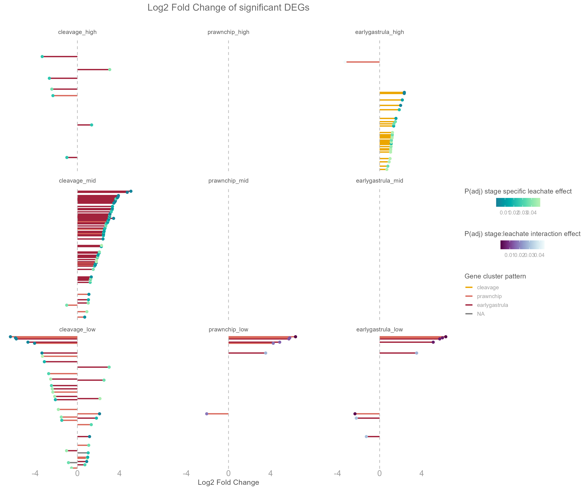

# Differential Expression Analysis Figures

This directory contains publication-quality figures from the differential expression analysis of *Montipora capitata* embryos exposed to PVC leachate.

## Figures

### DEG Clusters - Leachate x Stage

### Final DEG Figure

### Highlight Patterns

### Log2 Fold Change

### Log2 Fold Change - Clustered

