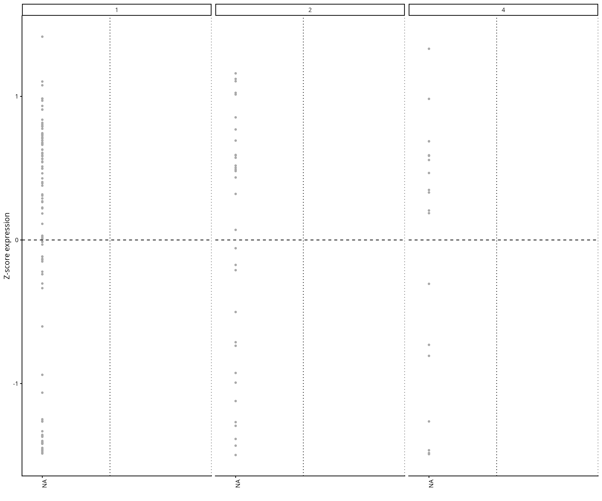
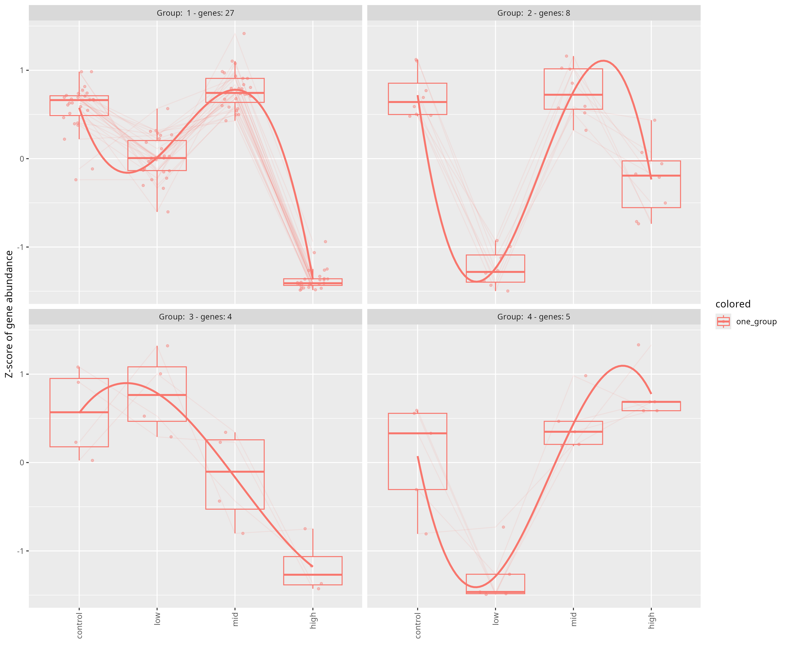
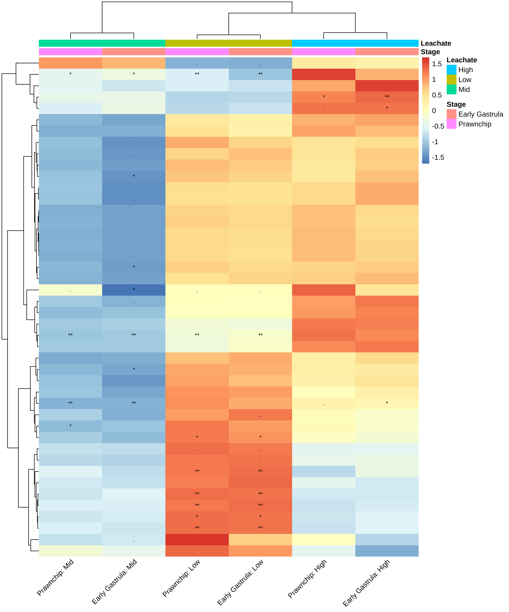

# Interaction Effects Analysis

This directory contains figures from interaction effects analysis between PVC leachate and developmental stage in *Montipora capitata* embryos.

## Figures

### Cluster Plot

### DEG Patterns Cluster Plot

### Interaction Wald Test Heatmap

## Subdirectories

- **gene_panels/**: Individual gene panel visualizations (5 panels)
- **gene_plots/**: Individual gene expression plots (88 genes)
