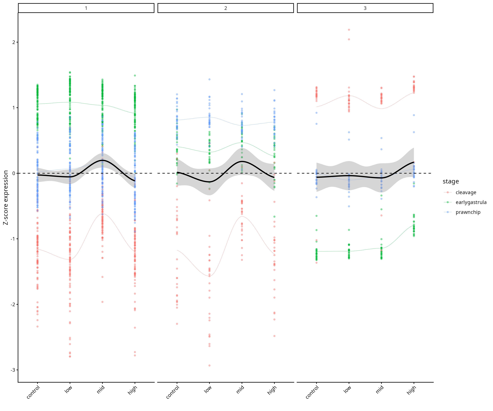
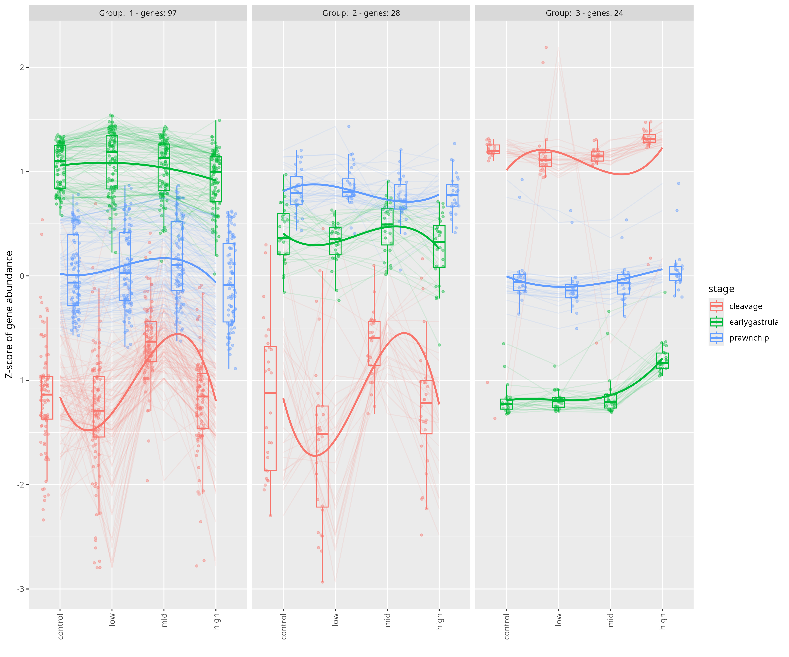
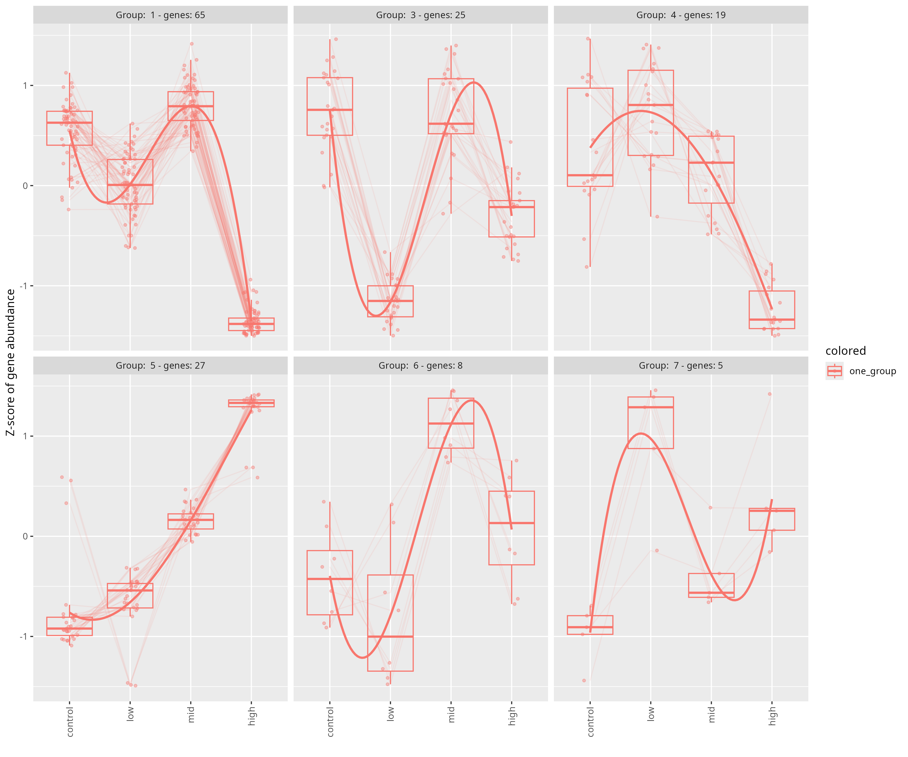
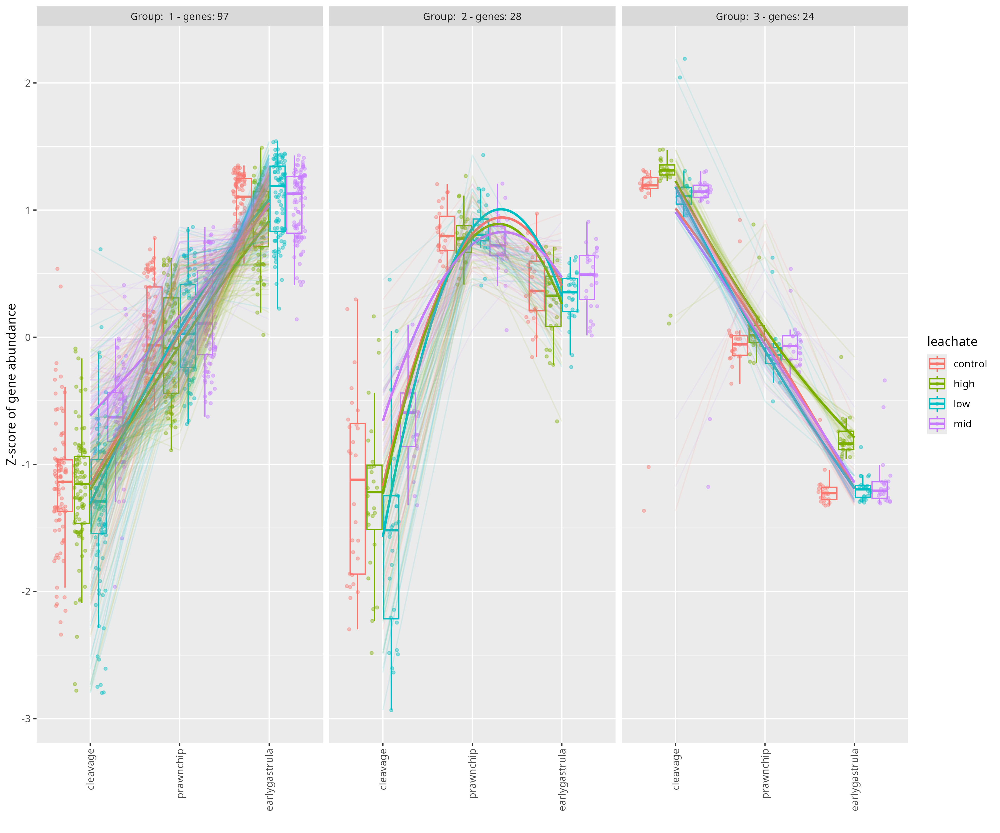

# Gene Clustering Analysis

This directory contains clustering analysis figures for differentially expressed genes from *Montipora capitata* embryos exposed to PVC leachate.

## Figures

### Cluster Plot

### DEG Leachate Patterns Cluster Plot

### DEG Patterns Cluster Plot

### DEG Stage Patterns Cluster Plot

