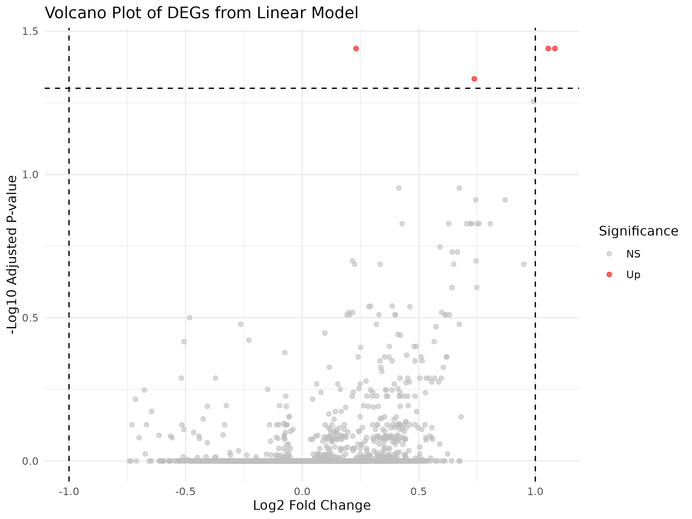
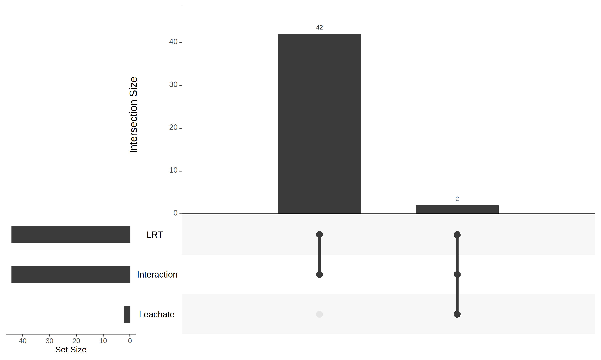
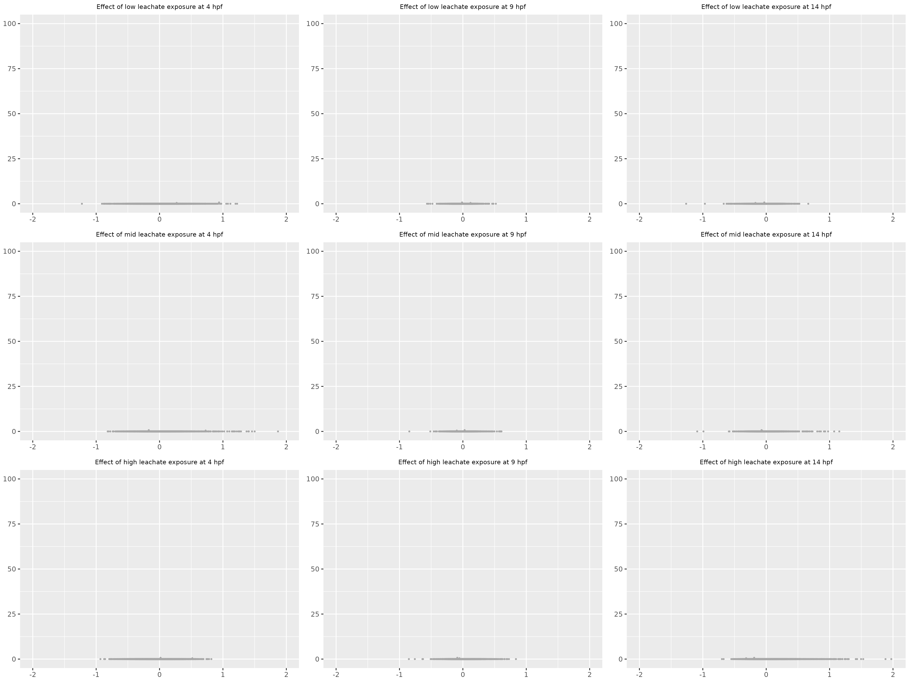
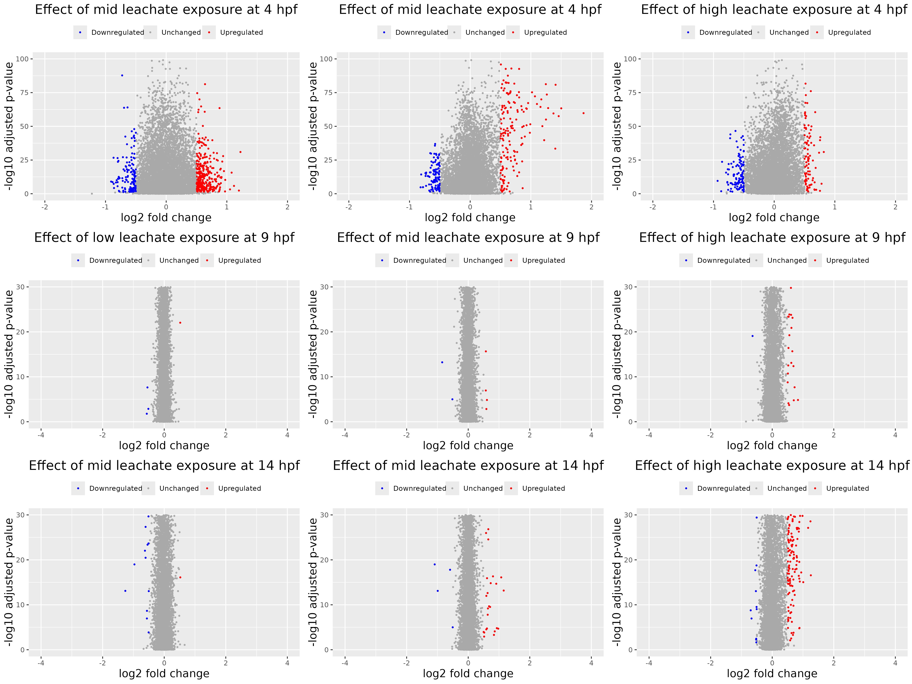
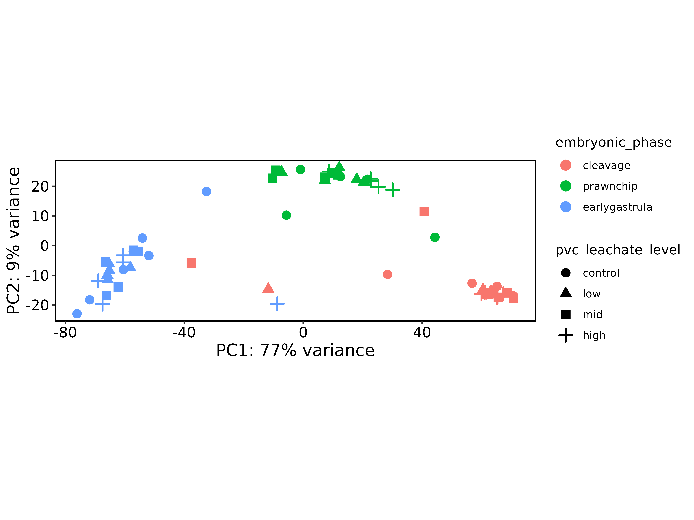
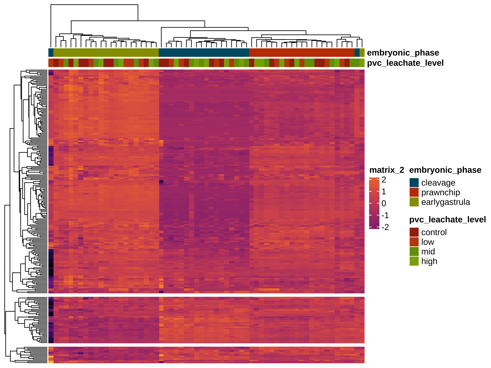

# Multifactorial Differential Expression Analysis

This directory contains figures from multifactorial differential expression analysis of *Montipora capitata* embryos exposed to PVC leachate.

## Figures

### Linear Volcano Plot

### UpSet Plot - DEG Overlap

### Volcano Plot - Faceted

### Volcano Plot - Grid

### Volcano Plot

### Z-score PCA Plot

### Z-score Heatmap

